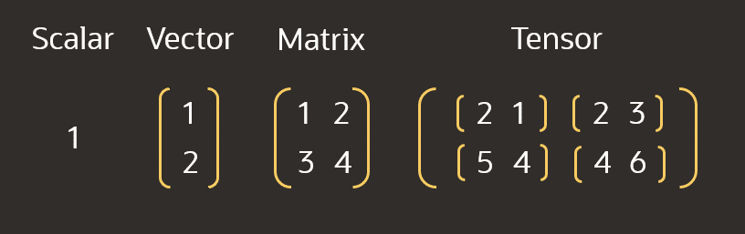

# Introduction

Implementing an image classification training is the “Hello World” of computer vision. Although there are many blog posts about the topic, most of them present the solution without adequately explaining the library API, the underlying principals, or both. The [Training a Classifier](https://pytorch.org/tutorials/beginner/blitz/cifar10_tutorial.html) guide from PyTorch is a great place to start, but some of the details of the code are explained too sparsely for a reader new to the field. This workshop builds on that tutorial as a base with line-by-line explanations of the code to facilitate a clearer learning pathway. This guide will show you how to train a model using CPUs and then explain how to update code to utilize GPU resources. Note that GPU instances are not available in the free-tier.

Estimated lab time: 60 minutes

### About Tensors

For better or worse, visual representations help contextualize computer science terminology, data structures, and algorithms. For tensors, [KDnuggets provides a clear explaination](https://www.kdnuggets.com/2018/05/wtf-tensor.html). When you search for a definition online, you may encounter some confusion between the technical definition of a tensor and colloquial usage. Technically, a vector is a 1-dimensional tensor and a matrix is a 2-dimensional tensor, but most often tensor refers to an n-dimensional container that’s larger than both a vector and a matrix.

The term is important to understand because tensors are central to building artificial intelligence algorithms, and they underpin discussions about optimizing compute resources. A common area of concern when training a model is GPU utilization, because NVIDIA [Turing Tensor Cores](https://www.nvidia.com/en-us/data-center/tensor-cores/) are capable of significant computational acceleration but can take some tuning. Fortunately, PyTorch contains a data loader that takes the responsibility for transmitting tensors to the GPU.

### Objectives

Topics covered in this lab:
* Tensors
* DataLoaders
* Convolutional Neural Networks (CNN)
* Loss Function and Optimizer
* Model Training
* GPU Acceleration

### Prerequisites

This lab assumes you have:
- An Oracle Free Tier or Paid Cloud account

## Acknowledgements
* **Author** - Justin Blau, Senior Solutions Architect, Big Compute
* **Last Updated By/Date** - Justin Blau, Big Compute, October 2020

## Need Help?
Please submit feedback or ask for help using our [LiveLabs Support Forum](https://community.oracle.com/tech/developers/categories/livelabsdiscussions). Please click the **Log In** button and login using your Oracle Account. Click the **Ask A Question** button to the left to start a *New Discussion* or *Ask a Question*.  Please include your workshop name and lab name.  You can also include screenshots and attach files.  Engage directly with the author of the workshop.

If you do not have an Oracle Account, click [here](https://profile.oracle.com/myprofile/account/create-account.jspx) to create one.