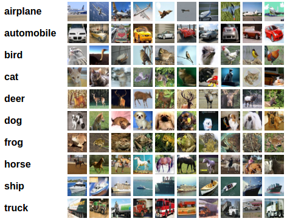

# Training a Classifier

## Introduction
The [Training a Classifier](https://pytorch.org/tutorials/beginner/blitz/cifar10_tutorial.html) guide from PyTorch is a great place to start, but some of the details of the code are explained too sparsely for a reader new to the field. This lab builds on that tutorial as a base with line-by-line explanations of the code to facilitate a clearer learning pathway.

Estimated Lab Time:  45 minutes

### Objectives
In this lab, you will learn about:
* DataLoaders
* Convolutional Neural Networks (CNN)
* Loss Function and Optimizer
* Model Training

### Prerequisites

This lab assumes you have:
- An Oracle Free Tier or Paid Cloud account
- Access to either a CPU or GPU instance as covered in labs 1 and 2

## **STEP 1**: Set up the environment

There are a number of methods to set up a python environment to run PyTorch. You may follow your preferred method or the following set of instructions.

1. Get a link for the [latest version of miniconda](https://docs.conda.io/en/latest/miniconda.html) by navigating to the site scrolling down to "Linux Installers" and copying the top link.
2. In a terminal for the instance, use wget to download the file. 

        wget https://repo.anaconda.com/miniconda/Miniconda3-latest-Linux-x86_64.sh
3. [Run the install command](https://conda.io/projects/conda/en/latest/user-guide/install/linux.html) and complete the setup. 

        bash Miniconda3-latest-Linux-x86_64.sh

4. Exit the terminal and open a new terminal after installation, which ensures that conda is activated. Optional: create a specific environment for PyTorch by running the command `conda create --name pytorch python=3.6` and then enabling the environment by running `conda activate pytorch`
5. [Install PyTorch](https://pytorch.org/) through conda `conda install pytorch torchvision cudatoolkit=10.2 -c pytorch`

[Click here to download the full code example](https://objectstorage.us-ashburn-1.oraclecloud.com/p/UudtANEChREpKXDjzRvqRzNPhPJpTEMfq5BHf6Ym7H12zSE8wGcTtwabHyxpcpow/n/c4u03/b/ai-ml-library/o/jblau-image-classification-pytorch.zip)

## **STEP 2**: CIFAR10 and DataLoader

Most of an AI researcher’s time is not spent running training and testing models, but cleaning and preparing data. An incredible amount of work has been condensed into the few lines of code below. CIFAR10 is a fully preprocessed dataset of images and labels. It was created and made public to serve as a standardized benchmark for testing new models or get started with deep learning. Transforming a set of raw data into a structure that works with PyTorch can take a great deal of time, so to lower that barrier the dataset has been included in the PyTorch library distribution. 

```python
import torch
import torchvision
import torchvision.transforms as transforms

transform = transforms.Compose(
    [transforms.ToTensor(),
     transforms.Normalize((0.5, 0.5, 0.5), (0.5, 0.5, 0.5))])

trainset = torchvision.datasets.CIFAR10(root='./data', train=True,
                                        download=True, transform=transform)
trainloader = torch.utils.data.DataLoader(trainset, batch_size=4,
                                          shuffle=True, num_workers=2)

testset = torchvision.datasets.CIFAR10(root='./data', train=False,
                                       download=True, transform=transform)
testloader = torch.utils.data.DataLoader(testset, batch_size=4,
                                         shuffle=False, num_workers=2)

classes = ('plane', 'car', 'bird', 'cat',
           'deer', 'dog', 'frog', 'horse', 'ship', 'truck')
```
[transform.Compose](https://pytorch.org/docs/stable/torchvision/transforms.html) ensures that the data is in the tensor format required for the model and has been [normalized](https://discuss.pytorch.org/t/understanding-transform-normalize/21730) to ensure that all values fit within a defined range. Normalizing data can often improve model training as it helps make the values in the dataset more consistent.

These lines of code manage downloading the dataset, splitting images into three color channels (red, green, and blue), matching them to the correct label (airplane, bird, dog, frog, and so on), and converting all images and labels into [torch.Tensors](https://pytorch.org/docs/stable/tensors.html). The output of the [torchvision.datasets.CIFAR10](http://pytorch.org/docs/stable/torchvision/datasets.html?highlight=cifar10#torchvision.datasets.CIFAR10) method is an object that's ready to use.
The next method, [torch.utils.data.DataLoader](https://pytorch.org/docs/stable/data.html?highlight=dataloader#torch.utils.data.DataLoader), manages the logistical tasks involved in optimizing compute resources. With GPU systems, data must first be loaded into CPU memory and then transferred to the GPU memory for accelerated parallel processing. Ideally, there are enough CPU workers to ensure that processed data is taken off and unprocessed data replaces it with as little delay as possible.

GPU utilization can vary, depending primarily on the size of the dataset and the computational process for the model. Developing an efficient data-loading algorithm and conducting artificial intelligence research are typically two different skills, so the PyTorch team has created a general, optimized method to handle this task for any torch.Tensor. To improve GPU utilization, you can adjust the hyperparameters for the data loader, such as `batch_size` and `num_workers`. In this case, `batch_size` is 4 and `num_workers` is 2, meaning that two CPU processes load four images at a time to the GPU. Depending on the size of your images and the system you’re using, you can adjust these values to achieve optimal GPU utilization. This specific example is not particularly challenging for the GPU to run because the neural network is shallow and the dataset is small. However, as you develop your own models that have more channels and a larger dataset, the uplift in performance will be more significant.

This example uses two datasets. CIFAR10 is split into a *training* dataset that is iterated over to develop the model and a *test* dataset of unseen data that is used to test the model’s performance. When working with your dataset, consider splitting your raw data into 80 percent used for training and 20 percent used for testing. You should avoid testing with data that’s used to train the model because it limits your ability to detect [overfitting](https://www.kdnuggets.com/2019/12/fighting-overfitting-deep-learning.html), a problem that occurs when your model works well against training data but not new data.

## **STEP 3**: Convolutional Neural Network

[Define a Convolutional Neural Network](https://pytorch.org/tutorials/beginner/blitz/cifar10_tutorial.html#define-a-convolutional-neural-network), defines the model. The dataset consists of images that are split into three color channels: red, green, and blue. Those values are sent to LCD displays to show different colors in pixels. Splitting the colors into three separate channels allows us to churn them through machine learning functions and create a deep neural network. We do that by running a convolution over each channel multiple times.

```python
import torch.nn as nn
import torch.nn.functional as F


class Net(nn.Module):
    def __init__(self):
        super(Net, self).__init__()
        self.conv1 = nn.Conv2d(3, 6, 5)
        self.pool = nn.MaxPool2d(2, 2)
        self.conv2 = nn.Conv2d(6, 16, 5)
        self.fc1 = nn.Linear(16 * 5 * 5, 120)
        self.fc2 = nn.Linear(120, 84)
        self.fc3 = nn.Linear(84, 10)

    def forward(self, x):
        x = self.pool(F.relu(self.conv1(x)))
        x = self.pool(F.relu(self.conv2(x)))
        x = x.view(-1, 16 * 5 * 5)
        x = F.relu(self.fc1(x))
        x = F.relu(self.fc2(x))
        x = self.fc3(x)
        return x


net = Net()
```


At a high level, the [nn.Conv2d](https://pytorch.org/docs/stable/generated/torch.nn.Conv2d.html?highlight=conv2d#torch.nn.Conv2d) function runs convolutions over the input tensor as shown in the preceding animation. A *filter* (the terms *filter* and *kernel* are used interchangeably in various texts), represented by the yellow square, passes over each channel like a typewriter and outputs a new channel. The tutorial instructs us to set the first convolution to `nn.Conv2d(3, 6, 5)`. This call to `Conv2d` expects the input tensor to have 3 channels, and outputs a tensor with 6 channels by running the convolution multiple times. The final value, 5, is the filter (kernel) size, a 5x5 square. If a tuple (5,2) is passed, a rectangular filter is used. It’s important to note that all the images in the dataset are 32x32 pixel squares. If a dataset with different-sized images is input into this algorithm, a runtime error would occur because the output matrices are not the same size.

The next line in the tutorial defines a way to downsample the data to help control the size of the neural network and prevent overfitting, [nn.MaxPool2d](https://pytorch.org/docs/stable/generated/torch.nn.MaxPool2d.html). As before, the input parameters are first the size of the filter and then the stride. By default, the stride in the `nn.Conv2d` function is 1, but for `nn.MaxPool2d` we’re using 2. So, instead of shifting to the right by one square, the filter shifts to the right by two squares. After every movement, `nn.MaxPool2d` takes the largest value seen by the filter and puts it into the output channel.


A second convolutional layer, which takes the 6 output channels from the first convolution as input and outputs 16 channels, is defined next. Repeating convolutional and max pooling layers can help the model find features within the image. However, both the computational workload and memory requirements quickly expand, and adding more layers doesn’t always produce a better-performing model.

To arrive at a prediction, the model uses three [nn.Linear](https://pytorch.org/docs/stable/generated/torch.nn.Linear.html?highlight=nn%20linear#torch.nn.Linear) layers, called fully connected layers. This function is a straightforward application of linear regression. The output tensors from the `Conv2d` and `MaxPool2d` functions are flattened into a 1-dimensional array, and the length of that array is the first input. Getting the correct input number takes some math that isn’t described in the tutorial. We already defined how a convolution works, and we can calculate the output height and width by using the following equation:

`Output Width = ((Image Width – Filter Width + 2 * Padding) / Stride) + 1`

`Output Height = ((Image Height – Filter Height + 2 * Padding) / Stride) + 1`

(The default values for [padding and stride](https://deepai.org/machine-learning-glossary-and-terms/padding) are 0 and 1, respectively.)

After a convolution, the max pooling step is applied, so we divide the output width and height by the max pooling width and height after each step to get the final output size. Because we’re using square dimensions, we need to perform only one set of calculations:

`Convolution 1: ((32 – 5 + 2 * 0) / 1 ) + 1 = 28`

`Max Pool 1: 28 / 2 = 14`

`Convolution 2: ((14 - 5 + 2 * 0) / 1 ) + 1 = 10`

`Max Pool 2: 10 / 2 = 5`

Our final output is 16 channels of 5x5 squares, so the first input for the first fully connected layer is as follows:

`16 * 5 * 5 = 400`

Notice that `16 * 5 * 5` is the first input for the `fc1` layer. The second input is the target output array size. Best practice is to gradually reduce the size of the array through successive layers, which explains using three layers. When you’re building a new model for classification, a good guess for the final fully connected layer output is the same as the number of categories that you’re trying to filter the images into. In our case, we have 10 categories: airplane, automobile, bird, cat, deer, dog, frog, horse, ship, and truck.



In the code for the model, each operation is defined in the class initialization, and the order in which the operations are performed on samples is defined in the `forward` method. [F.relu](https://pytorch.org/docs/stable/nn.functional.html?highlight=relu#torch.nn.functional.relu) is an [activation function](https://www.kdnuggets.com/2017/09/neural-network-foundations-explained-activation-function.html). Delving into activation functions is beyond the scope of this post, but in short there are three popular options: Sigmoid, TanH, and ReLU. These three (and more) are useful in different scenarios, but ReLU works for this example. Tensor.view changes the shape of the tensor, in this case flattening it into a 1-dimensional, 400-length array, as described previously.

## **STEP 4**: Loss Function and Optimizer

```python
import torch.optim as optim

criterion = nn.CrossEntropyLoss()
optimizer = optim.SGD(net.parameters(), lr=0.001, momentum=0.9)
```

The next section in the PyTorch tutorial defines the [loss function (criterion)](https://ml-cheatsheet.readthedocs.io/en/latest/loss_functions.html) and [optimizer](https://ml-cheatsheet.readthedocs.io/en/latest/optimizers.html?highlight=optimizer#optimizers) used, which are also deep topics themselves, but out of scope here. The ones selected are good “general purpose” options. The [Machine Learning Glossary](https://ml-cheatsheet.readthedocs.io/) succinctly describes both of these operations:

“Optimizers … tie together the loss function and model parameters by updating the model in response to the output of the loss function. In simpler terms, optimizers shape and mold your model into its most accurate possible form by adjusting the weights. The loss function is the guide to the terrain, telling the optimizer when it’s moving in the right or wrong direction.”


Image credit: [CS231n](https://cs231n.github.io/neural-networks-3/)

The training process generates a gradient that can be likened to a mountain range. As you iterate over data, you want to arrive at the lowest point in the mountain range for a fully trained model, but the problem is you lack a map. The loss function and optimizer help you descend the range, but if you go too fast or use the wrong system, you could get stuck in a local low point instead of the actual minimum.

## **STEP 5**: Training the Model

With everything prepared, we’re ready to begin training, in which we continually iterate over the data to arrive at our trained model (step 4, [Train the Network](https://pytorch.org/tutorials/beginner/blitz/cifar10_tutorial.html#train-the-network)). 

```python
for epoch in range(2):  # loop over the dataset multiple times

    running_loss = 0.0
    for i, data in enumerate(trainloader, 0):
        # get the inputs; data is a list of [inputs, labels]
        inputs, labels = data

        # zero the parameter gradients
        optimizer.zero_grad()

        # forward + backward + optimize
        outputs = net(inputs)
        loss = criterion(outputs, labels)
        loss.backward()
        optimizer.step()

        # print statistics
        running_loss += loss.item()
        if i % 2000 == 1999:    # print every 2000 mini-batches
            print('[%d, %5d] loss: %.3f' %
                  (epoch + 1, i + 1, running_loss / 2000))
            running_loss = 0.0

print('Finished Training')
```

Looking at the first provided line, an `epoch` is a full iteration over every image in the dataset. The tutorial as written iterates over the data only twice, which isn’t enough to find the minimum. You can increase that number simply by typing in a different input for `range`. Running loss is tracked to determine how much each epoch influences the model. Training typically stops after the running loss becomes so small that the model has effectively stopped changing.

In the second loop, we enumerate the `trainloader`. As described earlier, the loader segments the data into batches, and we process each batch. `Inputs` are the tensors that contain the batch image data, and `labels` are the correct category for each image in the batch. The `inputs` are passed through the forward propagation via `net` (the CNN defined above) to get the prediction, or `outputs`. `Outputs` are passed to the `criterion` with the correct label to get the `loss` function, to determine the amount the model has changed. The `loss` is then passed into the `backward` propagation, which adjusts each weight in the model to minimize the amount it contributes to error in the prediction. The `optimizer.step` function makes the next step down the mountain range (using the previous analogy) based on the learning rate, which you can think of as the length of our step. You want to use a learning rate large enough to move you along the path but small enough not to overstep a potential avenue for a better result.

A successful output should print out lines in this format, although the loss numbers will not be exactly the same every run.

```
[1,  2000] loss: 2.105
[1,  4000] loss: 1.775
[1,  6000] loss: 1.639
[1,  8000] loss: 1.577
[1, 10000] loss: 1.493
[1, 12000] loss: 1.462
[2,  2000] loss: 1.388
[2,  4000] loss: 1.367
[2,  6000] loss: 1.314
[2,  8000] loss: 1.313
[2, 10000] loss: 1.276
[2, 12000] loss: 1.267
Finished Training
```

## **STEP 6**: Saving the Model and Testing Accuracy

```python
PATH = './cifar_net.pth'
torch.save(net.state_dict(), PATH)
```

These lines of code save the model after it has completed the training loop to a file. This method is also useful for creating checkpoints throughout the model training. For the sake of example, we will load the model from the file saved above.

```python
net = Net()
net.load_state_dict(torch.load(PATH))

correct = 0
total = 0
with torch.no_grad():
    for data in testloader:
        images, labels = data
        outputs = net(images)
        _, predicted = torch.max(outputs.data, 1)
        total += labels.size(0)
        correct += (predicted == labels).sum().item()

print('Accuracy of the network on the 10000 test images: %d %%' % (
    100 * correct / total))
```

It is important to test the model in order to determine measured accuracy. This will indicate if the model provides sufficient performance for a given use case. We have only trained the model for two epochs in the training loop above, so the model will not produce impressive performance results. If you increase the number of epochs until the loss stops decreasing, you'll find that the model performance improves. This process can be run during the training periodically for detailed monitoring, although it should not be repeated too often or it will lengthen the training time.

```python
class_correct = list(0. for i in range(10))
class_total = list(0. for i in range(10))
with torch.no_grad():
    for data in testloader:
        images, labels = data
        outputs = net(images)
        _, predicted = torch.max(outputs, 1)
        c = (predicted == labels).squeeze()
        for i in range(4):
            label = labels[i]
            class_correct[label] += c[i].item()
            class_total[label] += 1


for i in range(10):
    print('Accuracy of %5s : %2d %%' % (
        classes[i], 100 * class_correct[i] / class_total[i]))
```

For this example, we can dive a little deeper than just the overall accuracy. The above code prints out the accuracy for each category and can provide some insight as to where the model may be getting confused.

This covers the main points of training deep learning computer vision models. [Click here to download the full code example](files/image-classification-pytorch.py) The next step is to accellerate the computational workload with a GPU.

You may proceed to the next lab.

## Acknowledgements
* **Author** - Justin Blau, Senior Solutions Architect, Big Compute
* **Last Updated By/Date** - Justin Blau, Big Compute, October 2020

## Need Help?
Please submit feedback or ask for help using our [LiveLabs Support Forum](https://community.oracle.com/tech/developers/categories/livelabsdiscussions). Please click the **Log In** button and login using your Oracle Account. Click the **Ask A Question** button to the left to start a *New Discussion* or *Ask a Question*.  Please include your workshop name and lab name.  You can also include screenshots and attach files.  Engage directly with the author of the workshop.

If you do not have an Oracle Account, click [here](https://profile.oracle.com/myprofile/account/create-account.jspx) to create one.