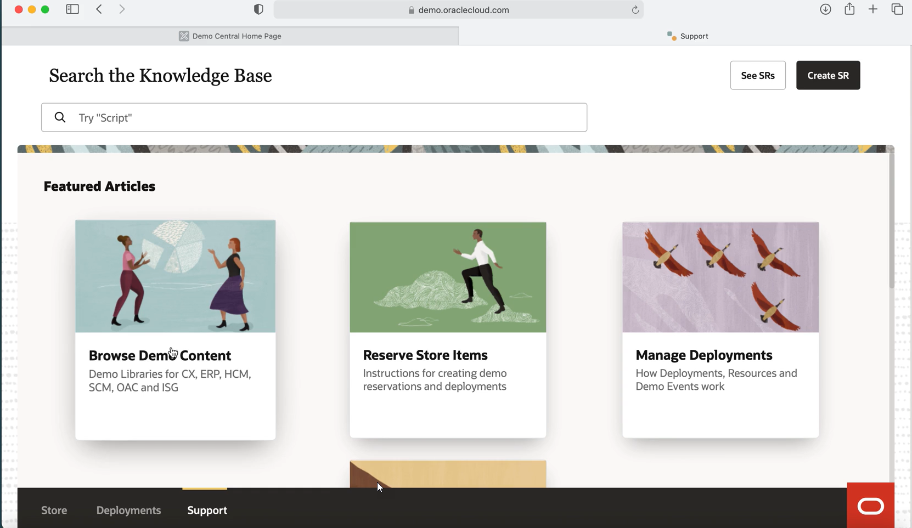

# Fusion Analytics Warehouse (FAW)-Custom Content

# Environment and Product(s):

- Cloud Platform > Business Analytics
- Cloud Applications > Human Capital Management (HCM)
- Cloud Applications > Business Analytics > Analytics for HCM

# Introduction

**Description**: This content can be imported into an Allocated FAW Environment. You cannot use the content below to import to a FAW Docker or VM Image. e've included both a video and document below that details how you can download content and import it into an FAW Allocated environment.

- This lab walks you through the Steps to Import custom FAW Content. We created a document with all detailed steps.

*You may check this video, on OTube: [**Import FAW Content**](<https://otube.oracle.com/media/1_9mg1xpv4>)* Estimated Time: 18 minutes

## About <product technology=""></product>

When importing content you must:

- Download the Deck , DVA File, Catalog File (If required), and KPI to a directory on your laptop
- Rename the DVA download from .zip to .dva
- Import the DVA File to the following Directory: Shared/Custom/Demos/
- Import the Catalog File (if required) to Classic Analytics UI in the directory: Shared/Custom/Demos
- Upload the JSON file to FAW
- Create the KPI Deck
- Add and Customize the KPI Cards by following the Word Doc

### Objectives

*This lab provides an overview on the custom FAW content and offers the needed documentation and steps to import content.*

In this lab, you will:

- Find the steps to import custom FAW content for given examples
- Get the files needed for each example
- See sample images of how each example looks like 

### Prerequisites

This lab assumes you have:

- Read the document explaining the import steps
- Access to Demo Environments
- Familiarity with Oracle Cloud Infrastructure (OCI)
- Access to Knowledge Management tool

> **Note:** Each example listed is independent from the others.

## Acknowledgements

- **Author** Oana Turnea, Technical Writer, Demo Services
- **Contributors** Kurt Wassil, Manager, Demo Services
- **Last Updated By/Date** TW, September, 2021

