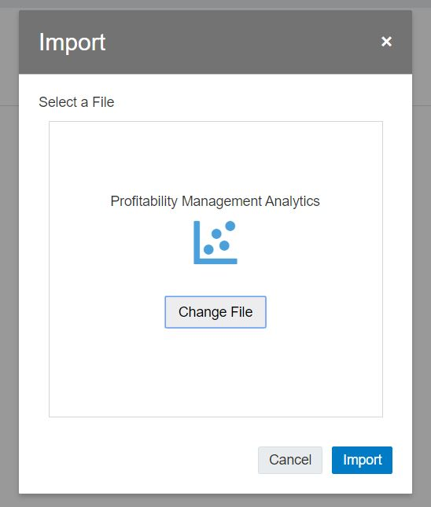
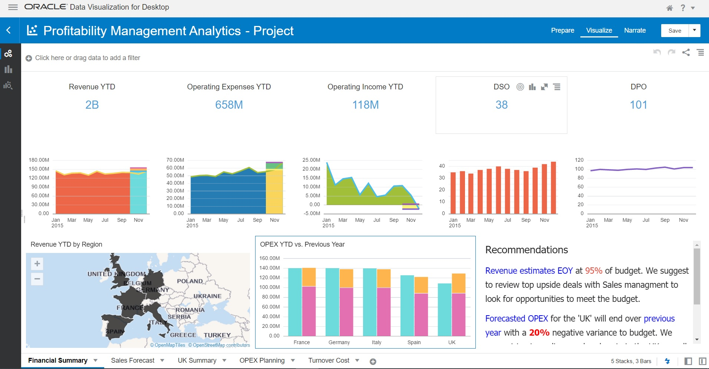
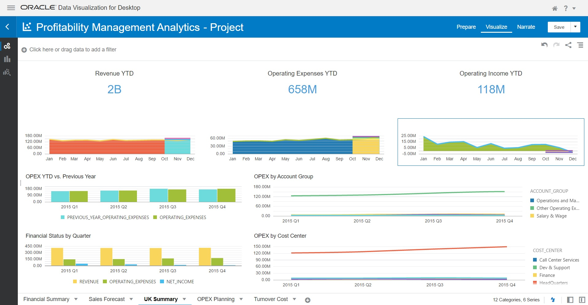

# Setup Oracle Analytics Desktop

## Introduction

In this lab, you will downlod the Oracle Analytic Desktop on local machine and connect with the Autonomous Datawarehouse. Import Project.

Estimated Lab Time: 30 minutes

### About Product/Technology
Oracle Autonomous Datawarehouse, Oracle Analytic Desktop.

### Objectives

*List objectives for the lab - if this is the intro lab, list objectives for the workshop*

In this lab, you will:
* Creating Rich Data Visualization
* Importing Project
* Creating Connection to Autonomous Datawarehouse in Oracle Analytic Desktop

### Prerequisites

*Use this section to describe any prerequisites, including Oracle Cloud accounts, set up requirements, etc.*

* Download the Oracle Analytic Desktop with url - [URL Text](https://www.oracle.com/solutions/business-analytics/analytics-desktop/oracle-analytics-desktop.html).

## **STEP 1**: Installing Oracle Analytics Desktop on a Windows Desktop

1.	Download the latest version of Oracle Analytics Desktop (formerly Data Visualization Desktop) from here.
2.	After saving the installer executable file, click on the installer and follow the guided steps.

## **STEP 2:** Create a Connection to Your Autonomous Database from Oracle Analytics Desktop

## **STEP 2a**: Creating Rich Data Visualizations

Step 1 Follow the steps shown in the URL "Creating Rich Data Visualizations"

* [Creating Rich Data Visualizations](https://oracle.github.io/learning-library/data-management-library/autonomous-database/shared/adb-quickstart-workshop/freetier/?lab=lab-5-visualizing-data)

Once the above tutorial is completed return back to this page and proceed further.

## **STEP 3:** Importing of the project in the Oracle Analytic Desktop

1. Download the project file. Download the [Project file](files/ProfitabilityManagementAnalytics.dva).
2. Open the Project and import the project in the Oracle Analytic Destop
   
   
   
3. Change the Database connection to the ADW Connection
4. Download the xls or csv data files.  
   Download the [Project file](files/xlxs.zip). 
   Download the [Project file](files/csv.zip).
5. On Import the xlxs or csv files and give the table name same as xlxs or csv file using local SQL Developer or SQL Web.
6. Open the project and point it to the ADW database connection. 
7. View the visualizations
   
   
   
   
   
   
You may proceed to the next lab.

## Learn More

*(optional - include links to docs, white papers, blogs, etc)*

* [URL text 1](http://docs.oracle.com)
* [URL text 2](http://docs.oracle.com)

## Acknowledgements
* **Author** - <Name, Title, Group>
* **Adapted for Cloud by** -  <Name, Group> -- optional
* **Last Updated By/Date** - <Name, Group, Month Year>
* **Workshop (or Lab) Expiry Date** - <Month Year> -- optional, use this when you are using a Pre-Authorized Request (PAR) URL to an object in Oracle Object Store.

## See an issue?
Please submit feedback using this [form](https://apexapps.oracle.com/pls/apex/f?p=133:1:::::P1_FEEDBACK:1). Please include the *workshop name*, *lab* and *step* in your request.  If you don't see the workshop name listed, please enter it manually. If you would like for us to follow up with you, enter your email in the *Feedback Comments* section.
