# Monitoring and Ad-hoc scaling up ADW activity for optimal OAC experience

## Introduction

In this lab, you will explore capabilities available for your Autonomous Data Warehouse (**ADW**) using **Database Service Console**, you use **ad-hoc scaling up** of ADW for optimal Oracle Analytics Cloud (OAC) experience and check **OAC query logs** looking for the Logical and Physical SQL.

_Estimated Lab Time_: 40 minutes

### Objectives

* Monitoring ADW activity generated by OAC
* Ad-hoc scaling up of ADW for optimal OAC experience  
* Checking OAC query logs

### Prerequisites

* An Oracle Cloud Free Tier or Paid account
* You should have completed  
    * Lab 1: Provisioning your Autonomous Database instance
    * Lab 2: Provisioning your Oracle Analytics Cloud instance
    * Lab 3: Connecting OAC to ADW and adjusting Data Set properties
    * Lab 5: Gaining Insights with Visual Data Dialog

## Task 1: Monitoring ADW activity generated by OAC
The **ADW Service Console** provides dashboards to monitor the real-time and historical CPU and storage utilization, as well as database activity, like the number of running or queued statements.

1.  Launch **Database Service Console**.  
Log in to **Oracle Cloud Infrastructure Console**, select **Autonomous Data Warehouse** from the Hamburger Menu and navigate to your ADW instance.  

    Enter your **User Name**, **Password** and Click **Sign In.**

    

2.  Click on the hamburger **MENU** link at the upper left corner of the page.  
This will produce a drop-down menu, where you select **Autonomous Data Warehouse.** 

    

3.  Select your Compartment and Click on your ADW instance

    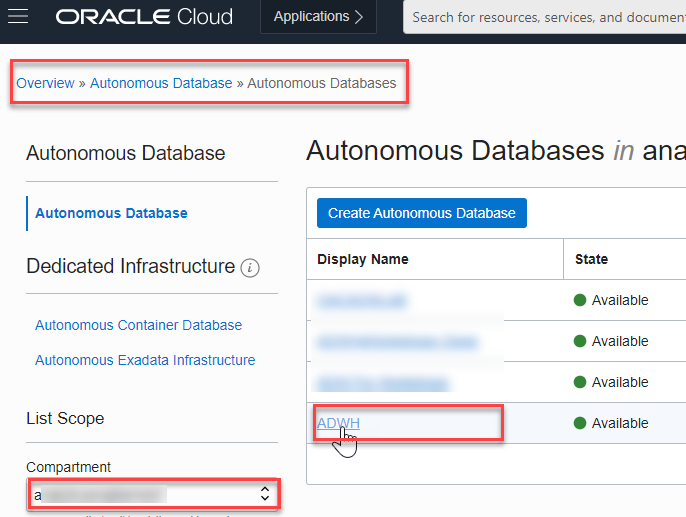

4.  In your ADW **Database Details** page, click the **Service Console** button.

    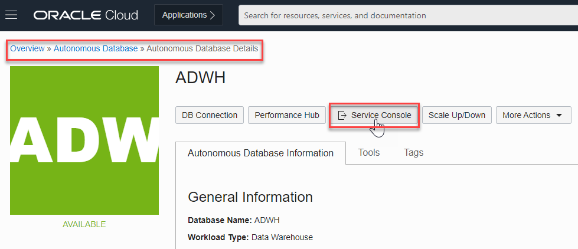

5.  Examine the **Console Overview** and **Activity** Page.  
A new Canvas Page is opening.  
Examine the components of the Overview page:  
    * Storage used  
    * CPU utilization  
    * Running SQL statements  
    * Number of OCPUs allocated  
    * SQL statement response times

    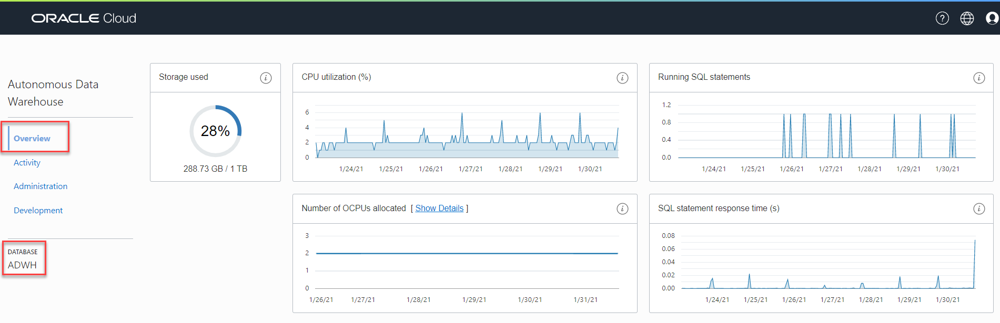

6.  To access detailed information about the service's performance, click the **Activity** tab in the Service Console.

    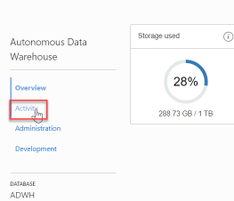

7.  Click the **Monitored SQL** tab to see information about current and past monitored SQL statements.

    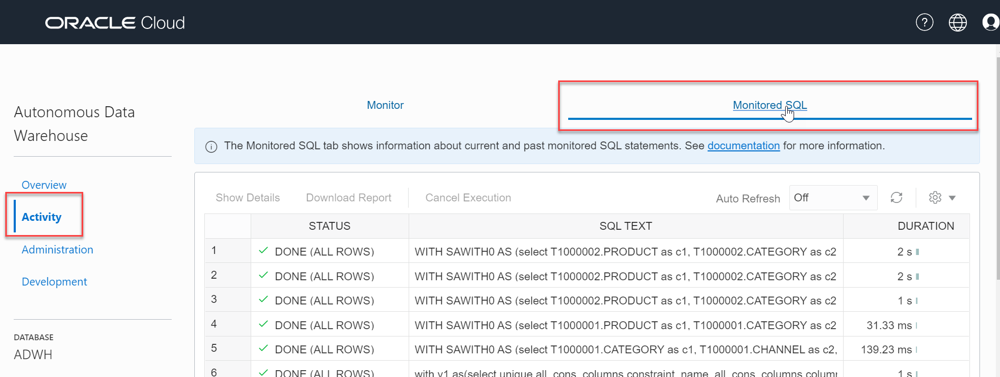

8.  Navigate to OAC canvas, lets **refresh** the data and see if new queries gets generated in ADW.  
Open the browser page with your OAC canvas (previous lab) and click **Refresh Data** button from top right.

    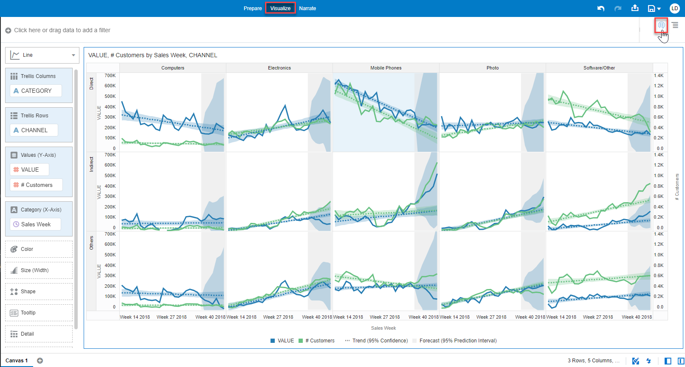

9.  Navigate to ADW  tab you notice that no new queries are generated from OAC data refresh. What might be the reason?.

    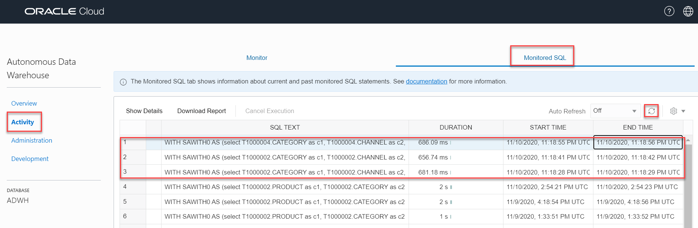

10. Lets inspect the Data Set. It is set to _automatic caching_ and hence, _queries fetched from cache_.  
Navigate to OAC, go to the **Data Pane > Data**, Right Click **DCA\_SALES\_DATA** and Select **Inspect**.  

    

11. Go to **General** tab and notice the **Data Access** is set _Automatic Caching_.

    

12. We need to set it to _Live_ to make sure queries are fired against the database.  
Click **Data Access** and change to _Live_ > Click **Save** and then **Close**.

    

13.   Lets regenerate the report to see if fresh queries are getting fired against the database.  
Repeat Steps 2.4 and 2.5.  
Now... if we refresh, fresh queries can be seen getting generated.
    
      

## Task 2: Ad-hoc scaling up of ADW for optimal OAC experience  

You are going to create a slightly larger OAC report to mimic the performance scenario by adding greater level of granularity.  

In this section, you will scale up your Oracle Autonomous Data Warehouse (ADW) service to have more CPUs and understand the performance impact over a more complex OAC generated queries.

1.  OAC Canvas.  
Lets create a slightly larger report.  
Navigate to OAC, lets _turn off_ _Auto Apply Data_ to queue data requests while filtering or constructing visuals (not refresh the report immediately).  
Open the OAC browser and click **Auto Apply Data** button from bottom right.  

      
    > notice the button turned greyed out 

2.  Replace _Sales Week_ with _Day of Year_.  
Go to **Data Panel**, Select  **Sales_Date > Day of Year** data element, drag and drop it over **Sales Week** from **Grammar Panel** **Category (X-Axis)** section.  
That is going to replace the existing data element (week) with a more granular one (day) and increase query complexity and ADW "work".  
    > Note: in case if the query is displaying an error, you can skip the replace step and use the visualization as is, it would be relevant enough

    

3.  You get the message _**"Click the Auto-Apply Data below to refresh data"**_ with a clear indication where to go. 

    

4.  Refresh the data by clicking on **Auto Apply data** and notice that the report takes a while to run.

5.  ADW **Service Console**  
Go to ADW console, note the duration that  the query ran with the current compute resources.  
You are going to compare this duration with the duration after you scale-up the ADW compute resources.

    

6.  Lets **Scale-Up** the ADW to use the maximum number of OCPUs that you can spare (16 OCPUs is a good number, but not a mandatory one). It takes about 90 seconds for the scale up process to complete.  
    > Note: in your training environments, if you are using the _Free Tier_ offer, or you have limited resources, you might not be able to actually scale-up the ADW to use 16 OCPUs; please use as reference this [video](https://www.youtube.com/watch?app=desktop&v=koOLAY48lZM&list=PL6gBNP-Fr8KVdvmZUg7eqXljXnFhidBV-&index=2) starting from minute 10:1  

    Go back to the **Cloud Console** you used during the provisioning exercise and open the database instance's **Details** page. From the **action menu**, click **Scale Up/Down**
    
    

7.  Fill in the form with the following information:  
     - **Change** **OCPU Count** to 16 (or to the highest value that you are able to provision)
     - **Auto-Scaling**: Disabled  
       > if you have enough resources you can enable auto-scaling; this feature allows your database to use up to three times the current base number of CPU cores at any time -> basically if this feature was disabled, just by enabling and leave the same number of OCPUs. you'll get extra performance when need it.

8.  Click **Update**

    

9.  In OAC page, lets **refresh** the data and see how fast the query is generated in a scaled-up ADW instance.  
Open the browser page with your OAC canvas and click **Refresh Data** button from top right.  

    

10. In the ADW **Service Console > Activity > Monitored SQL**, note the duration that  the query ran with the updated compute resources.  
The new query generated has taken just a few milliseconds seconds to complete with 16 OCPUs being utilized.

    

## Task 3: Checking OAC Query Logs  

Administrators can examine the **underlying SQL query** requests that are executed.

1.  Going back to our visualization, lets Remove Analytics.  
Click on your visualization and you activate the Visualization Properties Pane on the lower left of the screen.  
Click on **Analytics** Properties and mouse hover on the **Trend** till you get an red x, Click on it and do the same with **Forecast**.  
   
    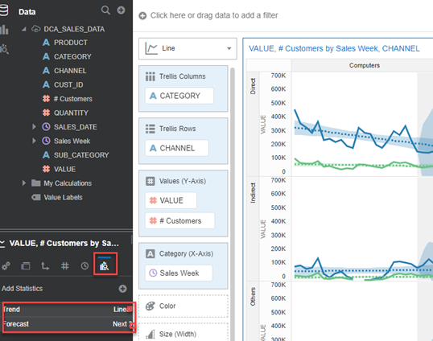

2.  Lets save our project for further analysis.  
   Click on **Save** icon from upper top right of the screen. 

    

3.  Save Project as Training01 (or any name we choose). Type **Name**: **Training01** an Click **Save** button. 

    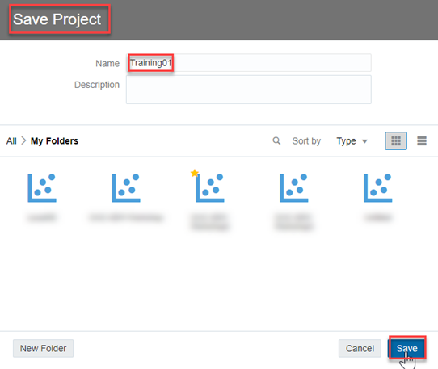

4.  OAC **Query Log**  
Lets now check the query logs generated inside of OAC.  
Click **Go Back** left arrow from upper left of the screen to go to the Analytics Home Page. 

5.  Click **Navigator** and then Select **Console**.

    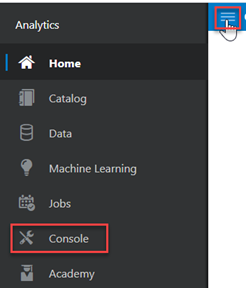

6.  Click **Sessions and Query Cache** under _Configuration and Administration_ section.

    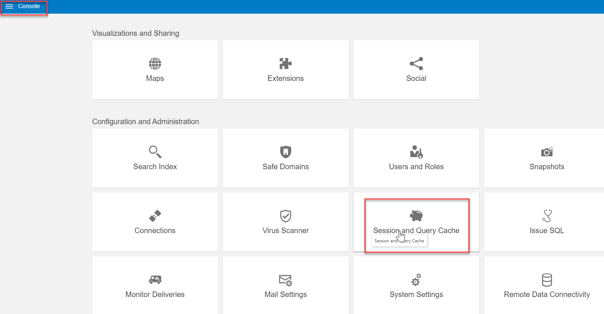

7.  The logs screen shows all the query logs and it can be sorted in ascending/descending order.  
Locate the **Cursor Cache** section, and review the query information recorded there. 

    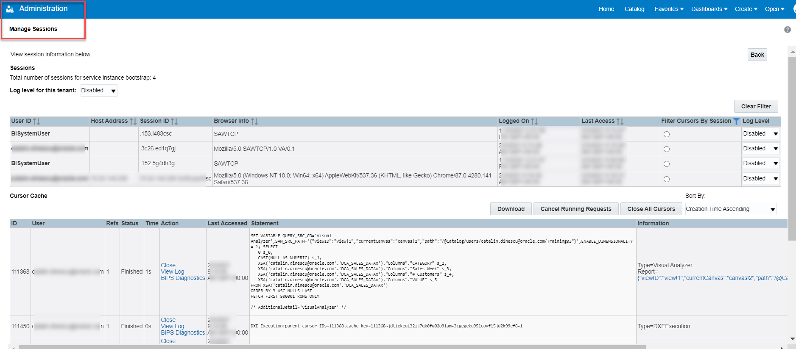

8.  Sort the query log in a descending order.  
   **Sort By**> Select **Order Time Descending**.

    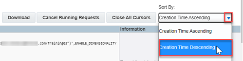

9.  Pick-up the most recent one and Click **View Log**.

    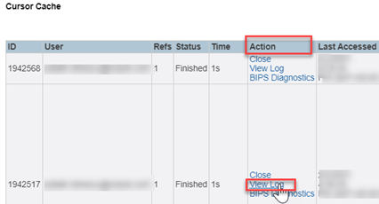

10. **Logs** contain **logical SQL** generated by the BI Server and the **physical SQL** fired against the database.  
Scroll down the log file and you'll first find the **Logical SQL** and further down the **Physical SQL** as well. 

    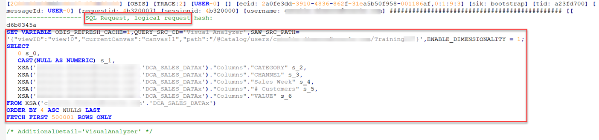  
     > Note: for the physical SQL search the log for "_Sending query to database named_"
    
    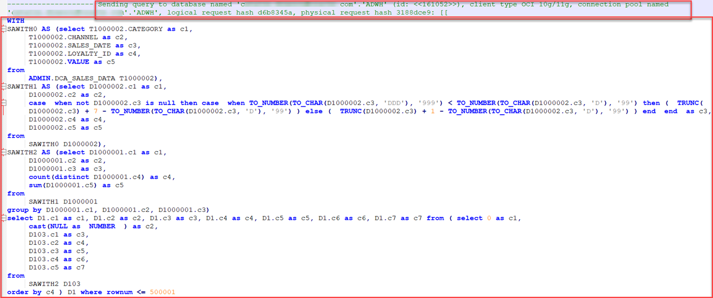

11. Bonus  
Lets test the _**Logical SQL**_ with _**OAC**_ and see the _**Physical SQL**_ in the _**ADW Console**_.

12. **Copy** the **Logical SQL** from the log file. 

     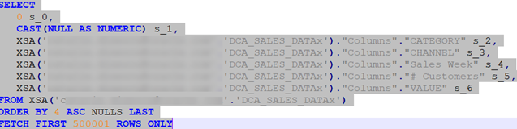

13. Go back to **Console** and Click **Issue SQL** under _Configuration and Administration_ section.  
    
     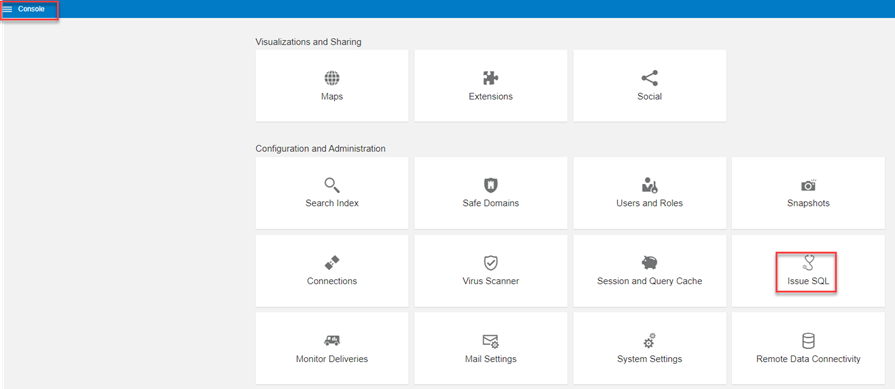

14. Paste the _Logical SQL_ and Click **Issue SQL** button.  

     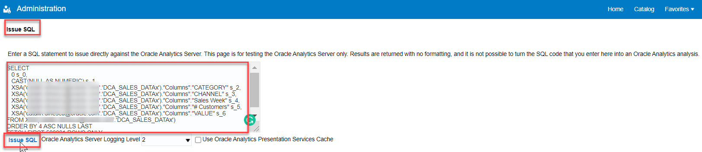

15. You can quickly see the results (unformatted table below the SQL query). 

     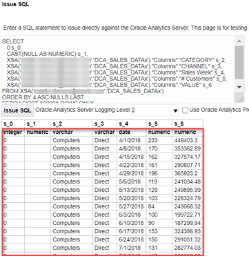

16. Go to the ADW **Service Console > Activity > Monitored SQL**, select your query, right-click and select **Show Details**.

     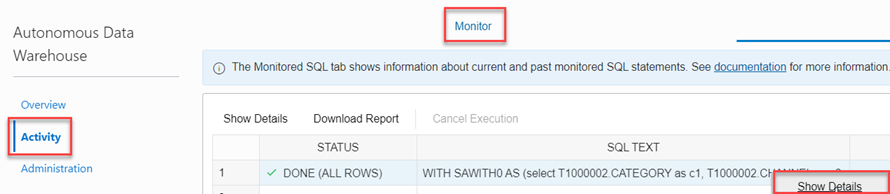

17. Check the **Overview** tab, you'll find the Physical **SQL Text** which is identical with the one from OAC query log. 

     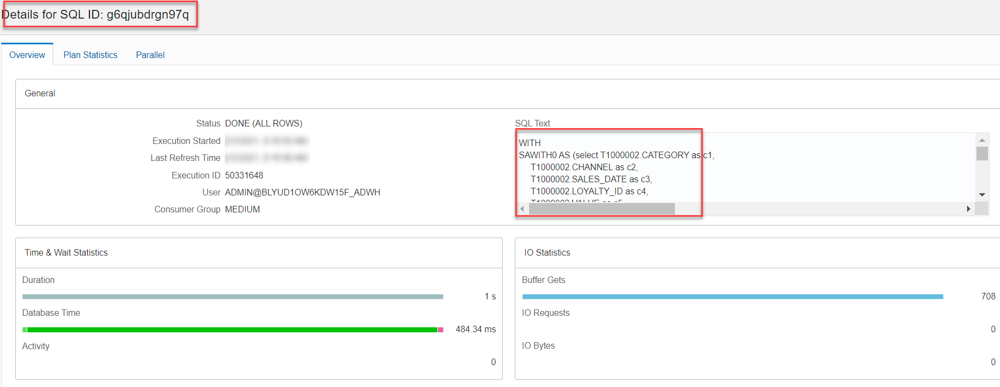

18. You can also browse through the other tabs as **Plan Statistics** to see other relevant query information.

     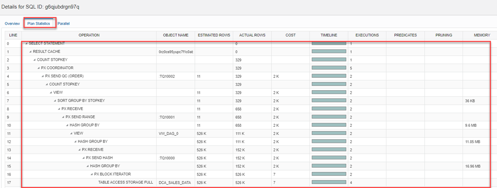

You have just finished learning how to **monitor ADW activity generated by OAC**, as well as the benefits of **ad-hoc scaling up ADW **for optimal OAC experience. You have also learnt how to check **OAC query logs** and find the **Logical and Physical generated SQL**.

You may now [proceed to the next lab](#next)

## Want to Learn More?

* [Where is the Log for My Data-Flow In Oracle Analytics?](https://blogs.oracle.com/analytics/where-is-the-log-for-my-data-flow-in-oracle-analytics)
* [Analyze SQL Queries and Logs](https://docs.oracle.com/en/cloud/paas/analytics-cloud/acabi/monitor-users-and-activity-logs.html#GUID-24782185-AED4-4F6B-BBF6-51AE9C0C7962)
* [Scaling and Performance in the Autonomous Database Workshop](https://apexapps.oracle.com/pls/apex/dbpm/r/livelabs/view-workshop?wid=608&session=121182585525212)

## **Acknowledgements**

- **Author** - Lucian Dinescu, Product Strategy, Analytics
- **Contributors** -
- **Reviewed by** - Shiva Oleti, Product Strategy, Analytics
- **Last Updated By/Date** - Lucian Dinescu, April 2021
