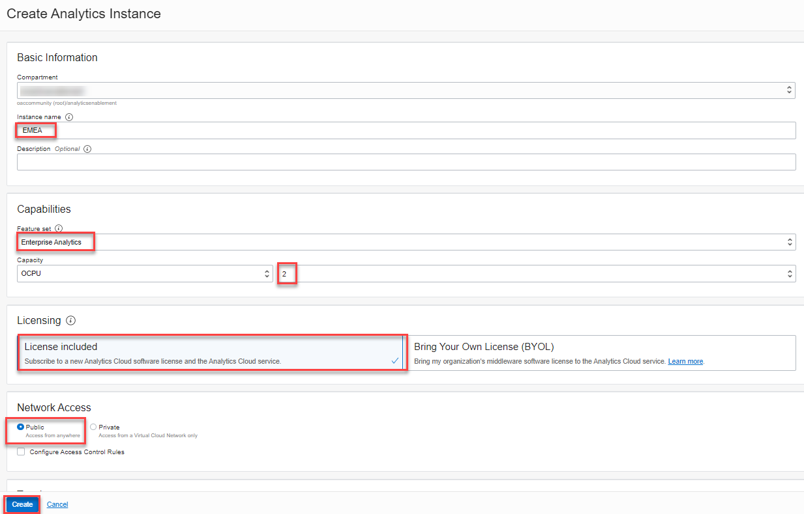
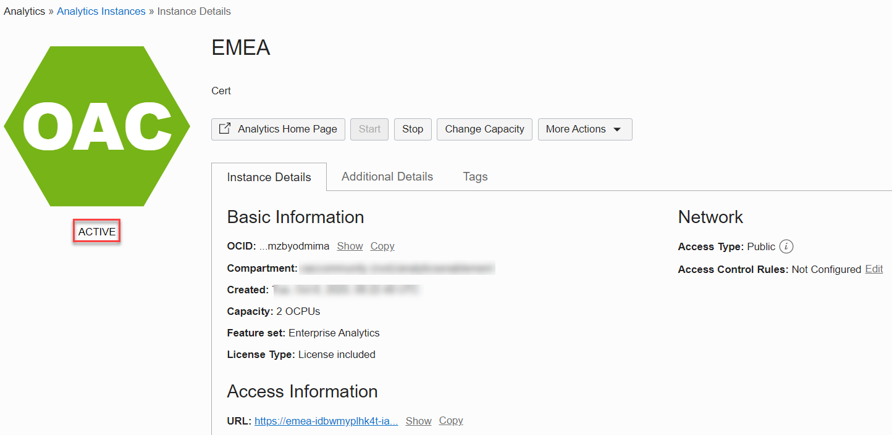

# Provisioning your Oracle Analytics Cloud (OAC) instance

## Introduction

This section describes the process of deploying **Oracle Analytics Cloud** instances on Oracle Cloud Infrastructure Gen 2, which is the default for newly provisioned accounts in **EMEA** and **US**.

Your Oracle Cloud Free Tier account will use the Oracle Cloud Free Trial **credits** while this instance is provisioned, as Oracle Analytics Cloud is not part of the **Always Free** cloud services.

Provisioning an Oracle Analytics Cloud instance can take over **40 minutes**.

_Estimated workshop Time:_ 15 minutes.

### Objectives

- Create an Oracle Analytics Cloud Instance

## Task 1: Create an Oracle Analytics Cloud (OAC) Instance

Return to the Oracle Cloud Infrastructure Console accessing from **Oracle Home Page** (oracle.com) and sign in into your cloud account.
Click in **View Account** and **Sign in to Cloud**.  

1. Click on the menu icon on the right. Verify that you are signed in as a **Single Sign On** (Federated user) user by selecting the **Profile** icon in the top right hand side of your screen.  
    If your username is shown as:

    > oracleidentitycloudservice/&lt;your username&gt;
    >
    Then you are **connected** as a **Single Sign On** user.

    

      If your username is shown as:

    > &lt;your username&gt;
    >
    Then you are **signed in** as an **Oracle Cloud Infrastructure** user.

    

    If your user does not contain the identity provider (**oracleidentitycloudprovider**), please logout and select to authenticate
    using **Single Sign On**.  
    

    To use **Oracle Analytics Cloud** you need to be a **Single Sign-On** (SSO) user.

    [More information about federated users](https://docs.cloud.oracle.com/en-us/iaas/Content/Identity/Tasks/usingscim.htm).

2. Return to the *Home Console Page* and navigate to **Analytics** under **Solutions and Platform** section and then **Analytics Cloud**.

    

    > **Note**: You must be connected as a **Single Sign On** (**Federated** user) user to a tenancy, which has available cloud credits to see this menu item. Local OCI users are not able to do this.

3. Select **Create Instance**.

    Complete the form using the following information:

    >**Compartment**: Select a valid compartment in your tenancy
    >
    >**Instance Name**: Choose a Name
    >
    >**Description**: &lt;optional&gt;
    >
    >**Feature Set**: Enterprise Analytics (important)
    >
    >**Capacity**: 2  
       > **Important**: **1 OCPU OAC instance is for Trials Only**; you cannot scale up an 1 OCPU instance once need it, and also the shape you chose comes with [Limits for Querying, Displaying, Exporting Data](https://docs.oracle.com/en/cloud/paas/analytics-cloud/acsom/create-services-oracle-analytics-cloud.html#GUID-164D8568-9AE3-4A74-9F1A-0D87B78713C9) => **DO NOT create an 1 OCPU instance for OAC Production environment**
    >
    >**License Type**: "Subscribe to a new Analytics Cloud software > license and the Analytics Cloud." (You will use this service as part of the free Oracle Cloud trial that you requested for this workshop).

4. Select **Create**.

    

5. On the **Confirmation** screen, select **Create**.

    The Analytics instance page will be displayed with a status of ***CREATING***.

    ***Reminder***: Provisioning an Oracle Analytics Cloud instance can take over **40 minutes**.

6. The Analytics instance page will be displayed with a status of ***ACTIVE***.  

    

You may now [proceed to the next lab](#next)

## **Acknowledgements**

- **Author** - Lucian Dinescu, Product Strategy, Analytics
- **Contributors** - Priscila Iruela, Database Business Development | Juan Antonio Martin Pedro, Analytics Business Development Victor Martin, Melanie Ashworth-March, Andrea Zengin
- **Reviewed by** - Shiva Oleti, Product Strategy, Analytics
- **Last Updated By/Date** - Lucian Dinescu, January 2021