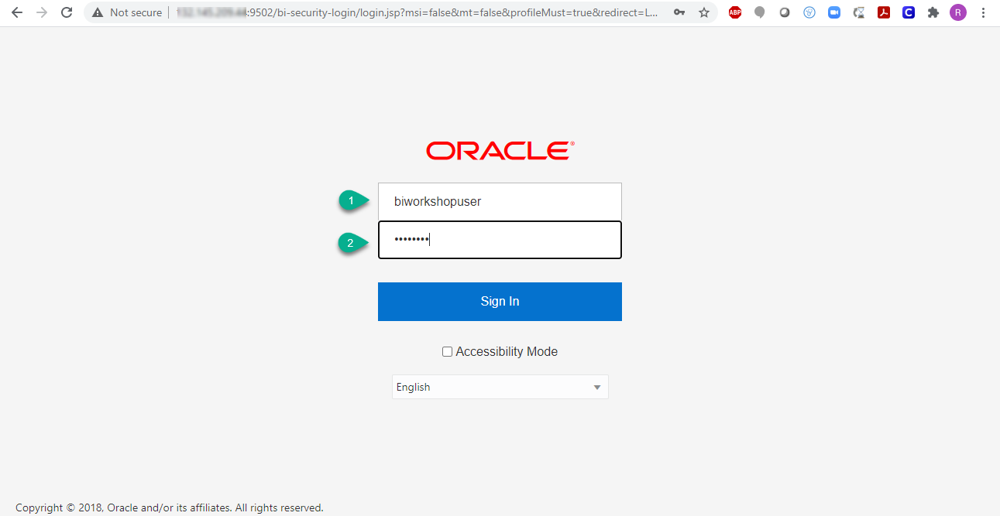
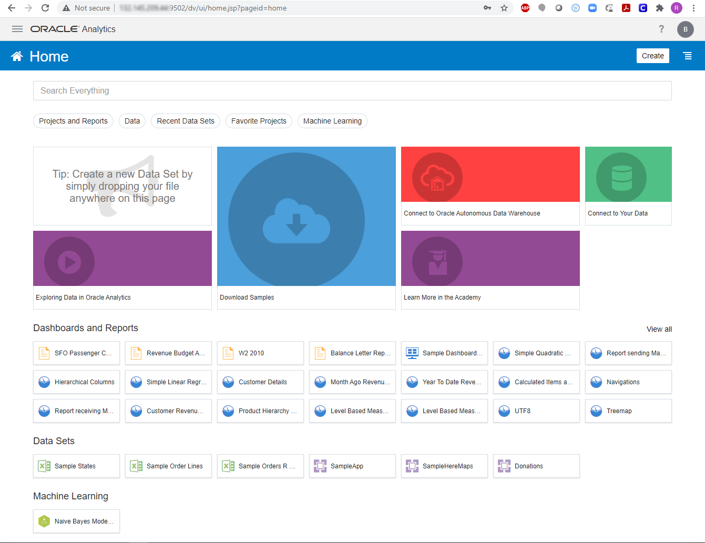
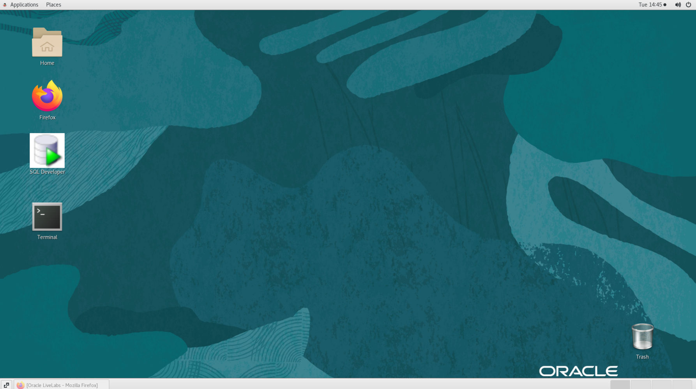

# Environment Setup

## Introduction
This lab will show you how to access Oracle Analytics Server and obtain the necessary workshop artifacts needed for executing the labs.

*Estimated Lab Time*: 10 Minutes

### Objectives
- Validate that the environment has been initialized and is ready
- Download and stage workshop artifacts

### Prerequisites
This lab assumes you have:
- A Free Tier, Paid or LiveLabs Oracle Cloud account
- SSH Private Key to access the host via SSH
- You have completed:
    - Lab: Generate SSH Keys (*Free-tier* and *Paid Tenants* only)
    - Lab: Prepare Setup (*Free-tier* and *Paid Tenants* only)
    - Lab: Environment Setup

## **STEP 1:** Environment Access
This lab has been designed to be executed end-to-end with any modern browser on your laptop or workstation. Proceed as detailed below to login.

### Login to Oracle Analytics Server UI
1. Launch your browser to the following URL to access Oracle Analytics Server UI

    ```
    URL: <copy>http://[your instance public-ip address]:9502/dv/ui</copy>
    e.g: http://111.888.111.888:9502/dv/ui
    ```

    ***Note:*** While application processes are automatically started upon instance boot up, it takes approximately 15 minutes for this URL to become active after all processes have fully started. Should this URL remain inactive after 15 minutes, refer to **Step 3** below for manual start.

2. Provide login credentials

    ```
    Username: <copy>biworkshopuser</copy>
    ```
    ```
    Password: <copy>Admin123</copy>
    ```

    

3. The landing page is displayed

    

### Access the graphical desktop (optional)
For ease of execution of this workshop, your instance has been pre-configured for remote graphical desktop accessible using any modern browser on your laptop or workstation. Proceed as detailed below to login.

1. Launch your browser to the following URL

    ```
    URL: <copy>http://[your instance public-ip address]:8080/guacamole</copy>
    ```

2. Provide login credentials

    ```
    Username: <copy>oracle</copy>
    ```
    ```
    Password: <copy>Guac.LiveLabs_</copy>
    ```

    

    *Note*: There is an underscore `_` character at the end of the password.

3. To launch *Firefox* browser or a *Terminal* client, click on respective icon on the desktop

    

### Enable Copy/Paste from local to remote desktop (Guacamole clipboard)
During the execution of your labs you may need to copy text from your local PC/Mac to the Guacamole remote desktop, such as commands from the lab guide. While such direct copy/paste isn't supported as you will realize, you may proceed as indicated below to enable an alternative local-to-remote clipboard with Input Text Field.

1. From your remote desktop session, enter CTRL+ALT+SHIFT (*Windows*) or CTRL+CMD+SHIFT (*Mac*)

2. Select *Text Input*

    

3. Notice the black Text Input field added at the bottom of your screen after you made the selection in the previous step. This is the field to paste any text copied from your local environment.

    

4. Test copy/pasting the text below. Prior to pasting ensure that the cursor has been placed at the location where the intended text is to be pasted, then right-click inside the black *Text Input* field and paste it

    ```
    <copy>echo "This text was copied from my local desktop on to my remote session"</copy>
    ```

    


### Login to Host using SSH Key based authentication (optional)
While you will only need the browser to perform all tasks included in this workshop, you can optionally use your preferred SSH client to connect to the instance should you need to perform any troubleshooting task such as restarting processes, rebooting the instance, or just look around.

Refer to *Lab Environment Setup* for detailed instructions relevant to your SSH client type (e.g. Putty on Windows or Native such as terminal on Mac OS):
 - Authentication OS User - “*opc*”
 - Authentication method - *SSH RSA Key*
 - OS User – “*oracle*”.

1. First login as “*opc*” using your SSH Private Key

2. Then sudo to “*oracle*”. E.g.

    ```
    <copy>sudo su - oracle</copy>
    ```

## **STEP 2:** Download and Stage Workshop Artifacts (optional)
We recommend running this workshop end-to-end from the remote desktop session for all tasks requiring either *SQL Developer* or *Web browser*. Should you elect to use these tools locally on your PC/Mac then proceed as indicated below.

1. Download [`OAS_OML_Workshop_LabFiles.zip`](https://objectstorage.us-ashburn-1.oraclecloud.com/p/upY4mzN1N2Oq3PrWIr_PaaAw5hLK3XesrlIehHBFqvobSJTKF309EnZSuLUTlXFt/n/natdsecurity/b/labs-files/o/OAS_OML_Workshop_LabFiles.zip) and save to a staging area on your laptop or workstation.

2. Uncompress the ZIP archive

  ***Note***: If you are running the labs exclusively from the remote desktop session as recommended, the content of *`OAS_OML_Workshop_LabFiles.zip`* is already unpacked and staged at *`/opt/oracle/stage/OAS_OML_Workshop_LabFiles`/*

## **STEP 3:** Managing DB and OAS processes (optional)
Your workshop instance is configured to automatically start all processes needed for the labs. Should you need to stop/start these processes, proceed as shown below as user *opc* from your SSH terminal session

### DB Startup/Shutdown

1. Check Current State

    ```
    <copy>sudo systemctl status oracle-database</copy>
    ```

2. Startup

    ```
    <copy>sudo systemctl start oracle-database</copy>
    ```

3. Shutdown

    ```
    <copy>sudo systemctl stop  oracle-database</copy>
    ```

### OAS Startup/Shutdown

1. Check Current State

    ```
    <copy>sudo systemctl status oas</copy>
    ```

2. Startup

    ```
    <copy>sudo systemctl start oas</copy>
    ```

3. Shutdown

    ```
    <copy>sudo systemctl stop oas</copy>
    ```

You may now [proceed to the next lab](#next).

## Learn more
* [Oracle Analytics Server Documentation](https://docs.oracle.com/en/middleware/bi/analytics-server/index.html)
* [https://www.oracle.com/business-analytics/analytics-server.html](https://www.oracle.com/business-analytics/analytics-server.html)
* [https://www.oracle.com/business-analytics](https://www.oracle.com/business-analytics)

## Acknowledgements
* **Authors** - Rene Fontcha, LiveLabs Platform Lead, NA Technology, January 2021
* **Contributors** - Diane Grace
* **Last Updated By/Date** - Rene Fontcha, LiveLabs Platform Lead, NA Technology, March 2021
