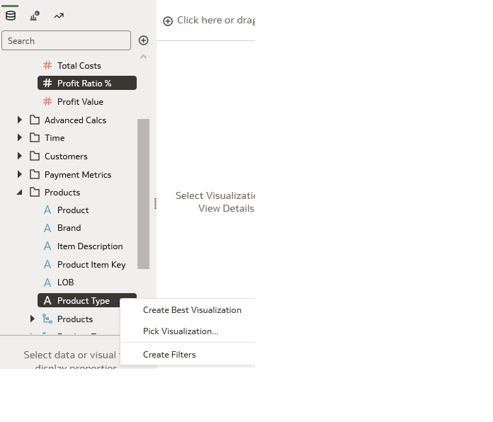
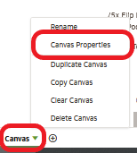

# Self-Service Data Visualization for Finance

## Introduction
This exercise will introduce you to the key features of self service within Oracle Analytics Server and will illustrate what is happening at **JTC America Group**, a fictional conglomerate with operations in multiple geographies and segments covering a vast portfolio of products.

*Estimated Completion Time:* 45 minutes

### About Oracle Analytics Server
Oracle Analytics Server features powerful, intuitive self service capabilities that enable analysts to identify and illustrate insights leveraging modern and innovative data preparation, data enrichment, data discovery and data visualization techniques on an accurate and consistent data set.

### Objectives

In this lab, you will explore the following features and capabilities:

* Data Visualization, Mash Ups, Trend Lines and Forecasting
* Custom Calculations and Maps
* Auto Insights

### Prerequisites
This lab assumes you have:
- A Free Tier, Paid or LiveLabs Oracle Cloud account
- You have completed:
    - Lab: Prepare Setup (*Free-tier* and *Paid Tenants* only)
    - Lab: Environment Setup
    - Lab: Initialize Environment

## Task 1: Data Visualization and Mash Ups

In order to complete our analysis we will create a workbook.  Think of a workbook as a dashboard. A workbook may contain a number of objects including filters, text boxes and other visualization types.  

1.    From the browser session you started in [Lab: Initialize Environment](?lab=init-start-oas), **Click** on *"Create"* at the upper right-hand corner.

      

2.    **Click** on Workbook to start a new self-service workbook.

      

3.    **Select** the "Sample App" subject area and **Click** "Add to Workbook".

      Sample App provides access to the data we will use to complete our analysis.  

      

4.    You will be presented with an empty canvas. Let’s start visualizing! First, let’s see how the product ratios are split across product types.

      - **Control select** "Products – Product Type" and "Profit Metrics – Profit Ratio %".
      - **Right click**, select "Pick Visualization".

      

5.    **Select** "Donut" Chart.

      

6.    Observe the donut chart on the canvas. You can see that of all the product ratios "Audio" has the lowest profit ratio percentage.

      

7.    Now, let’s try to dig deeper and find out why audio’s profit ratio is lower compared to our other product types. Let’s see how the products under "Audio" have been performing over time.

      Expand Time, Products and Profit Metrics, **CTRL-Click** *Product*, *Month* and *Profit Ratio %*. Then, **drag them** to the left of Donut chart.

      A green line appears.  It identifies the location of your visualization. You may drop the visualization to the left, right, top or bottom of the donut visualization.

      

8.    Oracle Analytics Server provides adaptive charting capabilities. Because we wish to review our measure over a specific period of time, Oracle Analytics chose to deliver the results with a
      line chart illustrating profit ratio, month over month.

      Next, we wish to review profit ratio for each product separately to obtain greater detail.

      **Drag** "Product" up to **Trellis Rows**. You should see an individual line chart for each product as shown in the image.

      

      Since we are concerned about the profit ratio of the Audio product type, we will filter down to the product level. To do this, **drag** "Products - Product Type" to the filters section and select "Audio".

      

      Observe that "MicroPod" has declining profit ratios and "SoundX Nano" could also be improved. There could be any number of reasons why this is the case.

9.    We continue our investigation examining product inventory levels. JTC America utilizes a third-party system which captures data regarding inventory and product demand levels.
      I need this data to complete my   analysis. Oracle Analytics provides the ability to quickly access inventory data and mash it up with our current analysis all within a single platform.  

      From the data elements panel, click on "+" and "Add Data Set" to import the inventory dataset into your current workbook.

      

10.   **Click** on "Create Data Set" >> "Drop data file here or click to browse".

      

      Navigate to the documents directory on the left side of the dialogue box.  **Click** Live Labs Content, then select the file *“Inventory.xlsx”*.  Open the file.

      

      

      Once the spreadsheet has been uploaded,  **Click**  "Add" in the upper right hand corner.

      

11.   Navigate back to the "New Workbook" tab located up above the workbook area.

      

      Notice the inventory dataset is available to add to the workbook.  

      - **Click**  "inventory"  "Add to workbook"

      </if>

12.    Let's define a relationship between the subject area – SampleApp and the inventory spreadsheet in order to join the data sources for further analysis.

       From the top - middle of the workbook, notice three navigation options - "Data"  "Visualize"  "Present"

       - **Click**  "Data"

       </if>

       Within Data, you have the ability to identify the key data elements and join your data sources.  Oracle Analytics will attempt to locate data elements that are labeled the same, and automatically make the join if identical data element labels are found.  

       Notice data diagram. The data diagram provides a graphical representation of your data sources and data source connections. Note there are no connections.   Move your cursor in between the data sources   "SampleApp" and "Inventory".

       A match was not identified, therefore we must create our own.

       - **Click** on "0' in between the two data sources.

       - **Click** "Add Another Match"  

       </if>

       From inventory

       - **Click** on "Select Data" and select the "Product Name” column.  

        </if>

        Perform the same steps on "SampleApp" and select "Products - Product" to join the data sources.

        Notice the data sources are joined.  

        </if>

       - **Navigate** to "Visualize".

       

       -  Explore the data elements panel on the left. Note the Inventory spread sheet is listed under SampleApp.

        

13.    Now that we've successfully mashed up our data, let's continue with our analysis.  **Hold control** and **select** "Product -> Product"     from SampleApp and "Stock" and "Demand" from Inventory.

       - **Right Click** and **Select** "Pick Visualization".  

        

       - **Select** "Bar"

        

14.  Notice the grammar panel for the bar visualization. Arranging both the metrics "Stock" and "Demand" in the Y axis respectively, the graph should render as shown in the image.

     

      **Right click** on any bar representing "Demand" and **Sort** -> "Demand" -> "Low to High."

      

      See that the graph sorts itself with Demand in order from lowest to highest demand.

      

      Looking at the bar chart, it can be easily seen that for *"MicroPod"* and *"SoundNano"*, the demand is greater than the current stock level.

      For other products, the relationship between Stock and Demand is not significantly different. We are curious why the stock levels for both products is less than the current demand.

15.   We decide to investigate payables and receivables. In order to continue our analysis, we import our Vendor Outstanding Payment spreadsheet which we obtained from our financial system.

      **Import** the *Vendor Payments.xlsx* spreadsheet and repeat the steps from 9 through 12. You should now see the data set for Vendor Payments appear in the data elements panel of the workbook.

      

16.   Let’s create a visualization to analyze products and vendor payments.

      Expand Products and Vendor Payments, **CTRL-Click** *Product* and *OutstandingPayment*. Then, **Right-Click** and **select** "Pick Visualization."

      

17.   Select "Tag Cloud".

      

18.   You should see a new visualization on the canvas. The visual shows that **MicroPod** and **SoundX Nano** are the products with the greatest amount of outstanding vendor payments.

      It is possible that our vendors might not be willing to ship the order quantities if there are substantial outstanding payments on the account.

      We must take action to clear up these payment issues.

19.   There are a few more metrics and insights I would like to provide in order to complete my analysis.

      Let's forecast profit ratio and revenue performance for the upcoming months.  Oracle Analytics Server provides easy to use, advanced analytic functions such as trendline, forecast,
      clustering and outlier detection.  

20.   Let’s start by adding a new canvas. **Click** on the "+" icon at the bottom to create a new canvas. On the new canvas **Click** the upside
      down triangle to the right of its name. Select "Canvas Properties".

      

21.   **Click** "Auto Fit" and change it to "Freeform." **Click** "Ok".

22.   **Select** "Profit Ratio %", "Revenue" and "Month". RMB Pick Visualization. **Select** "Combo."

      

      Notice in freeform mode the entire canvas is not utilized automatically.

23.   From the grammar panel **Right click** "Profit Ratio %" and select "Y2 Axis." Enlarge the visualization for a better view.

      

24.   **Select** the "Analytics" option from the navigation panel on the left. Drag and drop "Trend Line" onto the visualization.

      

25.   You have now created a management report that shows both Revenue and Profit Ratio % with their corresponding trendlines all with no coding.

      **Drag** and **drop** "Forecast" on the visualization and you will see forecasted results for both measures. This may take a few moments, please wait.

      

      Review the properties box. Notice the forecast has predicted revenue and profit ratio % for the next 3 months. These variables may be modified as needed by the user.

      

26.   Looks like we are trending in the appropriate direction and our forecast looks promising.  Next, I'm going to provide a historical look at revenue performance utilizing a calendar heatmap
      custom visualization I found in the Oracle Analytics Extensions Library.  

      **Note:**  We've added the custom visualization into the environment for you. If you are interested in learning how to upload custom visualization types, please see the section at the end
      of this document.

      Let’s start by adding a new canvas. **Click** on the "+" icon at the bottom to create a new canvas.

      

27.   Expand Time and Revenue Metrics Metrics, **CTRL-Click** *Date* and *Revenue*. Then, **right click** and **select**
      the "Calendar Heatmap" visual.  

      

## Task 2:  Custom Calculations and Maps
   Oracle Analytics Server provides advanced mapping capabilities and the ability to create custom calculations.

1.    In this exercise we will create two custom calculations and then use Oracle’s self-service built in map capabilities to analyze state and average profit per customer.

      Let’s start by adding a new canvas.

      **Click** on the "+" icon at the bottom to create a new canvas.

      

2.    **Right Click** on the "My Calculations" folder.  **Select** "Add Calculation".

      

3.    We are going to utilize the expression builder to create a new metric called "Profit by Customer Count".  Notice there are a wide range of functions available for creating custom calculations.

4.    **Select** "Profit Value" from "Profit Metrics" and **drag** and **drop** into the calculation dialog. Type "/" after the "Profit Value" then drag and drop "# of Customers" from "Revenue Metrics"
      after "/."  Click Validate. Click Save.

      You have successfully created your own custom calculation that can be used like any other metric.

      

5.    Let’s utilize our custom calculation in a couple of visualizations.

      **Select** "Country Name" from "Geography".  Drag and drop it to the top left of the canvas, right above the canvas, where it is labeled "Click here or drag data to add filter." **Filter** to
      "United States" by typing "uni" and select "United States".

      

      

6.    **Select** "State Province" from "Geography" and your new custom calculation under "My Calculations." Drag and drop them onto the canvas."  Notice that not all states are making a profit.

      

      Let’s see what this looks like on a map.

7.    On the upper right corner of the visual, **Click** the three vertical dots and select "Edit" and then "Duplicate Visualization".

      

8.    Change the visualization type for the visualizations by selecting the "change visualization" menu in the upper left-hand corner of the grammar panel.

      **Select** map.

      

9.    Let’s change the default color scheme to a red to green gradient. From Color, click on the down arrow > Manage Assignments.

      

10.   Under Series, locate the metric you created : Profit by Customer Count

      - **Click** the Down arrow next to the color bar.
      - **Select** the red to green gradient second from the bottom right.
      - **Click** "Done".

      

11.   There are a number of ways to filter information in order to obtain insights regarding different attribute groups, and aggregation levels. The canvas is an extremely dynamic and interactive
      palette.

      Recall, at the beginning of the exercise, we reviewed profit ratio by product, and we added a filter to a specific visualization to review profit ratio for the products categorized as Audio
      product type.  (Task 1 - Step 8).

      In this exercise we added a filter to our canvas to review specific metrics within the United States.

      Users can quickly interact with visualizations in order to create slices or subsets via a few clicks of the mouse to obtain deeper insights.

      Navigate back to canvas 1.

      **Right Click** on the "Audio" pie slice and  "Keep Selected".

      

      Notice that each object interactively changes based upon the selection of "Audio" pie slice.

      

      Clear your filter section by Right **Clicking** on the "Audio" pie slice and **selecting** "Remove Selected".

      

12.   **Click** on the "Save" icon at the top right of the screen to save your workbook.

      

      **Save** your workbook under  /My Folders as `"<your_name>_Workbook`".

      

      You have successfully created a workbook.

## Task 3:  Auto Insights

 So far, we created a workbook based upon a defined and specific scenario.  We asked some questions, and we received answers.  
 As a result, we’ve delivered actionable insights addressing decreasing profit ratios at JTC Americas.

 Can you think of a time, when presented with a data analysis task, you are not quite sure how or where to begin given a voluminous dataset?  

 Oracle Analytics Server automatically can deliver powerful insights on any dataset in the system using a feature called Auto Insights.

 Auto Insight is a handy tool for understanding your data and provides a great starting point for analysis.

 When you create datasets or add datasets to a workbook, Oracle Analytics Server will assess the dataset and generate several suggestions via a visualization card and a descriptive
 natural language summary.  The summary explains the relationship between attributes, measures, and points of interest.  

1.  Let’s begin by creating a dataset with a spreadsheet titled - ‘sample order lines.xlsx’ located in  the Documents / Live Labs Content directory you accessed earlier.

     

     

     

2.  For this exercise, we will leave it exactly as it is, and add it to Oracle Analytics Server and create a workbook.

     

     

    Notice a white light bulb icon in the top right hand corner.  Once Auto Insights has assessed the dataset, the icon will turn yellow which indicates that Oracle Analytics Server has
    identified a series of suggested insights.

3.  **Click** the Auto Insights icon to review the suggested insights in the panel on the far right.

     

     Each visual insight includes a natural language summary to describe the function insight each visualization delivers.
     Hover over the text to see the full description.  

    If you are interested in a specific insight, simply click on the + icon within the visualization or drag the visualization directly into the canvas.

    Create a canvas selecting a handful of insights. Add the following:

    - Measures Overview
    - Trending Dimensions
    - City Scatter Plot Chart
    - Top 10 City by Profit

    When finished, collapse the auto insights panel.

     

    Notice each insight exists in the canvas as if you created each visualization object manually.

4.  Hover over the title of each insight to review its natural language summary.  You may wish add a text box in order to display the natural language summary within your workbook.

    Select the visualization menu on the far left, select Text Box.  Drag the text box above Trending Dimensions.

    

    Copy (Ctrl-C) the text in the Title Tooltip field in the left-hand data panel (properties) of the workbook designer and paste (Ctrl-P) it in the 'Edit Text' box within the visualization.

    

    You may edit the text box as desired.

    

    Navigate to the far left and explore the data elements panel and scroll to the bottom.  

5.  Review ‘MyCalculations’.

    

    Notice the accompanying custom calculations have been carried over to the data elements panel as a result of your visualization selections.

    Just like any canvas, elements and objects can be filtered, or modified based upon your requirements.  You can use the insight visualization objects as a template to duplicate or
    modify the visualization objects based upon your analysis needs.  

    Right click on 'Top 10 City by Profit Value' calculation.  Notice you can edit the calculation, duplicate it, or copy it to a clipboard.    

    Select 'Edit the Calculation.  You can see the syntax and functions utilized for each calculation.

    

    

    Let's edit the calculation and review the top 5 cities by profit value.  Save the calculation.  

    

    Don't forget to modify the visualization name.

    

6.  Navigate to Data Prep and modify the metadata.

    From top middle,  **Click** data.  **Click** on the pencil icon to navigate to view the data.

    

    Navigate to the metadata view,  hint - upper right.

    

    Make the following modifications:
    - Discount , modify the aggregation from 'Sum' to 'Average'
    - Rename 'Sales' to 'Revenue'
    - Hide 'Product Sub Category'

    Don't forget to 'Apply Script'

7.  Once you have applied the script, navigate back to your workbook via your open workbook window.  

     

     Next, navigate to 'Visualize'

    Notice the changes to your workbook, and lightbulb icon is white again.   Auto Insights will automatically execute and reassess your data.  
    The lightbulb icon will turn yellow and provide new insights when complete.  

## Task 4: Uploading a custom visual extension (Read-only)  

**Note:** Tasks listed under this step are for ***reference*** only as they have already been performed on your instance.

Oracle Analytics provides users choice and flexibility with deployment.  Users can upload custom visualizations and analytics scripts in order to expand and enhance self-service visualization capabilities. In this task, you will review how to leverage two of our extension options.

1. Navigate to the Analytics Library to view custom visualization plugins which are available for import

    [https://www.oracle.com/business-analytics/data-visualization/extensions.html](https://www.oracle.com/business-analytics/data-visualization/extensions.html)

    

2. Download the “Circle Pack” and “Calendar Heatmap” extensions.

    

## Learn More
* [Oracle Analytics Server Documentation](https://docs.oracle.com/en/middleware/bi/analytics-server/index.html)
* [https://www.oracle.com/business-analytics/analytics-server.html](https://www.oracle.com/business-analytics/analytics-server.html)
* [https://www.oracle.com/business-analytics](https://www.oracle.com/business-analytics)

## Acknowledgements
* **Authors** - Linda Dest Analytics Platform Specialist, NA Technology
* **Contributors** - Linda Dest, Rene Fontcha
* **Last Updated By/Date** - Linda Dest NA Technology, April 2022
