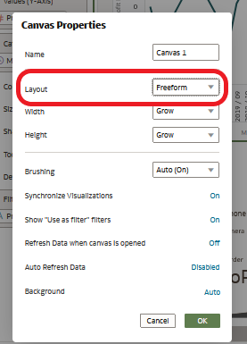
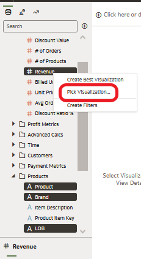
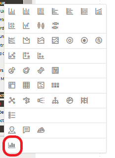
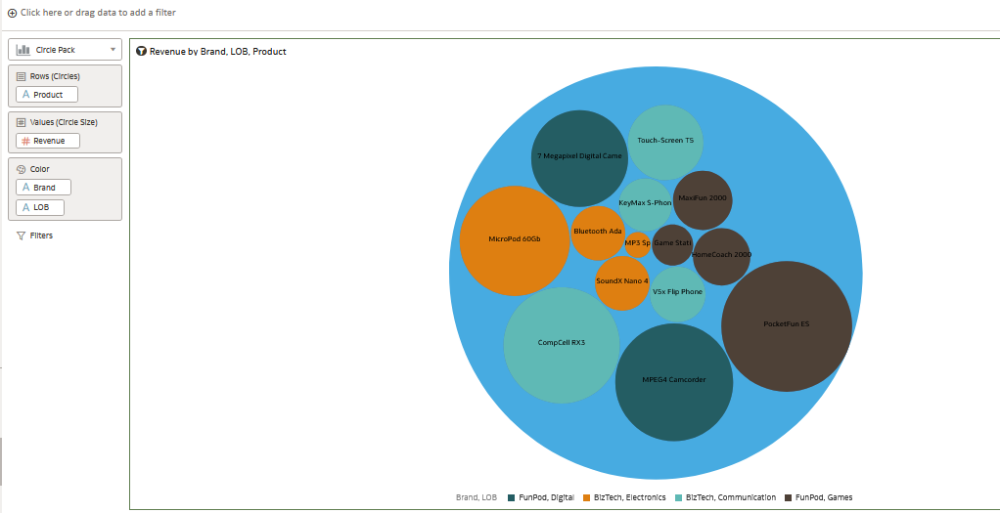
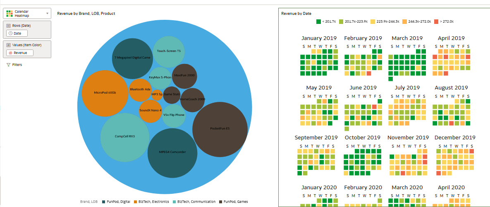
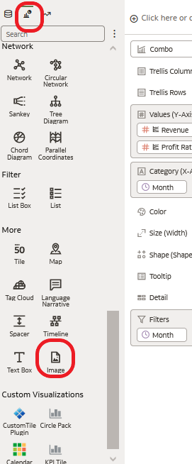
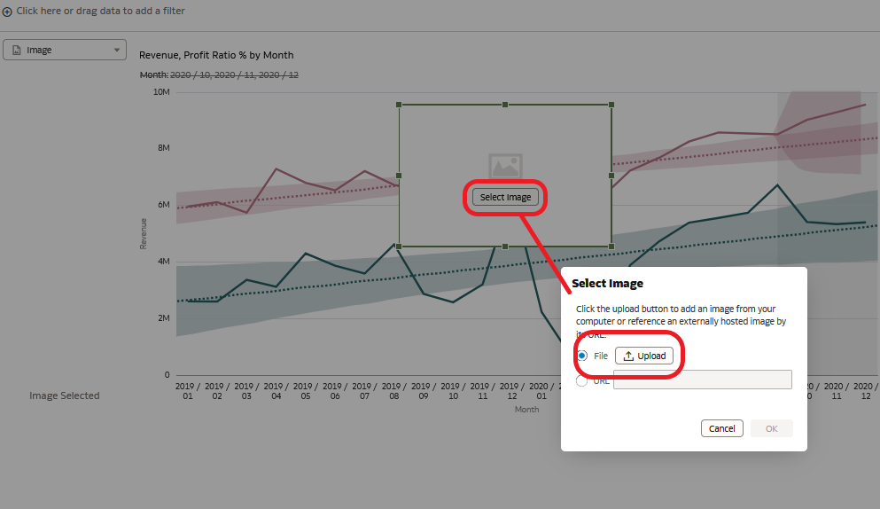

# Self-Service Data Visualization for Finance

## Introduction
This exercise will introduce you to the key features of self service within Oracle Analytics Server and will illustrate what is happening at **JTC America Group**, a fictional conglomerate with operations in multiple geographies and segments covering a vast portfolio of products.

*Estimated Completion Time:* 45 minutes

### About Oracle Analytics Server
Oracle Analytics Server features powerful, intuitive self service capabilities that enable analysts to identify and illustrate insights leveraging modern and innovative data discovery and data visualization techniques on an accurate and consistent data set.

### Objectives

In this lab, you will explore the following features and capabilities:

* Data Visualization and Mash Ups
* Custom Calculations and Maps
* Freeform Canvases, Trend Lines, and Custom Backgrounds

### Prerequisites
This lab assumes you have:
- A Free Tier, Paid or LiveLabs Oracle Cloud account
- You have completed:
    - Lab: Prepare Setup (*Free-tier* and *Paid Tenants* only)
    - Lab: Environment Setup
    - Lab: Initialize Environment

The following files <if type="external">referenced in [Lab: Initialize Environment](?lab=init-start-oas) should already be downloaded and staged as instructed, as they</if> <if type="desktop"> staged under *`/opt/oracle/stage`*</if> are required to complete this lab.
- inventory.xlsx
- vendor payments.xlsx
- JRC Americas Group.jpg

## Task 1: Data Visualization and Mash Ups

In order to complete our analysis we will create a workbook.  Think of a workbook as a dashboard. A workbook may contain a number of objects including filters, text boxes and other visualization types.  

1. From the browser session you started in [Lab: Initialize Environment](?lab=init-start-oas), Click on *"Create"* at the upper right-hand corner.

    

2. **Click** on Workbook to start a new self-service workbook.

    

3. **Select** the "Sample App" subject area and **Click** "Add to Workbook".

     Sample App provides access to the data we will use to complete our analysis.  

    

4. You will be presented with an empty canvas. Let’s start visualizing! First, let’s see how the product ratios are split across product types.

    - **Control select** "Products – Product Type" and "Profit Metrics – Profit Ratio %".
    - **Right click**, select "Pick Visualization".

    

5. **Select** "Donut" Chart.

    

6. Observe the donut chart on the canvas. You can see that of all the product ratios "Audio" has the lowest profit ratio percentage.

    

7. Now, let’s try to dig deeper and find out why audio’s profit ratio is lower compared to our other product types. Let’s see how the products under "Audio" have been performing over time.

    Expand Time, Products and Profit Metrics, **CTRL-Click** *Product*, *Month* and *Profit Ratio %*. Then, **drag them** to the left of Donut chart.

    A green line appears.  It identifies the location of your visualization. You may drop the visualization to the left, right, top or bottom of the donut visualization.

    

8. Oracle Analytics Server provides adaptive charting capabiities. Because we wish to review our measure over a specific period of time, Oracle  Analytics chose to deliver the results with a line chart illustrating profit ratio, month over month.

   Next, we wish to review profit ratio for each product separately to obtain greater detail.
   
   **Drag** "Products" up to **Trellis Rows**. You should  see an individual line chart for each product as shown in the image.

    

    Since we are concerned about the profit ratio of the Audio product type, we will filter down to the product level. To do this, **drag** "Products - Product Type" to the filters section and select "Audio".

    

     Observe that "MicroPod" has declining profit ratios and "SoundX Nano" could also be improved. There could be any number of reasons why this is the case.

9. We continue our investigation examining our product inventory levels. JTC America utilizes a third-party system which captures product inventory as well as product demand. I need this data to complete my
   analysis.  Oracle Analytics provides the ability to quickly access the inventory data and mash it up with our current analysis all within a single platform.  

    From the data elements panel, click on "+" and "Add Data Set" to import the inventory dataset into your current workbook.

    

10. **Click** on "Create Data Set" >> "Drop data file here or click to browse".

    

    Drag and drop, or browse and select the file *“Inventory.xlsx”* from <if type="external"> the staging area where you unpacked the downloaded artifacts as instructed in [Lab: Initialize Environment](?lab=init-start-oas)

    </if> <if type="desktop"> *`/opt/oracle/stage`*

    </if>

    Once the spreadsheet has been uploaded,  **Click**  "Add" in the upper right hand corner.

    

11. Oracle Analytics Server includes its own light weight data preparation capabilities. 

    When you import the spreadsheet, notice a new tab opens labeled "New Dataset".  When Oracle Analytics ingests data, each element is identified as an attribute, measure, or time element.  Above each data column, notice each associated data insight card, which provides additional diagnostic information and notifies you of missing values, misspellings, and data type inconsistencies.  Data quality issues and inconsistencies can be easily corrected inline, accelerating data preparation and improving analytics quality.  
 
    Over to the right, notice Oracle Analytics will make enrichment recommendations based upon what it understands and knows about the data.  Enrichment recommendations provide the ability to add information to data such as enhancing a zip code attribute column with the state name.  A user may choose to add a new column to the dataset containing the name of the state associated with the zip code.  When you select a recommendation, the change is added to the Preparation Script.  Note the panel located on the far left side of the working palette.  Modifications and enhancements are applied when you apply the preparation script. If you delete or undo the change, the recommendation is displayed once again as an available option in the Recommendations panel. 

    We will explore these features later in another lab exercise. 

    Navigate back to the "New Workbook" tab located up above the workbook area. 

    

    Notice the inventory dataset is available to add to the workbook.  

    - **Click**  "inventory"  "Add to workbook"

      </if>
    
12. Let's define a relationship between the subject area – SampleApp and the inventory spreadsheet in order to join the data sources for further analysis.

    From the top - middle of the workbook, notice three navigation options - "Data"  "Visualize"  "Present"

    - **Click**  "Data"

    </if>

    Within Data, you have the ability to identify the key data elements and join your data sources.  Oracle Analytics will attempt to locate data elements that are labeled the same, and automatically make the join if identical data element labels are found.  

    Notice data diagram. The data diagram provides a graphical representation of your data sources and data source connections. Note there are no connections.   Move your cursor in between the data sources "SampleApp" and "Inventory".

    A match was not identified, therefore we must create our own.

     - **Click** on "0' in between the two data sources. 

     - **Click** "Add Another Match"  

    </if>

    From inventory
   
    - **Click** on "Select Data" and select the "Product Name” column.  

        </if>

    Perform the same steps on "SampleApp" and select "Products - Product" to join the data sources. 

    Notice the data sources are joined.  

    

    - - **Navigate** to "Visualize".  Explore the data elements panel on the left. Note the Inventory spread sheet is listed under SampleApp.

        

13. Let's perform our analysis.  **Hold control** and **select** "Product -> Product" from SampleApp and "Stock" and "Demand" from Inventory.

    - **Right Click** and **Select** "Pick Visualization".  

    

      - **Select** "Bar"

    

14. Notice the grammar panel for the bar visualization. Arranging both the metrics "Stock" and "Demand" in the Y axis respectively, the graph should render as shown in the image. 

    

    Looking at the bar chart, it can be easily seen that for *"MicroPod"* and *"SoundNano"*, the demand is greater than the current stock level.

    For other products, the relationship between Stock and Demand is not significantly different. We are curious why the stock levels for both products is less than the current demand.

15. We decide to investigate payables and receivables. In order to continue our analysis, we import our Vendor Outstanding Payment spreadsheet which we obtained from our financial system.

    **Import** the *Vendor Payments.xlsx* spreadsheet and repeat the steps from 9 through 12. You should now see the data set for Vendor Payments appear in the data elements panel of the workbook.

    

16. Let’s create a visualization to analyze products and vendor payments. 

    Expand Products and Vendor Payments, **CTRL-Click** *Product* and *OutstandingPayment*. Then, **Right-Click** and **select** "Pick Visualization."

    

17. Select "Tag Cloud".

    

18. You should see a new visualization on the canvas. The visual shows that **MicroPod** and **SoundX Nano** are the products with the greatest amount of outstanding vendor payments. 
    It is possible that our vendors might not be willing to ship the order quantities if there are substantial outstanding payments on the account.

    We must take action to clear up these payment issues.

19. Before we take action, let’s play with a few more features and capabilities.

    **Click ** the bar chart.  **right click** on any bar representing "Demand" and **Sort** -> "Demand" -> "Low to High."

    

    See that the graph sorts itself with Demand in order from lowest to highest demand.

    

20. Let's organize our visualizations within our workbook canvas. 

    Oracle self-service includes a freeform canvas mode. This allows you to place and size visualizations anywhere on the canvas. 

    I would like to size my visualizations to make this canvas more pleasing to the business consumer.  In order to do that I need to modify the canvas properties.  

    Move your cursor to the tab labeled "Canvas 1" .  **Click** on the arrow, and **select** "Canvas Properties"

    

    Navigate to the "Layout" setting, and **select** "freeform" from the choice list.

    

    **Click** on any visualization.  Notice you can drag in or drag out from any of the edges of the visualization.  Or  drag and drop the entire visualization to a new location within the canvas.  

     

21. The canvas is an extremely dynamic and interactive palette.  Users can quickly create slices or subsets to obtain deeper insights.  Let's explore the ability to filter. 

    Each visualization can be leveraged to drill down to specific details.  **Right Click** on the "Audio" pie slice and  "Keep Selected".

    

     Notice that each object interactively changes based upon the selection of "Audio" pie slice.

    

    Clear your filter section by Right **Clicking** on the "Audio" pie slice and **selecting** "Remove Selected".

    

22. Now, let’s look at how to add custom visualizations to the canvas. Let’s start by adding a new canvas. **Click** on the "+" icon at the bottom to create a new canvas.

    

    Expand Products and Revenue Metrics, **CTRL-Click** *Product*, *Brand*, *LOB* and *Revenue*. Then, **right click** and **select** "Pick Visualization".

    

    **Select** the "Circle Pack," which is a custom visualization.

    **Note:** if you are interested in learning how to upload custom visualization types, please see the section at the end of this document.

    **Drag** "Products" from Color to the Rows section.

    

    The circle pack visualization appears as shown in the image. The size of the circles represents Revenue and each colored circle represents a combination of Brand and LOB.

    

23. Now, let’s look at revenue by date by leveraging another custom visualization type "Calendar Heatmap." Expand Time and Revenue Metrics, **CTRL-Click** *Date* and *Revenue*. Then, **right click** and **select**
    the "Calendar Heatmap" visual.  

    

    Recall in the previous activity, the calendar map visualization was not available for selection. Oracle Analytics determined the calendar heatmap to be an appropriate visualization option because date and revenue were selected by the user.

    The Calendar Heatmap appears next to the Circle Pack.

    

    **Click** on the "Save" icon at the top right of the screen to save your project.

    

    **Save** your project under  /My Folders as `"<your_name>_Project`".

    

## Task 2: Custom Calculations and Maps
 Oracle Analytics Server provides advanced mapping capabilities and the ability to create custom calculations. 

1. In this exercise we will create two custom calculations and then use Oracle’s self-service built in map capabilities to analyze state and average profit per customer.

    Let’s start by adding a new canvas.

    **Click** on the "+" icon at the bottom to create a new canvas.

    

2. **Right Click** on the "My Calculations" folder.  **Select** "Add Calculation".

    

3. We are going to utilize the expression builder to create a new metric called "Profit by Customer Count".  Notice there are a wide range of functions available for creating custom calculations.

4. **Select** "Profit Value" from "Profit Metrics" and **drag** and **drop** into the calculation dialog. Type "/" after the "Profit Value" then drag and drop "# of Customers" from "Revenue Metrics" after "/." Click Validate. Click Save.

    You have successfully created your own custom calculation that can be used like any other metric.

    

5. Let’s utilize our custom calculation in a couple of visualizations.

    **Select** "Country Name" from "Geography".  Drag and drop it to the top left of the canvas, right above the canvas, where it is labelled "Click here or drag data to add filter." **Filter** to "United States" by typing "uni" and select "United States".

    

    

6. **Select** "State Province" from "Geography" and your new custom calculation under "My Calculations." Drag and drop them onto the canvas."  Notice that not all states are making a profit.

    

    Let’s see what this looks like on a map.

7. On the upper right corner of the visual, **Click** the three verticle dots and select "Edit" and then "Duplicate Visualization".

    

8. Change the visualization type for the visualizations by selecting the "change visualization" menu in the upper left-hand corner of the grammar panel.

    **Select** map.

    

9. Let’s change the default color scheme to a red to green gradient. From Color, click on the down arrow > Manage Assignments.

    

10. Under Series, locate the metric you created : Profit by Customer Count 

    - **Click** the edit option (the pen) for Profit by Customer Count.
    - **Click** the Down arrow next to the color bar.
    - **Select** the red to green gradient second from the bottom right.
    - **Click** "Done".

    

11. You have successfully completed custom calculations and mapping. **Select** "Save" to save and update your project.

    

## Task 3: Freeform Canvases, Trend Lines, and Custom Backgrounds  

 In this exercise we will use the freeform canvas property setting to display the *"JTC Americas Group"* corporate logo as the background for trendline analysis. Additionally, we will explore one-click / drag and drop advanced analytic functions such as trendline, forecast, clustering and outlier detection.

1.  Let’s start by adding a new canvas. **Click** on the "+" icon at the bottom to create a new canvas. On the new canvas **Click** the upside down triangle to the right of its name. Select "Canvas Properties".

    

2. **Click** "Auto Fit" and change it to "Freeform." **Click** "Ok".
  
3. **Select** "Profit Ratio %", "Revenue" and "Month". RMB Pick Visualization. **Select** "Combo."

    

    Notice in freeform mode the entire canvas is not utilized automatically.

4. From the grammar panel **Right click** "Profit Ratio %" and select "Y2 Axis." Enlarge the visualization for a better view.

    

5. **Select** the "Analytics" option from the navigation panel on the left. Drag and drop "Trend Line" onto the visualization.

    

6. You have now created a management report that shows both Revenue and Profit Ratio % with their corresponding trendlines all with no coding.

    **Drag** and **drop** "Forecast" on the visualization and you will see forecasted results for both measures. This may take a few moments, please wait.

    

    Review the properties box. Notice the forecast has predicted revenue and profit ratio % for the next 3 months. These variables may be modified as needed by the user.

    

7. Next we will add the JTC Americas logo to our canvas.

    **Click** the Visualizations menu on the left side of the pane. **Select** "Image" and **drag** and **drop** it on the canvas. Click "Select Image" and upload the *"JTC Americas Group.jpg"* file from <if type="external"> the staging area where you unpacked the downloaded artifacts as instructed in [Lab: Initialize Environment](?lab=init-start-oas)</if> <if type="desktop"> *`/opt/oracle/stage`*</if>.

    

    

8. On the Image properties panel change the "Width" and Height" properties to "Auto Fit".

    

    Notice you can align the image and modify the "Transparency."   **Click** the value of "0" and use the slider to see how the transparency looks beneath your trendline visualization.

    

9. Once you have configured the image to your liking. Move the image of the company logo on top of the trendline visualization. "**Right-Click** and **select** "Order Visualization"->"Send Backward".

    

10. The result should look something like this. Select "save" to update and save your project.

    

## Task 4: Uploading a custom visual extension (Read-only)  

**Note:** Tasks listed under this step are for ***reference*** only as they have already been performed on your instance.

Oracle Analytics provides users choice and flexibility with deployment.  Users can upload custom visualizations and analytics scripts in order to expand and enhance self-service visualization capabilities. In this task, you will review how to leverage two of our extension options.

1. Navigate to the Analytics Library to view custom visualization plugins which are available for import

    [https://www.oracle.com/business-analytics/data-visualization/extensions.html](https://www.oracle.com/business-analytics/data-visualization/extensions.html)

    

2. Download the “Circle Pack” and “Calendar Heatmap” extensions.

    

## Learn More
* [Oracle Analytics Server Documentation](https://docs.oracle.com/en/middleware/bi/analytics-server/index.html)
* [https://www.oracle.com/business-analytics/analytics-server.html](https://www.oracle.com/business-analytics/analytics-server.html)
* [https://www.oracle.com/business-analytics](https://www.oracle.com/business-analytics)

## Acknowledgements
* **Authors** - Linda Dest Analytics Platform Specialist, NA Technology
* **Contributors** - Linda Dest, Rene Fontcha
* **Last Updated By/Date** - Linda Dest NA Technology, March 2022
