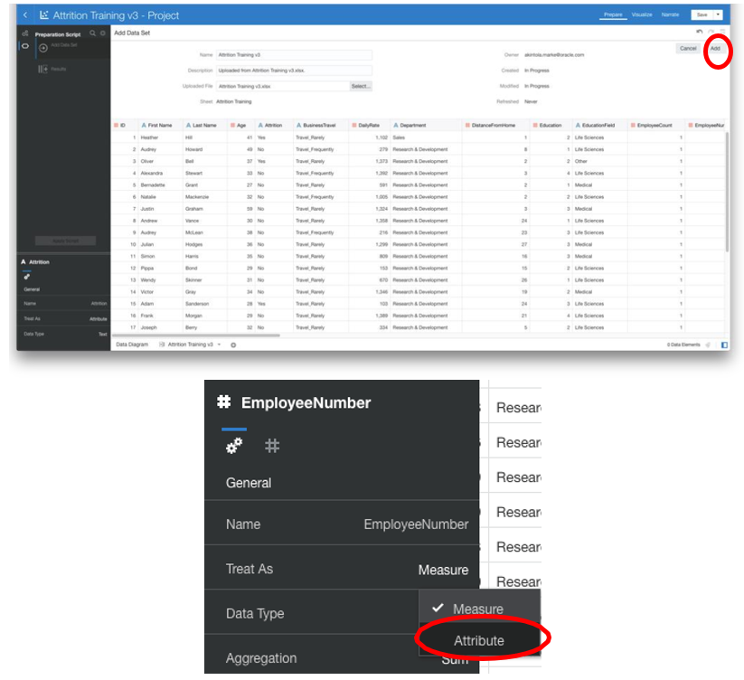
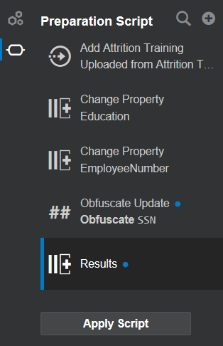

# OAS Augmented Analytics in Data Visualization #

## Introduction ##

Oracle Analytics Server features powerful, intuitive data visualization capabilities that enable analysts to create self-service data visualizations on an accurate and consistent data set.  One of the more sophisticated features of Oracle’s self-service offering is the ability to leverage Augmented Analytics and Machine Learning at the click of a button directly within your self-service projects and data flows.

Augmented Analytics are statistical functions that you apply to enhance or apply forecasting to the data already displayed on your canvas.

There are also a set of pre-built machine learning algorithms which can be used to extract information from your data sets such as sentiment analysis, predicting outcomes and time-series forecasting.

As well as the pre-built options available in the user interface, you can also call custom advanced analytics or machine learning scripts either using Evaluate Script function from within your self-service projects or by adding custom scripts as part of your Data Flow when preparing data.

*Estimated Lab Time:* 30 Minutes

### Objectives ###
- This exercise will introduce you to the capability to readily add augmented analytic functions such as Trendline, Forecast, Cluster & Outlier identification to your analysis.
- In this lab, you will play the role of an HR Analyst.  The VP of HR has noticed an increasing rate of attrition. 
- As an analyst, you have been tasked with identifying what is happening internally in order to decrease the rate of attrition and identify potential strategies to mitigate risk. Additionally, you will identify those employees who are at the greatest risk for leaving.  
  
### Prerequisites ###

This lab assumes you have:
- A Free Tier, Paid or LiveLabs Oracle Cloud account
- SSH Private Key to access the host via SSH
- You have completed:
    - Lab: Generate SSH Keys (Free Tier and Paid Account only)
    - Lab: Prepare Setup (Free Tier and Paid Account only)
    - Lab: Environment Setup
    - Lab: Initialize Environment

- The following files are required to complete this lab.
    - DATA TO BE IMPORTED IN ORACLE DB:
         - Employee_Attrition.xlsx file 
         
     - DVA File:
         - Employee+Analysis.dva 

## **STEP** 1: Adding Trend Line, Forecast, Clusters and Outliers to charts
 

1. Login to Oracle Analytics by entering the URL provided by your instructor.

2. Click on **Create** -> **Project** to start a new self-service project. 

3. Select the “**Sample App**” subject area and Click “**Add to Project**”.  
  
  
4. Select “**Profit Ratio %**”, “**Revenue**” and “**Month**.” Right click and select Pick Visualization and  select “**Combo**.”   
 
  
   **Notice:** in freeform mode the entire canvas is not utilized automatically.  
 
5. Click “**Profit Ratio %**” and select “**Y2 Axis**.” 
   Enlarge the visualization for a better view.  

6. Select the “**Analytics**” option. Drag and drop “**Trend Line**” onto the visualization.   
 

7. You have now created a management report that shows both Revenue and Profit Ratio % with their corresponding trendlines with no coding. 

   Now Drag and drop “**Forecast**” onto the visualization and you will see forecasted results for both measures. This may take a few moments, please wait.  

Save your analysis.

## **STEP** 2: Using OAS Machine Learning to accelerate root cause analysis 

We will use the data profiling and semantic recommendations functionality to repair and enrich your data. These recommendations are based on the system automatically detecting a specific semantic type during the data profiling .

You will learn how the Explain feature uses machine learning so you don not have to waste time guessing and dropping random data elements on the canvas to create a visualization for data insight.

We will also leverage the BI Ask functionality as part of data visualization. This feature provides an interactive way to integrate data into your visualization projects.

In this exercise we use a data set on employee attrition to explore information related to experience, performance and incentive information and use this to predict whether the employee has left the organization.

From the homepage we create a new project and upload the data set to start analyzing the data set.

We will be leveraging the data visualization machine learning features to generate rapid insights of the data added to the project.

1. In the home page, click on create button and select **Project**.
 

2. Select > **Create Data Set**. Add the data set “**AttritionTraining .xlsx**”
 
 
 

3. In the prepare pane you can check to see the definitions of each of the columns from the data set.
   Ensure that the ‘**EmployeeNumber**’ column is set to attribute and that the ‘**Education**’ measure is also set to attribute.
 

   Navigate to properties in the bottom left corner and change data type for ‘**EmployeeNumber**’ and ‘**Education**’ from Measure to Attribute.
   
   Once you are done with all of your changes, select Add.Your data is now being analyzed and profiled. 

4. After creating a data set, the data set undergoes column-level profiling to produce a set of semantic  recommendations to repair or enrich your data. These recommendations are based on the system automatically detecting a specific semantic type during the profile . 
   
   There are various categories of semantic types such as geographic locations identified by city names, a specific pattern such as a credit card number or email address, a specific data type such as a date, or a recurring pattern in the data such as a hyphenated phrase.

   A set of column transformation “Recommendations” will be displayed on a pane to the right.   
 

5. During the data profiling a column with data that has **Social Security Numbers (SSN)** was detected and recommendations on what to do with this column are presented.
   
   We will obfuscate the entire SSN. Select the “**Obfuscate SSN**” recommendation. Select the check mark which appears when you hover over the recommendation.

   Select the “<” to return to the rest of the recommendation suggestions.

    
    

6.  On the left-hand pane notice that the transformation and enrichment operations are displayed.
    Select “**Apply Script**”. Then select the “**Visualize**” tab.
    

7. We will start by using the ‘**Explain Attribute**’ function which enables us to generate rapid insights about attribute columns in our data set automatically without having to manually create visualizations.
   
   Select **Attrition** and Right Click and Select **Explain Attrition**.

    

8.  This will generate an Explain window with insights on the attrition column divided into  4 categories as shown.

  This first tab will give us basic facts about our attrition attribute.

  In this case it will perform automatic aggregations on the distinct rows.

  Attrition is a binary variable so it will be split into a yes or a no. The pie chart at the top shows a breakdown of employees who did or didn't leave the company
  
    

9. Explore the charts a bit to see what is automatically generated

   If there is a chart you want to add to your project you can do so by selecting the tick mark in the top of the chart.

   You can select multiple charts from each tab and continue your analysis.

    

10. Navigate to the second tab, which shows the key drivers of our attrition attribute. i.e. columns which the Machine Learning algorithm detects as having a strong relationship with the column '**attrition**'.

 It then displays a bar graph showing the distribution of attrition across each of the key driver columns.

 Note: Disregard order and screen placements of charts in explain.

    

11. Tab three generates information on the segments that explain the column attrition. i.e. in what scenarios it is more or less likely that attrition will be a yes or a no.

   You can use the bar at the top to toggle through the different explain features for different attribute columns

    

12. The fourth tab illustrates the anomalies of our attrition attribute.

   This tab shows us the combinations of each distinct value of attrition against all columns in the dataset to identify top outliers.

   It visualizes the actual value, expected value and highlights the places where actual and expected value do not match.

    

13. After exploring the tabs of explain we can click on '**add selected**’ to add interesting visualizations to our project canvas.

    
    
This will then create a new tab in the project called ‘Explain Attrition’ and contain all of the visualizations that we want to keep or explore further.

Before selecting **add selected** be sure to select the following charts:  

**Basic facts:**  

   **•	Attrition pie chart**  
 
   **•	YearsAtCompany by Attrition**

**Key Drivers:**  

   **•	JobRole Anomalies of Attrition**  

   **•	JobRole**

     

14.  We can perform further explain functions on other attributes in our project data set, and for each column we explain and generate visualizations for a new explain canvas tab will be added to the project.

   Try explaining the 'Education' attribute and add some visualizations to the project

   Highlight the following charts from the explain education dialogue box:  

   **•	Education Pie chart**  

   **•	NumCompaniesWorked by Education**  

   **•	Education anomalies chart by JobRole**  
    
    

15. Select ‘**Add Selected**’ to the project.
    Add a new canvas to the project and we will continue building up the analysis.
    Before going further, save the project in the shared folder as ‘**Attrition Analysis**’

    

16. We are going to further explore the data we have in this project now.

   One area we have not analyzed extensively yet is gender in attrition.

   Add another canvas to your project.

   Name the canvas > **Gender Analysis** 

    

17. Use the **BI Ask** icon to generate a visualization for this. To do this select the magnifying glass icon.

   The **BI Ask** feature lets you query your data set and even build visualizations by searching for measures and attributes you are interested in.

   This is particularly useful when dealing with a large or unfamiliar data set.

    

18. Type the following:

   “**EmployeeCount**” , “**Attrition**” and “**Gender**”, selecting each as the attribute appears.

   Drag the three elements to the canvas. 
    
     

19. You should have a chart like this. If not change the chart type to horizontal stacked.

   We see that more men than women left the organization but proportionally more women left.

   Let us use the in-built advanced analytics features to see if we can see why this might be.

    

20. Select the **“x”** to remove your BI Ask elements.
   

   Select the following items from the data elements pane

   ‘**Gender**’,‘**EnvironmentSatisfaction**’,‘**WorklifeBalance**’ and ‘**Last Name**’

   Right click and pick visualization ‘**Scatter**’.

   Move “**Gender**” to “**Trellis Columns**”.

   Your visualization should look like this, with the scatter plot trellised by gender.
    
     

 
21. In the pane on the left select the ‘**Analytics**’ tab. Select ‘**Outlier**’ and drag it onto the scatter plot “**Color**” section.

    

22. Looking at the outliers you can see that typically female employees have a lower satisfaction level and work life balance. This could explain why women are proportionally more inclined to leave the organization than men.

    
   Save your analysis and go back to the home page.  

## **STEP** 3: Leveraging OAS native Machine Learning to predict attrition

This exercise explores how self-service machine learning models are available and can be leveraged within OAS to enable various forms of predictive  analysis.   

It is worth noting this type of work may be more efficiently off-loaded to the Oracle Database where it is possible to handle significantly more data, many more attributes and to evaluate & leverage more machine learning algorithms than one might wish to attempt using OAS.In fact, the current roadmap for OAS calls for a transparent mechanism which will effectively and transparently offload a majority of machine learning processing to the Oracle Database.

We are now going to extend our analysis by seeing how we can predict whether an employee is likely to leave the organization.

For this we will be using a **Binary Classification** model.

Binary classification is the technique of classifying elements of a given dataset into two groups on the basis of classification rules. For example, Employee Attrition Prediction, i.e. whether the employee is expected to Leave or Not Leave.

These classification rules are generated when we train a model using training dataset which contains information about the employees and whether the employee has left the company or not.

1. In the home page, click on create and select  **Data Flow**.
    

2. Select the data we were analyzing > “**Attrition Training**.” and click on **Add**.
   

3. The selected data set will be added as a source for our data flow.
    

4. In the last example we saw that there is attrition in our department and there appears to be some drivers identified using the explain function.

   What we want to do now is build and train a machine learning model in order for us to be able to predict whether someone is likely to leave the organization.

   Select the ‘**plus icon**’ on the source data and select ‘**Train Binary Classifier**’
    

5. We need to select which binary classification model we want to use.

   Select ‘**Naïve Bayes for Classification**’ and click OK.
    

6. Select the ‘**Attrition**’ attribute as the target column for the model.Make sure that the positive class is ‘**Yes**’ and leave the other options as the default settings.
    

7. Click ‘**Save Model**’, rename model name from Untitled to ‘**Attrition Predict**’.
    

8. Save the flow as ‘**Attrition Train Model – Naïve Bayes**’.
    

9. **Run** the data flow once it has saved. Wait for the training to complete.
    

10. Go to the **Machine Learning** tab and we can see we have our new classification model.
    

11. We can inspect the validity of our Machine Learning model by Right Clicking and selecting **Inspect**.
    

12. What we want to do is take a new and current data set for current employees in order to apply the model and generate some predictions on whether they are likely to leave the organization.

   In order to do this we go back to the Home page and select ‘**Create’/ ‘import**’ in the **Page Menu** (hamburger) to import a project previously created which analyzes the current employees of our organization.
   

13. Import the “**Employee_Analysis.dva**” file.
   

14. Enter the password “**Admin123**”.
   

15. Find and open the project named Employee Analysis.
   Here we have an existing project for the 470 employees in our organization.

   We are going to apply our new classification to this data set which we imported with this project.
   

16. Go to the **Home** page and create a new **Data Flow**.
   

17. Select the new data set **Attrition Predict**.
   

18. Click on **plus icon** to add a new node to the data flow.
   

19. Select the **Apply Model** Node.
   

20. Select our Machine Learning Model **'attrition predict'**  and click OK
   

21. Our apply model node will have 3 sections.  
    
   **Outputs** - this is a list of columns returned by the model in addition to the input columns. 
    
   Applying the model will enrich our employee data set adding a predicted value and a prediction confidence score. 
    
   **Parameters** - optional parameters that users can pass to apply the model. 
    
   **Inputs** - these are the input columns for the apply model.  
   
   The apply model will try to automatically map the input dataset column names to the column names in the model.
   

22. Click on  the **plus icon (+)** and select the **Save Data** node.
   

23. Give it the name **attrition Predicted Dat**.

   **Note:** we can run this data flow to an existing database if we like. For now, keep if as the default data set storage.
   

24. Save the data flow under the name **attrition Prediction**.
   

25. Once the data flow is saved **Run** the data flow.

   This will produce a new data set which appends the predicted values to our existing Attrition Apply data set.
   

26. Go to the **Data** tab and select the new data set **Attrition Predicted Data**.
   

27. Some of the measures may be stored as attributes.

   As we did in previous exercises, ensure that the following columns are stored as **measures**:  

   •	**PredictionConfidence**  

   •	**EmployeeCount** and that **Employee Number** is an **Attribute**.
   

   After making the modifications, click on **Apply Script**.

28. Create some visualizations like the example here.  

   **•	Performance Tile for EmployeeCount**

   **•	Pie chart of EmployeeCount by JobRole and Department**  

   **•	Pivot Table of EmployeeNumber, First Name, Last Name, PredictionConfidence, PredictedValue**
   

29. Save the project as **Attrition Prediction**.
   

30. Now that we have a project exploring the likelihood of whether an employee is likely to leave or not it might be useful to create a link to the existing Employee Analysis project from before.

   Click on the **hamburger** at the top right select **Data Actions**.
   

31. Select the **+** to create a new **Data Action**

   Give it the name **Existing Employees Analysis**.

   And select type as **Analytics Link**.
   

32. On the Target option, select **Select from Catalog**.
   

33. Select the **Employee Analysis** project then select OK
   

34. Now we can use the data action to navigate between projects.

   Select a person from the pivot table, right click and select the new action for **Existing Employees Analysis**.
   

35. This will take you to the project for existing employees filtered for the employee you highlighted.
   

 

## Want to learn more
* [Oracle Analytics Server Documentation](https://docs.oracle.com/en/middleware/bi/analytics-server/index.html)
* [https://www.oracle.com/business-analytics/analytics-server.html](https://www.oracle.com/business-analytics/analytics-server.html)
* [https://www.oracle.com/business-analytics](https://www.oracle.com/business-analytics)

## Acknowledgements
* **Authors** - Diane Grace, Manager, Analytics Platform Specialist Team, NA Technology
* **Contributors** - John Miller, Jyotsana Rawat, Venkata Anumayam
* **Last Updated By/Date** - Jyotsana Rawat, Solution Engineer, NA Technology, February 2021

## Need Help?
Please submit feedback or ask for help using our [LiveLabs Support Forum](https://community.oracle.com/tech/developers/categories/livelabsdiscussions). Please click the **Log In** button and login using your Oracle Account. Click the **Ask A Question** button to the left to start a *New Discussion* or *Ask a Question*.  Please include your workshop name and lab name.  You can also include screenshots and attach files.  Engage directly with the author of the workshop.

If you do not have an Oracle Account, click [here](https://profile.oracle.com/myprofile/account/create-account.jspx) to create one.

