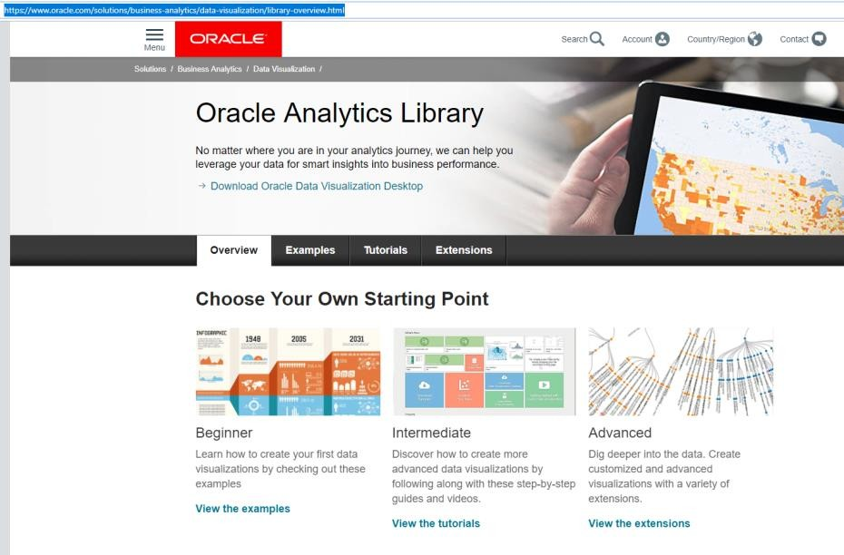

# Uploading a custom visual extension

## Introduction

When we introduced Oracle Analytics Server at the beginning of this workshop we talked about how the platform gives you choice and flexibility in your deployment. The feature we will now explore in more detail is the ability to upload custom visualizations and analytics scripts. We will do this by leveraging some of the pre-built examples from the Oracle Analytics Library.

Estimated Lab Time: n minutes

### Objectives

*List objectives for the lab - if this is the intro lab, list objectives for the workshop*

In this lab, you will:
* Objective 1
* Objective 2
* Objective 3

### Prerequisites

*Use this section to describe any prerequisites, including Oracle Cloud accounts, set up requirements, etc.*

* An Oracle Free Tier, Always Free, Paid or LiveLabs Cloud Account
* Item no 2 with url - [URL Text](https://www.oracle.com).

## **Step 1:** Add Custom Visualization Plugin
1. **DO NOT PERFORM THESE STEPS. THEY HAVE ALREADY BEEN DONE FOR YOU. THIS IS JUST FOR REFERENCE**.
   In the next few steps, let’s see how to add custom visualization plugins which are available on the Oracle Analytics Library.

   Navigate to the Analytics Library

   https://www.oracle.com/business-analytics/data-visualization/extensions.html

   

2. **DO NOT PERFORM THESE STEPS. THEY HAVE ALREADY BEEN DONE FOR YOU. THIS IS JUST FOR REFERENCE**.
    Download the “Circle Pack” and “Calendar Heatmap” extensions.
    

    

## Want to learn more
- [link](to be added)

## Acknowledgements
* **Authors** - 
* **Contributors** - 
* **Last Updated By/Date** - Jyotsana Rawat, Solution Engineer, NA Technology, September 2020

## Need Help?
Please submit feedback or ask for help using our [LiveLabs Support Forum](https://community.oracle.com/tech/developers/categories/livelabsdiscussions). Please click the **Log In** button and login using your Oracle Account. Click the **Ask A Question** button to the left to start a *New Discussion* or *Ask a Question*.  Please include your workshop name and lab name.  You can also include screenshots and attach files.  Engage directly with the author of the workshop.

If you do not have an Oracle Account, click [here](https://profile.oracle.com/myprofile/account/create-account.jspx) to create one.
