# Augmented Analytics for HR

## Introduction
One of the more sophisticated features of Oracle’s self-service offering is the ability to leverage advanced analytics and machine learning at the click of a button directly from your self-service projects and data flows. The machine learning features include a set of pre-built algorithms which can be used to extract insights from your data sets such as sentiment analysis, time-series analysis, prediction outcomes and confidence scores.

Advanced analytics functions such as forecasting, trend analysis and clustering can be applied to a visualization within your canvas with one-click. Additionally, users can call custom machine learning scripts either using the evaluate script function from within your self-service projects, or by adding custom scripts as part of your data flow when preparing data.

*Estimated Completion Time:* 30 Minutes.

### Video Preview
  

### Objectives
* This exercise will introduce you to OAS augmented analytics such as Explain feature, outlier identification, etc.
* You will explore OAS predictive analytics using built-in  machine learning algorithms.
* In this lab, you will play the role of an HR Analyst. The VP of HR has noticed an increasing rate of attrition.  
* As an analyst, you have been tasked with identifying what is happening internally in order to decrease the rate of attrition and identify potential strategies to mitigate risk. Additionally, you will identify those employees who are at greatest risk for leaving.   

### Prerequisites
This lab assumes you have:
- A Free Tier, Paid or LiveLabs Oracle Cloud account
- You have completed:
    - Lab: Prepare Setup (*Free-tier* and *Paid Tenants* only)
    - Lab: Environment Setup
    - Lab: Initialize Environment

The following files <if type="external">referenced in [Lab: Initialize Environment](?lab=init-start-oas) should already be downloaded and staged as instructed, as they</if> <if type="desktop"> staged under *`/opt/oracle/stage`*</if> are required to complete this lab.
- Attrition Training v3.xlsx
- Employee_Analysis.dva

## Task 1: Using Machine Learning to Accelerate Root Cause Analysis
In this exercise we are going to import a data set containing a number of employee records with various attributes that record employee experience, performance, and incentive. The data is historical in nature and includes a data element that identifies whether the employee has left the organization.  

  - Note the attrition column, a binary indicator.  
  - Each employee record contains either a *“yes”* or a *“no”* response.

Once you have imported your data into Oracle Analytics, you begin with data profiling, and reviewing semantic recommendations in order to repair and enrich your data for further analysis. Next you will leverage an augmented analytics capability called *explain*. Explain is used to generate insights via a combination of natural language processing, descriptive statistics and predictive modeling techniques in order to better understand our data and obtain deeper insights, pre-analysis.

1. From the browser session you started in [Lab: Initialize Environment](?lab=init-start-oas), go to the landing page, click on create button and select Project.

    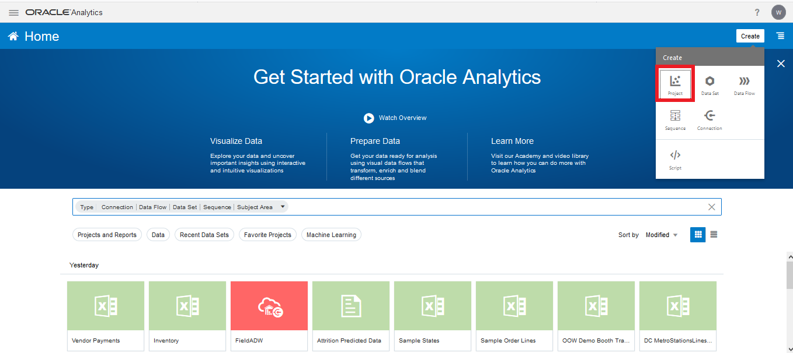

2. Select Create Dataset.  

    

3. Add the data set. From <if type="external"> the staging area where you unpacked the downloaded artifacts as instructed in [Lab: Initialize Environment](?lab=init-start-oas)</if> <if type="desktop"> *`/opt/oracle/stage`*</if>, drag and drop, or browse and select the file *“Attrition Training v3.xlsx”*

    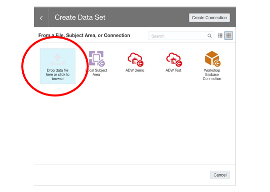

3. Notice you have navigated to the prepare page.  

    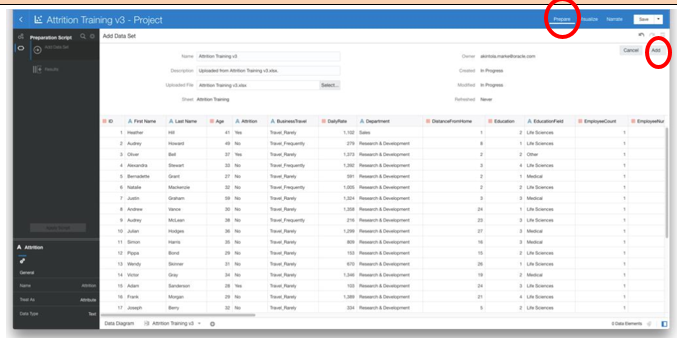

    Ensure that the *EmployeeNumber* column is set to attribute and that the *Education* measure is also set to attribute.  

    Navigate to properties in the bottom left corner and change data type for *EmployeeNumber* and *Education* from Measure to Attribute.  

    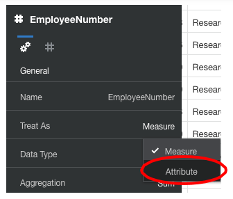

    Click on Add.

4. A set of column transformation “Recommendations” will be displayed on a pane to the right. Click on "SSN". Select the “Obfuscate SSN” recommendation.  

    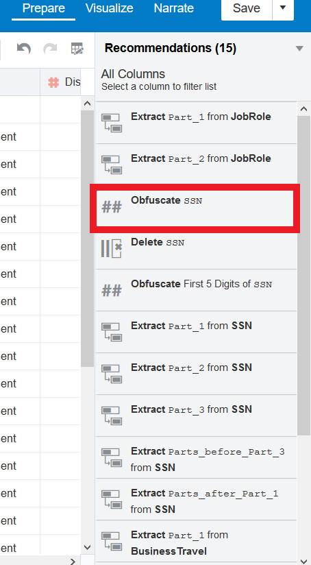    

    Select the check mark which appears when you hover over the recommendation.

    

5. On the left-hand pane review the preparation script. Note the transformation and enrichment operations are displayed, Select “Apply Script”.

    

6. Now, select the "Visualize" tab.

    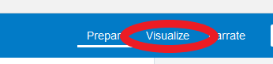

7. In the "Data Elements" section, Select Attrition, Right Click and Select “Explain Attrition”.

    

8. This will generate an Explain window that delivers insights regarding attrition.  The insights are divided into 4 categories. This first category identifies basic facts about our attrition attribute. In this case, it will perform automatic aggregations on the distinct rows.  

      

  Attrition is a binary variable. The variable is either a “yes” or a “no”.  The pie chart at the top shows a breakdown of employees who did or didn't leave the company.

9. Scroll down in order to explore the additional information that is automatically generated during Explain. If there is an interesting insight you would like to share or further analyze, you can select the visualization by clicking the tick mark in the top, right hand corner of the chart.  

    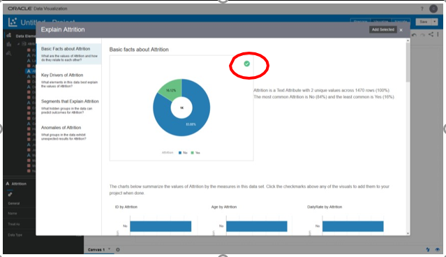      

    You can select multiple charts from each tab and continue your analysis.

10. Navigate to the second tab, which identifies the key drivers related to the attrition attribute. Oracle Analytics, leveraging machine learning capabilities, identifies those variables having a strong relationship with the column 'attrition'.  The bar graphs on the right illustrate the distribution of attrition across each of the key driver columns.

    

   **Note**: Disregard order and screen placements of charts in explain.

11. Next, Explain generates information on segments, identifying similarities, or grouping profile scenarios in which it is more or less likely that attrition will be a yes or a no.  

        

    You can use the bar mid screen to toggle through the different segment groupings to identify scenario confidence.

12. The fourth insight category illustrates the anomalies of our attrition attribute. The anomaly designator indicates combinations of each distinct value of attrition against all columns in the dataset to identify top outliers.  

        

    It visualizes the actual value, expected value and highlights the places where actual and expected value do not match.

13. select the following charts from the tabs in Explain:  

    - **Basic facts**: Attrition pie chart, YearsAtCompany by Attrition  
    - **Key Drivers**: JobRole  
    - **Anomalies of Attrition**: JobRole  

    After reviewing the insights delivered via explain, we can click on "Add selected" to add interesting visualizations to our project canvas.  

    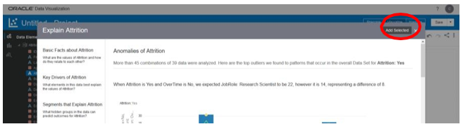    

    This will then create a new tab in the project called *Explain Attrition* and contain all of the visualizations that we selected to share or further explore.

      

14. We can execute explain functions on other attributes in our project data set. For each column we explain and generate visualizations, a new explain canvas tab will be added to the project.  Try explaining the 'Education' attribute and add some visualizations to the project.  

         

    Highlight the following charts from the Explain Education dialogue box:

    - Education Pie chart  
    - NumCompaniesWorked by Education  
    - Education anomalies chart by JobRole

15. Select "Add Selected" to the project. Add a new canvas to the project and we will continue building up the analysis.  

    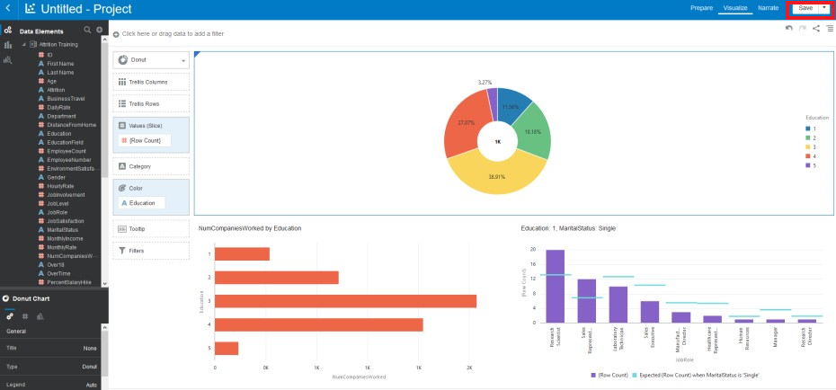          

    Before going further, save the project in the shared folder as *Attrition Analysis*.

16. We’re going to further explore the data we have in this project now. One area we have not analyzed extensively yet is gender in attrition. Add another canvas to your project. Name the canvas as "Gender Analysis".

    

17. Use the BI Ask icon to generate a visualization for this. To do this select the magnifying glass icon.  

        

    The BI Ask feature lets you query your data set and even build visualizations by searching for measures and attributes you’re interested in.

18. Type the following: “EmployeeCount” and “Attrition” and “Gender”, selecting each as the attribute appears. Drag the three elements to the canvas.

    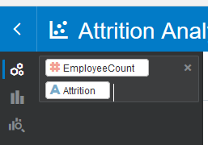

19. You should have a chart like this if not change the chart type to horizontal stacked.  

       

    We see that more men than women left the organization but proportionally more women left. Let’s use the in-built advanced analytics features to see if we can see why this might be.

20. Select the “x” to remove your BI Ask elements.

    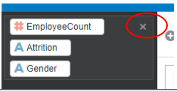

21. Select the following items from the data elements pane: *Gender*, *EnvironmentSatisfaction*, *WorklifeBalance* and *Last Name*. Right click and pick visualization *Scatter*. Move “Gender” to “Trellis Columns”. Your visualization should look like this, with the scatter plot trellised by gender.

      

22. In the navigation pane on the left select the *Analytics* tab. Select *Outlier* and drag it onto the scatter plot “Color” section.

      

    Looking at the outliers you can see that typically female employees have a lower satisfaction level and work life balance. This could explain why women are proportionally more inclined to leave the organization than men.  

23. Save your analysis.

## Task 2: Leverage machine learning to predict voluntary termination
This exercise will explore how self-service machine learning enables predictive analytics. We are now going to extend our analysis by seeing how we can predict whether an employee is likely to leave the organization. For this we will be using a Binary Classification model. Before we venture any further let us try to understand briefly what binary classification is.  

Binary classification is a technique of classifying elements of a given dataset into two groups on the basis of classification rules for example Employee Attrition Prediction, i.e. whether the employee is expected to Leave or Not Leave. These classification rules are generated when we train a model using training dataset which contains information about the employees and whether the employee has left the company or not.

1. In the home page, click on create button and select Dataflow.

    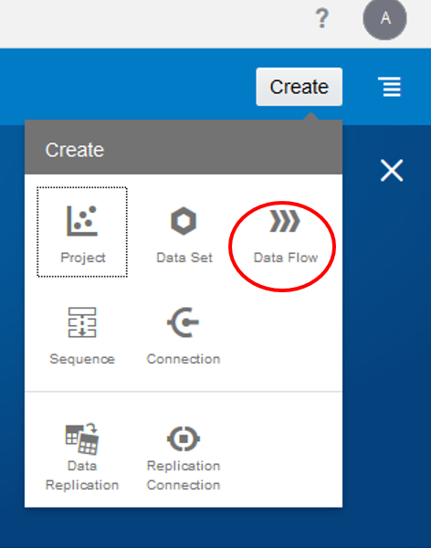

2. Select the dataset we were analyzing on “Attrition Training.” Click Add.

    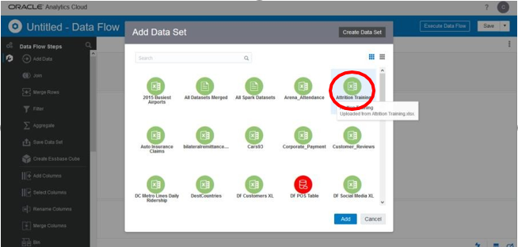

3. This data set will be added as a source for our data flow.

    

4. In the last example, we identified that there is attrition in our department and made note of some of the drivers identified using the explain function. What we want to do now is build and train a machine learning model in order to predict whether someone is likely to leave the organization. Let’s add a machine learning algorithm to our data flow.  

    Select the *plus icon* on the source data and select *Train Binary Classifier*.

    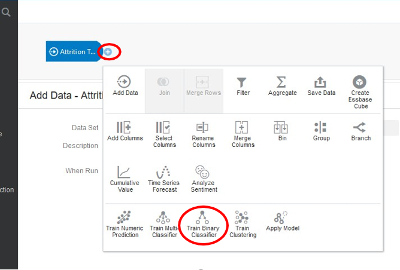

5. Select *Naïve Bayes for Classification* and click OK.

    

6. Select the *Attrition* attribute as the target column for the model. Make sure positive class is *Yes* and leave the other options as the default settings.

    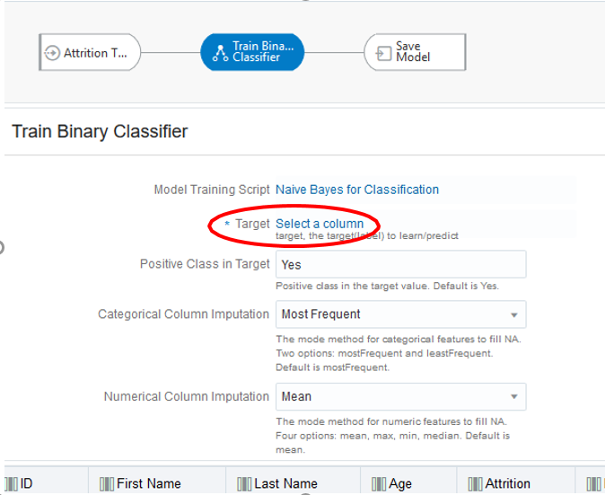

7. Click *Save Model* rename model name from Untitled to "Attrition Predict".

    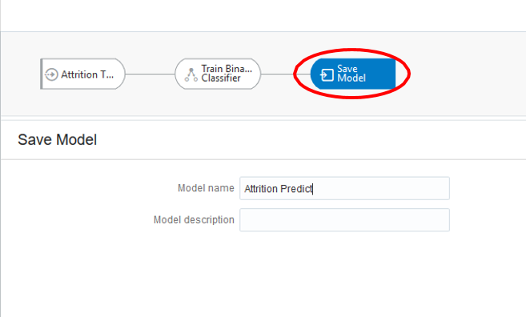

8. Save the flow as *Attrition Train Model – Naïve Bayes*.

    

9.  Run the data flow once it has saved. Wait for the training process to complete.

    

10. Go to the Machine Learning tab in order to review the results of the classification model.

    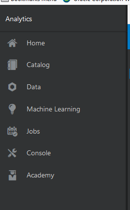

11. We can inspect the validity of our Machine Learning model. Right Click and select "Inspect".

    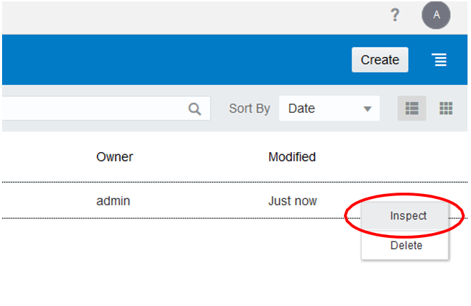

12. We can inspect the model to view more details like model quality (confusion matrix, precision, recall) and the generated datasets. The quality tab identifies the overall quality of the model with a series of related metrics: The overall model accuracy is 87% and the precision is 65%.

    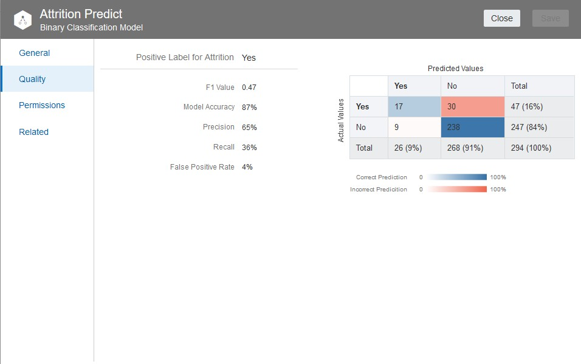

13. Since the model returned a positive accuracy score, we wish to apply that model to a new, current employee data set. To begin,  we go back to the Home page and click on the hamburger icon (to the right of Create). Select import project flow and import the employee *"analysis.dva"* file.  This project was  previously created with Oracle Analytics self- service and  analyzes the current employees of our organization.

    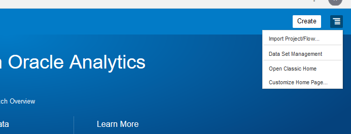

14. Drag and drop, or browse and select the *“Employee_Analysis.dva”* file from <if type="external"> the staging area where you unpacked the downloaded artifacts as instructed in [Lab: Initialize Environment](?lab=init-start-oas)</if> <if type="desktop"> *`/opt/oracle/stage`*</if>.

    

15. Enter the password *“Admin123”*.

    

16. Find and open the project named Employee Analysis. Here we have an existing project for the 470 employees in our organization. We’re going to apply our new classification training model to this data set which we imported with this project.

      

17. Go to the home tab and create a new *data flow*.

    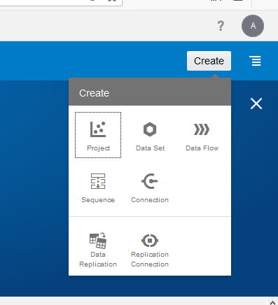

18. Select this new data set “Attrition Predict”.

    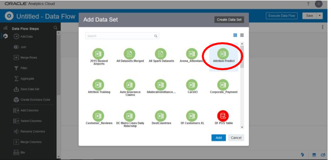

19. Select the *plus icon* to add a new node to the data flow.

    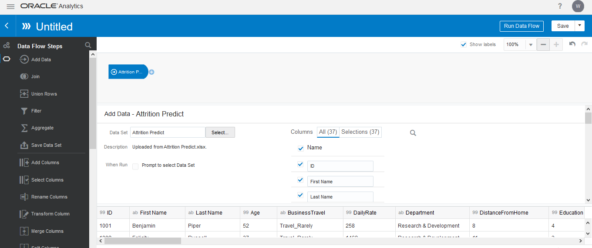

20. Select the *Apply Model* Node.

    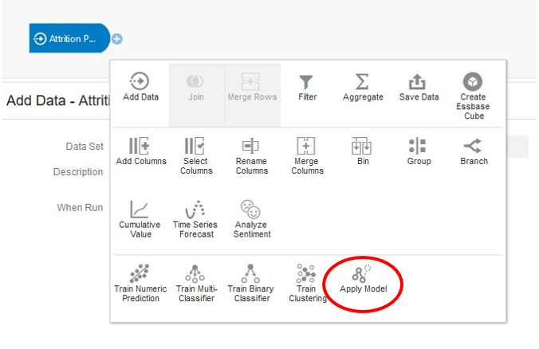

21. Select our Machine Learning Model from before and click OK.

    

22. Our apply model node will have 3 sections.  

    - **Outputs** - this is a list of columns returned by the model in addition to the input columns. Applying the model will enrich our employee data set adding a predicted value and a prediction confidence score.
    - **Parameters** - optional parameters that users can pass to apply the model.
    - **Inputs** - these are the input columns for the apply model.  

    The apply model will try to automatically map the input dataset column names to the column names in the model.

      

23. Select the *plus icon* and select the *Save Data* node.

    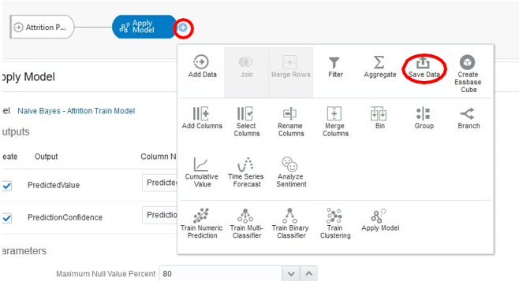

24. Give it the name “Attrition Predicted Data”.

         

    **Note**: We can run this data flow to an existing database if we like. For now, keep if as the default data set storage.

25. Save the data flow under the name “Attrition Prediction”.

    

26. Once the data flow is saved, run the data flow.

        

    This will produce a new data set which appends the predicted values to our existing Attrition Apply data set.

27. Go to the data tab and select the new data set “Attrition Predicted Data”.

    

28. Some of the measures may be stored as attributes. As we did in previous exercises, ensure that:

    - The following columns are stored as measures:
      - PredictionConfidence   
      - EmployeeCount  
    - Employee number is an attribute.  

      

    If you made any modifications, then click on Apply script.

29. Create some visualizations like the example here:  

    -	Performance Tile for EmployeeCount  
    -	Pie chart of EmployeeCount by JobRole and Department  
    -	Pivot Table of EmployeeNumber, First Name, Last Name, PredictionConfidence, PredictedValue.

    

30. Save the project as “Attrition Prediction”.

    

**This concludes this lab.**

## Learn More
* [Oracle Analytics Server Documentation](https://docs.oracle.com/en/middleware/bi/analytics-server/index.html)
* [https://www.oracle.com/business-analytics/analytics-server.html](https://www.oracle.com/business-analytics/analytics-server.html)
* [https://www.oracle.com/business-analytics](https://www.oracle.com/business-analytics)

## Acknowledgements
* **Authors** - Diane Grace, Manager, Analytics Platform Specialist Team, NA Technology
* **Contributors** - Linda Dest, Jyotsana Rawat, Rene Fontcha
* **Last Updated By/Date** - Rene Fontcha, LiveLabs Platform Lead, NA Technology, September 2021
