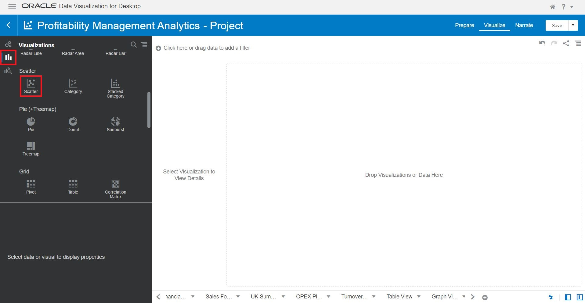
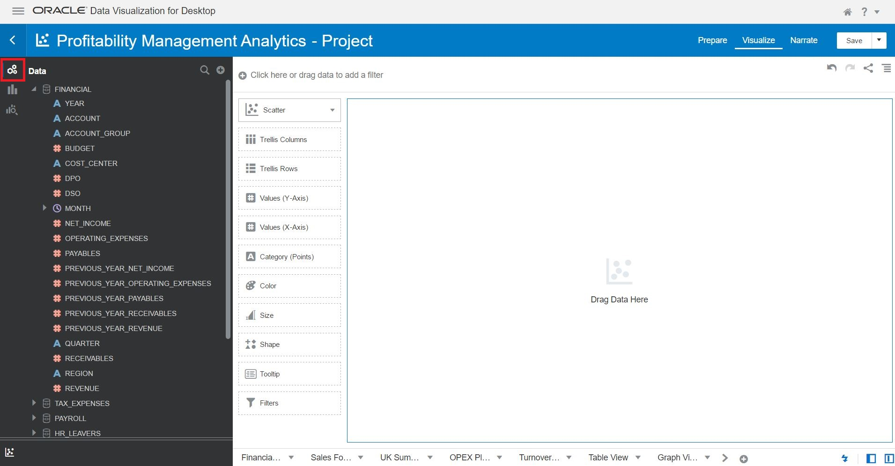
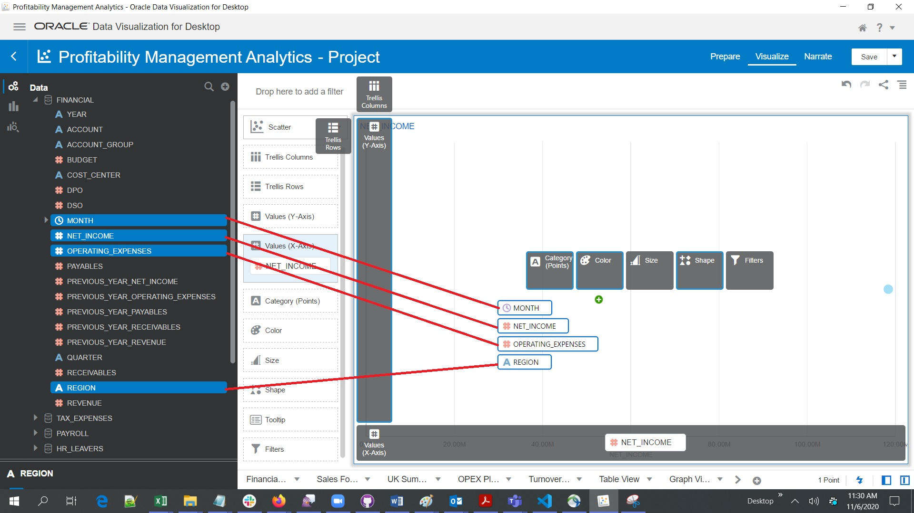
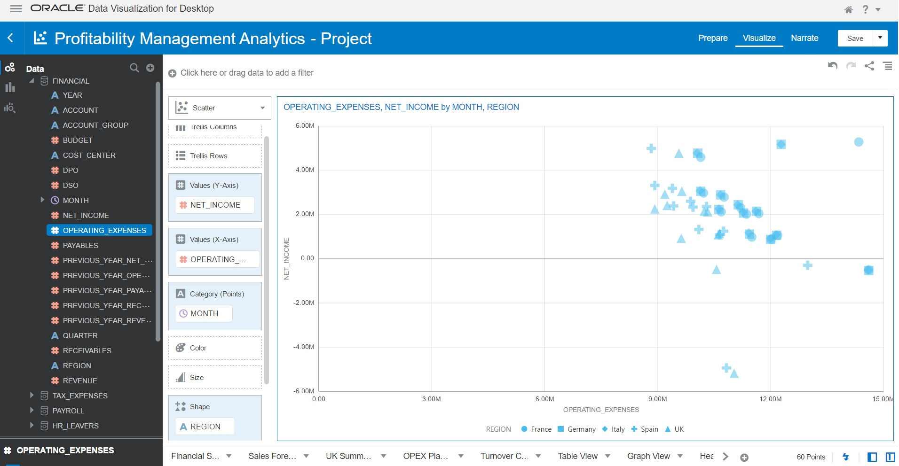

# Perform Analytics

## Introduction

Creating New Visualization using the imported Project.

Estimated Lab Time: 15 minutes

### About Product/Technology
Oracle Analytic Desktop, Oracle Autonomous Database

### Objectives

Create New Visualizations.

In this lab, you will create visualization:
* Using Table View
* Using Graph View
* Using Heat View
* Using Scatter View

### Prerequisites

Oracle Analytic Desktop, Oracle Autonomous Database

*This is the "fold" - below items are collapsed by default*

## **STEP 1**: Create Visualization using Table View

Click on the Visualizations Icon on the left hand side of the Canvas.  Drag drop the Table Visualization on the Canvas.

Click on the Data Icon on the left side of the Canvas and Multi-select (Ctrl+Click) the Data Elements within FINANCIAL, ACCOUNT GROUP, NET INCOME, PAYABLES, RECEIVABLES, REVENUE.
Drag the selected data elements to the middle of the screen.

You may Save this project if you need.

## **STEP 2:** Create Visualization using Graph View

Click on the Visualizations Icon on the left hand side of the Canvas.  Drag drop the Table Visualization on the Canvas.

Click on the Data Icon on the left side of the Canvas and Multi-select (Ctrl+Click) the Data Elements within FINANCIAL, ACCOUNT GROUP, NET INCOME, PAYABLES, RECEIVABLES, REVENUE.
Drag the selected data elements to the middle of the screen.

You may Save this project if you need.

## **STEP 3:** Create Visualization using Heat View

Click on the Visualizations Icon on the left hand side of the Canvas.  Drag drop the Table Visualization on the Canvas.

Click on the Data Icon on the left side of the Canvas and Multi-select (Ctrl+Click) the Data Elements within FINANCIAL, ACCOUNT GROUP, NET INCOME.
Drag the selected data elements to the middle of the screen.

You may Save this project if you need.

## **STEP 4:** Create Visualization using Scatter View

Click on the Visualizations Icon on the left hand side of the Canvas.  Drag drop the Table Visualization on the Canvas.

Click on the Data Icon on the left side of the Canvas and Multi-select (Ctrl+Click) the Data Elements within FINANCIAL, ACCOUNT GROUP, NET INCOME, OPERATING EXPENSES, REGION.
Drag the selected data elements to the middle of the screen.

You may Save this project if you need.

You may proceed to the next lab.

## Learn More

## Acknowledgements
* **Author** - <Name, Title, Group>
* **Adapted for Cloud by** -  <Name, Group> -- optional
* **Last Updated By/Date** - <Name, Group, Month Year>
* **Workshop (or Lab) Expiry Date** - <Month Year> -- optional, use this when you are using a Pre-Authorized Request (PAR) URL to an object in Oracle Object Store.

## See an issue?
Please submit feedback using this [form](https://apexapps.oracle.com/pls/apex/f?p=133:1:::::P1_FEEDBACK:1). Please include the *workshop name*, *lab* and *step* in your request.  If you don't see the workshop name listed, please enter it manually. If you would like for us to follow up with you, enter your email in the *Feedback Comments* section.
