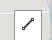
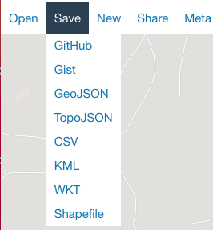

# Build your GeoJSON LineStrings and Points

## Introduction 

In this exercise, you will generate a “Line String” GeoJSON file using
an external tool and see how easy it is to leverage it to build map
layers in OAC. There are many ways to generate GeoJSON code and
<https://geojson.io/> is just one open-source option.

_Estimated time:_ 30 minutes


### Objectives

In this lab, you will:

- Build LineString and Points using GeoJSON

- Modify the GeoJSON with properties needed in OAC

### Prerequisites

This lab assumes you have:

- Are able to use a GeoJSON code generation tool or browse to
    <https://geojson.io/>

## Task 1: Create LineStrings of Circuit Zandvoort

1. Go to <https://geojson.io/>

2. Search for your location, in this instance we will search for “2041 KP Zandvoort, Netherlands”.

      
    
    > **Note:** Use the [Circuit
Zandvoort](https://www.formula1.com/en/racing/2021/Netherlands/Circuit.html)
layout to find your three sectors, colored red, yellow, and blue.  

     You will use the line tool to draw each sector.

3.  Start drawing your LineString by choosing the polyline option   

    Your JSON code will contain a top level FeatureCollection and  multiple Features nested below it. Add a “name”:”\[unique name\]” to each “LineString” property.  

    **CODE SNIPPIT:**  
     **Before**
    ```
    <copy>
     {

     "type": "FeatureCollection",

      "features": \[

      {

     "type": "Feature",

     "properties": {},
 
     "geometry": {

     "type": "LineString",

     "coordinates": \[
    </copy>
    ```

    **After**
     ```
     <copy>
    {

     "type": "FeatureCollection",

     "features": \[

     {

     "type": "Feature",

     "properties": {"name": "Sector1"},

     "geometry": {

     "type": "LineString",

     "coordinates": \[
    </copy>
     ```

    

    Image using Satellite View

4. Draw the two remaining LineStrings to complete the circuit.

    

Image using Mapbox view

5. Choose Save, GeoJSON to export the file.

    > **Note:** properties cannot be empty. You must add a unique value for each
property. Example: "properties": {}  "properties": {"name": "Sector1"}
for each “LineString” for the file to successfully upload as a map layer
in OAC.

    

6. Rename the file to the map layer name. example: _Circuit Zandvoort Sectors_

## Task 2: Create Points that represent turns on Circuit Zandvoort

1. Go to <https://geojson.io/>

2. Search for your location Zandvoort, Netherlands and start with a blank file.

    > **Note:** Use the [Circuit Zandvoort](https://www.formula1.com/en/racing/2021/Netherlands/Circuit.html) layout to find each turn. You will find turns labeled 1-14.

3. Create a GeoJSON file with Points using the “**Draw a Marker**” option. Add the 14 turns to your map.

      
    

4. Add unique values for each properties option. In this example you will have 14 lines you update.

5. Choose **Save**, **GeoJSON** to export the file.

    > **Note:** you must add a unique properties value to each “Point” for the
file to successfully upload as a map layer in OAC.

    

6. **Rename** the file to the map layer name.

Congratulations on completing this lab!

You may now *proceed to the next lab*.

## **Acknowledgements**

- **Author** - Carrie Nielsen (Oracle Analytics Product Strategy Director)
- **Contributors** - Lucian Dinescu (Oracle Analytics Product Strategy)
- **Last Updated By** - Lucian Dinescu (Oracle Analytics Product Strategy)
