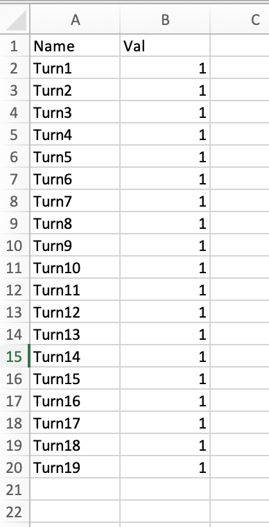
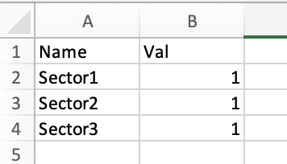
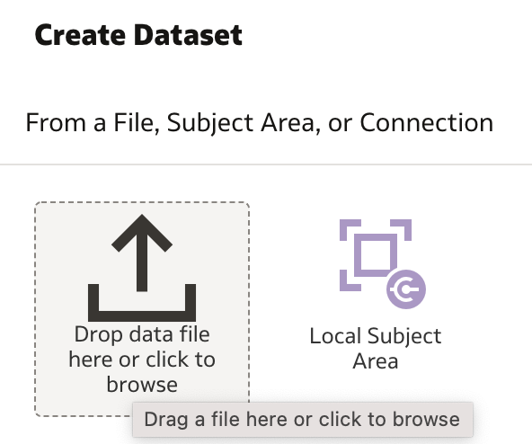
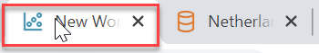
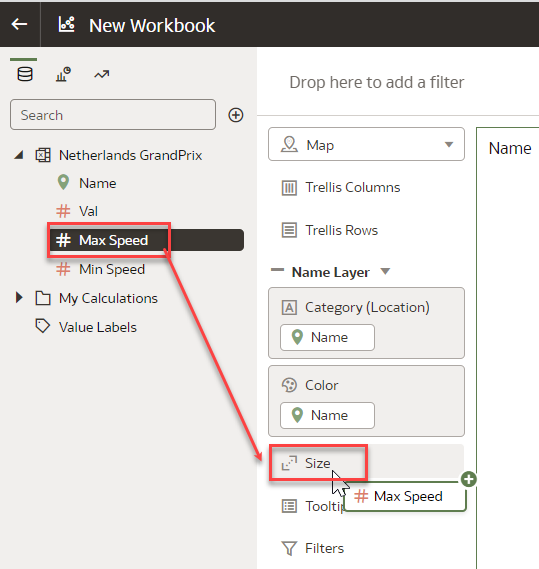
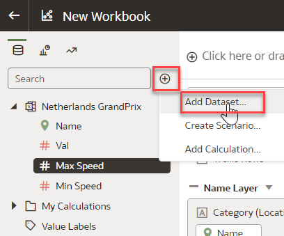

# Add the Sector Dataset to OAC and assign it to the map layer

**Introduction**

In this lab you will assign values from your Dataset to properties in your map layers. This process allows for maps to be automatically
rendered in OAC for your GeoJSON LineString and Points with color, size, and more.

###  Prerequisites

This lab assumes you have:

- An Oracle Free Tier, Always Free, Paid or Live Labs Cloud Account
- Provisioned Oracle Analytics Cloud
- All previous labs successfully completed
- Permission to create Datasets in OAC
- Created a file or use the data file provided

## Task 1: Create a Dataset and assign to a Map Layer

Now that you have your two map layers created and imported, we need to associate these keys to values in your data. Our first simple exercise will be to **create a Dataset** for each **Map Layer**.

Create a file that contains the following information. The name field in your data set needs to match the id value in the map layer.

 

1. On the top right of the **Oracle Analytics Home Page**, choose **Create** and then **Data Set**

    

2. Browse to the file you created for Turns and Segments (Sector)  

    

3. Add your file, rename your Dataset as needed, and ensure the correct sheet is selected. Click **Add**.  
    > **Note:** you can use [Netherlands GrandPrix.xlsx](https://objectstorage.us-ashburn-1.oraclecloud.com/p/wzqlSdk7t5tkX-fLWuYt7wlgJ7o7oGjZvDZNsNaEqZJWcz9coErP_GG8bl3X13F_/n/idbwmyplhk4t/b/RedBullRacing-HondaWin/o/Netherlands%20GrandPrix.xlsx)

    

4. Highlight the **Name** columns and click on the stacked dots (**Options**).  

    

5.  Choose **Location Details**…  

    

6.  Choose the appropriate Map Layer name and confirm your match quality is sufficient. Click **OK**  

    

    Your data is now mapped to the map layer. You will see the icon to the left of your name column change to the location property icon.

7. Click **Apply Script**.  

    

8. Select **Create Workbook** button from top right  

    

9. Right click on the `Name` field and choose **Create Best Visualization**.  

      

10. Use the **Name** value for both the **Category** and **Color**.  
Drag **Name** to **Color**
    
      

11. Your Map visualizatin should look like
    
      

    You can extend your Dataset with additional values such as speed to provide additional values to display. You can use all of the powers of OAC now to blend additional DataSets to make your visualization more interactive.

12. Click **Data** tab on your center-top header and within the Dataset icon, click the  _pencil_ and then choose **Edit Definition**.  

    

13. Click select and reload your file with any extended values you want in your Dataset (Segments(2) Sheet). Click **OK**  

    

14. Return to your **Visualize** tab and add your new Max Speed Measure to size to see the fastest part of the track.  

    Click **New Workbook** browser page 

    

15. Click **Visualize** tab  

    

16. Drag and Drop **Max Speed** to **Size**  

    

    > **Note:** Min and Max speed values are not real and were created for the use in this exercise 

17. Your visualization should look like  

      

## Task 2: Add Points Dataset to OAC and assign it to the map layer

1. Select the circle icon containing a **+** next to Search to select **Add Dataset**  

    

2. Click **Create Dataset** You can create a new Dataset by importing the file that contains your data for **Turns**

    

3. Browse for **[Netherlands GrandPrix.xlsx](https://objectstorage.us-ashburn-1.oraclecloud.com/p/wzqlSdk7t5tkX-fLWuYt7wlgJ7o7oGjZvDZNsNaEqZJWcz9coErP_GG8bl3X13F_/n/idbwmyplhk4t/b/RedBullRacing-HondaWin/o/Netherlands%20GrandPrix.xlsx)** file and click **Open**

    

4. Rename Dataset as **Netherlands GrandPrix Turns**, select **Turns** Sheet and click **Add**

    

5. As defined earlier, select the name column, click the triple stacked icon, choose Location Details. You will then select the name that    was used for your points map layer.  

    Highlight the **Name** columns, click on the stacked dots (**Options**) and choose **Location Details**

    
6. Choose the appropriate Map Layer name and confirm your match quality is sufficient. Click **OK**  

    

    Your data is now mapped to the map layer. You will see the icon to the left of your name column change to the location property icon.

7. Click **Apply Script**.  

    

8. Return to the previous browser page, select  **Netherlands GrandPrix Turns** Dataset and click **Add to Workbook** 

    

9. Save and return to the OAC visualization page. 

    

10. Go to your **Data** tab and right click on your join between the two Datasets.  
Select **Delete All Matches**, click **OK**, confirm that you want to disconnect these datasets by selecting yes.

    

**!!! MISSING PIECES !!! Please add content**

11. Returning to your visualize tab you will add your second layer and use your Turns data to represent the points on your map.  
Click the add layer button as shown below.

12. Using the Turns data, use your name column for the Category (Location) and Val for the Size option.

Congratulations on completing this workshop!

## **Acknowledgements**

- **Author** - Carrie Nielsen (Oracle Analytics Product Strategy Director)
- **Contributors** - Lucian Dinescu (Oracle Analytics Product Strategy)
- **Last Updated By** - Lucian Dinescu (Oracle Analytics Product Strategy)
