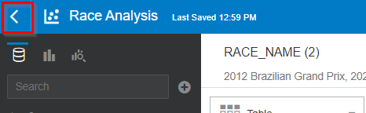

# Advanced Data Exploration

## Introduction

We've already identified several data points that were "out in the open" and readily available to us: the number of overtakes, the number of Did-Not-Finish and the weather.

However, we're not yet done. In practice, the data that holds predictive value is often _hidden away_.

It is up to us to _uncover_ the patterns that are important to be able to make a prediction. After all, the success of our machine learning model will depend on the data that we present to it, and we have to make the most of the data that we have.

### Objectives
- Learn how to use visualization techniques to uncover additional data points that may be of value in predicting the score of a race.
- Learn how to use Oracle Analytics Cloud to Explore Data and Prepare Data to get it ready for building a Machine Learning model.

### Prerequisites
- An Oracle Free Tier, Always Free, Paid or Live Labs Cloud Account
- Oracle Analytics Cloud
- Autonomous Data Warehouse
- You've completed the previous labs

## **STEP 1:** "Come back score"

First of all, let's look closer at the visualizations that we already have to see what data is patterns are hidden away in them.

1. On the home page, reopen the project of the previous lab by clicking on "Projects and Reports" and then on "Race Analysis".

   

2. We want to look only at the 2012 Brazilian GP.

   Remove the Abu Dhabi GP from the filter by clicking on the filter (top-left), then click on "2020 Abu Dhabi...".

 	 

3. On the position chart, zoom in on Sebastian Vettel by clicking on "vettel" (the driver references are shown in the legend of the chart).

	 

4. Inspect the chart.

   

   Due to a collision Vettel fell to 22nd position early in the race. In the chart you can see how he made a great come back. Eventually he made it back to the 6th position, which was enough for him to seal the championship of that year.

   This is another interesting pattern. For the fans, we suspect it is interesting to have many overtakes, and it's even more exciting if a particular driver is able to recover many positions during the race. Let's make another note of this as an interesting pattern.

	 Note 5: A large come back (many positions gained) of a driver _may have_ a positive influence on the score. We don't have this metric available yet, so we will have to create it ourselves later (Feature Engineering).

## **STEP 2:** Pit Stops

Now let's have a look at the pit stop information.

1. Let's visualize a more recent race. In the filter, change the selected race to the Austrian Grand Prix of 2021.

   Use the search box to look for "Austrian", then click on "2021 Austrian Grand Prix" in the list.

   

2. We want to show whether a driver made a pit stop in a particular lap.

   Click on the position chart to select its configuration, then drag "PIT_STOP" to the Shape attribute

	 

	 You should see different shapes appear in the chart (e.g. squares and circles), indicating whether a pit stop was made.

4. Now, click on Norris in the legend.

   

5. Inspect the results.

   

   Notice how Norris is overtaken by Bottas in lap 30. However, this overtake took place because Norris was making a pit stop. This is in contrast with the overtake by Hamilton in lap 20, which actually takes place on the track itself.

	 Granted, an overtake because of a pit stop can be very interesting for the viewers, but our theory is that overtakes that actually take place on the track are more interesting to the viewers, and will result in a higher score. This is another interesting finding.

	 Note 6: Position changes due to a pit stop _may be_ less interesting for viewers than position changes on the track. We will have to transform the race data in some way to separate real overtakes from semi overtakes (during Feature Generation).

## **STEP 3:** Ghost Car

The position chart we've been using so far may seem quite rudimentary; although it contains position information, it doesn't give any idea of exactly _how big_ the distance is in seconds between cars.

This leaves one thinking that we might still be missing some essential insights. So how can we include the element of time to visualize a race?

For this we have to introduce the concept of the "ghost car". The ghost car is a virtual car that drives at the exact average speed of the pack. This time has already been calculated for you and is available as

To visualize how well each car is doing, we'll calculate the time-delta between each car and the ghost driver at each lap.

1. Configure the filter to only select data for the 2012 Brazilian GP.

   

2. On the bottom left, below the datasets, right-click on "My Calculations" and then "Add Calculation".

   

3. Calculate the delta to the ghost car as follows:

   * Drag MEDIAN_MILLISECONDS_CUMULATIVE (from Lap Times) to the formula box.
	 * Type the minus symbol "-" behind it.
	 * Drag MILLISECONDS_CUMULATIVE (from Lap Times) to the formula box (to the end of the formula).
	 * Name the calculation "Delta to Ghost Car".
	 * Press "Save"

   

3. Now visualize the top race again, this time by showing the delta to the ghost car.    

   Select the LAP, DRIVERREF and the newly calculated field "Delta to Ghost Car" (use Control + Click to select multiple fields). Then right click on any of the fields to bring up the context menu and select "Pick Visualization". Then select the "Line" visualization type.

   

4. Make sure that the chart is configured as follows (rearrange the fields if necessary).
   - Values (Y-Axis): Delta to Ghost Car
   - Category (X-Axis): LAP
   - Color: DRIVERREF

	 

4. Inspect the resulting chart.

   

   In this chart, the horizontal axis (y=0) indicates the ghost car. Any car that's above the line is going faster than the ghost car, any car below it is going slower.

   With this new visualization we can uncover new patterns in the data! There's an event around laps 25-30 where all the cars come back close together. This is likely a safety car.
	 This wasn't visible before in the position chart.
	 This makes us think: What could a safety car mean for the level of excitement of a race? A safety car effectively "resets" the race, by compressing the cars into a short distance from each other. Our theory is that in general this may add lead to a higher score.

	 Note 7: The presence of a safety car _may_ increase the score of races in general.

5. Save the project by clicking on the Save icon.

   

6. Finally, go back to the home page by clicking on the top left icon.

   

## **STEP 4:** Conclusion

In the previous lab we already found several factors that influence the score that fans will give to a race. These factors were directly available to us in the RACES dataset.

In this lab, we've gone a step further by uncovering useful pieces of data that weren't visible at first sight. We've uncovered the following new pieces of information that we can potentially be extracted from the data:
- Come back score (number of positions recovered by a driver during the race)
- Positions changes as a result of actual take overs on the track versus position changes that are a result of pit stops
- The presence of a safety car

Congratulations on completing the lab! In the next lab we'll see how we can actually extract these new pieces of information from the data sets (Features Generation). We'll also train a model and review the model's performance.

<!--
In our Exploratory Data Analysis we tried to identify factors that are of value to predict the fan score of a race.

Let's review our notes:
- Note 1: "The total number of position changes _may be_ a factor to predict race score"
- Note 2: "The number of changes in the top positions _may be_ a factor to predict race score"
- Note 3: "DNFs _may be_ a factor to predict race score"
- Note 4: "Wet weather _may have_ a positive influence on the score that fans give to a race.""
- Note 5: "A large come back (many positions gained) of a driver _may have_ a positive influence on the score. We don't have this metric available yet, so we will have to create it ourselves later (Feature Engineering)."
- Note 6: "Position changes due to a pit stop _may be_ less interesting for viewers than position changes on the track. We will have to transform the race data in some way to separate real overtakes from semi overtakes (during Feature Generation)."
- Note 7: "The presence of a safety car _may_ increase the score of races in general."

Regarding the first 4 notes, all of these values are directly available on the RACES dataset. Using correlation analysis we've confirmed that they are likely good candidates for the machine learning model.

Notes 5 to 7 are about data that is not directly available to us. We learned that we could potentially uncover these useful data points through additional data preparation (known as Feature Generation).

In the next lab you will see how you can:
- Extract the new data as mentioned in notes 5-7 (Feature Generation)
- Train the model
- Predict scores with the model and verify the accuracy
-->

<!--
  Let's form some hypothesis, we believe the following variables influence the fan score of a race:
	-> The circuit where the race is being held. It seems fair to assume that one circuit leads to higher fan scores than the other. Maybe the Brazilian circuit is simply more exciting than the Abu Dhabi one (?). Some people are of the opinion that older, classic circuits were more spectacular than current, modern circuits.

## **STEP 6:** Validating our hypothesis with correlation diagrams (continuous variables)

Let's review our list of hipothesis. We believe the following potentially influence the fan score of a race:
- The number of overtakes / position changes. The theory is that more overtakes make a more interesting race. There's certainly a lot more position changes in the Brazilian race than in the Abu Dhabi race that we investigated. In particular, it may be the case that changes in the top positions are more interesting (result in a higher fan score) than changes in the lower positions.
-> Crashes / DNFs (Did Not Finish). Although nobody likes accidents that harm the drivers, accidents can add dynamics to a race and have surprising effects on the race outcome, as was the case in the Brazilian GP.

## **STEP 6:** Validating our hypothesis with correlation diagrams (categorical variables)

## **STEP 7:** Feature engineering (business user)

There are many other potential data points that we could extract from this data.

- It's not just number of overtakes. Overtakes in the top of the race is more interesting than overtakes in the back of the ranking.
- Currently all position changes are counted, including position changes as a result of pit stops. Although those position changes are interesting, it's probably more interesting for fans to see an actual overtake. Therefore we have to do something to separate "pit stop overtakes" and actual overtakes.
- The surprise factor of lower ranking drivers who end up on the podium. A race is more interesting when there's an element of surprise, and when a low ranking driver ends up in the top 3 that may excite the fans more than having the well known top ranking drivers.
- The current number of overtakes also includes overtakes as a result of pitstops. Although interesting, an overtake that's a result of a pitstop is likely less spectacular than an actual overtake on the circuit.
-> What happens with the top-ranking drivers is more interesting than what happens with the lower ranking teams. For example, it's more interesting when number 2 takes over number 1, than it is that number 15 takes over number 14.
- Have a look at the Wikipedia for the Brazilian 2012. It explains how Vettel came back from a 22nd position and climbed all the way back to 6th position. This was enough to win the world championship. The hipothesis is that an audience likes the fact that a favourite comes back from so far back in the field. We'll have to quantify this phenomenon somehow, and we'll call it "comeback score".

Data Flow allows you to calculate all these yourself, but it would be quite a bit of work to do this in the workshop. Because of this, we've provided you with a Notebook that has all the SQL in there to create them.

...

END OF FIRST LAB

At the basis of our data structure are the formula one RACES.

(Let them play with ergast data)
(let them show one of the latest races?)
=> One chart with a particular race (latest race?)
=> One chart with the results over the different seasons, and the winners.
Say something about battle between Mercedes and Red Bull.
=> Something with pit stops combined into one chart (demonstrate chart second Y axis?)

conclusion: the granularity is on LAP level, meaning that we can see what the positions are of everyone throughout the race per lap (but not more detailed within a lap).
We suspect this is a pretty good indication of the progress of a race, even though it may "hide" some close encounters of cars (not fine grained enough for that).

To help us decide what makes a good race, we have race fan scores (source: ...)
(Let them play with score data)
(Show )

There are various goals behind data exploration. One way to approach the data is by making hipothesis beforehand, and verifying them. On the other hand, we also like to explore things about the data that we didn't think about a-priori. In other words, we'd like to learn what we don't know yet. We'll come back to that later.

Why ML?
- Initial correlation diagrams suggests there may be some truth in our correlation.
- But each hipothesis almost certainly will not be enough to make an accurate prediction.
- However, if we can build a machine learning model that PREDICTs with some accuracy the fan score from the combination of these elements (number of overtakes, DNFs and circuit), we can build a strong case that these are indeed important elements that influence the fan score.

Build the model with overtakes, DNF and circuit.
Visual comparison.
Mathematical comparison. Explain RMSE, Explain MAE. One big error has more influence than various small errors.

Conclusion:
- Pretty inaccurate
- Some of the reasons may be:
  - We haven't found those factors yet that really influence the fan score.
  - We could have data errors in the racing data. For example, if the position data isn't accurate, the number of overtakes won't be accurate, and therefore our model won't be accurate.
  - The fan score may actually not be an accurate measure of fan sentiment. We don't know all the details of how fan score was collected. For example, maybe there are people that voted many times on the same race, and thereby skewed the results. Or maybe there are other data errors.

BACK TO THE DRAWING table

Let's revisit the Overtaking metric. Is this accurate enough? You might say:
- Overtakes in top positions are much more interesting than in the lower positions.
- Pit stops are included, pit stop overtakes not as interesting as actual overtakes.

New ideas:
- Closeness in terms of time. The "closeness" of the battle between the top teams. The theory is that, the closer the drivers/teams are together, the more exciting the race/the season, as we don't know who the winner will be.
- Something unexpected => Brings back the field much closer together. Adds a surprise element to the race. Theory: Yellow car in a race will have positive correlation with score.
Yet another way of looking for ideas is by looking at actual reports of the race.
- Weather
- Come back score?

Exercise:
- Do a more advanced data preparation (e.g. come back score)
  Or add the weather as separate data source
  Or add the yellow car as separate data source
Train again
- Show the overtrained model. Explain what the problem is. Explain the price we pay for too many features.
- Let them choose the final model.

Bonus: Try some of the other attributes
  Nationality (explain rationale)
  Driver (explain rationale)

Score the model
Conclusion: Still not very close
Our hipothesis are correct, in the sense that they can be used to predict score, but the accuracy is not very high yet. So what can we do to improve? We have to think critically about our initial hipothesis again, think how we can improve them, or even come up with new ones.

One way we could come up with new hipothesis is by looking at an actual race.

Do some exercise with data preparation.

Bonus:
- Find a race in the past with a very high score. Visualize it and read about it on Wikipedia.
  Do you agree with the high score of the race?

Conclusion 1: How good is our model?
  - No baseline for this, so pretty good. Certainly a lot better than nothing.
Conclusion 2: What can we do with it now we have it?
  - Takeovers -> Anything we can do to improve takeover probability
  - Bringing the number 1 and 2 closer -> ...
  - Weather -> Don't cancel event when it's raining
  - Car -> Place it on the race faster (evens the chances again)
Conclusion 3: Learnings
  - You've seen the daily process of data science.
  - It's an experiment, don't know what you'll find
  - Have to look for patterns in the data
  - It's ever improving process, not easy, constantly looking for the right data, looking for data quality, ..., constantly asking questions
  - Useful skills for future, use it for any use case

(Terugbrengen naar 2021 -> strijd tussen Hamilton en Verstappen)
-->

## **Acknowledgements**
- **Author** - Jeroen Kloosterman, Technology Product Strategy Director
