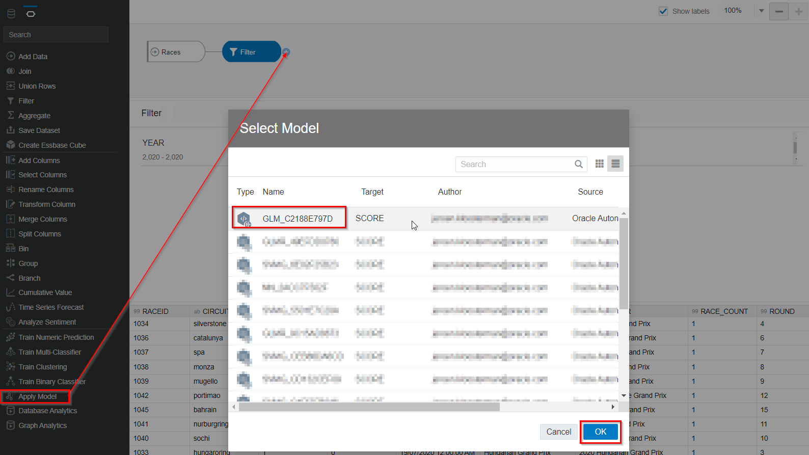
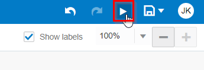

# Feature Generation, ML Training, Prediction and Evaluation

## Introduction

In this previous labs we have identified variables that are candidates for training a machine learning models. Some of these variables are already available on the RACES dataset: total number of take overs,

In the advanced data exploration lab we identified additional data points that may be of value. However, we first have to extract those data points. In this lab we will do this (Feature Genereation).

After that, in this lab we will train the machine learning model, and finally we will evaluate the accuracy of the model.

### Objectives
- Learn how to generate new features from one or more data sets
- Learn how to train a model with AutoML
- Learn how to predict using a model and evaluate the accuracy of the predictions

### Prerequisites
- An Oracle Free Tier, Always Free, Paid or Live Labs Cloud Account
- Oracle Analytics Cloud
- Autonomous Data Warehouse
- You've completed the previous labs

## **TASK 1:** Set Up The Machine Learning User

1. Open the Autonomous Data Warehouse.

   From the Oracle Console, click **Oracle Database** > **Autonomous Data Warehouse**.

   

2. Click on the `REDBULL` database that you created earlier.

   

3. Open the **Service Console**.

   

4. Choose **Administration** > **Manage Oracle ML Users**.

   

   If sign-in is requested, sign in with `ADMIN`, password `Oracle_12345`.

5. Check **Show All Users**, then click on the `F1` user.

   

6. Choose any email address (it's not relevant). **Don't update any of the other fields**.

   

   Press **Save**. You've now enabled the `F1` user to use the Machine Learning functionality of Autonomous Data Warehouse.

## **TASK 2:** Generate New Features

1. **Download** a prepared notebook that contain the SQL instructions to Generate the new Features:

   <a href="
https://objectstorage.eu-frankfurt-1.oraclecloud.com/p/N2qV6WmjOVm9OMa3R7eohbCEKnO0rc-ok1dxFTD9CKz2-RCvWoOO2gRdd29rtoVz/n/odca/b/workshops-livelabs-do-not-delete/o/.............json" target="\_blank">Notebook to Generate Features</a>

   Save the file on your local machine. Make sure that the file is saved with extension `.json`.

2. In the console of the Autonomous Data Warehouse, open the **Service Console**.

   

3. Choose **Development** > **Oracle Machine Learning Notebooks**.

   

4. Sign in with the user `F1`, password `Oracle_12345`.

   

5. Open the menu by pressing the hamburger icon, then open the Notebooks option.

   

6. Start the "Import Notebook" option.

   

7. Then import the notebook.json file that you downloaded in step 1.

   You should see the message "1 out of 1 notebooks imported successfully" and the notebook "Red Bull Racing: Generate New Features" appears.

   

8. Now click on the notebook to open it.

   

   You will see the following:

   

9. Inspect the notebook

   In this notebook you will find 3 things:

   First of all, you'll find the SQL to calculate the following features:
   * Calculate the number of laps that have a change of driver in the leading position.
   * Calculate the number of laps that have a change of driver in the top 5 positions.
   * Calculate the number of overtakes separated by overtakes due to a pit stop and real overtakes on the track.
   * Calculate the come back score, defined as the maximum number of positions that a driver recovers from a postion in the back of the field.
   * Retrieve the number of safety cars in a race.

   Secondly, you'll find the SQL updates to actually add these features to the RACES table.

   And finally, you'll find the SQL to create a separate training table (RACES_TRAIN) that will be used to build the model. This table will hold the years until 2019. Later, we will use the races of 2020 later to test our model.

10. Run the notebook

    Go back to the top of the notebook and press the Run icon. Then confirm that you want to run the entire notebook.

    

11. Running the notebook may take several minutes.

    You can follow the progress as the paragraphs are run one by one.

    To check that everything has run successfully, go to the last paragraph, and check that you see a message such as the following "Took X secs. Last updated..."

    

## **TASK 3:** Train the model using automl

   

   

## **TASK 2:** Bonus exercise: Predict values for 2021

Modify the Data Flow to predict score values for 2021 and plot the predicted scores.

In this case we don't have any actual race scores to compare our predictions with. In data science terms: we don't have ground truth data.

So what do you think? Do you believe that the predictions for 2021 are correct?

**Oracle Analytics Cloud** will be the tool which you use to analyze your data. **Autonomous Data Warehouse** is used to store and organize the data, and to provide the Machine Learning engine.
Therefore we need to create a connection from Oracle Analytics Cloud to Autonomous Data Warehouse first. To be able to create this connection, OAC will need to use a so-called "wallet" file. The wallet file (client credentials), along with the database user ID and password, provides access to your Autonomous Database in the most secure way possible. The "wallet" file can be obtained from the database menus.

1. In Oracle Cloud, click the **Navigation Menu** in the upper left, navigate to **Oracle Database**, and select **Autonomous Data Warehouse**.

	

    You can see all the **ADW** instances that you have **created**.
    **Select** the instance `REDBULL` that we created before.

    

2. We will download the wallet file. The wallet file (client credentials), along with the database user ID and password, provides access to your Autonomous Database in the most secure way possible.

   > NOTE: Store wallet files in a secure location. Share wallet files only with authorized users.

3. On the ADW detail page,click **DB Connection**.

   

4. Click **Download Wallet** on Database Connection side-screen. Leave  the default value `Instance Wallet` as the **Wallet Type**. Finally, click **Download Wallet**.

   

5. Type the password, confirm the password by typing it again and click **Download**.

      - Password: `Oracle_12345`
      - Confirm Password: `Oracle_12345`

   

6. Click **Close**. A `ZIP` file will start downloading.

7. Use the Wallet in Oracle Analytics Cloud

    **Return** to the **Oracle Cloud Infrastructure console** and click on the menu icon on the left.

    Navigate to **Analytics & AI** and then **Analytics Cloud**.

    

8. **Open** the Cloud Analytics **URL** associated with your instance (we created this earlier) by using the dots menu button on the right-hand side of your instance information and selecting **Analytics Home Page**.

   > Make sure your Oracle Analytics Cloud instance is in status `Active` (not `Creating`) before you go to **Analytics Home Page**.
   >
   > Be patient, Analytics Cloud sometimes can take few more minutes to provision.

    

    The **Oracle Analytics** page will open in a new browser **window/tab**.

9. On the top right-hand side of the screen, click **Create**, and then **Connection**.

    

10. Choose **Oracle Autonomous Data Warehouse**.

    

    Use the following information to configure your **connection**.

    > **Connection Name**: `REDBULL`
    >
    > **Client Credentials**: Use the Browse button to upload the **wallet zip > file** that you downloaded. It will automatically extract the `cwallet.sso` file from this zip bundle.
    >
    > **Username**: `ADMIN`
    >
    > **Password**: `Oracle_12345`
    >
    > **Service Name**: Keep the default, the name of your database followed by the `_high` suffix.
    >

    

11. Select **Save** to save your new connection **information**.

## **STEP 2:** Add the dataset to Oracle Analytics Cloud

To do

## **STEP 3:** Initial exploration of Data Sets

Let's have a first look at what data is available for our challenge.\

To do... add data diagram.

- Add RACES dataset. Each record in this dataset represents one single race.
  TO DO...

- Open the RACES dataset.

  This screen shows a snapshot of the top of the dataset, together with histograms to get an idea of the distribution of the values in each column.

  Have a quick look at all the column to get a feeling for what's available to us.
  => Examples: year, round (the number of the race in the season), circuit name, location, country,

- Now let's check the distribution of values.

  For example, scroll to the YEAR
  

  Notice how the dataset contains races from the start of Formula 1 in 1950 until sometime in the season of 2021. You can also notice directly how the number of races per year has gradually increased.

- Now scroll to the column SCORE
  

  This column indicates the scores that fans have given to the race. We will use this value as the -ground truth- for the measurement of how good a race is. In other words, we want to learn to understand what factors contribute to each score.

  Notice how values are distributed between +/- 3.5 and +/- 9.5. At first sight, the scores also appear to be normal distributed (e.g. very low and very high scores occur less often).

- To understand the dataset better, let's do a quick discovery with a visualization:
  

  Conclusion:
  - Notice the drop in number of races in season 2020 (Covid 19).
  - Notice that, although we have formula 1 data from the very start in 1950 until now, the fan scores are available from 2008 to 2020 only. And we're missing the fan scores for the races in season 2021.

- At first sight, since the measurement of fan scores started in 2008, fans seem to be less excited about the sport as the years progressed. At least, this is the case if we look at the yearly average.

## **STEP 4:** Finding the best and worst race according to the fans

- What was the most popular race between 2008 and 2020 according to the fans? This would be interesting to find out, as that race is likely to have a lot of the key factors that fans appreciate.

  Visualize all races, and sort it by score.
  

  TO DO: Simply use a table with race and score, and sort ascending/descending by score.

  You see that this was the Brazilian Grand Prix of 2012 (ID: 879).

  Now change the chart to show the races with the BOTTOM 10 scores.

  You see that this was the Abu Dhabi GP of 2020 (ID: 1047).

## **STEP 5:** Exploratory Data Analysis: Overtakes and DNFs

Apparently, the Brazilian GP of 2012 had the right elements to make it interesting, whereas Abu Dhabi didn't. It's logical to look at these two races and compare in what way they are different.

- Open the LAP_TIMES dataset

  This dataset contains a record for every individual lap of each race. We can use this to zoom in on the progress during a race. We'll visualize this dataset to understand the story of what happened during the two races we've selected.

Bottom race: Abu Dhabi 2020
  

Top race: Brazilian 2012
  

We see immediately that the high scoring race has many more position changes than the low scoring race. We make a note of this.

Now place a filter to only show the drivers that are in the top positions during the race.

Conclusion: The Brazilian GP doesn't only have more take overs in general, it also has more take overs in the leading positions. This gives us another hint: it's likely that take overs in the top positions are more exciting for viewers than take overs in the back of the pack.
=> Let's make a note of this!

Remove the filters again. Now look at the graphs for Paul Di Resta, Lewis Hamilton, Romain Grosjean and Pastor Maldonado ("resta", "hamilton", "grosjean", "maldonado"). Notice how they didn't finish the race. In fact, all of these drivers were involved in accidents/collisions. This raises the theory that DNFs (Did Not Finish) may increase the score that fans give to a race. Although nobody likes accidents that harm the drivers, accidents can add dynamics to a race and have surprising effects on the race outcome, as was the case in the Brazilian GP.
Let's make a note of this!

Now, let's check our theories, what is the correlation between position changes and DNFs on the race score? We can find out using correlation diagrams.

Create...

Positive correlation, as number of overtakes increase, so does the average fan score.
However, the points are not nicely concentrated on one line, which indicates that this is certainly not the only factor that influences the fan score.

-> Correlation between DNF and scores.

Conclusion:
Positive correlation, as number of DNFs increase, so does the fan score.
However, the angle of the slope of the line is quite small; the score doesn't increase significantly when DNFs increase, not as much as was the case with the correlation between overtakes and fan score.

-> Relying on interpretation of a scatter plot can be a bit subjective. Therefore, it's important to also provide numerical evidence of the correlation. We can do this by calculating the so-called Pearson correlation coefficient. For each combination of two variables, it provides a number between -1 and 1 (-1 is a perfectly negative linear correlation, 0 means no correlation and 1 a perfectly positive correlation).

Generally speaking, when we're looking for candidates to train a machine learning model with, we'd like to identify variables with a fairly high correlation with the value that we try to predict (fan score in this case).

## **STEP 5:** Exploratory Data Analysis: Weather

Create a new project on the Races dataset.

Notice how the weather of the top scoring and lowest scoring race are different. Our theory is that wet weather on average will make a race more spectacular, because of unpredictable events, more complicated pit stop and tyre decisions, sliding/turning cars, et cetera. Let's make a note of this.

Bonus: Have a look at the Wikipedia pages of the two races to find more background between the data.

Now let's look how important the race circuit (where the race is being held) and the weather are for the fan score. As these are categorical variables, we'll use a different type of visualization: the box-plot.

...build the weather box plot...

How to read this? The mean of the data set is indicated by the small line within the boxes. So we see that the mean fan score for races with wet weather is quite a bit higher than for races with dry weather. The boxes show where the mid 50% of the fan scores lie. We can conclude that this is also significantly higher than races with dry weather. However, we can also see that there are still some races with dry weather that result in very high scores. So again, the weather factor looks important, but it's certainly not the only factor that influences fan score.

## **STEP 5:** Exploratory Data Analysis: Looking for hidden data points - "Come back" score

We've already identified several data points that were "out in the open" and easily available to us: number of overtakes, weather and Did-Not-Finish. They are correlated with the race score.

However, we're not yet done. In practice, data that holds predictive value is often hidden away. It is up to us to dig up the patterns that are important to be able to make a prediction.

After all, the success of our machine learning model will depend on the data that we present to it, and we have to make the most of the data that we have.

So where could we look for additional data points that might influence the score of a race?

Let's look closer at the visualizations that we already have.

1. Open the "position-by-lap" project that you saved earlier. Now zoom in on Sebastian Vettel by clicking on "vettel".

Due to a collision Vettel fell to 22nd position early in the race. In the chart you can see how he made a great come back. Eventually he made it back to the 6th position, which was enough for him to seal the championship of that year.
This is another interesting pattern. It's great to have many overtakes, but it's even more exciting if a particular driver is able to recover many positions during the race. Let's make another note of this as an interesting pattern.

## **STEP 6:** Exploratory Data Analysis: Looking for hidden data points - Investigation pit stop information

Now let's have a look at the pit stop information. Add "PIT_STOP" to the Shape attribute to show whether a driver made a pit stop in a particular lap.
Let's visualize a more recent race, in this case the Austrian Grand Prix of 2021.
Notice the pattern we see here. Pit stops influence the positions in several ways. A driver may lose positions because of the time lost in the pit, but he may also gain positions shortly after the pit stop because of better tyres.

Now, select Norris.

Notice how he is overtaken by Bottas in lap 30. However, this overtake took place because Norris was in the pit stop. This is in contrast with the overtake by Hamilton in lap 20, which actually takes place on the track itself. Granted, an overtake because of a pit stop can be very interesting, but our theory is that overtakes that actually physicially take place on the track are more interesting to the viewers, and will result in a higher score. Therefore, we have to think about how to separate position changes in cases that took place because of a pit stop and ones that took place on the track. Let's make a note of this as well.

3. GHOST CAR - SAFETY CAR - SECONDS DIFFERENCE
If you look back at the position chart that you created in chart X, this looks quite rudimentary; although it contains position information, it doesn't give any idea -how big- the distance is in seconds between cars. This gives the feeling we still might be missing some essential insights. So how can we introduce the concept of time/seconds when we visualize a race?

For this we have to introduce the concept of the "ghost car". The ghost car is a virtual car that drives at the exact average speed of the pack.

To visualize how well each car is doing, we'll calculate the time-delta between each car and the ghost driver at each lap.

Now visualize the top race again, this time by showing the delta to the ghost car. This means we get a representation of the difference in time between the cars.

In this chart, the horizontal axis (y=0) indicates the ghost car. Any car that's above the line is going faster than the ghost car, any car below it is going slower.

With this new visualization we can uncover new patterns in the data.

For example, we can see that there's

Although the raw data is still the same (lap times), we have extracted very different, useful, information from it.

Let them filter on the top 5 finishing drivers.

Conclusions:
- There's very close competition in the top 3. The drivers are driven in fractions of seconds from eachother.
- There's an event in lap 28-29 where all the cars come back close together. This is likely a safety car. That's something we weren't able to see in the previous visualization. And we've just identified another potential factor that influences the score of the race! A safety car may be an indicator that adds excitement to the race as it removes the distance between the car and effectively "resets" the race.

Hopefully you see how data visualization can expose data points that are useful to predict a target value (race score in this case).

Bonus: Pick another race to visualize, and look for patterns in it.

Leave project... save...

  Let's form some hypothesis, we believe the following variables influence the fan score of a race:
	-> The circuit where the race is being held. It seems fair to assume that one circuit leads to higher fan scores than the other. Maybe the Brazilian circuit is simply more exciting than the Abu Dhabi one (?). Some people are of the opinion that older, classic circuits were more spectacular than current, modern circuits.

## **STEP 6:** Validating our hypothesis with correlation diagrams (continuous variables)

Let's review our list of hipothesis. We believe the following potentially influence the fan score of a race:
- The number of overtakes / position changes. The theory is that more overtakes make a more interesting race. There's certainly a lot more position changes in the Brazilian race than in the Abu Dhabi race that we investigated. In particular, it may be the case that changes in the top positions are more interesting (result in a higher fan score) than changes in the lower positions.
-> Crashes / DNFs (Did Not Finish). Although nobody likes accidents that harm the drivers, accidents can add dynamics to a race and have surprising effects on the race outcome, as was the case in the Brazilian GP.

## **STEP 6:** Validating our hypothesis with correlation diagrams (categorical variables)

## **STEP 7:** Feature engineering (business user)

There are many other potential data points that we could extract from this data.

- It's not just number of overtakes. Overtakes in the top of the race is more interesting than overtakes in the back of the ranking.
- Currently all position changes are counted, including position changes as a result of pit stops. Although those position changes are interesting, it's probably more interesting for fans to see an actual overtake. Therefore we have to do something to separate "pit stop overtakes" and actual overtakes.
- The surprise factor of lower ranking drivers who end up on the podium. A race is more interesting when there's an element of surprise, and when a low ranking driver ends up in the top 3 that may excite the fans more than having the well known top ranking drivers.
- The current number of overtakes also includes overtakes as a result of pitstops. Although interesting, an overtake that's a result of a pitstop is likely less spectacular than an actual overtake on the circuit.
-> What happens with the top-ranking drivers is more interesting than what happens with the lower ranking teams. For example, it's more interesting when number 2 takes over number 1, than it is that number 15 takes over number 14.
- Have a look at the Wikipedia for the Brazilian 2012. It explains how Vettel came back from a 22nd position and climbed all the way back to 6th position. This was enough to win the world championship. The hipothesis is that an audience likes the fact that a favourite comes back from so far back in the field. We'll have to quantify this phenomenon somehow, and we'll call it "comeback score".

Data Flow allows you to calculate all these yourself, but it would be quite a bit of work to do this in the workshop. Because of this, we've provided you with a Notebook that has all the SQL in there to create them.

...

END OF FIRST LAB

At the basis of our data structure are the formula one RACES.

(Let them play with ergast data)
(let them show one of the latest races?)
=> One chart with a particular race (latest race?)
=> One chart with the results over the different seasons, and the winners.
Say something about battle between Mercedes and Red Bull.
=> Something with pit stops combined into one chart (demonstrate chart second Y axis?)

conclusion: the granularity is on LAP level, meaning that we can see what the positions are of everyone throughout the race per lap (but not more detailed within a lap).
We suspect this is a pretty good indication of the progress of a race, even though it may "hide" some close encounters of cars (not fine grained enough for that).

To help us decide what makes a good race, we have race fan scores (source: ...)
(Let them play with score data)
(Show )

There are various goals behind data exploration. One way to approach the data is by making hipothesis beforehand, and verifying them. On the other hand, we also like to explore things about the data that we didn't think about a-priori. In other words, we'd like to learn what we don't know yet. We'll come back to that later.

Why ML?
- Initial correlation diagrams suggests there may be some truth in our correlation.
- But each hipothesis almost certainly will not be enough to make an accurate prediction.
- However, if we can build a machine learning model that PREDICTs with some accuracy the fan score from the combination of these elements (number of overtakes, DNFs and circuit), we can build a strong case that these are indeed important elements that influence the fan score.

Build the model with overtakes, DNF and circuit.
Visual comparison.
Mathematical comparison. Explain RMSE, Explain MAE. One big error has more influence than various small errors.

Conclusion:
- Pretty inaccurate
- Some of the reasons may be:
  - We haven't found those factors yet that really influence the fan score.
  - We could have data errors in the racing data. For example, if the position data isn't accurate, the number of overtakes won't be accurate, and therefore our model won't be accurate.
  - The fan score may actually not be an accurate measure of fan sentiment. We don't know all the details of how fan score was collected. For example, maybe there are people that voted many times on the same race, and thereby skewed the results. Or maybe there are other data errors.

BACK TO THE DRAWING table

Let's revisit the Overtaking metric. Is this accurate enough? You might say:
- Overtakes in top positions are much more interesting than in the lower positions.
- Pit stops are included, pit stop overtakes not as interesting as actual overtakes.

New ideas:
- Closeness in terms of time. The "closeness" of the battle between the top teams. The theory is that, the closer the drivers/teams are together, the more exciting the race/the season, as we don't know who the winner will be.
- Something unexpected => Brings back the field much closer together. Adds a surprise element to the race. Theory: Yellow car in a race will have positive correlation with score.
Yet another way of looking for ideas is by looking at actual reports of the race.
- Weather
- Come back score?

Exercise:
- Do a more advanced data preparation (e.g. come back score)
  Or add the weather as separate data source
  Or add the yellow car as separate data source
Train again
- Show the overtrained model. Explain what the problem is. Explain the price we pay for too many features.
- Let them choose the final model.

Bonus: Try some of the other attributes
  Nationality (explain rationale)
  Driver (explain rationale)

Score the model
Conclusion: Still not very close
Our hipothesis are correct, in the sense that they can be used to predict score, but the accuracy is not very high yet. So what can we do to improve? We have to think critically about our initial hipothesis again, think how we can improve them, or even come up with new ones.

One way we could come up with new hipothesis is by looking at an actual race.

Do some exercise with data preparation.

Bonus:
- Find a race in the past with a very high score. Visualize it and read about it on Wikipedia.
  Do you agree with the high score of the race?

Conclusion 1: How good is our model?
  - No baseline for this, so pretty good. Certainly a lot better than nothing.
Conclusion 2: What can we do with it now we have it?
  - Takeovers -> Anything we can do to improve takeover probability
  - Bringing the number 1 and 2 closer -> ...
  - Weather -> Don't cancel event when it's raining
  - Car -> Place it on the race faster (evens the chances again)
Conclusion 3: Learnings
  - You've seen the daily process of data science.
  - It's an experiment, don't know what you'll find
  - Have to look for patterns in the data
  - It's ever improving process, not easy, constantly looking for the right data, looking for data quality, ..., constantly asking questions
  - Useful skills for future, use it for any use case

(Terugbrengen naar 2021 -> strijd tussen Hamilton en Verstappen)

<!--In this lab, you will use machine learning to solve a very common challenge in sailing: finding the best direction to sail. With the optimal direction, we mean **which angle to the wind the boat must sail** to **obtain the highest boat speed** in the target direction, given a particular wind speed.

You will train a machine learning model that will find the relationship between wind speed, wind angle and boat speed.

The machine learning that takes place in the Autonomous Data Warehouse and Oracle Analytics Cloud will pick up the resulting predictions from the database and visualize them.-->

Estimated Lab Time: 25 minutes

### Objectives

In this lab, you will:
- Learn basic machine learning principles, which you can apply to a myriad of (business) problems.
- Learn how you can perform machine learning in Autonomous Data Warehouse, and analyze the results in Oracle Analytics Cloud, without having to be a data science expert!

### Prerequisites

- An Oracle Free Tier, Always Free, Paid or LiveLabs Cloud Account
- Oracle Analytics Cloud
- Autonomous Data Warehouse
- A configured connection between Oracle Analytics Cloud and Autonomous Data Warehouse

<!--## **STEP 1:** Planning our approach

For this case, we will imagine that our **goal is to try to sail upwind** (into the direction of the source of the wind) as fast as possible. Different angles result in different boat speeds, for example:
- Going directly upwind with angle 0 (straight into the wind) is not possible at all.
- Taking a wide angle of 60+ degrees (e.g. "Wind angle 2") will result in a high boat speed, but it will not bring us to our target as quickly as possible (going vertically "up").
- Taking a less wide angle (e.g. "Wind angle 1") will result in a less high boat speed, but may actually bring us to our target faster.

Therefore, there is an optimal wind angle, and it is up to us to find it. However, this is not so easy; every boat has its own characteristics and responds with a different speed to the wind angle and wind speed in a non-linear way. There's a complex relationship between these variables!

We will attack the problem in two phases:

1) Predict the actual boat speed (green) based on wind speed (red) and wind angle (blue). We will use machine learning to do this.

2) Decompose the boat speed and extract its "vertical" component (purple) towards the wind. This is the speed we're finally interested in. It's nice for the boat to go fast, but only the vertical speed (up towards the wind) is what counts.

## **STEP 2:** Machine Learning - Data Exploration

Predict boat speed (green) based on wind speed (red) and wind angle (blue).

In the past we've gone onto the water with our boat many times in different wind conditions, and we've measured wind speed, wind angle and the resulting boat speed. This has resulted in a data set with many measurements. We'll start the process by having a look at this data.

1. Open Oracle Analytics Cloud.

   From the  **Oracle Cloud Infrastructure console** click on the menu icon on the left.
   **Navigate** to **Analytics & AI** and then **Analytics Cloud**.

   

2. **Open** the Cloud Analytics **URL** associated with your instance (the one that we created in Lab 2) by using the dots menu button on the right-hand side of your instance information and selecting **Analytics Home Page**.

   

3. Let's have a look at our measurements.

   Create a new dataset.

   

4. Select our database connection, `SAILGP`.

   

5. **Double click** the `SGP_SAIL_HISTORY` table in the `SAILOR` schema.

   

   Here you see the results of the measurements of our past trips with the boat; every measurement is a combinations of wind speed, wind angle and resulting boat speed.

6. Open the contents of the table by clicking on `SGP_SAIL_HISTORY` at the bottom of the screen.

   

7. Click on the PK column (this holds a simple counter for each measurement). On the bottom left of the screen, change **Treat As** to **Attribute**.

   

8. Save the Data Set and name it `Sail History`.

   

9. From the **Home Page**. Click **Create Project**.

   

10. Select the `PK`, `WIND_SPEED` and `BOAT_SPEED` columns (use control-click) and drag them to the canvas to create a new visualization.

   

   Conclusion: There appears to be some correlation between wind -speed and boat speed, as you would expect. But it's not just a simple straight line!

   

11. Create a new visualization from `PK`, `WIND_ANGLE` and `BOAT_SPEED` and drag it to just above the original chart (the area will be highlighted in blue).

   

   Conclusion: There also appears to be a relationship between `WIND_ANGLE` and `BOAT_SPEED` as well. There's a clear concentration of points in the top of the chart. However, there are also many points further down.

   

12. Drag the `WIND_SPEED` to the **Color** component. With this we're trying to visualize the relationship between all three variables.

   

   Conclusion: We see correlation between wind speed, wind angle and boat speed. However, it's very difficult to find the exact relationship. As mentioned before, the relationship between wind speed, wind angle and boat speed is **non linear**.

   On top of that, it's fair to assume that there will be some amount of error in our readings, it's notoriously difficult to measure things like wind speed and wind angle accurately.

   These things together makes it pretty hard for us, human beings, to find these relationships.

   But luckily for us, Machine Learning is great at extracting these type of patterns! It is able to cut through the noise and find relationships between variables!-->

## **STEP 3:** Machine Learning - Setup the Machine Learning user

1. Open the Autonomous Data Warehouse.

   From the Oracle Console, click **Oracle Database** > **Autonomous Data Warehouse**.

   

2. Click on the `REDBULL` database that you created earlier.

   

3. Open the **Service Console**.

   

4. Choose **Administration** > **Manage Oracle ML Users**.

   

   Sign in with `ADMIN`, password `Oracle_12345`, if login is requested.

5. Check **Show All Users**, then click on the `F1` user.

   

6. Choose any email address (it's not relevant). **Don't update any of the other fields**.

   

   Press **Save**. You've now enabled the `F1` user to use the Machine Learning functionality of Autonomous Data Warehouse.

## **STEP 4:** Machine Learning - Building the model

1. In the console of the Autonomous Data Warehouse, open the **Service Console**.

   

2. Choose **Development** > **Oracle Machine Learning Notebooks**.

   

3. Sign in with the user `SAILOR`, password `Oracle_12345`.

   

4. Start AutoML by clicking on the ribbon and `AutoML`.

   

5. Select **Create**

   

6. Now we have to select how to train our model.

   - Name: `Predict F50 Speed`
   - Data Source: `SAILOR.SGP_SAIL_HISTORY`, choose `SAILOR` and `SGP_SAIL_HISTORY` on the popup window.

   We want to predict **boat speed** from **wind speed** and **wind angle**, therefore:

   - Predict: `BOAT_SPEED`
   - Case ID: `PK`

   In the features make sure `WIND_ANGLE` and `WIND_SPEED` are selected.

   Configure the Experiment as follows:

   

7. Lastly, in the **Additional Settings**, set Database Service Level to `High`. This will help us build the model faster.

   

8. Now start the training of the model.

   On the top right choose **Start** > **Faster Results**.

   

9. Use the three small dots to open the window with progress of the training process.

   

10. The training will take several minutes. During this time, AutoML tries out several different ML algorithms, with different configurations.

   The value under **Negative Mean Squared Error** is an indicator of the accuracy of the model.

   

   We will use the **Support Vector Machine (Gaussian) model**.

   **IMPORTANT: Make a note of the exact model name, including the number. You will need this later.**

## **STEP 5:** Machine Learning - Predicting boat speed in Oracle Analytics Cloud

Now it's time to make predictions with the model. We will make a prediction for a combination of wind speeds (5, 10, 15, 20 and 25 mph) and range of wind angles (0-180 degrees with 1 degree increments).

The following assumes you already have Oracle Analytics Cloud open in your browser. If not, you can find instructions in Step 2 on how to open it.

1. Create a new dataset.

   

2. Select the connection to our Autonomous Data Warehouse.

   

3. **Double click** on the `SGP_WINDSPEED_AND_WINDANGLES` table (under the **SAILOR** user).

   

   You will see that this table holds a combination of wind speeds and wind angles. The table **does not yet have** the boat speed. We will predict the boat speed from these two values.

4. Click on the table name at the bottom of the screen.

   

5. Save the Data Set, call it `To Predict`.

   

6. Go back to the **Home Page**.

   

7. Now we need to make the Machine Learning model that we built in the database available to Oracle Analytics Cloud.

   Click the **ribbon**, then **Register ML Model**. Then select `SAILGP` connection.
   

8. Now select the model starting with `SVMG`. Check that it has the same name that you created earlier. Then press **Register**.

   

9. Now it's time to predict the boat speeds for all the combinations of wind speed and wind angle in the "To Predict" dataset. We can do this with Data Flows. Data Flows let us create a series of steps in which we can manipulate data in sequence, or in this case, apply a ML model to data.

   Create a new Data Flow.

   

10. Select the "To Predict" Data Set as the input for the Data Flow and click **Add**.

   

11. Click on the **+** icon next to the **To Predict** Data Set and add an **Apply Model** step.

   

12. Choose the model that we registered earlier, and click **OK**.

   

   See how the Wind Speed and Wind Angle are automatically lined up with the input features of the model.

13. Although the model has predicted values for wind angles from 0-360, our training data actually only has values from 0-180. Therefore it does not make sense to predict values above 180. We will set those to 0.

   Click the **+** signal next to **Apply Model**, and select **Transform Column**.

   

14. Choose the Prediction column. This is the column we will adapt.

   

15. Clear the formula, open the Expressions option at the right, and drag "Case (If)" to the formula field.

   

16. Complete the formula `CASE WHEN wind_angle<=180 THEN prediction ELSE 0 END`.

   When typing the field names wind_angle and prediction, make sure that you confirm the field names by clicking on the suggestions by the editor.

   
   

   If all is well, `WIND_ANGLE` and `PREDICTION` will be shown in blue.

   Now Apply the transformation.

17. Finally, add a step to save the resulting data to a new Data Set. Select **Save Data**.

   

18. Fill in the following details on the **Save Data** step.

   - Data Set: `Predicted Boat speed`
   - Table: `SGP_PREDICTED`

   

   Then press **Save**.

19. Give the Data Flow the name `Prediction Data Flow`.

   

20. On the top right, click on the play button to start the Data Flow.

   

   This may take a few minutes. You should see a message that the Data Flow completed successfully.

21. Go back to the **Home Page**.

   

22. Open the new Data Set by clicking on **Data**, then on the ribbon of **Predicted Boat Speed** and select **Open**.

   

23. Change the **Treat As** of the 4 columns to be as follows:

   - `WIND_SPEED`: `Attribute`
   - `WIND_ANGLE`: `Attribute`
   - `PK`: `Attribute`
   - `Prediction`: `Measure`

   Ignore any message regarding the Data Flow by clicking **OK**.

   The result should look like this.

   

24. **Save** the Data Set and click **Create Project** after.

   

25. Now it's time to visualize the predictions.

   Select `WIND_SPEED`, `WIND_ANGLE` and `Prediction` (control-click for multi-select) and Right Click. Then choose **Pick Visualization** and choose **Line** chart.

   

26. Make sure that the Line Chart is configured as indicated with the red boxes.

   

   > If you see a different chart be sure you have the correct order as showed in the picture.

   Conclusion: We can now see clear patterns in how boat speed changes as a result of wind speed and wind angle. The angles to reach the highest boat speed are different depending on the wind speed.

## **STEP 6:** Machine Learning - Extract boat speed towards our upwind target

At this point, we can use the previous chart to pick the best angle to sail to obtain the highest boat speed for a certain wind speed. In other words, what we can now predict is the green line in this diagram, based on wind speed and wind angle.

However, this is not so useful by itself. Remember, what we -really- want to know, is not the absolute boat speed, but the boat speed towards our -goal-, which is going directly upwind in this case. What we want to do now, is to obtain the length of the -purple- line. The sailing term for this is "Velocity Made Good".

Luckily, we can easily do this by converting the chart into a polar diagram.

1. Change the visualization of the chart to "Radar Line".

   

2. How to read this chart?

   Because of the circular projection, the vertical distance now effectively shows the Velocity Made Good (the speed that we're achieving towards the target).

   

   For example, imagine the current wind speed is 10 knots. This is the green ellipse. Now find the point that's vertically in the highest position. This point indicates the maximum speed that we can obtain towards our target (upwind). The optimum angle to obtain this is 41 degrees and the expected boat speed towards the target will be 10 knots.

   

   Another example, imagine the current wind speed is 25 knots. This is the purple ellipse. In this case, the highest vertical point on the line shows that we can obtain a boat speed of 22 knots towards our target if we choose the perfect wind angle of 44 degrees.

## **STEP 7:** Conclusions
In this lab we predicted what the boat speed will be based on wind speed and wind angle. We did this by training a ML model on historical measurements of wind conditions and resulting boat speed. Machine Learning was able to find the complicated relationship that exists between these variables. Something that's not easy to do for human beings!

By displaying these predictions in a smart way in a radar chart, it allowed us to read the optimal angle to take with a certain wind speed, in order to reach our goal as fast as possible!

Congratulations on completing the lab! Now you've learned the basics of machine learning, hopefully you are inspired to apply it to many more challenges!

## **Acknowledgements**
- **Author** - Jeroen Kloosterman, Technology Product Strategy Director
