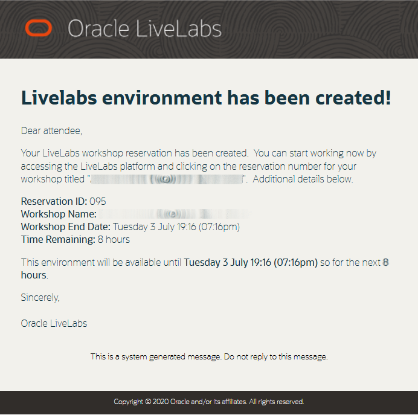
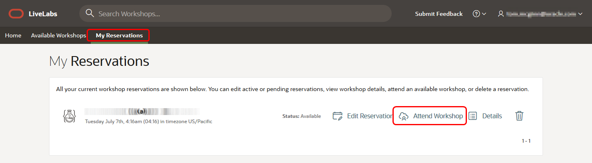
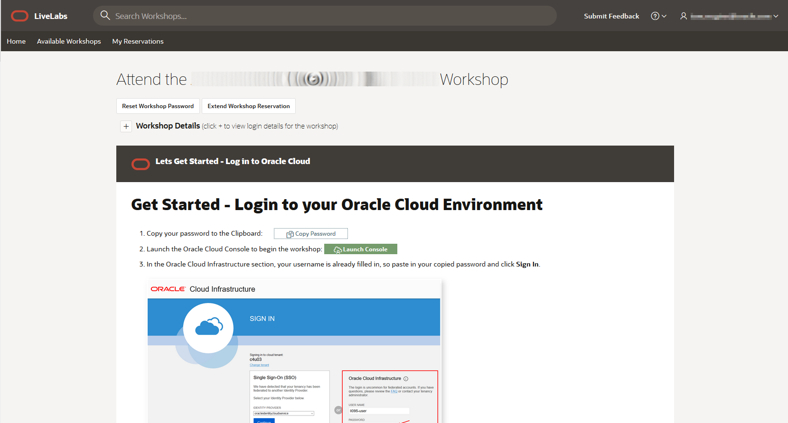

# LiveLabs Login

## Introduction

Before you get started, you should have an active *Oracle Account* login and a LiveLabs reservation. If you don't already have a login, follow the next step to request one free of charge.

*Note:* An *Oracle Account* is free and is needed to gain access to oracle publicly accessible content and Oracle Support to name the few.

If you already have a reservation, skip to the next lab to start your workshop by reading through the Introduction!

## Step 0: **Create an Oracle Account**
Creating an Oracle account can be summarized in the following two simple steps.

1. Navigate to [oracle.com](http://www.oracle.com), Click on *View Account*, and Select *Create an Account*

2. Fill out the form and click *Create Account*

## Step 1: **Request Workshop Reservation**
1. Using your *Oracle Account Login* go to [LiveLabs 2.0](http://bit.ly/golivelabs) and click   to request a reservation for this workshop.

2. After creating a reservation for a LiveLab Workshop, you will receive an e-mail indicating that your reservation is being processed, followed by an e-mail indicating that your environment has been created.

  

  *Note: You will receive the second created e-mail just before your selected reservation time.*

3. Log into LiveLabs and click **My Reservations**, then click the **Attend Workshop** link for the Workshop environment you'd like to use. Note that you may have several Workshops listed.

  

4. Follow the instructions provided to log in to your Oracle Cloud account, change your password, and complete your login to Oracle Cloud.

  

5. Finally, open the lab instructions by choosing one of the two options

  

## Acknowledgements

- **Created By/Date** - Tom McGinn, Database Innovations Architect, Database Product Management, March 2020
- **Contributors** - Kay Malcolm, Rene Fontcha
- **Last Updated By/Date** - Rene Fontcha, Master Principal Solutions Architect, NA Technology, October 2020 

## See an issue?
Please submit feedback using this [form](https://apexapps.oracle.com/pls/apex/f?p=133:1:::::P1_FEEDBACK:1). Please include the *workshop name*, *lab* and *step* in your request.  If you don't see the workshop name listed, please enter it manually. If you would like us to follow up with you, enter your email in the *Feedback Comments* section.
