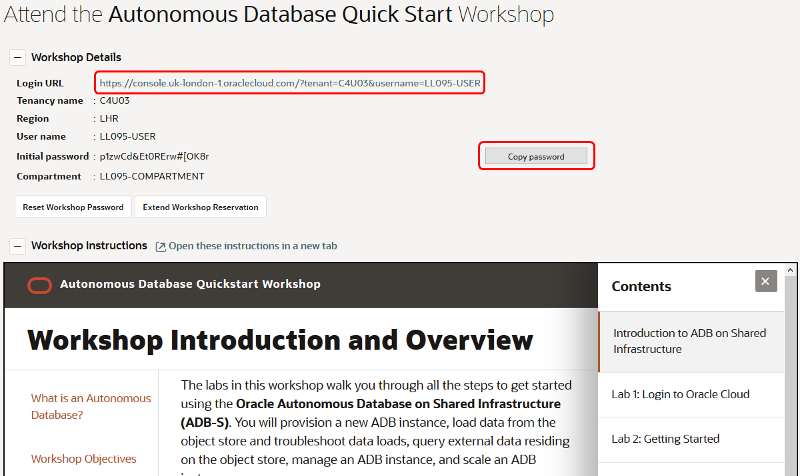

# Login to Oracle Cloud - LiveLabs 2.0 #

## Get Started - Login to your Oracle Cloud Environment

1. After creating a reservation for a LiveLab Workshop, you will receive an e-mail indicating that your reservation is being processed, followed by an e-mail indicating that your environment has been created.

  

  Note: You will receive the second created e-mail when just before your selected reservation time.

2. Log into LiveLabs and click **My Reservations**, then click the **Attend Workshop** link for the Workshop environment you'd like to use. Note that you may have several Workshops listed.

  

3. Click **Open these instructions in a new tab** to open the Workshop instructions.

  

4. Return to the LiveLabs tab, note the **Region**, and click **Copy Password** and then click on the **Login URL**.

  

5. In the Oracle Cloud Infrastructure section, your username is already filled in, so paste your copied password and click **Sign In**.

  

6. On the Change Password screen, paste your current password in the Current Password field, and enter a new password (twice) using the guidelines provided. Be sure to note your new password. Click **Save New Password**.

  

7.  Once you successfully save your new password, you will be presented with the Oracle Cloud homepage.

    

8.  Compare the region you are logged into with the region specified on the **Attend Workshop** page. If you need to change to regions, click on the **upper right-hand corner** and **set your region** to the region you were assigned. *Note: We have pre-created certain objects in this assigned region to assist with workshop completion. Failure to set the correct region will result in lab failure.*

    

Once you have set your region to the assigned value, *proceed to the next lab*.

## Acknowledgements

- **Last Updated By/Date** - Tom McGinn, Database Innovations Architect, DB Product Management, July 2020

See an issue?  Please open up a request [here](https://github.com/oracle/learning-library/issues).   Please include the workshop name and lab in your request.
