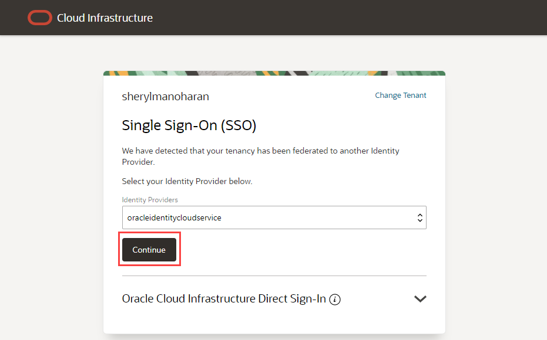

# Get started

## Introduction

Oracle Cloud is the industry's broadest and most integrated cloud provider, with deployment options ranging from the public cloud to your data center. Oracle Cloud offers best-in-class services across Software as a Service (SaaS), Platform as a Service (PaaS), and Infrastructure as a Service (IaaS).

### Existing Cloud Accounts

If you already have access to an Oracle Cloud account, including an Oracle Cloud account using [Oracle Universal Credits](https://docs.oracle.com/en/cloud/get-started/subscriptions-cloud/csgsg/universal-credits.html), skip to **Task 2** to sign in to your cloud tenancy.

### Types of Cloud Accounts

We offer two types of Cloud Accounts:

*Free Tier Accounts*:  After you sign up for the free Oracle Cloud promotion or sign up for a paid account, you’ll get a welcome email. The email provides you with your cloud account details and sign in credentials.

*Oracle Cloud Paid Accounts*:  When your tenancy is provisioned, Oracle sends an email to the default administrator at your company with the sign-in credentials and URL. This administrator can then create a user for each person who needs access to the Oracle Cloud. Check your email or contact your administrator for your credentials and account name.

### Objectives

- Learn how to login to your Oracle Cloud Account

### Prerequisites
- Cloud Account Name - The name of your tenancy (supplied by the administrator or in your Oracle Cloud welcome email)
- Username
- Password

> **Note**: Interfaces in the following screenshots may look different from the interfaces you will see.

## Task 1: Sign in to Your Account

_Please note that while your tenancy is initially created, you will only see a direct login. Once your tenancy is fully provisioned, you will see the screens as described below._

1. Go to [cloud.oracle.com](https://cloud.oracle.com). Enter your Cloud Account Name and click **Next**. This is the name you chose while creating your account in the previous section. It's NOT your email address. If you've forgotten the name, see the confirmation email.

    

2. Click **Continue** to sign in using the *"oraclecloudidentityservice"*.

   

   When you sign up for an Oracle Cloud account, a user is created for you in Oracle Identity Cloud Service with the username and password you selected at sign up. You can use this single sign-on option to sign in to Oracle Cloud Infrastructure and then navigate to other Oracle Cloud services without re-authenticating. This user has administrator privileges for all the Oracle Cloud services included with your account.

3. Enter your Cloud Account credentials and click **Sign In**. Your user name is your email address. The password is what you chose when you signed up for an account.

     

4. You are now signed in to Oracle Cloud!

    

You may now **proceed to the next lab**

## **Acknowledgements**

- **Created By/Date** - Kay Malcolm, Database Product Management, Database Product Management, March 2020
- **Contributors** - John Peach, Kamryn Vinson, Rene Fontcha, Arabella Yao
- **Last Updated By** - Arabella Yao, Product Manager, Database Product Management, May 2022