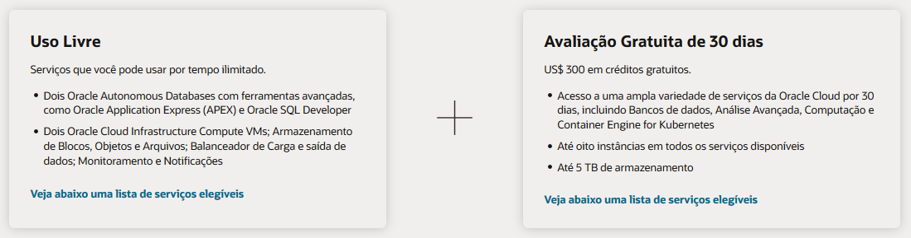

# Vamos Começar

## Introdução

Antes de tudo, você irá precisar de uma conta na Oracle Cloud. Este lab de cinco minutos te guiará nos passos para que possa obter uma conta no Modo Gratuito da Oracle Cloud e como ingressar nela.

### Contas Cloud Existentes

Se você já possui acesso a uma conta da Oracle Cloud, incluindo uma conta da Oracle Cloud que usa [Oracle Universal Credits](https://docs.oracle.com/en/cloud/get-started/subscriptions-cloud/csgsg/universal-credits.html), avance para o **PASSO 2** para entrar na sua Cloud Tenancy.

### Duas Ofertas de Cloud em Uma

Oracle Cloud Modo Gratuito permite que você se inscreva em uma conta da Oracle Cloud a qual provê um número de serviços de Uso Livre e uma Avaliação Gratuita com US$300 em crédito grátis para uso em todos os serviços elegíveis da Oracle Cloud por até 30 dias. Os serviços de Uso Livre estão disponíveis por tempo ilimitado. Os serviços de Avaliação Gratuita podem ser usados até que seus US$300 em créditos gratuitos sejam consumidos ou os 30 dias expirem, o que ocorrer primeiro.

### O que você vai precisar

* Um endereço de email válido
* Possibilidade de receber um texto de verificação por SMS (apenas se seu email não for reconhecido)

## **PASSO 1**: Crie Sua Conta de Avaliação Gratuita

Caso você já tem uma conta Cloud, avance para o **PASSO 2**.

1. Open up a web browser to access the Oracle Cloud account registration form at [oracle.com/cloud/free](https://myservices.us.oraclecloud.com/mycloud/signup?language=en).
2.  You will be presented with a registration page.
       
3.  Enter the following information to create your Oracle Cloud Modo Gratuito account.
    * Choose your **Country**
    * Enter your **Name** and **Email**.

4. Once you have entered a valid email address, select the **Verify my email** button.
    The screen will appear as follows after you select the button:
       

5. Go to your email. You will see an account validation email from Oracle in your inbox. The email will be similar to the following:
       

6. Select the link (if possible) or copy and paste the link into your browser.

7. Enter the following information to create your Oracle Cloud Modo Gratuito account.
       * Choose a **Password**
       * Enter your **Company Name**
       * Your **Cloud Account Name** will generate automatically based on your inputs, you can change that name by entering a new value. Remember what you wrote. You'll need this name later to sign in.
       * Choose a **Home Region**.  Your Home Region cannot be changed once you sign-up. Note: Based on the current design of the workshop and resource availability, it is recommended not to use the London region for this workshop at this time.
       * Click **Continue**
       

5.  Enter your Address information.  Click **Continue**.
          

6.  Choose your country and enter a mobile number for verification.   Click the **Text me a code** button.

       

7. Once you receive your code, enter it and click **Verify My Code**.
       

8. Click the **Add payment verification method** button.
         

9.  Choose the verification method.  In this case click the **Credit Card** button. Enter your information and payment details.  *Note: This is a free credit promotion account. You will not be charged unless you elect to upgrade the account*.
       

10. Once your payment verification is complete.  Review and accept the agreement by clicking the check box.  Click the **Start my Avaliação Gratuita** button.
       

11. Your account is provisioning and should be available in a few seconds! When it's ready, you're automatically taken to a sign-in page. You'll also receive two emails from Oracle. One email will be the initial notification that provisioning is underway. The other email will be notification that provisioning is complete. Here is a copy of the final notification:
       

## **PASSO 2**: Sign in to Your Account

If you've signed out of the Oracle Cloud, use these steps to sign back in.

1. Go to [cloud.oracle.com](https://cloud.oracle.com) and Enter your Cloud Account Name and click **Next**. This is the name you chose while creating your account in the previous section. It's NOT your email address. If you've forgotten the name, see the confirmation email.

    

2. Expand the arrow after *"Oracle Cloud Infrastructure Direct Sign-In"* to reveal the login input fields.

    

3. Enter your Cloud Account credentials and click **Sign In**. Your username is your email address. The password is what you chose when you signed up for an account.

    

4. You are now signed in to Oracle Cloud!

    

You may now [proceed to the next lab](#next).

## **Rate this Workshop**
When you are finished don't forget to rate this workshop!  We rely on this feedback to help us improve and refine our LiveLabs catalog.  Follow the steps to submit your rating.

1.  Go back to your **workshop homepage** in LiveLabs by going back to your workshop and clicking the Launch button.
2.  Click on the **Brown Button** to re-access the workshop  

    

3.  Click **Rate this workshop**

    

## **Acknowledgements**

- **Created By/Date** - Tom McGinn, Database Innovations Architect, Database Product Management, March 2020
- **Contributors** - John Peach, Kamryn Vinson, Rene Fontcha, Kay Malcolm
- **pt_BR Translated by** - André Ambrósio, April 2021
- **Last Updated By** - André Ambrósio, April 2021
