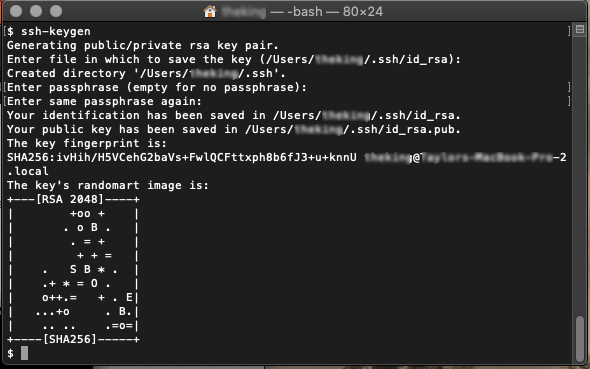
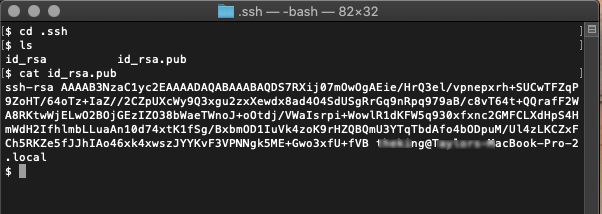
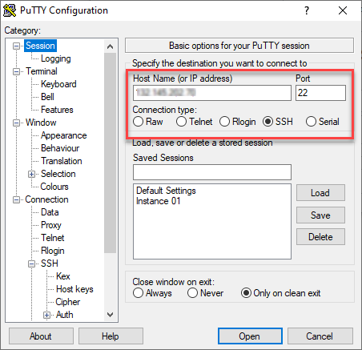
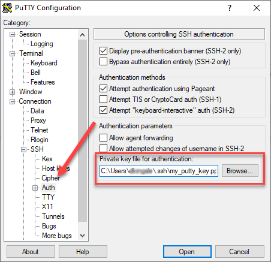
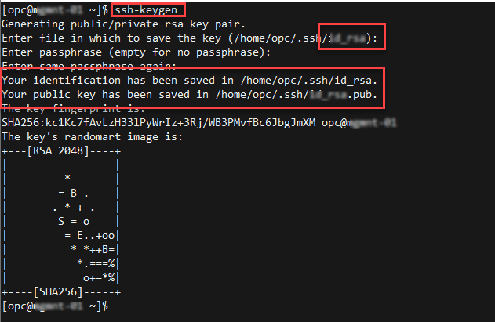

# SSH Key Creation

## Introduction

The SSH (Secure Shell) protocol is a method for secure remote login from one computer to another. SSH enables secure system administration and file transfers over insecure networks using encryption to secure the connections between end points.  SSH Keys are an important part of securely accessing OCI compute instances in the cloud.    

If you already have an ssh key pair, you may use that to connect to your environment.  We recommend you use the Oracle Cloud Shell to connect to your instance.  However if you prefer to connect via your laptop, please choose based on your configuration.

*IMPORTANT:  If the ssh key is not created correct, you will not be able to connect to your environment and will get errors.  Please ensure you create your key properly.* 


## Option 1:  Oracle Cloud Shell

The Cloud Shell machine is a small virtual machine running a Bash shell which you access through the OCI Console. Cloud Shell comes with a pre-authenticated OCI CLI, set to the Console tenancy home page region, as well as up-to-date tools and utilities. To use the Cloud Shell machine, your tenancy administator must grant the required IAM policy.

1.  To start the Oracle Cloud shell, go to your Cloud console and click the cloud shell icon to the right of the region.

     

2.  Once the cloud shell has started, enter the following command.  Do not enter a passphrase, press Enter twice.
    ````
    mkdir .ssh
    cd .ssh
    ssh-keygen -b 2048 -t rsa -f <<sshkeyname>>
    ````
     
     

3.  Examine the two files that you just created
    ````
    ls
    ````
     


## Option 2:  MacOS

1.  If you don't already have a shortcut to the terminal application for MacOS you can find it in the Applications > Utilities menu or (Shift+Command+U) on your keyboard.   Start up Terminal and type in the command ```ssh-keygen```.  ssh-keygen will ask you where to save the key, accept the default of your home directory in the .ssh folder.  File name will be ```id_rsa``` or whatever you choose to name your key.   Press enter twice and don't enter a passphrase.   Remember the directory where you saved your key, you'll need to reference it later when you create your instance.

    

2.  Type the following commands in the terminal window to verify that the public and private keys were created.  And to copy the contents of the public key for use in creating your instance in the OCI dialog.

    ```
    <copy>
    cd .ssh
    cat id_rsa.pub
    </copy>
    ```

    

3.  If you're ready to create your instance, left click and drag to copy the key contents, not including the file name on the command line.   You can paste the key information into the key creation dialog box in OCI later, assuming you don't copy something else in the meantime.   Otherwise, you can navigate to the file if you would prefer that method of loading the key.

    

4.  In the OCI **Create Compute Instance** dialog you can choose the SSH key from your system or paste the key contents.   The example below illustrates choosing the key file from a laptop running MacOS.   

    

5.  A trick for MacOS is that it (unlike Windows) understands that a dotted directory (.ssh) is hidden, so by default, the directory will be invisible in the Finder window.  In Finder, navigate to your home directory, and press (Cmd + Shift + .) (*yes, that's a dot*).   Hidden directories should now be visible.   Navigate to the .ssh directory and choose id_rsa.pub.

    

6.  Finish filling out the dialog and choose **Create** to create your instance.   Once it's up and running, copy the IP address and prepare to login via SSH.

    

7.  Open the Terminal and navigate to the .ssh directory, or you can reference it in the ssh login command if you wish.   Type the following command to login to your instance from the MacOS terminal.

    ```
    ssh -i id_rsa opc@xxx.xxx.xxx.xxx
    ```
    

    You have successfully logged into an OCI compute instance with a MacOS generated key.    This concludes this tutorial on creating SSH keys for all platforms. 

    [Click for the MacOS Terminal User Guide](https://support.apple.com/guide/terminal/welcome/mac)


## Option 3:  Windows 10

Creating keys for Windows can be interesting as ```ssh-keygen``` was not a native utility for Windows until the release of Windows 10.  And it wasn't included in the initial Windows 10 builds.  In this section, we'll assume your version of Windows 10 actually has ```ssh-keygen``` installed.  Note that you might have an earlier build that doesn't include ssh-keygen.  If you can't find it, either upgrade or try one of the other methods listed for earlier versions of Windows.

1.  Open a **Powershell** command window on your Windows 10 system by clicking it's icon/tile or by typing 'powershell' in the search field in the Start bar.

    

2.  Enter the command ```ssh-keygen``` into the terminal window.  Pay particular attention to where the file will be saved so you can locate it later.   ```ssh-keygen``` will default to the standard .ssh directory under the users base directory.  

3.  Press enter at all of the prompts to accept the default location, no passphrase, and default file names.

    **Note** *In Unix variants, a folder with a dot (.) in front of it was usually designated for configuration files and 'hidden' from normal view.   However, a dot (.) doesn't mean anything special in front of Windows folders.  So the folder will exist but won't be hidden.*

    

4.  Confirm that your keys exist and were created properly.   Enter the following commands in the Powershell window.

    ```
    <copy>
    cd .ssh
    ls
    cat id_rsa.pub
    </copy>
    ```

    

    You now have a working SSH key-pair and can use them for secure communications to instances in the cloud.   Do not share the *private* key with anyone unless you understand what you're doing.  You should only ever need to share and copy the public key.

5.  Also note that if you elect to copy/paste the contents of the key into certain dialogs for other OCI or Oracle Cloud labs, you will need to locate the file in Windows, either through Powershell, Explorer, or other directory tool, and open the public key file to copy its contents.  The example below is using Powershell to ```cat``` the contents.  You can select the text with your mouse but the copy/paste commands aren't available.  Use ```<ctrl-c>``` to copy the contents to the clipboard for pasting into other application dialogs.

    

    Or you can just open the file with Notepad, Wordpad, or other text editor.   

    **Note:** *Don't use MS Word or any other rich text editor as they might add extra formatting characters which will render the key unusable.*

    

    This concludes the Windows 10 SSH creation mini-lab.   

    * [Click here for more details on PowerShell for Windows](https://docs.microsoft.com/en-us/powershell/)
    * [Click here for more details on OpenSSH Key Management for Windows](https://docs.microsoft.com/en-us/windows-server/administration/openssh/openssh_keymanagement)

    In case you're interested, below are a few more steps showing how to login to an OCI cloud instance using Windows 10 PowerShell and the keys you just created.

6.  Assuming that you've uploaded or pasted your public SSH key to an OCI compute instance.    Open a PowerShell window and navigate to the ```.ssh``` subdirectory under your home folder.  (Or wherever you stored your key from the above steps).   Obtain the IP Address of the compute instance you wish to connect to and issue the following command:

    ```
    ssh -i id_rsa opc@129.213.100.78
    ```

    

    Great job!  You've successfully created an SSH key for Windows 10 and securely logged into an OCI compute instance.

## Option 4a: Prior Windows Versions - Git For Windows

In earlier versions of Windows, ssh-keygen was not a native utility so third party utilities had to be utilized.   In this section, we'll illustrate using **Git for Windows**.  **Git for Windows** includes a Unix like shell called ```gitbash``` which is what you'll use to create keys, and establish SSH communications with your cloud host systems.  If you prefer **Putty** go to the next section.

1.  If you don't already have it installed, access the link below and download the application.

    [Click here to download Git for Windows](https://git-scm.com/download/win)

2. Follow the instructions for installation.  **Note** *Installing Git for Windows is beyond the scope of this lab document.*

3.  Once installed, you should have an entry in your Windows Start menu for Git which should include the **gitbash** command.   Click on the **gitbash** command.

    

4.  Type ```ssh-keygen``` into the terminal window.   Press the enter key to accept the default filename (id_rsa) and ```<Enter>``` two more times for no passphrase.

    

    **Note:**  *The tricky part here is that **gitbash** uses a simulated Unix home directory.   In order to view, retrieve, or copy your keys, you will need to navigate into the Windows directory structure.

5.  First navigate 'up' into the root C: directory.

    ```
    <copy>
    cd c:
    </copy>
    ```
    Then navigate 'down' into the .ssh folder in your normal home directory.

    ```
    cd Users/<your home folder name>/.ssh/
    ls
    ```

    

6.  Make a note of where your SSH public and private key files are located.  You may be asked to upload the file or to copy/paste the contents in other labs for Oracle Cloud Services.  In the example below, you can use the gitbash ```cat``` command to display the public key file contents.  You can select the key file contents and left-click to **Copy** the key.  Or you can upload it directly.

    

    That's all there is to it. 

    **Note** *If you've already installed Git For Windows, don't bother with Putty.   It's your choice which utility to use for key generation and terminal access.

    In case you're interested, below are the steps to use **Git for Windows** gitbash utility to securely login to an OCI Compute instance.

7.  Assuming that you've uploaded or pasted your public SSH key to an OCI compute instance.    Open a gitbash session and navigate to the ```.ssh``` subdirectory under your home folder.  (Or wherever you stored your key from the above steps).   Obtain the IP Address of the compute instance you wish to connect to and issue the following command:

    ```
    ssh -i id_rsa opc@129.213.100.78
    ```

    

    Great job!  You've successfully created an SSH key for Windows 10 and securely logged into an OCI compute instance using the gitbash utility.


## Option 4b: Windows Versions - PuTTY

In earlier versions of Windows, ssh-keygen was not a native utility so third party utilities had to be utilized.   In this section, we'll illustrate using **PuTTy**.  If you prefer **Git for Windows** visit the section prior to this one.

1.  If you don't already have it installed, access the link below and download the application.   For Oracle employees, **PuTTy** is also available for download internally via the **MyDesktop** application.  For public access, use the below link.

    [Click here to download PuTTy for Windows](https://www.chiark.greenend.org.uk/~sgtatham/putty/latest.html)

2. Follow the instructions for installation.  

    **Note:** *Installing PuTTy is beyond the scope of this lab document.*

    Once installed, you should have an entry in your Windows Start menu, and perhaps a desktop shortcut for PuTTy.  PuTTy is a actually a suite of secure communication utilities.  We'll be using two of them, the PuTTy utility for terminal access and the PuTTygen utility for generating a secure SSH key.

3.   Open the Windows start menu and navigate to the PuTTy folder.  Select the PuTTygen utility.

     

4.  Verify that the defaults are selected and the key type should be RSA set at 2048 bits.   Click on the **Generate** button.

    

5.  Follow the instructions and move your mouse around the empty grey area to generate random information.  PuTTy is using that information to generate a random, secure SSH key.

    

6.  In the below screen, PuTTY has taken your mouse information and created a key. We need to do several things here that are a little different than other key generation methods.

**Note:**  *PuTTY does not save keys in an OpenSSH compatible format. Thus, if you upload a public key file created with Putty to a Linux/Unix system using OpenSSH, the key will not read correctly.  However, the key information itself, when copied directly from the PuTTYgen application, does work correctly when **pasted** into fields that then use that information to create a proper OpenSSH compatible key.  For example, when creating an instance on OCI, you can **paste** the SSH key from PuTTY and it will work correctly.*

    

7.  Although we can't actually use the file for an OCI Instance, we'll still want to save the key for future reference.   Click the **Save public key** button.

    In the *Save public key as:* dialog, name your key and add the ```.pub``` extension to the filename.   It will also be helpful if save the file in the common ```.ssh``` folder under your Windows username / folder structure.   In this example the key-files will be accessible ```C:\Users\<username>\.ssh``` directory.   Store the keys here for easy future reference.

    

8.  Next you'll need to save the private key.   Click the **Save private key** button, answer **Yes** to the warning about saving without a passphrase. 
    

9.  Name the key and verify that it's saved with a ```.ppk``` extension to identify the file as the private key file.   Do not share your private key with anyone.

    

10.  Now that you've saved the keys for future reference, all you have to do is copy the key information from the PuTTy dialog.  Select the key text in the dialog box from start to finish, then right click and choose **Copy**.  You can then paste the key into a Notepad or directly into the instance creation dialog in the OCI console. 

    [](images/keylab-021.png " ")

11.  Below is an example of the **Add SSH Key - Paste SSH Keys** dialog in the OCI instance creation form.

    

    This concludes the section on using Putty to generate an SSH key pair for versions of Windows prior to Windows 10.

    Follow the below instructions to connect to a cloud instance via SSH using the PuTTY terminal.

12.  Open the PuTTY utility from the Windows start menu.   In the dialog box, enter the IP Address of your OCI Compute Instance.  This can be obtained from the **OCI Console > Instance Details** screen.

    

13.  Under **Category** select **Connection** and then choose the **Data** field.  Enter the assigned username.  OCI instances will default to the username ```opc```.  Enter ```opc```.

    

14.  Under **Category**, navigate to **Connection** - **SSH** and choose the **Auth** category.   Click on the **Browse** button and locate the ```Private Key file``` you created in the earlier step.   Click the Open button to initiate the SSH connection to your cloud instance.

    

15.  Click **Yes** to bypass the Security Alert about the uncached key.

    

16.  Connection successful.   You are now securely connected to an OCI Cloud instance.

    

    You are now able to connect securely using the Putty terminal utility.   You can save the connection information for future use and configure PuTTY with your own custom settings.  

    [For more information on using PuTTY](https://the.earth.li/~sgtatham/putty/0.73/htmldoc/)

    **Note:** *If you've already installed PuTTY, don't bother with Git For Windows.   It's your choice which to use for key generation and terminal access.*

## Option 5: SSH Keys for Linux


1. Open a terminal window and type in the ssh-keygen command.   There are a few command line options for the ssh-keygen utility, however, for quick and dirty key creation for lab use, no options are necessary.    Type ```ssh-keygen --help``` in your terminal window to see all the possible options.   For now, just run the command by itself.

    ```
    <copy>
    ssh-keygen
    </copy>
    ```
    You should run this command from your home directory.  In this case as the user-id ```opc```.   The dialog will default to a hidden directory, ```~/.ssh```.  If you don't already have keys created, accept the default file name ```id_rsa``` by hitting the enter key.   Press the enter key two more times to create a key with no passphrase.   A best practice in a production environment would be to use a secure passphrase, however, we don't need to bother with these practice labs.

    

    The dialog will indicate that the key pair has been saved in the ```/home/username/.ssh``` directory and is now ready for use.

2. Change to the ```.ssh``` directory, list and examine your keys.

    ```
    <copy>
    cd .ssh
    ls
    </copy>
    ```

    

    Note in the output that there are two files, a *private key:* ```id_rsa``` and a *public key:* ```id_rsa.pub```.   Keep the private key safe and don't share it's contents with anyone.   The public key will be needed for various activities and can be uploaded to certain systems as well as copied and pasted to facilitate secure communications in the cloud.  

3.  Use the Linux ```cat``` command to list the contents of id_rsa.pub.

    ```
    <copy>
    cat id_rsa.pub
    </copy>
    ```
    

    In some labs you will be asked to upload or copy (rcp) the public key to an instance in order to facilitate communications.   So remember where the file is kept.   Other labs will ask for the 'contents' of the key to be pasted into various dialog boxes to facilitate secure connections.   Use the ```cat``` command and copy/paste the information from the key starting at the word "ssh-rsa" and copy everything up to the final character in the line.  In the example below, you would copy from "ssh-rsa ... " and to exactly after "... -01".   Copy the key contents exactly, capturing space after the key characters may render your key invalid.

    

    That's all there is to it!   You have created a public/private SSH key pair and can utilize it in any of the Oracle OCI labs that require an SSH key.

    * [Click here for more details on SSH](https://www.ssh.com/ssh/key)

    In case you're interested, here's a short tutorial on initiating a connection from a Linux instance with the SSH keys we just created.

4.  When creating an instance with the OCI Instance creation dialog there's a section of the form for adding an SSH key file.  Example below.

    

5.  Select the radio button for **Choose SSH key file**.   Click the button to **Choose Files**.  Choose the public key file (extension of .pub) that you created earlier and choose **Open**.

    

6.  If you've selected the correct type of file, the filename will appear in light grey in the dialog box.   You can now continue with instance creation setup and click the **Create** button to create your instance.

    

7.  When your instance has provisioned successfully, view the **Instance Details** screen from the OCI console and note (copy) the assigned Public IP Address.   See the image below for an example.

    

8.  Open a terminal window and issue an SSH connection command to your instance.   Issue the command from the .ssh directory or reference the path in the command before the id_rsa key file.   For an OCI instance, the default login name is ```opc```.

    ```
    ssh -i id_rsa opc@129.213.100.78
    ```
    

    Here's a screenshot of the command issued from the opc users home directory and the path to the id_rsa file in the .ssh hidden directory.

    ```
    ssh -i ~/.ssh/id_rsa opc@129.213.100.78
    ```

    

    This concludes the SSH key generation and SSH key terminal access section of this lab.


Lab created by Dan Kingsley, OSPA.  

