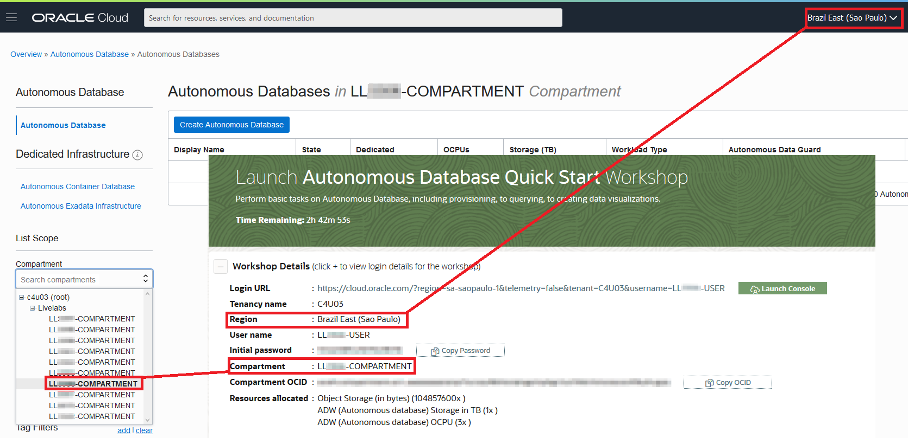

# Need Help?                                  
This page is designed to help you solve some common problems users face. **If you see your issue listed to the left or below, please expand the section and follow the relevant troubleshooting guide.**

If you still find yourself stuck or would like to report an issue with the workshop, click the question mark icon in the upper left corner to contact the LiveLabs team directly.  

This will construct an e-mail in your default mail application that is auto populated to address our LiveLabs support inbox and will also include your current workshop in the subject line. We ask that you do not change the subject line. Instead, include the description of your issue and any pertinent information in the contents on your e-mail.

## How To Format Your E-mail
To provide the most effective support for you, we ask that you include the **Lab Number**, **Step Number**, and **Sub-Step Number** where you've encounter the issue. We also ask that you attach a **Screenshot** and **Any Troubleshooting Steps** you've tried so we can recreate the issue and provide a timely and accurate solution.

## **Rate This Workshop**
When you are finished don't forget to rate this workshop!  We rely on this feedback to help us improve and refine our LiveLabs catalog.  Follow the steps to submit your rating. 

1.  Go back to your **Workshop Homepage** in LiveLabs by searching for your workshop and clicking the Launch button.

2.  Click on the **Brown Button** to re-access the workshop  

    

3.  Click **Rate this workshop**

    

If you still have an active reservation, you can also rate by going to My Reservations -> Launch Workshop.

## Most Common Issue
Double check that you are using the information and credentials provided to you in the lab banner. 

## Can't Login? 
Make sure you are using the tenancy, username, and password provided to you in the lab banner.

If you've forgotten your password, you can reset it to the default lab password provided in the lab banner.

## Can't Create An Oracle Database? Nothing In Your Compartment?
Ensure that under "List Scope", you are selecting the compartment provided to you in the lab banner. If you can't find your compartment in the drop-down box, make sure you set your region to the one provided in the lab banner.

## Connectivity Issues? Unable To Upload Data or Connect To The database?
Are you connected to a **VPN**, **Corporate Network**, or behind a strict **Firewall**?

If any of these three conditions are true, some ports in your network may be closed to traffic. Uploading data through Database Actions in your web browser and applications like the Oracle Analytics Tool could be restricted and may appear to "Hang" or freeze. 

Please disconnect from your VPN and try again if applicable.

If you are connected to a corporate network, try switching to a public or a "clear" network if allowed.

Alternatively, contact your IT Administrator to see if adding exceptions to your network or firewall would be viable.
