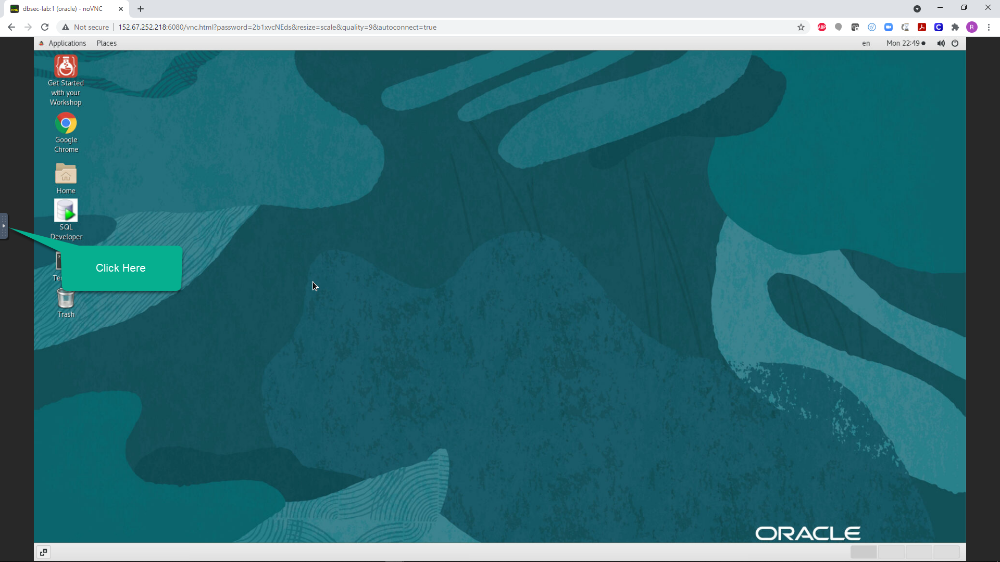

# Using noVNC Remote Desktop

## Introduction
This lab will show you how to get started with your workshop with a remote desktop session.

*Estimated Lab Time*: 10 minutes

### Objectives
In this lab, you will:
- Enable fullscreen display of remote desktop session
- Enable remote clipboard integration
- Open the workshop guide from the remote desktop

### Prerequisites

This lab assumes you have:
- Provisioned VM Instance configured with noVNC

## **STEP 1:** Enable Full-screen Display
For seamless desktop integration and to make the best use of your display, perform the following tasks to render your remote desktop session in fullscreen mode.

1. Click on the small gray tab on the middle-left side of your screen to open the control bar.

    

2. Select *Fullscreen* to render the session on your entire screen.

    
    

## **STEP 2:** Enable Copy/Paste from Local to Remote Desktop
During the execution of your labs you may need to copy text from your local PC/Mac to the remote desktop, such as commands from the lab guide. While such direct copy/paste isn't supported as you will realize, you may proceed as indicated below to enable an alternative local-to-remote clipboard with Input Text Field.

1. Continuing from the last task above, Select the *clipboard* icon

    

2. Copy some text from your local computer as illustrated below and paste into the clipboard widget, then finally open up the desired application (e.g. Terminal) and paste accordingly using *mouse controls*

    

    *Note:* Please make sure you initialize your clipboard with step [1] shown in the screenshot above before opening the target application in which you intend to paste the text. Otherwise will find the *paste* function in the context menu grayed out when attempting to paste for the first time.

## **STEP 3:** Open Your Workshop Guide

1. If the two *Firefox* browser windows are not already open, click on the icon from the remote desktop. This will launch two windows.

    

2. On the left windows is a workshop guide that may or may not be the correct guide as many VM images are shared by multiple workshops. To ensure that the guide displayed is the correct one, click on *Workshop Guides* from the browser toolbar bookmarks area and select the appropriate guide for your workshop.

    

You may now [proceed to the next lab](#next).

## Acknowledgements
* **Author** - Rene Fontcha, LiveLabs Platform Lead, NA Technology
* **Contributors** -
* **Last Updated By/Date** - Rene Fontcha, LiveLabs Platform Lead, NA Technology, June 2021
