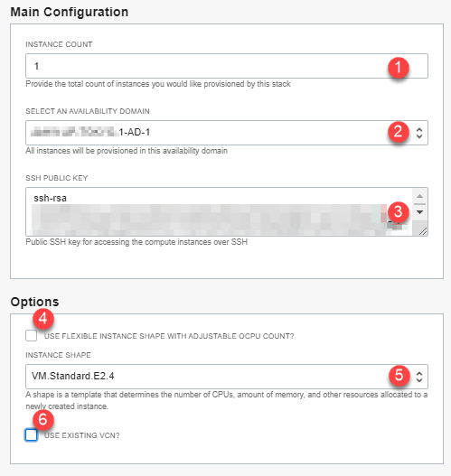

# Setup Compute Instance

## Introduction
This lab will show you how to setup a Resource Manager stack that will generate the Oracle Cloud objects needed to run your workshop.

*Estimated Lab Time:* 15 minutes

### About Terraform and Oracle Cloud Resource Manager
For more information about Terraform and Resource Manager, please see the appendix below.

### Objectives
-   Create Compute + Networking Resource Manager Stack
-   Connect to compute instance

### Prerequisites
This lab assumes you have:
- An Oracle Free Tier or Paid Cloud account
- SSH Keys
- Performed *Lab: Prepare Setup*

## **STEP 1**: Create Stack: Choose a Path
Proceed to deploy your workshop environment using Oracle Resource Manager (ORM) stack

Your options are:
1. Step 1A: Create Stack:  **Compute + Networking** *(recommended)*
2. Step 1B: Create Stack:  **Compute Only**

## **STEP 1A**: Create Stack:  Compute + Networking
1. Identify the ORM stack zip file downloaded in *Lab: Prepare Setup*
2. Login to Oracle Cloud
3.  Open up the hamburger menu in the left hand corner.  Choose the compartment in which you would like to install.  Under the **Solutions and Platform** submenu, choose **Resource Manager > Stacks**.  

  

  

4.  Select **My Configuration**, choose the **.ZIP FILE** button, click the **Browse** link and select the zip file that you downloaded. Click **Select**.

  

5. Enter the following information:

  

      - **Name**:  Enter a name  or keep the prefilled default (*DO NOT ENTER ANY SPECIAL CHARACTERS HERE*, including periods, underscores, exclamation etc, it will mess up the configuration and you will get an error during the apply process)
      - **Description**:  Same as above
      - **Create in compartment**:  Select the correct compartment if not already selected

     ***Note:*** *If this is a newly provisioned tenant such as freetier with no user created compartment, stop here and first create it before proceeding.*
6.  Click **Next**.

7. Enter or select the following:

  

    - **Instance Count:** Accept the default, **1**, unless you intend to create more for a team for instance
    - **Select Availability Domain:** Select an availability domain from the dropdown list.
    - **SSH Public Key**:  Paste the public key you created in the earlier lab

    ***Note:*** *If you used the Oracle Cloud Shell to create your key, make sure you paste the pub file in a notepad, remove any hard returns.  The file should be one line or you will not be able to login to your compute instance*
8. Depending on the quota you have in your tenancy you can choose from standard Compute shapes or Flex shapes.  We recommend standard shapes unless not available or you have run out of quota (Please visit the Appendix: Troubleshooting Tips for instructions on checking your quota)
    - **Use Flexible Instance Shape with Adjustable OCPU Count?:** Keep the default as checked (unless you plan on using a fixed shape)
    - **Instance Shape:** Keep the default or select from the list of Flex shapes in the dropdown menu (e.g *VM.Standard.E4.Flex*).
    - **Instance OCPUS:** Accept the default shown. e.g. (**4**) will provision 4 OCPUs and 64GB of memory. You may also elect to reduce or increase the count by selecting from the dropdown. e.g. `[2-24]`. Please ensure you have the capacity available before increasing.
9.  If don't have quota for Flex Shapes or you prefer to use fixed shapes, follow the instructions below.  Otherwise skip to the next step.
    - **Use Flexible Instance Shape with Adjustable OCPU Count?:** Unchecked
    - **Instance Shape:** Accept the default shown or select from the dropdown. e.g. VM.Standard2.2

  

10. For this section we will provision a new VCN with all the appropriate ingress and egress rules needed to run this workshop.  If you already have a VCN, make sure it has all of the correct ingress and egress rules and skip to the next section.
    - **Use Existing VCN?:** Accept the default by leaving this unchecked. This will create a **new VCN**.

11. Click **Next**.
12. Select **Run Apply** and click **Create**.

  

13. Your stack has is now created and the *Apply* action triggered is running to deploy your environment!  

  

You may now proceed to Step 2 (skip Step 1B).

## **STEP 1B**: Create Stack:  Compute only
If you just completed Step 1A, please proceed to Step 2.  If you have an existing VCN and are comfortable updating VCN configurations, please ensure your VCN meets the minimum requirements. Refer to *Lab: Prepare Setup*       

***Note:*** *We recommend letting our stack create the VCN to reduce the potential for error.*

1.  Identify the ORM stack zip file downloaded in *Lab: Prepare Setup*
2.  Login to Oracle Cloud
3.  Open up the hamburger menu in the left hand corner.  Choose the compartment in which you would like to install.  Choose **Resource Manager > Stacks**.  

  

  

4. Select **My Configuration**, click the **Browse** link and select the zip file (dbsec-lab-mkplc-freetier.zip) that you downloaded. Click **Select**.

  

  Enter the following information:
    - **Name**:  Enter a name  or keep the prefilled default (*DO NOT ENTER ANY SPECIAL CHARACTERS HERE*, including periods, underscores, exclamation etc, it will mess up the configuration and you will get an error during the apply process)
    - **Description**:  Same as above
    - **Create in compartment**:  Select the correct compartment if not already selected

  ***Note:*** *If this is a newly provisioned tenant such as freetier with no user created compartment, stop here and first create it before proceeding.*

5. Click **Next**.

  

  Enter or select the following:
    - **Instance Count:** Keep the default to **1** to create only one instance. You may also choose to a higher number if you need more than one instance created.
    - **Select Availability Domain:** Select an availability domain from the dropdown list.
    - **SSH Public Key**:  Paste the public key you created in the earlier lab

  ***Note:*** *If you used the Oracle Cloud Shell to create your key, make sure you paste the pub file in a notepad, remove any hard returns.  The file should be one line or you will not be able to login to your compute instance*

    - **Use Flexible Instance Shape with Adjustable OCPU Count?:** Keep the default as checked (unless you plan on using a fixed shape)
    - **Instance Shape:** Keep the default or select from the list of Flex shapes in the dropdown menu (e.g *VM.Standard.E4.Flex*).
    - **Instance OCPUS:** Accept the default shown. e.g. (**4**) will provision 4 OCPUs and 64GB of memory. You may also elect to reduce or increase the count by selecting from the dropdown. e.g. `[2-24]`. Please ensure you have the capacity available before increasing.
    - **Use Existing VCN?:** Check to select.

  

    - **Select Existing VCN?:** Select existing VCN with regional public subnet and required security list.

  

    - **Select Public Subnet:** Select existing public subnet from above VCN.

   ***Note:*** *For an existing VCN Option to be used successful, review the details at the bottom of this section*

6. If you prefer to use fixed shapes, follow the instructions below.  Otherwise skip to the next step.
    - **Use Flexible Instance Shape with Adjustable OCPU Count?:** Unchecked
    - **Instance Shape:** Accept the default shown or select from the dropdown. e.g. VM.Standard.E2.2

  

7. Review and click **Create**.

  

8. Your stack has is now created and the *Apply* action triggered is running to deploy your environment!

  

## **STEP 2**: Terraform Apply
In the prior steps we elected to trigger the *terraform apply action* on stack creation.

1.  Review the job output.

  

2.  Congratulations, your environment has been created!  Click on the *Application Information* tab to get additional information about what you have just done.
3.  Your public IP address(es), instance name(s), and remote desktop URL are displayed.


## **STEP 3:** Access the Graphical Remote Desktop
For ease of execution of this workshop, your VM instance has been pre-configured with a remote graphical desktop accessible using any modern browser on your laptop or workstation. Proceed as detailed below to login.

1. Navigate to **Stack Details**, **Application Information** tab, and click on the remote desktop URL

  

    *Note:* It may take up to 5 minutes for the URL to render. If the page loads and issues an *authentication error*, update the URL and replace the value after *password=* with *LiveLabs.Rocks_99*

    e.g.

    ```
    <copy>http://111.111.111.111/vnc.html?password=LiveLabs.Rocks_99&resize=scale&quality=9&autoconnect=true</copy>
    ```

    *Note:* The IP address shown above is made up for illustration only. Provide the correct IP address.

    

## **STEP 4:** Enable Full-screen Display
For seamless desktop integration and to make the best use of your display, perform the following tasks to render your remote desktop session in fullscreen mode.

1. Click on the small gray tab on the middle-left side of your screen to open the control bar.

    

2. Select *Fullscreen* to render the session on your entire screen.

    
    

## **STEP 5:** Enable Copy/Paste from Local to Remote Desktop
During the execution of your labs you may need to copy text from your local PC/Mac to the remote desktop, such as commands from the lab guide. While such direct copy/paste isn't supported as you will realize, you may proceed as indicated below to enable an alternative local-to-remote clipboard with Input Text Field.

1. Continuing from the last task above, Select the *clipboard* icon

    

2. Copy some text from your local computer as illustrated below and paste into the clipboard widget, then finally open up the desired application (e.g. Terminal) and paste accordingly using *mouse controls*

    

    *Note:* Please make sure you initialize your clipboard with step [1] shown in the screenshot above before opening the target application in which you intend to paste the text. Otherwise will find the *paste* function in the context menu grayed out when attempting to paste for the first time.

## **STEP 6:** Open Your Workshop Guide

1. If the two *Firefox* browser windows are not already open, click on the icon from the remote desktop. This will launch two windows.

    

2. On the left windows is a workshop guide that may or may not be the correct guide as many VM images are shared by multiple workshops. To ensure that the guide displayed is the correct one, click on *Workshop Guides* from the browser toolbar bookmarks area and select the appropriate guide for your workshop.

    

You may now [proceed to the next lab](#next).

## Appendix 1: Login to Host using SSH Key Based Authentication (Optional) - Choose a path

Access by SSH terminal is optional and if needed, choose a path from the following 3 methods. If you are doing a LiveLab that can be done within a terminal completely, we recommend you choose Oracle Cloud Shell (Appendix 1A).

Your options are:
1. Appendix 1A: Connect using Cloud Shell *(recommended)*
2. Appendix 1B: Connect using MAC or a Windows CYGWIN Emulator
3. Appendix 1C: Connect using Putty *(Requires you to install applications on your machine)*

## Appendix 1A: Upload Key to Cloud Shell and Connect

1.  Go to ***Compute >> Instances*** and select the instance you created (make sure you choose the correct compartment).

2.  To start the Oracle Cloud Shell, go to your Cloud console and click the Cloud Shell icon at the top right of the page.

	

    

    

3.  Click on the Cloud Shell hamburger icon and select **Upload** to upload your private key. Note the private key does not have a `.pub` extension.

    

4.  To connect to the compute instance that was created for you, you will need to load your private key.  This is the half of the key pair that does *not* have a `.pub` extension.  Locate that file on your machine and click **Upload** to process it.

    

5. Be patient while the key file uploads to your Cloud Shell directory.
    

    


6. Once finished run the command below to check to see if your ssh key was uploaded.  Move it into your .ssh directory and change the permissions.

    ```nohighlight
    <copy>
    ls
    </copy>
    ```
    ```nohighlight
    mkdir ~/.ssh
    mv <<keyname>> ~/.ssh
    chmod 600 ~/.ssh/<privatekeyname>
    ls ~/.ssh
    ```

    

7.  Secure Shell into the compute instance using your uploaded key name (the private key).

    ```
    ssh -i ~/.ssh/<sshkeyname> opc@<Your Compute Instance Public IP Address>
    ```
    

If you are unable to ssh in, check out the troubleshooting tips below.

You may now [proceed to the next lab](#next).

## Appendix 1B: Connect via MAC or Windows CYGWIN Emulator
Depending on your workshop, you may need to connect to the instance via a secure shell client (SSH). If you're instructed in the next lab(s) to execute tasks via an SSH terminal, review the options below and select the one that best meet your needs.

1.  Go to ***Compute >> Instances*** and select the instance you created (make sure you choose the correct compartment)
2.  On the instance homepage, find the Public IP address for your instance.
3.  Open up a terminal (MAC) or cygwin emulator as the opc user.  Enter yes when prompted.

    ```
    ssh -i ~/.ssh/<sshkeyname> opc@<Your Compute Instance Public IP Address>
    ```
    

You may now [proceed to the next lab](#next).

## Appendix 1C: Connect via Windows using Putty
On Windows, you can use PuTTY as an SSH client. PuTTY enables Windows users to connect to remote systems over the internet using SSH and Telnet. SSH is supported in PuTTY, provides for a secure shell, and encrypts information before it's transferred.

1.  Download and install PuTTY. [http://www.putty.org](http://www.putty.org)
2.  Run the PuTTY program. On your computer, go to **All Programs > PuTTY > PuTTY**
3.  Select or enter the following information:
    - Category: _Session_
    - IP address: _Your service instance’s public IP address_
    - Port: _22_
    - Connection type: _SSH_

    

### **Configuring Automatic Login**

1.  In the category section, **Click** Connection and then **Select** Data.

2.  Enter your auto-login username. Enter **opc**.

    

### **Adding Your Private Key**

1.  In the category section, **Click** Auth.
2.  **Click** browse and find the private key file that matches your VM’s public key. This private key should have a .ppk extension for PuTTy to work.  
3.  If you do not have a .ppk extension see the [Appendix](#Appendix:TroubleshootingTips) for instructions for converting your private key to .ppk format using PuttyGen.

    

### **To save all your settings:**

1.  In the category section, **Click** session.
2.  In the saved sessions section, name your session, for example ( EM13C-ABC ) and **Click** Save.

## Appendix 2:  Terraform and Resource Manager
Terraform is a tool for building, changing, and versioning infrastructure safely and efficiently.  Configuration files describe to Terraform the components needed to run a single application or your entire datacenter.  In this lab a configuration file has been created for you to build network and compute components.  The compute component you will build creates an image out of Oracle's Cloud Marketplace.  This image is running Oracle Linux 7.

Resource Manager is an Oracle Cloud Infrastructure service that allows you to automate the process of provisioning your Oracle Cloud Infrastructure resources. Using Terraform, Resource Manager helps you install, configure, and manage resources through the "infrastructure-as-code" model. To learn more about OCI Resource Manager, take a watch the video below.

[](youtube:udJdVCz5HYs)

## Appendix 3: Troubleshooting Tips
If you encountered any issues during the lab, follow the steps below to resolve them.  If you are unable to resolve, please skip to the **Need Help** section to submit your issue via our  support forum.
- Availability Domain Mismatch
- Invalid public key
- Limits Exceeded
- Flex Shape Not Found
- Instance shape selection grayed out

### **Issue #1:** Availability Domain Mismatch


#### Issue #1 Description
When creating a stack and using an existing VCN, the availability domain and the subnet must match otherwise the stack errors.  

#### Fix for Issue #1
1.  Click on **Stack**-> **Edit Stack** -> **Configure Variables**.
2.  Scroll down to the network definition.
3.  Make sure the Availability Domain number matches the subnet number.  E.g. If you choose AD-1, you must also choose subnet #1.
4.  Click **Next**
5.  Click **Save Changes**
6.  Click **Terraform Actions** -> **Apply**

### **Issue #2:** Invalid public key


#### Issue #2 Description
When creating your SSH Key, if the key is invalid the compute instance stack creation will throw an error.

#### Tips for fixing for Issue #2
- Go back to the instructions and ensure you create and **copy/paste** your key into the stack correctly.
- Copying keys from Cloud Shell may put the key string on two lines.  Make sure you remove the hard return and ensure the key is all one line.
- Ensure you pasted the *.pub file into the window.
1.  Click on **Stack**-> **Edit Stack** -> **Configure Variables**.
2.  Repaste the correctly formatted key
3.  Click **Next**
4.  Click **Save Changes**
5.  Click **Terraform Actions** -> **Apply**

### **Issue #3:** Flex Shape Not Found


#### Issue #3 Description
When creating a stack your ability to create an instance is based on the capacity you have available for your tenancy.

#### Fix for Issue #3
If you have other compute instances you are not using, you can go to those instances and delete them.  If you are using them, follow the instructions to check your available usage and adjust your variables.
1. Click on the Hamburger menu, go to **Governance** -> **Limits, Quotas and Usage**
2. Select **Compute**
3. These labs use the following compute types.  Check your limit, your usage and the amount you have available in each availability domain (click Scope to change Availability Domain)
4. Look for Standard.E2, Standard.E3.Flex and Standard2
4.  Click on the hamburger menu -> **Resource Manager** -> **Stacks**
5.  Click on the stack you created previously
6.  Click **Edit Stack** -> **Configure Variables**.
7.  Scroll down to Options
8.  Change the shape based on the availability you have in your system
9.  Click **Next**
10. Click **Save Changes**
11. Click **Terraform Actions** -> **Apply**

### **Issue #4:** Limits Exceeded


#### Issue #4 Description
When creating a stack your ability to create an instance is based on the capacity you have available for your tenancy.

*Please ensure that you are NOT running this in the **Always Free** Tier. This workshop does not run on the Always Free tier, you must have available cloud credits.  Go to **Governance** -> **Limits, Quotas and Usage,** select **compute**, ensure that you have **more than** the micro tier available.  If you have only 2 micro computes, your account has transitioned to an Always Free.  This means that the promotional period of 30 days has expired or you have run out of credits, this workshop will NOT run.*

#### Fix for Issue #4
If you have other compute instances you are not using, you can go to those instances and delete them.  If you are using them, follow the instructions to check your available usage and adjust your variables.

1. Click on the Hamburger menu, go to **Governance** -> **Limits, Quotas and Usage**
2. Select **Compute**
3. These labs use the following compute types.  Check your limit, your usage and the amount you have available in each availability domain (click Scope to change Availability Domain)
4. Look for Standard.E2, Standard.E3.Flex and Standard2
5. This workshop requires at least 4 OCPU and a minimum of 30GB of memory.  If you do not have that available you may request a service limit increase at the top of this screen.  If you have located capacity, please continue to the next step.
6.  Click on the Hamburger menu -> **Resource Manager** -> **Stacks**
7.  Click on the stack you created previously
8.  Click **Edit Stack** -> **Configure Variables**.
9.  Scroll down to Options
10. Change the shape based on the availability you have in your system
11. Click **Next**
12. Click **Save Changes**
13. Click **Terraform Actions** -> **Apply**

### **Issue #5:** Instance Shape LOV Selection Grayed Out


#### Issue #5 Description
When creating a stack selected the option *"Use Flexible Instance Shape with Adjustable OCPU Count"* but the *"Instance Shape"* LOV selection is grayed out and the following error message displayed:***"Specify a value that satisfies the following regular expression: ^VM\.(Standard\.E3\.Flex)$"***

This issue is an indication that your tenant is not currently configure to use flexible shapes (e3flex)

#### Fix for Issue #5
Modify your stack to use fixed shapes instead.

1. Uncheck the option *"Use Flexible Instance Shape with Adjustable OCPU Count"* to use fixed shape instead


### Issue #6 Description
Participant is unable to login to instance using SSH authentication

#### Tips for fixing Issue #6
There may be several reasons why you can't login to the instance.  Here are some common ones we've seen from workshop participants
- Permissions are too open for the private key - be sure to chmod the file using `chmod 600 ~/.ssh/<yourprivatekeyname>`
- Incorrectly formatted ssh key (see above for fix)
- User chose to login from MAC Terminal, Putty, etc and the instance is being blocked by company VPN (shut down VPNs and try to access or use Cloud Shell)
- Incorrect name supplied for ssh key (Do not use sshkeyname, use the key name you provided)
- @ placed before opc user (Remove @ sign and login using the format above)
- Make sure you are the oracle user (type the command *whoami* to check, if not type *sudo su - oracle* to switch to the oracle user)
- Make sure the instance is running (type the command *ps -ef | grep oracle* to see if the oracle processes are running)

### Issue #7 Description
Participant is running PuTTY on Windows and needs a private SSH key in *ppk* format

#### Tips for fixing Issue #7
If you want to use Putty to connect to your server, you must convert your SSH key into a format compatible with Putty. To convert your key into the required .ppk format, you can use PuTTYgen.

[Download PuTTYgen](https://www.google.com/url?sa=t&rct=j&q=&esrc=s&source=web&cd=&cad=rja&uact=8&ved=2ahUKEwigtZLx47DwAhUYKFkFHf99BmAQFjAAegQIAxAD&url=https%3A%2F%2Fwww.puttygen.com%2F&usg=AOvVaw1fagG6hM51oZWfQB_rqn2t)

To use PuTTYgen to convert a key into .ppk format, complete the following steps:

1. Open PuTTYgen, go to **Conversions**, and then click **Import key**. PuTTYgen will display a window to load your key.
2. Browse to your **SSH private key**, select the file, and then click **Open**. Your SSH private key may be in the Users\[user_name]\.ssh directory.
3. Enter the passphrase associated with the private key, or leave blank if none and then click **OK**. *Note the key fingerprint confirms the number of bits is 4096.*
4. Go to **File**, and then click **Save private key** to save the key in .ppk format.

## Acknowledgements

* **Author** - Rene Fontcha, LiveLabs Platform Lead, NA Technology
* **Contributors** - Kay Malcolm, Product Manager, Database Product Management
* **Last Updated By/Date** - Rene Fontcha, LiveLabs Platform Lead, NA Technology, June 2021
