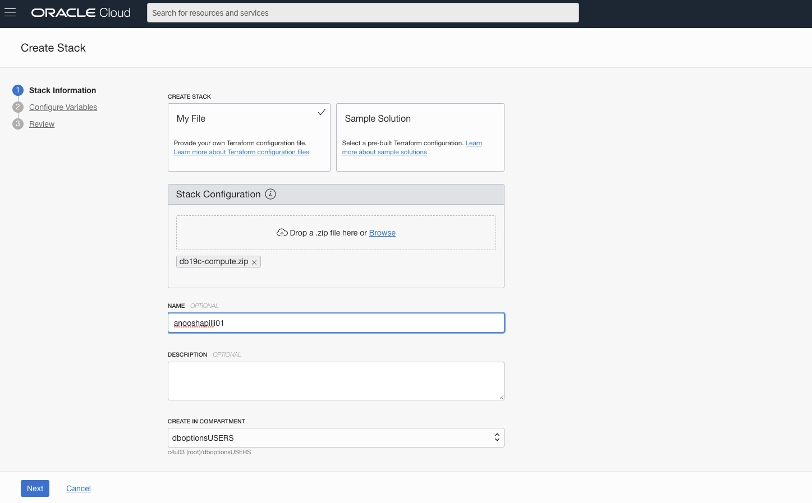
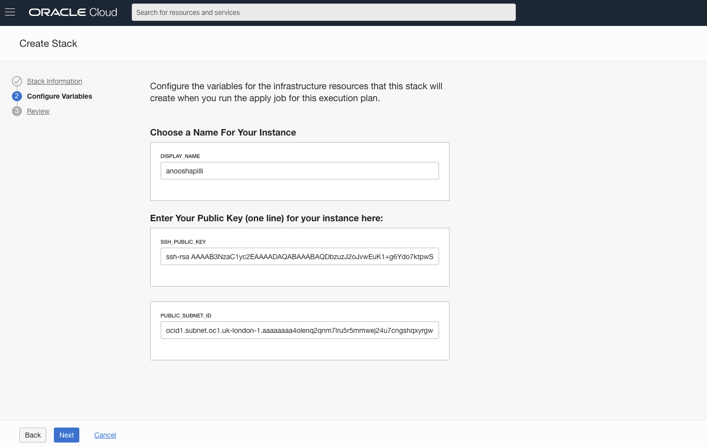
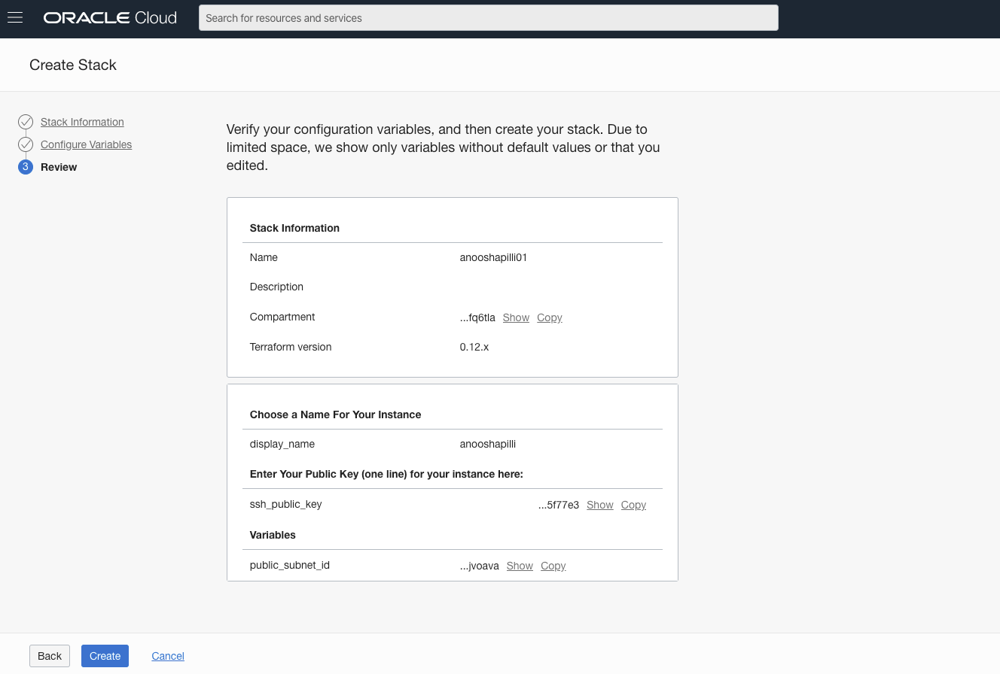
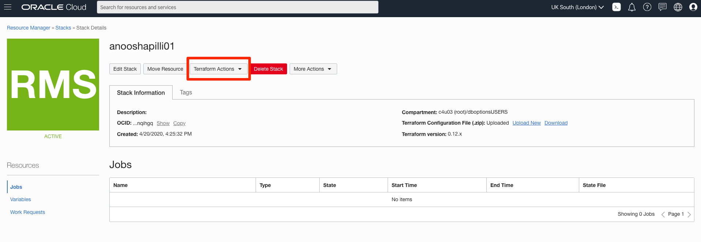
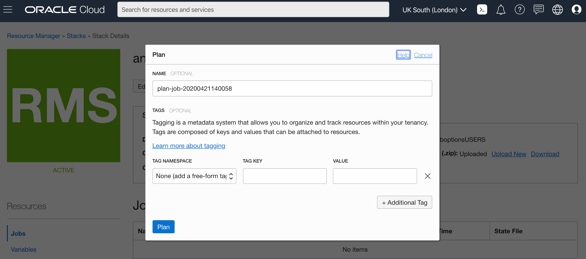
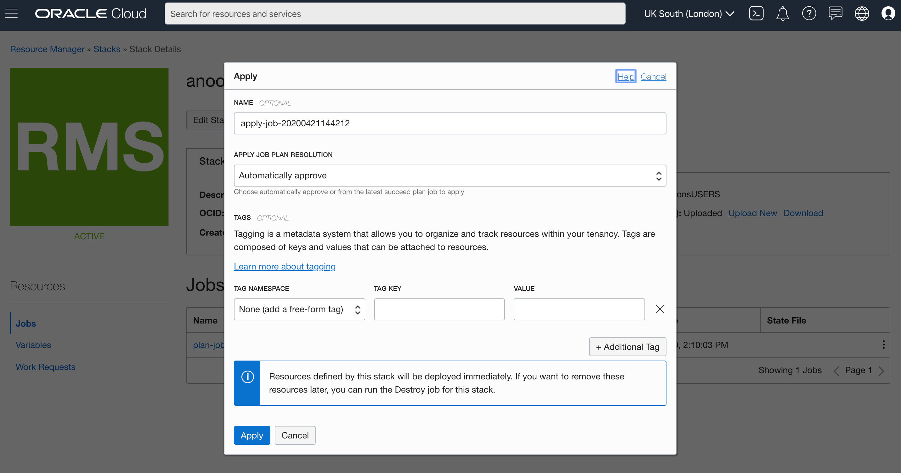
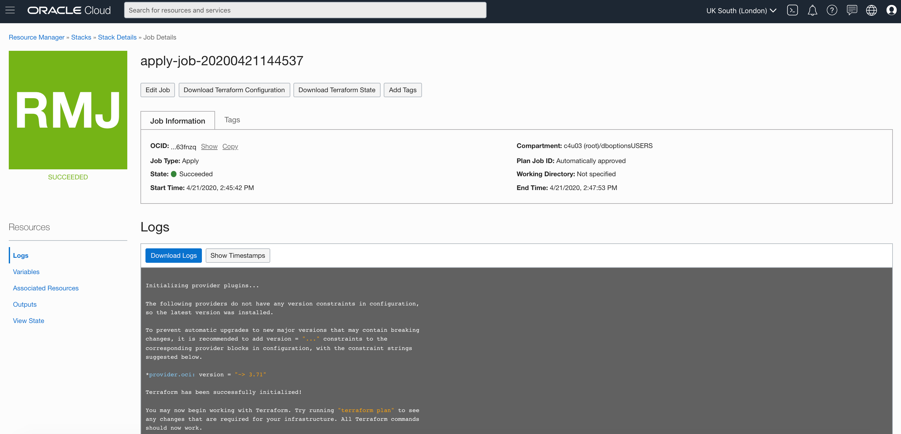
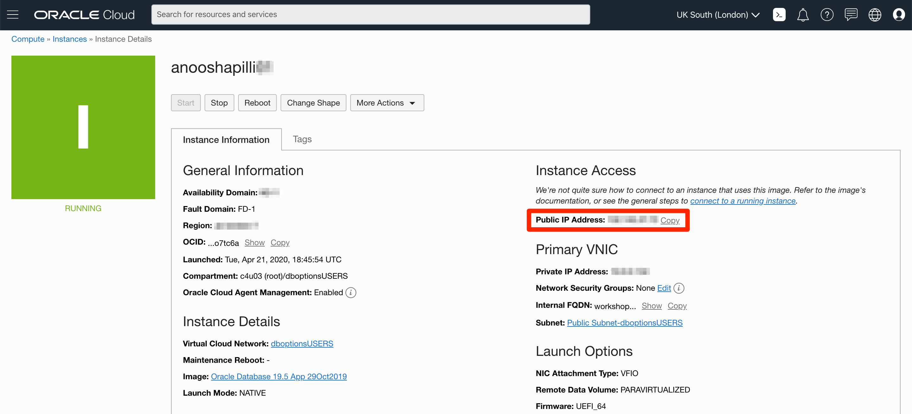
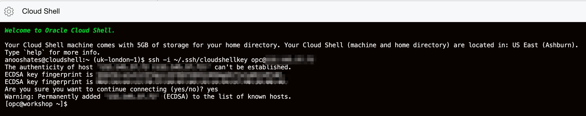

# Environment Setup

## Introduction

This lab will show you how to setup a Oracle Cloud network (VCN) and a compute instance running a pre-configured Oracle Database 19c install using Oracle Resource Manager and Terraform.

### About Terraform and Oracle Cloud Resource Manager

Terraform is a tool for building, changing, and versioning infrastructure safely and efficiently.  Configuration files describe to Terraform the components needed to run a single application or your entire datacenter.  In this lab a configuration file has been created for you to build network and compute components.  The compute component you will build creates an image out of Oracle's Cloud Marketplace.  This image is running Oracle Database 19c.

Resource Manager is an Oracle Cloud Infrastructure service that allows you to automate the process of provisioning your Oracle Cloud Infrastructure resources. Using Terraform, Resource Manager helps you install, configure, and manage resources through the "infrastructure-as-code" model. To learn more about OCI Resource Manager, take a watch the video below.

[](youtube:udJdVCz5HYs)

### Oracle Cloud Marketplace

The Oracle Cloud Marketplace is a catalog of solutions that extends Oracle Cloud services.  It offers multiple consumption modes and deployment modes.  In this lab we will be deploying the free Oracle Database 19c marketplace image.

Link to Marketplace - https://www.oracle.com/cloud/marketplace/

### Objectives

-   Setup a network and compute instance using the DB19c Marketplace image
-   Use Terraform and Resource Manager to complete the setup

### Lab Prerequisites

This lab assumes you have already completed the following labs:
- Login to Oracle Cloud
- Create SSH Keys

### Estimated Time

This lab takes approximately 10 minutes to complete.

## **Step 1**: Login and Create Stack using Resource Manager

1.  Click on the link below to download the Resource Manager zip file you need to build your enviornment.
    - [db19c-compute-v19-7.zip](https://objectstorage.us-ashburn-1.oraclecloud.com/p/k52Q1PBzZUsUlTUEKwdfN63LY9naMuiOA9QaK5naUHE/n/c4u03/b/labfiles/o/db19c-compute-v19-7.zip) - Packaged terraform instance creation script

2.  Save in your downloads folder.

3.  Open up the hamburger menu in the left hand corner. Choose **Resource Manager > Stacks**. Choose the **Compartment** from your email, click the  **Create Stack** button. *Note: If you are in a workshop, double check your region to ensure you are on the assigned region.*

    

    

    

    

4.  Click the **Browse** link and select the zip file (db19c-compute-v19-7.zip) that you downloaded. Click **Select** to upload the zip file.

    

    Enter the following information. Accept all the defaults and click **Next**.

    - **Name**:  Enter your firstname and lastname and the day you were born. *(Do not enter any special characters here, including periods, underscores, exclamation etc, it will mess up the configuration and you will get an error during the apply process.)*

    - **Description**:  Same as above

    - **Compartment**:  Select Compartment from Email 2

5.  Enter the following information and click **Next**. You will be updating Public Subnet, Display Name and SSH Key.

    

    **Public Subnet ID**:  Enter the subnet ID based on your region. The subnets are provided in Email 2 or an email from your Workshop Lead.

    **Display Name:** Enter your firstname and lastname and the day you were born. *(Do not enter any special characters here, including periods, it may mess up the configuration.)*

    **SSH Public Key**:  Paste the public key you created in the earlier step. *(Note: If you used the Oracle Cloud Shell to create your key, make sure you paste the pub file in a notepad, remove any hard returns.  The file should be one line or you will not be able to login to your compute instance)*

6.  Click **Create**.

    

7.  Your stack has now been created!  Now to create your environment. *Note: If you get an error about an invalid DNS label, go back to your Display Name, please do not enter ANY special characters or spaces. It will fail.*

    

## **Step 2**: Terraform Plan (OPTIONAL)

When using Resource Manager to deploy an environment, execute a terraform **Plan** to verify the configuration. This is an optional step in this lab.

1.  [OPTIONAL] Click **Terraform Actions** -> **Plan** to validate your configuration. Click **Plan**. This takes about a minute, please be patient.

    

    

    

    

## **Step 3**: Terraform Apply

When using Resource Manager to deploy an environment, execute a terraform **Plan** and **Apply**. Let's do that now.

1.  At the top of your page, click on **Stack Details**.  Click the button, **Terraform Actions** -> **Apply**. Click **Apply**. This will create your instance and install Oracle 19c. This takes about a minute, please be patient.

    

    

    

    

2.  Once this job succeeds, you will get an apply complete notification from Terraform.  Examine it closely, 1 resource has been added. Congratulations, your environment is created! Time to login to your instance to finish the configuration.

    

## **Step 4**: Connect to your Instance

Choose the environment where you created your ssh-key in the previous lab (Generate SSH Keys).

*NOTE 1:  If you are using your laptop to connect, you cannot connect while on VPN or in the Oracle office on clear-corporate (choose clear-internet). This does not apply to the Oracle Cloud Shell.*

*NOTE 2: The ssh-daemon may be disabled for the first 5 minutes or so while the instance is processing.  If you are unable to connect and certain you have a valid key, wait a few minutes and try again.*

### Oracle Cloud Shell

1.  To re-start the Oracle Cloud shell, go to your Cloud console and click the cloud shell icon to the right of the region. *Note: Make sure you are in the region you were assigned.*

    

2.  Go to **Compute** -> **Instances** and select the instance you created (make sure you choose the correct compartment).

    

3.  On your instance's homepage, copy the Public IP addresss for your instance to a notepad.

    

4.  Enter the command below and update it with your cloud shell key name and your instance's public IP addess to login to your instance.

    ````
    ssh -i ~/.ssh/<sshkeyname> opc@<Your Compute Instance Public IP Address>
    ````

5.  When prompted, answer **yes** to continue connecting.

    

6.  Continue to Step 5 on the left hand menu.

### MAC or Windows CYGWIN Emulator

1.  Go to **Compute** -> **Instances** and select the instance you created (make sure you choose the correct compartment).

2.  On the instance homepage, find the Public IP addresss for your instance.

3.  Open up a terminal (MAC) or cygwin emulator as the opc user.  Enter yes when prompted.

    ````
    ssh -i ~/.ssh/optionskey opc@<Your Compute Instance Public IP Address>
    ````

    

    

4.  After successfully logging in, proceed to Step 5.

### Windows using Putty

1.  Open up putty and create a new connection.

    ````
    ssh -i ~/.ssh/optionskey opc@<Your Compute Instance Public IP Address>
    ````

    

2.  Enter a name for the session and click **Save**.

    

3.  Click **Connection** > **Data** in the left navigation pane and set the Auto-login username to root.

4.  Click **Connection** > **SSH** > **Auth** in the left navigation pane and configure the SSH private key to use by clicking Browse under Private key file for authentication.

5.  Navigate to the location where you saved your SSH private key file, select the file, and click Open.  NOTE:  You cannot connect while on VPN or in the Oracle office on clear-corporate (choose clear-internet).

    

6.  The file path for the SSH private key file now displays in the Private key file for authentication field.

7.  Click Session in the left navigation pane, then click Save in the Load, save or delete a stored session Step.

8.  Click Open to begin your session with the instance.

## **Step 5**: Verify the ORCL Database is Up

1.  From your connected session of choice **tail** the **dbsingle.log** file. This file configures the database.

    ````
    <copy>
    tail -f /u01/ocidb/buildsingle1.log
    </copy>
    ````
    

2.  When you see the following message, the database setup is complete - **Completed successfully in XXXX seconds** (this may take up to 30 minutes). However certain labs may proceed without the entire database setup being finished.

    

3.  Run the following command to verify the database with the SID **ORCL** is up and running.

    ````
    <copy>
    ps -ef | grep ORCL
    </copy>
    ````

    

4. Verify the listener is running:

    ````
    <copy>
    ps -ef | grep tns
    </copy>
    ````

    

5.  Connect to the Database using SQL*Plus as the **oracle** user.

    ````
    <copy>
    sudo su - oracle
    sqlplus system/Ora_DB4U@localhost:1521/orclpdb
    exit
    </copy>
    ````

    

6.  To leave `sqlplus` you need to use the exit command. Copy and paste the text below into your terminal to exit sqlplus.

    ````
    <copy>
    exit
    </copy>
    ````

7.  Copy and paste the below command to exit from oracle user and become an `opc` user.

    ````
    <copy>
    exit
    </copy>
    ````

Congratulations! You now have a fully functional Oracle Database 19c instance (ORCL) running on Oracle Cloud Compute.

You may now proceed to the next lab.

## **Acknowledgements**

- **Author** - Kay Malcolm, Director, DB Product Management
- **Contributors** - Quintin Hill, Brian McGraw, Oracle North America Technology | Arabella Yao, Dylan McLeod, LiveLabs QA Team, DB Management
- **Last Updated By/Date** - Kay Malcolm, June 2020

## **See an issue?**
Please submit feedback using this [form](https://apexapps.oracle.com/pls/apex/f?p=133:1:::::P1_FEEDBACK:1). Please include the *workshop name*, *lab* and *step* in your request.  If you don't see the workshop name listed, please enter it manually. If you would like for us to follow up with you, enter your email in the *Feedback Comments* section.
