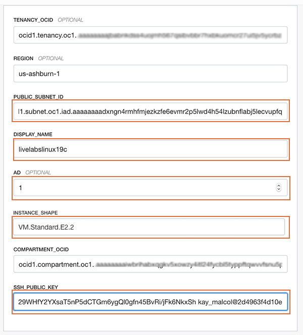

# Setup Compute Image

## Introduction
This lab will show you how to setup a Oracle Cloud network (VCN) and a compute instance for your workshop using Oracle Resource Manager.  

Estimated Lab Time:  30 minutes

### About Terraform and Oracle Cloud Resource Manager
Terraform is a tool for building, changing, and versioning infrastructure safely and efficiently.  Configuration files describe to Terraform the components needed to run a single application or your entire datacenter.  In this lab a configuration file has been created for you to build network and compute components.  The compute component you will build creates an image out of Oracle's Cloud Marketplace.  

Resource Manager is an Oracle Cloud Infrastructure service that allows you to automate the process of provisioning your Oracle Cloud Infrastructure resources. Using Terraform, Resource Manager helps you install, configure, and manage resources through the "infrastructure-as-code" model. To learn more about OCI Resource Manager, preview the video below.

[](youtube:udJdVCz5HYs)

### About Oracle Cloud Marketplace

The Oracle Cloud Marketplace is a catalog of solutions that extends Oracle Cloud services.  It offers multiple consumption modes and deployment modes.  

[Link to Marketplace](https://www.oracle.com/cloud/marketplace/)

### Objectives
In this lab, you will:
* Setup a VCN (Virtual Compute Network) using Resource Manager
* Setup a compute instance
* Login to your compute instance

### Prerequisites

This lab assumes you have:
- An Oracle Free Tier or Paid Cloud account
- Lab:  Generate SSH Keys

## **STEP 1**: Setup VCN Stack
If you already have a VCN created, skip this step and proceed to *STEP 3*.

1.  Login to your Oracle Cloud account
2.  Click the **Create a Stack** tile on the homepage.  You may also get to Resource Manager by clicking on the Hamburger **Menu** -> **Solutions and Platform** -> **Resource Manager**

3.  In the Browse Solutions window, select **Default VCN**.
    

4. Click the **Select Solution** button.
   
5.  Enter the name for your VCN:  **livelabsvcn**.  Click **next**.
   
6. Inspect and then accept all default values in the Configure Variables screen and click **Next**. 
   
7.  Review your selections and click **Next**
   

## **STEP 2**: Run VCN Stack Apply Job
Now that your stack has been created, you will run an *apply* job to create the actual VCN
1. Click on **Terraform Actions** to expose the drop down menu

2. Select **Apply**

3. Insepct the apply job, accept all defaults and click **Apply**

4. The VCN will immediately begin creation.

5. Once the apply job is complete, inspect the results.  

6. Scroll down the log.  You will notice that 6 objects were created:  A VCN, subnet, internet gateway, default security list, route table and dhcp options, each with their own Oracle Cloud ID (ocid).  We will focus on the subnet.  You will need this subnet information to create your compute instance

7. Copy the first subnet id to a notepad and save for the next step.  If you would like to further inspect the VCN, complete #s 8-12.  Otherwise skip to the next section.

8.  Click on the hamburger menu in the upper left corner of your browser.  Select **Networking**->**Virtual Cloud Networks**. 
9.  The VCN you created should be listed.  Click on the VCN you just created.
  
10.  On the VCN homepage notice the 3 subnets that were created.  Each subnet is tied to an Availability Domain.  Click on the first subnet that matches AD-1.
  
11.  Inspect the subnet homepage, find the OCID (Oracle Cloud ID).  Click **Copy**
  
12. Copy the subnet ID to a notepad.
        
   
## **STEP 3**: Setup Compute Stack 

Now that you have a network for your compute instance, it's time to create the compute instance.  

1.  Click on the link below to download the Resource Manager zip file you need to build your enviornment.  
    - [db19c-compute-livelabs.zip](https://objectstorage.us-ashburn-1.oraclecloud.com/p/xbuVfRwRZRhZCiGrsFOa3l_3mW3wyk3ZNl4pm7GzCak/n/c4u03/b/labfiles/o/db19c-compute-livelabs-v1.zip) - Packaged terraform instance creation script for creating instance running the 19c Oracle Database

2.  Save in your downloads folder.

3.  Open up the hamburger menu in the left hand corner.  Choose the compartment in which you would like to install.  Select **Resource Manager > Stacks**.  

    

    

    

4.  Click the **Browse** link and select the zip file (db19c-compute-livelabs.zip) that you downloaded. Click **Open**.

    

    

    Enter the following information:

    - **Name**:  Enter a name  (*DO NOT ENTER ANY SPECIAL CHARACTERS HERE*, including periods, underscores, exclamation etc, it will mess up the configuration and you will get an error during the apply process)

    - **Description**:  Same as above or leave blank

    Click **Next**

5.  Now, configure your instance.

    

    Enter the following information:

    **PUBLIC_SUBNET_ID** - Paste the subnet ocid you saved in your notepad here.

    **DISPLAY_NAME** - Enter a display name. This will be the display name for the compute instance you create.  

    **AD** - Choose availability domain 1 (or choose the AD that matches the subnet you chose)

    **SSH_PUBLIC_KEY**:  Paste the public key you created in the earlier lab *(Note: If you used the Oracle Cloud Shell to create your key, make sure you paste the pub file in a notepad, remove any hard returns.  The file should be one line or you will not be able to login to your compute instance)*

    *Accept all other defaults*

    Click **Next**.

6. After confirming the stack information and the variables are correct, click **Create**.

    

7.  Your stack has now been created!  You will now run the apply process in Resource Manager to create your DB19c instance.

    

## **STEP 4**: Run Compute Stack Apply Job

1.  At the top of your page, click on **Stack Details**.  Click the button, **Terraform Actions** -> **Apply**.  This will create your  instance that comes pre-installed Oracle 19c.
    

2.  Accept all defaults and click **Apply**
    

    

3.  Once this job succeeds, you will get an apply complete notification from Terraform.   Time to login to your instance to finish the configuration.

    

    

## **STEP 5**: Connect to your instance

There are multiple ways to connect to your cloud instance.  Choose the way to connect to your cloud instance that matches the SSH Key you generated.  *(i.e If you created your SSH Keys in cloud shell, choose cloud shell)*

- Oracle Cloud Shell
- MAC or Windows CYCGWIN Emulator
- Windows Using Putty
  
### Oracle Cloud Shell

1. To re-start the Oracle Cloud shell, go to your Cloud console and click the cloud shell icon to the right of the region.  *Note: Make sure you are in the region you were assigned*

    

2.  Go to **Compute** -> **Instance** and select the instance you created (make sure you choose the correct compartment)
3.  On the instance homepage, find the Public IP addresss for your instance.

    
4.  Enter the command below to login to your instance.    
    ````
    ssh -i ~/.ssh/<sshkeyname> opc@<Your Compute Instance Public IP Address>
    ````

    *Note: The angle brackets <> should not appear in your code.*
5.  When prompted, answer **yes** to continue connecting.
6.  Continue to STEP 5 on the left hand menu.

### MAC or Windows CYGWIN Emulator
1.  Go to **Compute** -> **Instance** and select the instance you created (make sure you choose the correct compartment)
2.  On the instance homepage, find the Public IP addresss for your instance.

3.  Open up a terminal (MAC) or cygwin emulator as the opc user.  Enter yes when prompted.

    ````
    ssh -i ~/.ssh/<sshkeyname> opc@<Your Compute Instance Public IP Address>
    ````
    

    

    *Note: The angle brackets <> should not appear in your code.*

4.  After successfully logging in, proceed to STEP 5.

### Windows using Putty

1.  Open up putty and create a new connection.

    ````
    ssh -i ~/.ssh/<sshkeyname> opc@<Your Compute Instance Public IP Address>
    ````
    

    *Note: The angle brackets <> should not appear in your code.*

2.  Enter a name for the session and click **Save**.

    

3. Click **Connection** > **Data** in the left navigation pane and set the Auto-login username to root.

4. Click **Connection** > **SSH** > **Auth** in the left navigation pane and configure the SSH private key to use by clicking Browse under Private key file for authentication.

5. Navigate to the location where you saved your SSH private key file, select the file, and click Open.  NOTE:  You cannot connect while on VPN or in the Oracle office on clear-corporate (choose clear-internet).

    

6. The file path for the SSH private key file now displays in the Private key file for authentication field.

7. Click Session in the left navigation pane, then click Save in the Load, save or delete a stored session STEP.

8. Click Open to begin your session with the instance.

## **STEP 6**: Verify the ORCL database is up

1.  From your connected session of choice **tail** the **dbsingle.log** file.  This file configures the database.
    ````
    <copy>
    tail -f /u01/ocidb/buildsingle1.log
    </copy>
    ````
    

2.  When you see the following message, the database setup is complete - *Completed successfully in XXXX seconds* (this may take up to 30 minutes).  However certain labs may proceed without the entire database setup being finished.

    

3. Run the following command to verify the database with the SID **ORCL** is up and running

    ````
    <copy>
    ps -ef | grep ORCL
    </copy>
    ````

    


4. Verify the listener is running
    ````
    <copy>
    ps -ef | grep tns
    </copy>
    ````

    

5.  Connect to the Database using SQL*Plus as the **oracle** user.

    ````
    <copy>
    sudo su - oracle
    sqlplus system/Ora_DB4U@localhost:1521/orclpdb
    exit
    </copy>
    ````

    

Congratulations!  You now have a fully functional Oracle Database 19c instance (ORCL) running on Oracle Cloud Compute.  

You may now *proceed to the next lab*. 

## Acknowledgements
- **Author** - Kay Malcolm, Director, DB Product Management
- **Contributors** - Anoosha Pilli, Sanjay Narvekar, David Start, Arabella Yao
- **Last Updated By/Date** - Kay Malcolm, July 2020

## See an issue?
Please submit feedback using this [form](https://apexapps.oracle.com/pls/apex/f?p=133:1:::::P1_FEEDBACK:1). Please include the *workshop name*, *lab* and *STEP* in your request.  If you don't see the workshop name listed, please enter it manually. If you would like us to follow up with you, enter your email in the *Feedback Comments* section.    Please include the workshop name and lab in your request.
