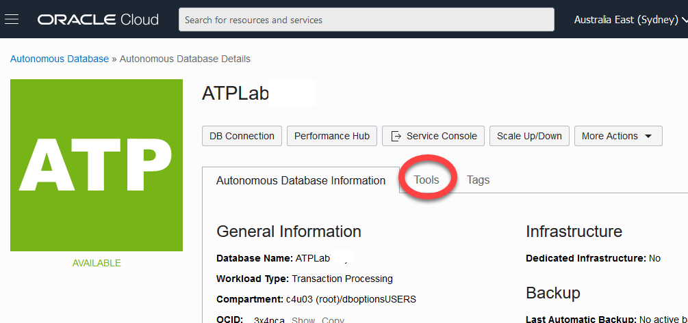
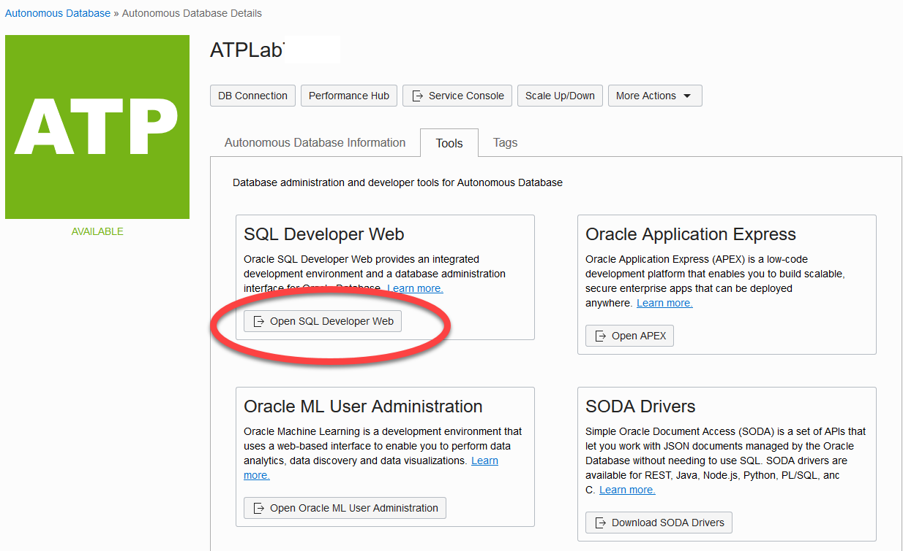
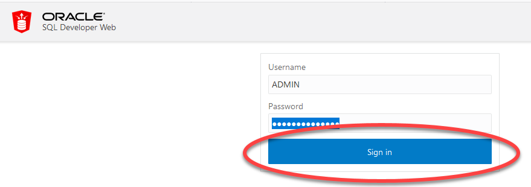
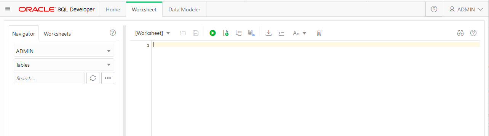

# Connect to ADB
## Introduction
Included with Oracle REST Data Services, Oracle SQL Developer Web is the web-based version of Oracle SQL Developer that enables you to execute queries and scripts, create database objects, build data models, and monitor database activity.

Oracle SQL Developer Web runs in Oracle REST Data Services and access to it is provided through schema-based authentication. To use Oracle SQL Developer Web, you must sign in as a database user whose schema has been enabled for SQL Developer Web.

In Oracle Autonomous Database databases, the ADMIN user is pre-enabled for SQL Developer Web.

Estimated time: 5 minutes

## **STEP 1**: Connect to your Autonomous Database using SQL Developer Web

1. From the ADB Details page, select the Tools tab

2. The Tools page provides you access to SQL Developer Web, Oracle Application Express, and Oracle ML User Administration. In the SQL Developer Web box, click **Open SQL Developer Web**.

3. A sign in page opens for SQL Developer Web. Sign in with the database instance's default administrator account, ADMIN, with the admin password you specified when creating the database. Click Sign in.

4. SQL Developer Web opens on a worksheet tab. The first time you open SQL Developer Web, a series of pop-up informational boxes introduce the main features.

## Conclusion
 You are now connected to your Autonomous Database using SQL Developer Web.

## **Acknowledgements**

 - **Author** - Troy Anthony, Database Product Management, May 2020
 - **Contributors** - Oracle LiveLabs QA Team (Arabella Yao, Product Manager Intern | Jaden McElvey, Technical Lead | Ayden Smith, Intern)
 - **Last Updated By/Date** - Troy Anthony, May 20 2020

## Need Help?
Please submit feedback or ask for help using our [LiveLabs Support Forum](https://community.oracle.com/tech/developers/categories/database-19c). Please click the **Log In** button and login using your Oracle Account. Click the **Ask A Question** button to the left to start a *New Discussion* or *Ask a Question*.  Please include your workshop name and lab name.  You can also include screenshots and attach files.  Engage directly with the author of the workshop.

If you do not have an Oracle Account, click [here](https://profile.oracle.com/myprofile/account/create-account.jspx) to create one.
