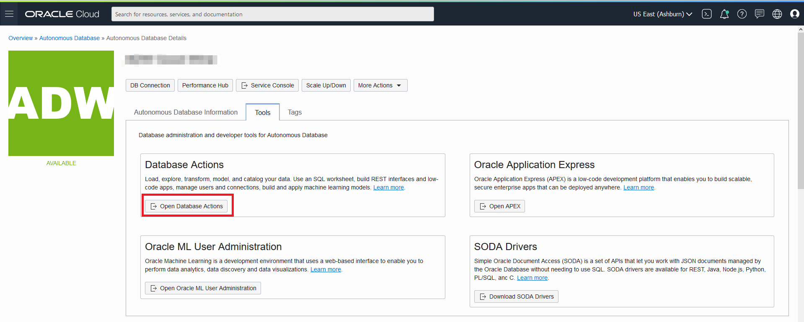

# Connect to ADB
## Introduction
Included with Oracle REST Data Services, Oracle SQL Developer Web is the web-based version of Oracle SQL Developer that enables you to execute queries and scripts, create database objects, build data models, and monitor database activity.

Oracle SQL Developer Web runs in Oracle REST Data Services and access to it is provided through schema-based authentication. To use Oracle SQL Developer Web, you must sign in as a database user whose schema has been enabled for SQL Developer Web.

In Oracle Autonomous Database databases, the ADMIN user is pre-enabled for SQL Developer Web.

Estimated time: 5 minutes

## **STEP 1**: Connect to your Autonomous Database using SQL Developer Web

1. From the ADB Details page, select the Tools tab

2. The Tools page provides you access to Database Actions, Oracle Application Express, and Oracle ML User Administration. In the Database Actions box, click **Open Database Actions**.

3. A sign in page opens for Database Actions. Sign in with the database instance's default administrator account, **Username - ADMIN**, click **Next** and with the admin password you specified when creating the database. Click **Sign in**.

4. From the Database Action menu, select **SQL**.

5. SQL Developer Web opens on a worksheet tab. The first time you open SQL Developer Web, a series of pop-up informational boxes introduce the main features.

## Conclusion
 You are now connected to your Autonomous Database using SQL Developer Web.

## Acknowledgements

 - **Author** - Troy Anthony, Database Product Management, May 2020
 - **Contributors** - Anoosha Pilli, Product Manager
 - **Last Updated By/Date** - Anoosha Pilli, June 2021
