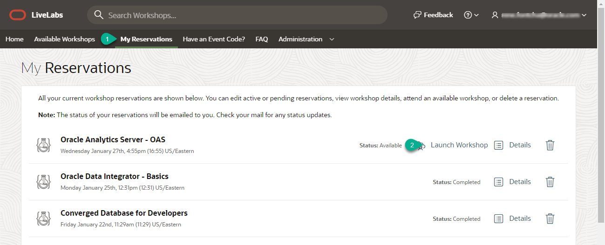
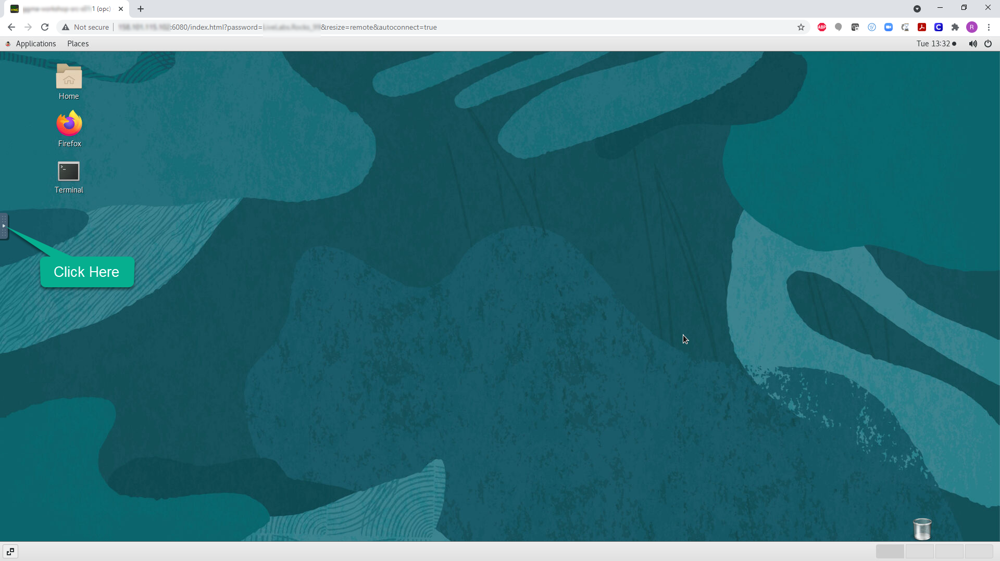
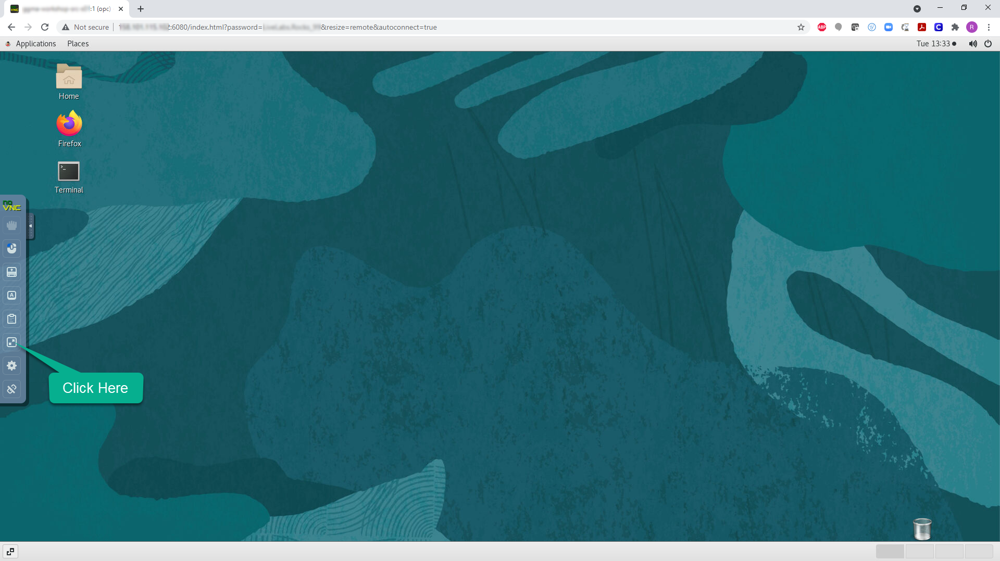

# Verify Compute Instance Setup

## Introduction
This lab will show you how to login to your pre-created compute instance running on Oracle Cloud.

*Estimated Lab Time*: 10 minutes

### Objectives
In this lab, you will:
- Learn how to connect to your compute instance using Remote Desktop

### Prerequisites

This lab assumes you have:
- A LiveLabs Cloud account and assigned compartment
- The IP address and instance name for your Compute instance
- Successfully logged into your LiveLabs account

## **STEP 1:** Access the Graphical Remote Desktop
For ease of execution of this workshop, your VM instance has been pre-configured with a remote graphical desktop accessible using any modern browser on your laptop or workstation. Proceed as detailed below to login.

1. Now that your instance has been provisioned, navigate to ***My Reservations***, find the request you submitted from the list displayed (only one item will be displayed if this is your first request).

   

2. Click on ***Launch Workshop***

3. Click on *Remote Desktop* link.

    

    This should take you directly to your remote desktop in a single click.

    

    *Note:* While rare, you may see an error titled “*Deceptive Site Ahead*” or similar depending on your browser type as shown below.

    Public IP addresses used for LiveLabs provisioning comes from a pool of reusable addresses and this error is due to the fact that the address was previously used by a compute instance long terminated, but that wasn't properly secured, got compromised and was flagged.

    You can safely ignore and proceed by clicking on *Details*, and finally on *Visit this unsafe site*.

    

## **STEP 2:** Access Your Workshop Guide

1. Two application windows with at least one for *Firefox* browser should already be opened on your first access, If not, click on the *Firefox* browser icon from the remote desktop to launch.

    

2. Depending on your workshop, you may have one or two browser windows loaded. The guide is shown on the left window and the content can be one of the following:  

    - The source images is used by multiple workshop listings, e.g. *Database Security* workshop VM.

    The landing page provides instructions on how to open the right guide for your workshop.

    

    - The source image is dedicated to a single workshop listing, e.g. *OIG One Hop Upgrade*

    The guide is preloaded.

    

## **STEP 3:** Enable Full-screen Display
For seamless desktop integration and to make the best use of your display, perform the following tasks to render your remote desktop session in fullscreen mode.

1. Click on the small gray tab on the middle-left side of your screen to open the control bar.

    

2. Select *Fullscreen* to render the session on your entire screen.

    
    

<!-- ## **STEP 4:** Enable Copy/Paste from Local to Remote Desktop
During the execution of your labs you may need to copy text from your local PC/Mac to the remote desktop. While such direct copy/paste isn't supported as you will realize, you may proceed as indicated below to enable an alternative local-to-remote clipboard with Input Text Field.

1. Continuing from the last task above, Select the *clipboard* icon

    

2. Copy some text from your local computer as illustrated below and paste into the clipboard widget, then finally open up the desired application (e.g. Terminal) and paste accordingly using *mouse controls*

    

    *Note:* Please make sure you initialize your clipboard with step [1] shown in the screenshot above before opening the target application in which you intend to paste the text. Otherwise will find the *paste* function in the context menu grayed out when attempting to paste for the first time. -->

You may now [proceed to the next lab](#next).

## Acknowledgements
* **Author** - Rene Fontcha, LiveLabs Platform Lead, NA Technology
* **Contributors** - Kay Malcolm
* **Last Updated By/Date** - Rene Fontcha, LiveLabs Platform Lead, NA Technology, July 2021
