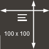

# Provision an Instance

## Introduction

*Describe the lab in one or two sentences, for example:* This lab walks you through the steps to ...

Estimated Lab Time: &lt;n&gt; minutes


*This is the "fold" - below items are collapsed by default*

## **STEP 1**: Conditional Text Test

Step 1 opening paragraph.

1. **Conditional content test:** Select your compartment. <if type="livelabs">**LiveLabs only:** If you are using a LiveLabs environment, be sure to select the compartment provided by the environment. Leave Always Free unchecked,</if><if type="freetier">**FreeTier Only:** Choose any compartment, select "Always Free",</if> and enter `SecretPassw0rd` for the ADMIN password, then click **Create Autonomous Database**.

    <!-- comment -->

    
    <if type="livelabs"></if>
    <if type="freetier"></if>
    

<if type="livelabs">
2. Steps 2 - 4 are for **LiveLabs** only. This test will show if the numbering is modified automatically. Sub step 2 with image and link to the text description below. The `sample1.txt` file must be added to the `files` folder.

    

3. Ordered list item 3 with the same image but no link to the text description below.

    

4. Example with inline navigation icon  click **Navigation**.
</if>

5. This step should be 2 if type is not `livelabs`. One example with bold **text**.

   If you add another paragraph, add 3 spaces before the line.

6. Links to external files

   To create a link to local file you want the reader to download, use this format:

   Download the [starter file](files/starter-file.sql) SQL code.

   *Note: do not include zip files, CSV, PDF, PSD, JAR, WAR, EAR, bin or exe files - you must have those objects stored somewhere else. We highly recommend using Oracle Cloud Object Store and creating a PAR URL instead. See [Using Pre-Authenticated Requests](https://docs.cloud.oracle.com/en-us/iaas/Content/Object/Tasks/usingpreauthenticatedrequests.htm)*

## **STEP 2:** Code samples with variables

1. Code examples - test pattern for `< and >` characters

    ```
    Not included in the copy: <copy>This code example contains a <variable> using the less-than and greater-than symbols</copy>
    ```

    ```
    Not included in the copy: <copy>This code example contains a &lt;variable&gt; that uses the escaped characters</copy>
    ```

## **STEP 3**: Images

1. Sample inline image that is 100 x 100 pixels  (max size for an in-line image)

2. Image and link to the text description below. The `sample1.txt` file must be added to the `files` folder.

    

3. 1200 pixel wide Image with a title.

    

3. 1200 pixel wide Image without a title (no " ")

    

4. Example with inline navigation icon  click **Navigation**.

*At the conclusion of the lab add this statement:*
You may proceed to the next lab.

## Learn More

*(optional - include links to docs, white papers, blogs, etc)*

* [URL text 1](http://docs.oracle.com)
* [URL text 2](http://docs.oracle.com)

## Acknowledgements
* **Author** - <Name, Title, Group>
* **Adapted for Cloud by** -  <Name, Group> -- optional
* **Last Updated By/Date** - <Name, Group, Month Year>
* **Workshop (or Lab) Expiry Date** - <Month Year> -- optional, use this when you are using a Pre-Authorized Request (PAR) URL to an object in Oracle Object Store.

## See an issue?
Please submit feedback using this [form](https://apexapps.oracle.com/pls/apex/f?p=133:1:::::P1_FEEDBACK:1). Please include the *workshop name*, *lab* and *step* in your request.  If you don't see the workshop name listed, please enter it manually. If you would like for us to follow up with you, enter your email in the *Feedback Comments* section.
