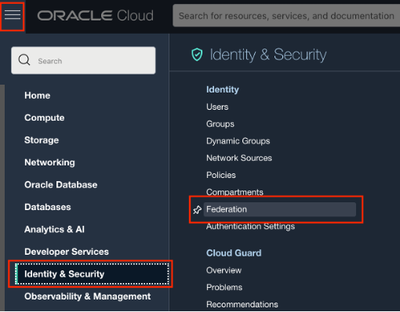
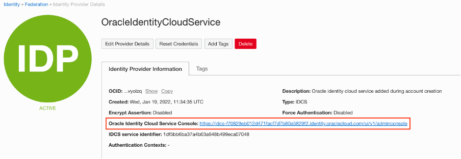
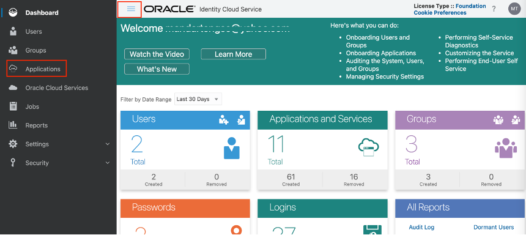
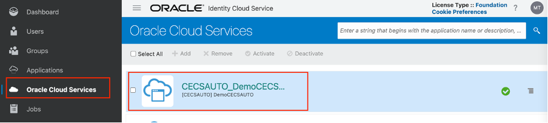
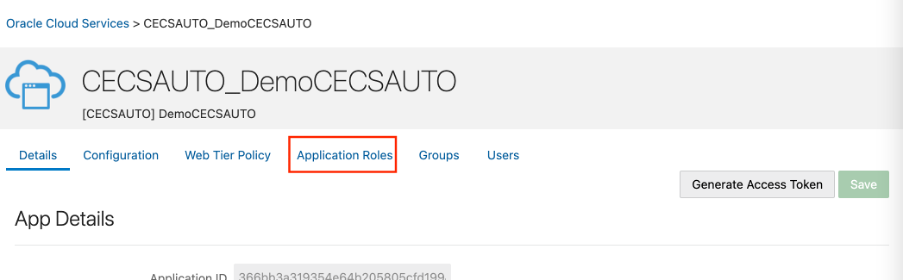
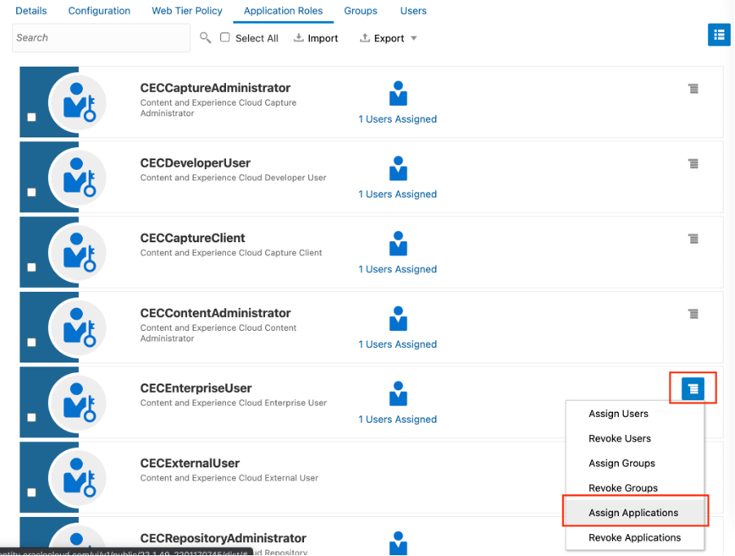
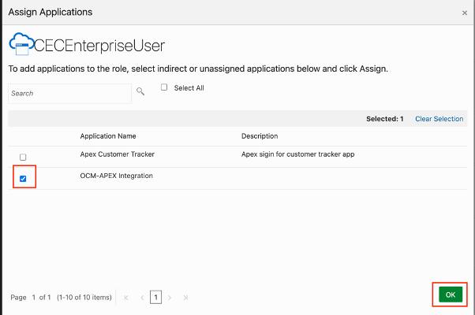

# Setup an OCM Instance

## Introduction

This lab walks you through the process of provisioning an instance of Oracle Content Management, assuming you don't already have one available to you. If you do, you can skip this lab and move on to the next one.

Estimated Time: 10 minutes

### Background
The Oracle Content Management **Starter Edition** offers a free content service tier with a limited feature set and limits on the number of users, assets, sites, and other items. However, it's sufficient to work with Oracle Content Management out of the box.

To take advantage of the full feature set and to increase the number of users and other items, [upgrade to the Premium Edition](https://docs.oracle.com/en/cloud/paas/content-cloud/administer/starter-vs-premium-edition.html).

For comparison of the features and limits in the Starter Edition vs. the Premium Edition, refer [documentation](https://docs.oracle.com/en/cloud/paas/content-cloud/administer/starter-vs-premium-edition.html).

### Objectives

In this lab, you will:
* Provision Oracle Content Management (Starter Edition)
* Create IDCS App for Integration(API Call)
* Associate IDCS App with OCM Instance

### Prerequisites

This lab assumes you have:
* This lab requires completion of the Getting Started section in the Contents menu on the left.

## Task 1: Create an instance of Oracle Content Management

1. Log into your Oracle Cloud account. From any browser go to [https://cloud.oracle.com/en_US/sign-in](https://cloud.oracle.com/en_US/sign-in)

  Enter Cloud **Account Name** in the input field and click the **Next** button
	
  

2. Select **oracleidentityservice** and click **Continue** button

    

3. Enter your **User Name** and **Password** in the input fields and click **Sign In** button

  

4. After successful login click the navigation menu icon from left upper corner. From the menu click **Developer services** and then **Content Management – Overview** 

  

5. Click **Create Instance** . If compartment is not selected by default for you then first you need to select **Compartment** <your tenancy>(root) from dropdown.

  

6. Enter following details and Click **Create Instance**
    * **Instance** name as Demo
    * select your **Compartment**
    * Enter your email address for **Notification Email**
    * Select **License Type** as **Starter Edition**

    

7. Wait till your instance provision is completed as shown below
  
  

8. Click **Demo** (Instance Name) and click **Open Instance**
  
  

9. Bookmark the URL (https://<your-tenancy-specific-id>.oraclecloud.com/   documents/home) as it’s your OCM instance URL for future login.

  

## Task 2: Create IDCS app for integrating OCM & APEX

1. Assuming you are already logged in to https://cloud.oracle.com , Click side navigation menu to select **Identity & Service** and then click **Federation**

  

2. Click **OracleIdentityService** as shown below

  

3. Click **Oracle Identity Cloud Service Console**  link

  

4. You will land on IDCS Dashboard page. Click side menu bar and then click Applications

  

5.	Click  to create new application

6.	Select **Confidential Application** from the list 

7.	In the **App Detail** section, enter below details

    * Name: OCM-APEX Integration
    * Description : App to call OCM API from APEX

8. Click **Next**

9. Select **Configure this application as a client now**

10. In the Authorization section choose **Allowed Grant** Types as **Client Credentials**

11.	Scroll to section **Token Issuance policy** and click **Add Scope**

  

12.	From the list select the OCM instance created by you, it will be named like **CECSAUTO_<Your InstanceName>CECSAUTO**. For example below is the instance created above with name **Demo** and highlighted row is corresponding to that

  

13.	Select the below highlighted scope ending with **urn:opc:cec:all** and click **Add**

  

14. Click **Next**

15.	Click **Next** to Skip for later (Expose APIs to Other Applications)

16.	Click **Next** to Skip for later (Web Tier Policy)

17.	Click **Finish** on Authorization (Do not check Enforce Grans as Authorization)

18.	Copy the **Client ID** and **Client Secret** to a text editor and save for later

19.	Click the **Close** button

20.	Click the **Activate** button on the top right

21.	Click the **Activate Application** button at the Activate Application prompt to confirm. 

## Task 3: Assign OCM roles to IDCS App

1.	Click **Oracle Cloud Services** from side menu and then click your application name. The name of application will follow pattern **CECSAUTO_**\<Your InstanceName>**CECSAUTO**

  

2.	Click **Application Roles** as shown below

  

3.	Select the role **CECEnterpriseUser** and then click the icon on right side as shown below. Select **Assign Applications**

  

4.	Search for your IDCS application created in previous task **OCM-APEX Integration** and then click **OK**

  

5.	Repeat above step 3 & 4 for roles **CECContentAdministrator** & **CECRepositoryAdministrator**

  *Note: You will use this IDCS application later while assigning access to repository. Sometime it take approx 45min before it's visible as member in OCM*

## Summary

This completes this lab. At this point, you know how to create a new Oracle Content Management instance and create an IDCS app. Click on **Lab 2: Setup an APEX Instance** to provision Oracle Autonomous Transaction Processing instance and create an APEX workspace within it.

## Learn

* [Deploy Oracle Content Management](https://docs.oracle.com/en/cloud/paas/content-cloud/administer/create-instance-infrastructure-console.html)
* [Administrative Interface](https://docs.oracle.com/en/cloud/paas/content-cloud/administer/administrative-interfaces.html)

## Acknowledgements

* **Author** - Vinay Kumar, Director - Product Management, Oracle Content Management
* **Last Updated By/Date** - Vinay Kumar, Feb 2022
