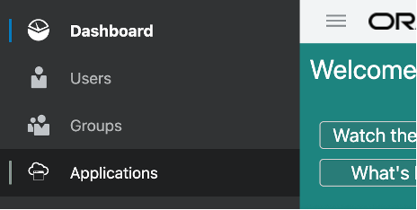
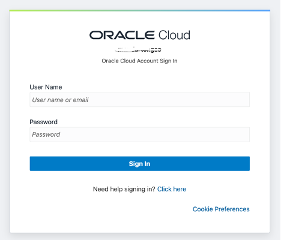
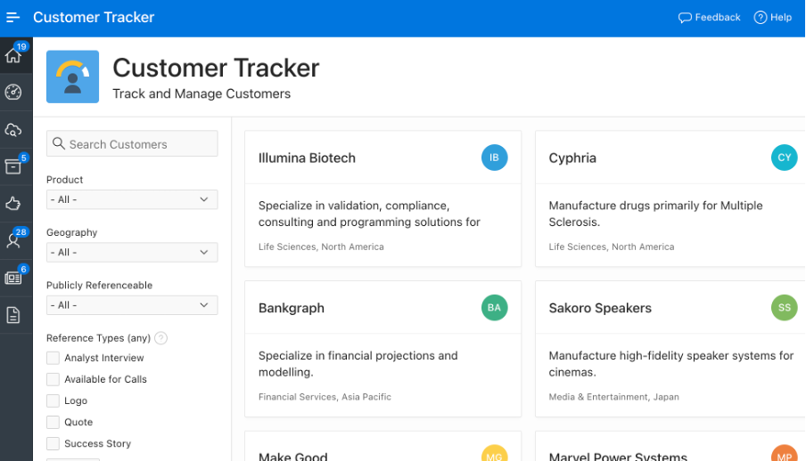

# Setup Oracle APEX sample application

## Introduction

*Describe the lab in one or two sentences, for example:* This lab walks you through the steps to ...

Estimated Lab Time: 10 minutes

### Objectives

In this lab, you will:
* Import Sample APEX application
* Create IDCS app for SSO
* Configure SSO Security
* Verify Sample Application

### Prerequisites

This lab assumes you have:
* An Oracle account
* All previous labs successfully completed

## Task 1: Import Customer Tracker sample application

1.	Select “Import” from the option available on home page after login

	

2. Drag & drop the Apex application file **CustomerTracker.zip**  and click **Next**. Choose file type as **Database Application, Page or Component Export**

  

3.	Screen will show you **File Import Confirmation** stage, just click **Next**

4.	In next stage of **Install Database Application** , choose **Reuse Application ID 100 from Export file** for Install as Application. (We are reusing application ID so that you can refer the application URL as is at other places in the document. If you already have application and you can choose “Auto Assign Application ID. In that case remember to change Application id in URL where it’s referred)
  

5.	Finally click **Install Application** and wait for next screen

6.	Keep Clicking **Next** till you get last button with **Install**
 

7. You will get below confirmation scree. Click **Edit Application** to complete this lab
  

## Task 2: Create IDCS application for SSO

1.	Login to IDCS console (Refer Lab 1 – Task 2.3)

2.	Navigate to **Applications** from left side menu
  

3.	Click    to create new application

4.	Select **Confidential Application** from the list

5.	In the “App Detail” section, enter below details
    * **Name** : Apex Customer Tracker
    * **Description** : APEX Sign in for Customer Tracker App
    * **Application URL** : \<paste your APEX application URL> like https://<your-instance-specific-value>.oraclecloudapps.com/ords/f?p=100

    *(**Note**: p=100 if you are assigning the same App ID while importing the app, otherwise provide the app if of your APEX application.)*

6.	Click **Next**

7.	Select **Configure this application as a client now**

8.	In the Authorization section complete the following:
    *	Allowed Grant Types: check "Authorization Code”
    * Redirect URL: https://<your-instance-specific-value>.oraclecloudapps.com/ords/apex_authentication.callback
    * Logout URL : Leave blank
    * Post Logout Redirect URL : https://\<your-instance-speicifc-value>.oraclecloudapps.com/ords/f?p=100

9.	Click **Next**

10.	Click **Next** to Skip for later (Expose APIs to Other Applications)

11.	Click Next to Skip for later  (Web Tier Policy)

12.	Click **Finish** on Authorization (Do not check Enforce Grans as Authorization).

13.	Copy the **Client ID** and **Client Secret** to a text editor and save for later.

14.	Click the **Close** button.

15.	Click the **Activate** button on the top right.

16.	Click the A**ctivate Application** button at the Activate Application prompt to confirm. You will have screen like below

## Task 3: Configure APEX App security for SSO

1.	Login to APEX and click **App builder** icon . You will see the application (Customer Tracker) which was created in earlier lab. Click the application name.

2.	Click **Share Components**

3.	Click **Web Credentials** under **Security**

4.	Click **IDCS Web Credentials**

5.	Provide Client ID & Client Secret which you got while creating IDCS application **APEX Customer Tracker**

6.	Click **Apply Change**

7.	Go back to **Share Component** and select **Authentication Schemes**

8.	Click **IDCS Authentication Scheme – Current** and then click **Show All**

9.	Change below fields
      * Settings > Discovery URL : https://\<your-idcs-url>.oraclecloud.com/.well-known/openid-configuration
      * Post-Logout URL > Go To URL : https://\<your-apex-url>.oraclecloudapps.com/ords/f?p=100

10.	Click **Apply Changes**

## Task 4: Login & verify IDCS integration

1.	Login to APEX application & click **App Builder** icon.

2.	Click **Customer Tracker** application from the list of applications

3.	Click  icon from the top right side of the page as shown below

4.	You should see the IDCS login page as below. Login with your Oracle cloud credentials. 

5.	You will see below screen after successful login

6.	Click **Complete Setup** button at the bottom of page. This should take you to Customer Tracker application’s dashboard page.

7.	Congratulations, you have successfully completed this lab.

## Learn More

*(optional - include links to docs, white papers, blogs, etc)*

* [URL text 1](http://docs.oracle.com)
* [URL text 2](http://docs.oracle.com)

## Acknowledgements
* **Author** - <Name, Title, Group>
* **Contributors** -  <Name, Group> -- optional
* **Last Updated By/Date** - <Name, Month Year>
