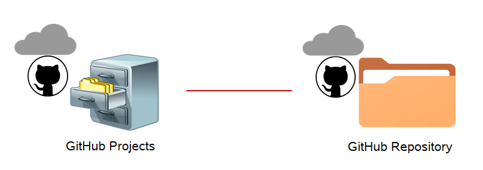
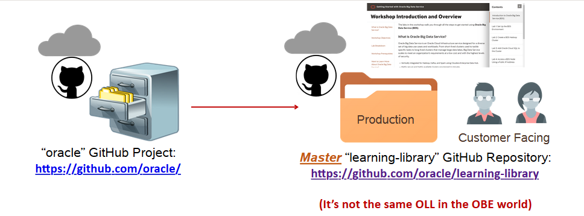
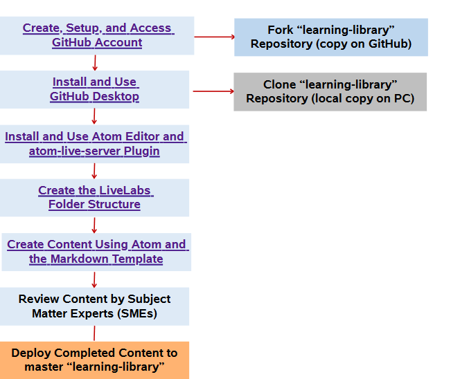

# Lab1: Introduction to Labs and Workshops                                   

The labs in this workshop walk you through all the steps to **develop labs and workshops**

## What are Labs and Workshops
A lab is a new model adopted by the DB organization to enhance the tutorial experience. Labs are what we all commonly know as Oracle by example (OBE). Labs (also called Livelabs) can be combined to form a workshop, formerly known as Hands-on Lab or HOL, or a Learning Path.

An individual Markdown (.md) file is called a lab.
A collection of labs is called workshop.

## GitHub Projects and Repositories
* GitHub is organized by projects.
* Each project has its own repository (commonly referred to as repo) that is accessed
through a unique URL.

## 'Oracle' GitHub Project and “learning-library” Repository

## GitHub Workflow
The following flow chart shows the process that your need to follow to set up the environment for developing labs and workshops.

The following diagram explains the process of setting up the GitHub environment, creating a forked (duplicate) copy of the production oracle/learning-library repository to your GitHub account, and cloning your forked repository to your local machine.

## Workshop Objectives
  - Set Up the GitHub Environment and Installing GitHub Desktop Client
  - Fork Learned-Library Content
  - Clone your Forked Library
  - Understand the Live Labs Folder Structure
  - Use Atom Editor to Develop Content
  - Perform GitHub Operations to Commit your Developed Contents
  - Host the labs on OHC

## Lab Breakdown
- **Lab 1:** Introduction to Labs and Workshops
- **Lab 2:** Get Started with Git and Set up the Environment
- **Lab 3:** Understand the Folder Structure
- **Lab 4:** Use Atom Editor and Live Server to Develop Content
- **Lab 5:** Use GitHub to Commit to Git Repository (Git Web UI)
- **Lab 6:** Add GitHub Hosted Labs to OHC

## What's Next

  **You are all set to begin the labs! Click Lab 2: Get Started with Git and Set up the Environment in the Contents menu on the right.**

## Want to learn more about labs and workshops?
  Use these links to get more information about Labs and Workshops:
  * [Glossary of Terms](https://confluence.oraclecorp.com/confluence/display/DBIDDP/Glossary+of+terms)

## Acknowledgements

* **Author:**
    * Anuradha Chepuri, Principal User Assistance Developer, Oracle GoldenGate
* **Contributors:**
    * Lauran Serhal, Principal User Assistance Developer, Oracle Database and Big Data User Assistance

* **Reviewed by:**  
    * Aslam Khan, Senior User Assistance Manager, ODI, OGG, EDQ
    * Tom McGinn, Database and Database Cloud Service Senior Principal Product Manager, DB Development - Documentation
* **Last Updated By/Date:** Anuradha Chepuri, October 2020

## See an issue?  
Please open a request [here](https://github.com/oracle/learning-library/issues).  Include the workshop name and lab in your request.
