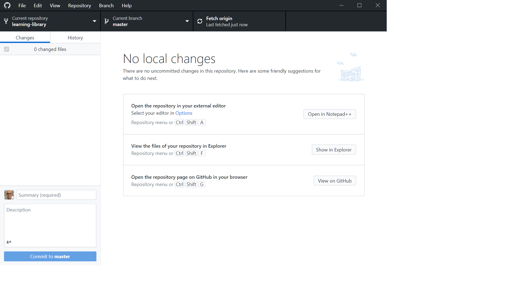

#  Get Started with Git and Set up the GitHub Environment

## Introduction

In this lab, you will learn how to create a GitHub Account and add it to Oracle organization, set up the GitHub Development Environment, and install GitHub Desktop.

### Objectives

* Create a GitHub Account
* Add the GitHub Account to Oracle organization
* Set up the GitHub Environment
* Install GitHub Desktop Client
### What Do You Need?

* A fair knowledge of GitHub Web UI and the GitHub Desktop client
* Prior knowledge of any HTML editor is an advantage.

## **STEP 1:** Download and Install the latest version of Git
1. Install Git for your operating system from the [Git download site] (https://git-scm.com/downloads).
2. Click the required option under **Downloads** (**Windows** in this example) and save the installer file.
3. Browse to the downloaded location and double-click the file to launch the installer.
4. Click **Yes** in the **User Account Control** dialog box.
5. Click **Next** in the **GNU General Public License** dialog box.
6. Under **Choose the default behavior of `git pull`**, leave the selected **Default (fast-forward or merge)** option as is and click **Next**.
7. In the **Configuring experimental options** dialog box, click **Install**.

## **STEP 2:** Create and Set Up Your GitHub Account

In this step, you will create and set up your GitHub account.

1. Create a free GitHub Account here: [GitHub Web UI](https://github.com/) if you don't have one.

2.  If this is a new account, use your Oracle email ID to register.

    **Note**: Do not create a secondary new account to join GitHub. Ensure that your GitHub account is associated to your @oracle.com email ID.
3. Go to [GitHub Settings](https://github.com/settings/profile) and configure the following:
    *   Set your Name as it appears in your Aria employee page.
    *   Set a Custom Profile.
4. Set up a 2 Factor Authentication here: [GitHub Security](https://github.com/settings/security).
    

## **STEP 3:** Add Your GitHub Account to Oracle Organization
You must request membership to the Oracle GitHub Organization (OGHO). After your membership is approved, your GitHub account is added to the Oracle organization.

1. Send a membership request from your Oracle email address to [opensource_ww_grp@oracle.com](opensource_ww_grp@oracle.com).
2. Await the invitation from them. Note that you will receive an email only if your account follows the guidelines mentioned in Step 1.
3. Accept the invitation that you receive or go to the organization page you requested membership for, and accept the invitation at the top of the page.

## **STEP 4:** Publicize your Membership
1. In the top right corner of [GitHub Profile Settings](https://github.com/settings/profile), click your profile photo, then click **Your profile**.

2. On the left side of your profile page, under **Personal Settings**, click **Organizations** to display the **Organizations** page and then click the icon for your organization.

3. Under your organization name, click **People**.
4. Locate your username in the list of members. If the list is large, you can search for your username in the search box.
5. In the menu to the right of your username, choose **Public** as the new visibility option:

  

6. Send an email to [github_info_ww_grp](github_info_ww_grp@oracle.com) that you have made your membership public. Now you are an official member of the main Oracle Organization on GitHub (OGHO).

  **Note**: If you don't make your membership public, then you will be removed from the organization within 30-days of the initial request to be added.

## **STEP 5:** Install GitHub Desktop
The GitHub Desktop application is a UI client for Windows and Mac that simplifies the complex set of GitHub command line arguments. GitHub Desktop is a fast and easy way to contribute to projects and it simplifies your development workflow. It is much easier than using Git command line.

To setup the GitHub Development Environment and install GitHub Desktop:

1. Download and install GitHub Desktop from [GitHub Desktop](https://desktop.github.com/).

2. When the software is successfully installed, open the GitHub Desktop.

  

3. Log in to GitHub Desktop using your GitHub Account.

    

## **STEP 6:** Fork the learning-library Repository on Your GitHub Account

  We create workshops and labs in the **learning-library** repository of the **oracle** project. You must fork the learning-library repository to create a duplicate personal copy of the repository on your GitHub account. You own the forked repository and you can edit its contents without affecting the parent repository.

  For example, if a user named achepuri forks the learning-library repository in the oracle project, a duplicate repository [achepuri/learning-library](https://github.com/achepuri/learning-library) is created.

  To fork the learning-library repository:
1. Log in to the [GitHub Web UI](http://github.com), using your GitHub account.
2. Navigate to the [oracle/learning-library repository](https://github.com/oracle/learning-library).
3. Click **Fork**.
  

In the following example, user achepuri has forked the learning-library repository.

In the next step, you will clone this forked repository.

## **STEP 7:** Clone the Forked repository
A clone is a copy of your forked repository that lives on your local computer instead of on [GitHub Web UI](http://github.com). When you clone your forked repository, you can edit the files in your preferred editor, such as Atom, and use GitHub Desktop client to keep track of your changes without having to be online.

To clone the forked repository:
1. Open your **GitHub Desktop** application and log in using your GitHub account.
2. Click **File > Clone repository** to display the **Clone a repository** dialog box.

    

3. Select your own repository such as **<your account>/learning-library** from **Your repositories**. In this example, there is only one repository displayed named **achepuri/learning-library**. Under **Local path**, select the local path on your machine where the repository is going to be cloned (copied). This is where the project files get copied to your local file system. In this example, the local path is **C:\Users\achepuri.ORADEV\Documents\GitHub**.  

    

4. Click **Clone**.

  The **learning-library** repository files appear in the local path you just specified. You are now start working on your labs and workshops!

**Note**: The local cloned repository is connected to the remote fork version. You can can push your local changes to the remote fork version when you are online to keep them in sync.
1. When you make a clone, you can edit the files in your preferred editor, such as **Atom**, and use **GitHub Desktop client** to keep track of your changes without having to be online.
2. The repository you cloned is still connected to the remote version (your fork) so that you can push your local changes to the remote to keep them synced when you're online.

**This concludes this lab. Please proceed to the next lab in the Contents menu.**

## Want to Learn More?

* [Setting Up Environment](https://otube.oracle.com/media/Setting+Up+GitHub/0_93stcjpb)
* [Download and Install Git for Windows and Mac](https://git-scm.com/download/win)
* [Using GitHub Desktop to merge, commit and make pull requests](https://otube.oracle.com/media/t/1_bxj0cfqf)

## Acknowledgements

* **Author:**
    * Anuradha Chepuri, Principal User Assistance Developer, Oracle GoldenGate
* **Contributors:**
    * Lauran Serhal, Principal User Assistance Developer, Oracle Database and Big Data User Assistance

* **Reviewed by:**  
    * Aslam Khan, Senior User Assistance Manager, ODI, OGG, EDQ
    * Tom McGinn, Database and Database Cloud Service Senior Principal Product Manager, DB Development - Documentation

* **Last Updated By/Date:** Anuradha Chepuri, October 2020

## Need Help?  
Please submit feedback or ask for help using our [LiveLabs Support Forum](https://community.oracle.com/tech/developers/categories/livelabsdiscussions). Please click the **Log In** button and login using your Oracle Account. Click the **Ask A Question** button to the left to start a *New Discussion* or *Ask a Question*.  Please include your workshop name and lab name.  You can also include screenshots and attach files.  Engage directly with the author of the workshop.

If you do not have an Oracle Account, click [here](https://profile.oracle.com/myprofile/account/create-account.jspx) to create one.
