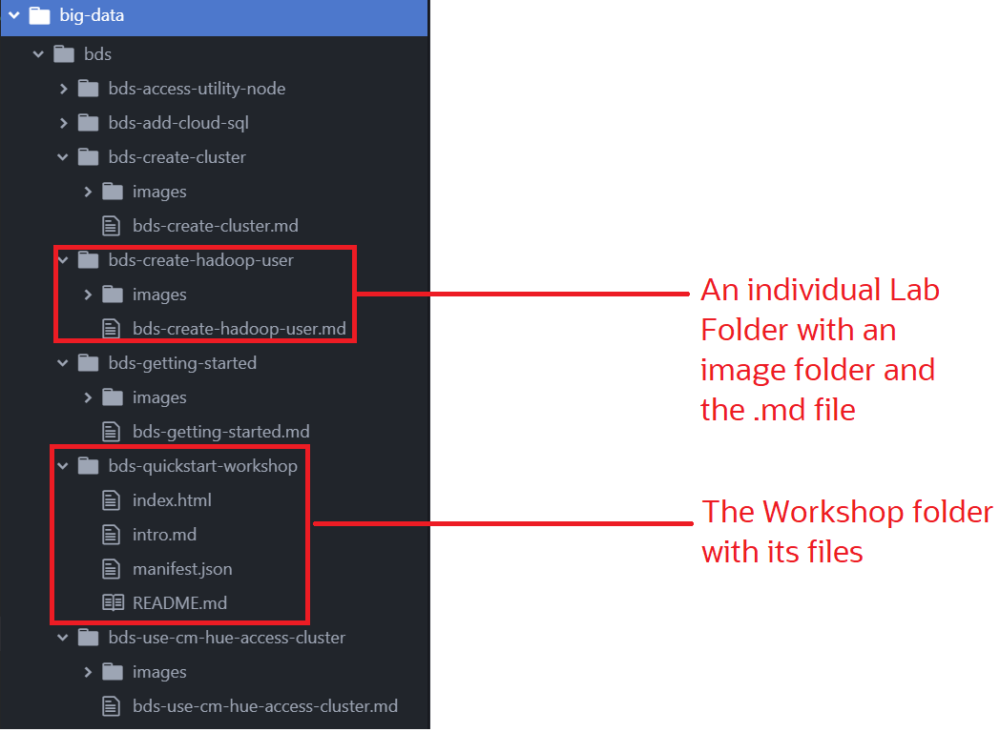
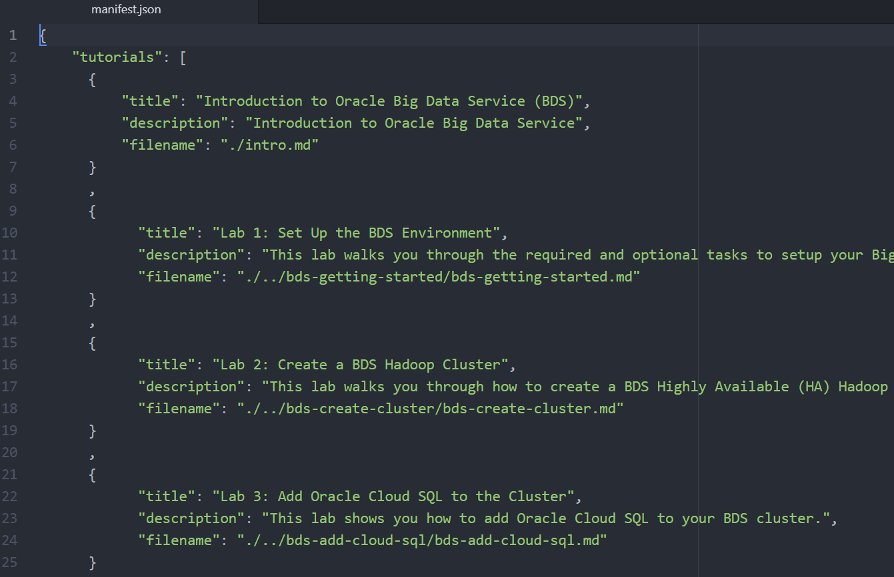

# Understand the Learning-Library Folder Structure

## Introduction
This lab describes the prescribed folder structure that we need follow for developing labs and workshops.
### Objectives
* Understand the Learning Library Folder Structure
* Get to know the Components

## **STEP 1:** Learning Library Folder Structure

The following image shows a folder structure of the big-data workshop. You can see this structure at the following URL [https://github.com/oracle/learning-library/tree/master/data-management-library/big-data/bds](https://github.com/oracle/learning-library/tree/master/data-management-library/big-data/bds), or in the data-management-library/big-data/bds folder of the clone on your machine.
    

## **STEP 2:** Understand the Components of the Workshop and Lab Folders
  The following describes the components of the above example:

    * The root folder of this example is the name of the workshop, **bds**.

    * Each lab has a separate folder, for example, `bds-create-cluster.md` and `bds-create-hadoop-user.md`.

    * Each lab folder has an **images** folder that contains the screenshots that are used in the lab.

    * The **bds-quickstart-workshop** is the workshop folder, which contains the `index.html`, `intro.md`, `manifest.json`, and `README.md` file.

    * The `index.html` file is executed when it is accessed by a browser. For example, [index.html](https://oracle.github.io/learning-library/data-management-library/database/multitenant/workshops/freetier/index.html).

    * The `intro.md` file contains the introduction of the workshop.

    * The `manifest.json` file defines the structure of the workshop that the `index.html` file renders.

    * The `README.md` file contains the gist of the entire Workshop. You can view it from your git repository.

      

**This concludes this lab. Please proceed to the next lab in the Contents menu on the right.**

## Want to Learn More?

* [How to Use the GitHub Template](https://otube.oracle.com/media/Use+GitHub+Template/0_780dlc2i)

## Acknowledgements

* **Authors:**
    * Anuradha Chepuri, Principal UA Developer, Oracle GoldenGate
* **Reviewed by:**  
        * Aslam Khan, Sr. User Assistance Manager, ODI, OGG
* **Last Updated By/Date:** Anuradha Chepuri, October 2020

## See an issue?  
Please open a request [here](https://github.com/oracle/learning-library/issues). Include the workshop name and lab in your request.
