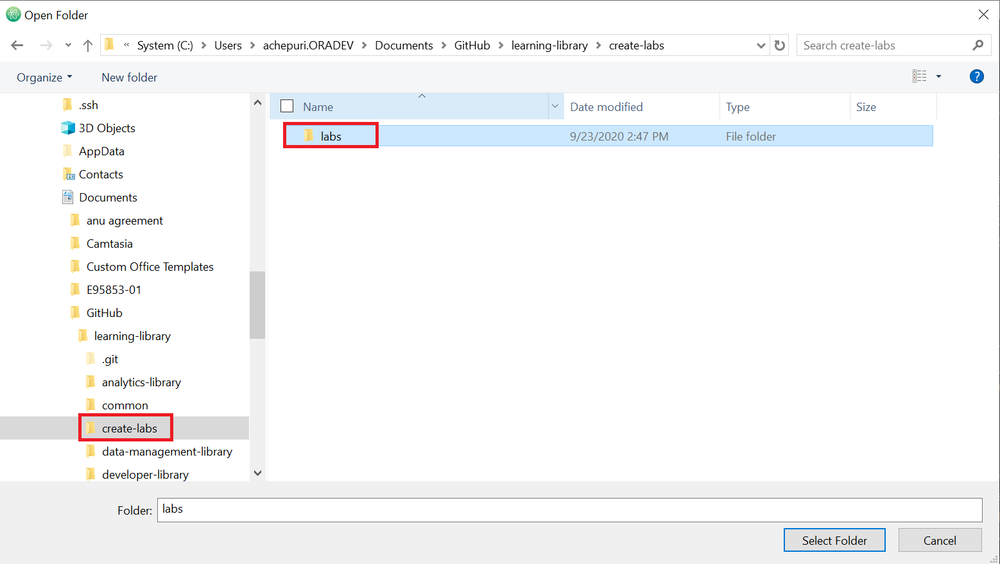
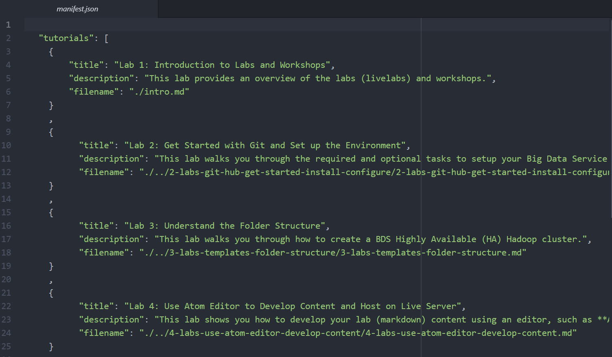
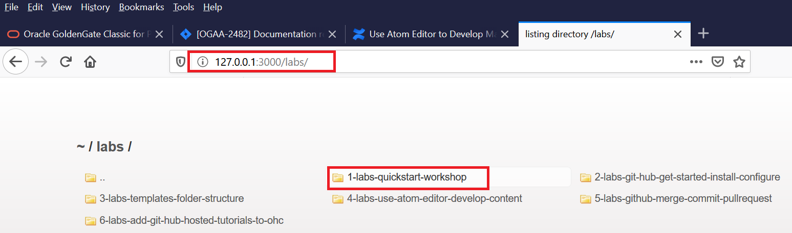

# Use Atom Editor to Develop Markdown Content

## Introduction

You can use your preferred editor to author and edit your Markdown (.md) content for rendering the Workshop output. Oracle recommends the Atom editor and the atom-live-server.

### Objectives

* Learn about the tools that are available to develop and host your content.
* Learn how to merge content.
* Create workshop and lab content.
* Preview the content in a browser.

### What Do You Need?
* An IDE, such as Atom.
* A local web server such as **atom-live-server**, a plugin for `Atom.io`.

**Note:** Oracle recommends the UA Developers to use Atom.

## **STEP 1:** Install Atom
`Atom.io` is a 3rd party IDE freely available under MIT License.

To install Atom:
1. Go to the [Atom](https://github.com/atom/atom/releases/tag/v1.51.0) URL.
2. Click the zip file  for your operating system, save and extract the zip file.
  
3. From the extracted files, click `atom.exe` to launch Atom.

## **STEP 2:** Install the atom-live-server Plugin
You must NOT be connected to Oracle's network or VPN while installing the Atom-Live-Server package.

To install the **atom-live-server**:
1. In the Atom editor, click **Help**, and then select **Welcome Guide**.
2. In the **Welcome Guide** screen, click **Install a Package**, and then click **Open Installer** to display the **Install Packages** window.

  

3. Enter **atom-live-server**, and then click **Install**.

  

4. When the installation is successfully completed, the **Install** button is replaced with the **Uninstall** and **Disable** buttons.
  
The atom-live-server plugin is added to the **Packages** menu.
  

## **STEP 3:** Merge Content from Git Before you Start Editing your Content
  Everyday before you start editing your content, ensure to do a Merge.
  Merging synchronizes the content in your cloned repository with the latest content on the **upstream/master** repository and ensures that you have the most recent versions of the templates and other workshops/labs.

  To merge content:
  1. Start your **GitHub Desktop** client.
  2. Select **Branch > Merge into current branch** to display the **Merge in Master** window.

    

  3. Under the **Default branch**, the master branch is selected by default. This indicates the local clone on your PC.
    

  4. Scroll down the **Merge into master** window, select **upstream/master** (this is your master repository which is the learning-library), and then click **Merge upstream/master into master**. In this example, this will merge 120 commits by other people from the upstream/master into the clone on the local PC.

    

  5. When the merge is successfully completed, a "Successfully merged upstream/master into master" message is displayed. To push the new commits from the local clone to your forked location, click **Push origin**.

    **Note**: To determine if your clone is up-to-date with **upstream/master** (production), repeat steps 2 to 4. If both repositories are synchronized, then the following message is displayed: "This branch is up to date with upstream/master".

    

  In the GitHub Desktop UI, notice that the **Push Origin** is replaced by **Fetch Origin** after the push origin operation is successfully completed.  The local clone and fork repositories are now synchronized with the master repository.

  

## **STEP 4:** Create your Workshop and Lab Content
You can use project folder in the **learning-library** folder as a template to create a workshop for your project. In this example, let's use the **learning-library\data-management-library\big-data\bds** project folder as a template to create a new workshop and labs.

**Note**: Ensure to update your clone from the **upstream/master** repository (detailed in **Step 2**) on a regular basis whenever we are working on the markdown files.

To create your lab and workshop content:
1. Open your cloned repository using Windows Explorer.
2. Copy the **learning-library\data-management-library\big-data\bd** folder and paste it in your project folder (create a new folder, such as **create-labs**).
3. Rename the **bds** project folder to a name of your choice, for example, **labs**.
4. Rename the workshop and lab folders in the labs folder as per your requirement.  For example, rename **bds-quickstart-workshop** folder to **1-labs-quickstart-workshop** and so on.
5. Open **Atom** Editor, browse, and select your project folder. Click **File > Open Folder** to display the **Open Folder** dialog box.
  
6. Navigate to **create-labs\labs** and click **Select Folder**.
  

  The workshop folder and the lab folders are displayed in Atom.
  
7. Expand the workshop folder, **1-labs-quickstart-workshop** in this example, open the `manifest.json` to list the labs you plan to add to your workshop and update the title of the workshop. The `manifest.json` is like your book map file in SDL.
  
8. Open the `intro.md` file from **1-labs-quickstart-workshop** and update it as per your requirements.
9. Open the `README.md` file and update it with a summary of your workshop.
    
10. Similarly, expand the lab folder, for example, **2-labs-git-hub-get-started-install-configure** and edit the `.md` file as per your requirement. If you want to use any images in your lab, then include them in the images folder.

## **STEP 5:** Preview Your Workshop and Labs Using atom-live-server

To preview your output in a browser:
1. Start the **atom-live-server**. In the Atom editor, select **Packages > atom-live-server > Start server**.
  

  By default, the **atom-live-server** opens a browser window that displays the folders inside the **labs** folder.
2. Double-click the folder that contains the workshop you want to view. In this example, to display the workshop, double-click the workshop's name, **1-labs-quickstart-workshop**.
  

  The Workshop is displayed along with the labs. You can make content changes in the Atom editor to the workshop and lab files, save the changes, and the updated workshop and labs are automatically refreshed in the browser window.

  

3. To stop the atom-live-server, select  **Packages > atom-live-server > Stop folder-path-at-port-#**.

**This concludes this lab. Please proceed to the next lab in the Contents menu.**

## Want to Learn More?
[Basic Writing and Formatting Syntax](https://docs.github.com/en/github/writing-on-github/basic-writing-and-formatting-syntax)

## Acknowledgements
* **Author:**
    * Anuradha Chepuri, Principal User Assistance Developer, Oracle GoldenGate
* **Contributors:**
    * Lauran Serhal, Principal User Assistance Developer, Oracle Database and Big Data User Assistance

* **Reviewed by:**  
    * Aslam Khan, Senior User Assistance Manager, ODI, OGG, EDQ
    * Tom McGinn, Database and Database Cloud Service Senior Principal Product Manager, DB Development - Documentation

* **Last Updated By/Date:** Anuradha Chepuri, October 2020

## Need Help?  
Please submit feedback or ask for help using our [LiveLabs Support Forum](https://community.oracle.com/tech/developers/categories/livelabsdiscussions). Please click the **Log In** button and login using your Oracle Account. Click the **Ask A Question** button to the left to start a *New Discussion* or *Ask a Question*.  Please include your workshop name and lab name.  You can also include screenshots and attach files.  Engage directly with the author of the workshop.

If you do not have an Oracle Account, click [here](https://profile.oracle.com/myprofile/account/create-account.jspx) to create one.
