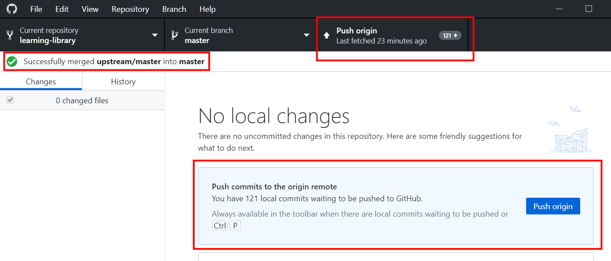

# Merge, Commit, Create Pull Request

## Introduction

As a best practice merge your library everyday or whenever you start your GitHub Desktop application. Merge pulls all the commits (changes) from the upstream/master repository (production), https://github.com/oracle/learning-library, into your local filesystem clone (local machine). This keeps your local clone up-to-date with other people's work (commits) from the upstream/master. Next, you push the updated content from your clone into the origin of your clone, that is, your fork, to synchronize your clone with your fork. Merging also avoids the long time it could take to complete if you don't do that often.

### Objectives

* Learn how to merge content
* Commit your Changes
* Request for a Review
* Test your Content
* Create a Pull Request to Upload your Content to Master

### What Do You Need?
* Git Environment Setup
* GitHub Desktop client

This lab assumes that you have successfully completed **Lab 2: Get Started with Git and Set up the GitHub Environment** in the **Contents** menu on the right.

## **Step 1:** Merge Content from Git Before you Start Editing your Content
To merge content:
1. Start your **GitHub Desktop** client.
2. Select **Branch > Merge** into current branch to display the **Merge in Master** window.

3. Under the **Default branch**, the master branch is selected by default. This indicates the local clone on your PC.

4. Scroll down the **Merge into master** window, select **upstream/master** (this is your master repository which is the learning-library), and then click **Merge upstream/master into master**. In this example, this will merge 120 commits by other people from the upstream/master (master repository) into the clone on the local PC.

5. When the merge is successfully completed, a "Successfully merged upstream/master into master" message is displayed. To push the new commits from the local clone to the origin remote of the clone (the fork), click **Push origin**.

To determine if your clone is up-to-date with upstream/master (production), repeat steps 2 to 4. If both repositories are synchronized, then the following message is displayed:
"This branch is up to date with upstream/master."

The **Push Origin** is replaced by **Fetch Origin** after the push origin operation is successfully completed.  The local clone and fork repositories are now synced with the master repository.

## **Step 2:** Commit your Changes in your Clone
When you create, delete, or modify assets in your clone (local copy), you should commit (save) those changes to your clone, and then push those changes from your clone to your fork. Then these changes get saved to your learning-library repository.

To commit your changes:
1. Start your **GitHub Desktop** client.
2. In the **Summary (required)** text box on the left (next to your picture), enter a summary of your changes. You can optionally add a more detailed description of your changes in the **Description** text box.

3. Click **Commit to master**. This saves your changes in your local clone. **Fetch Origin** changes to **Push Origin**.

4. Click **Push origin** (it should have an upward arrow with a number). This pushes the updated content from your clone into the origin of this clone, that is, your fork.

## Acknowledgements

* **Author:**  

* **Technical Contributors:**  

* **Last Updated By/Date:**

See an issue?  Please open up a request [here](https://github.com/oracle/learning-library/issues).
