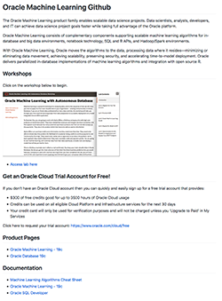

The Oracle Data Management Github is the central location for workshops related to all things Autonomous Database (ADB), Database, Big Data, Data Integration, Machine Learning, Security and more.  Across multiple deployment options:  on-premises and in the cloud.  

- [Autonomous Database](./autonomous-database) 
- [Database and Database 19c](./database) 
- [Oracle Machine Learning](./oracle-machine-learning) 
- [Security](./security) 

## Autonomous Database (ADB) 
- [Autonomous Database on Shared Infrastructure Workshop](https://oracle.github.io/learning-library/data-management-library/autonomous-database/shared/workshops/freetier-overview/)

- [Autonomous Database on Dedicated Infrastructure Workshop](https://oracle.github.io/learning-library/data-management-library/autonomous-database/dedicated/workshop/)

## For Developers
- [Building Microservices with Oracle's Converged Database](https://oracle.github.io/learning-library/developer-library/microservices-with-converged-db)
- [JSON](https://oracle.github.io/learning-library/developer-library/oracle-db-features-for-developers/workshops/json-freetier) 

- [Python](https://oracle.github.io/learning-library/developer-library/oracle-db-features-for-developers/workshops/python-freetier) 
- [Containerized Development on the Oracle Database](https://oracle.github.io/learning-library/data-management-library/database/docker/db-on-docker/freetier) 

- [Create a Database in a Docker Container](https://oracle.github.io/learning-library/data-management-library/database/docker/create-database-in-docker) 

- [Create a Database on OCI VM ](https://oracle.github.io/learning-library/data-management-library/database/oci-vm-database/create-oci-vm-db) 

## Database 
- [New Features for Developers](https://oracle.github.io/learning-library/developer-library/oracle-db-features-for-developers/freetier/index.html)  

- [Spatial](https://oracle.github.io/learning-library/data-management-library/database/spatial/freetier/index.html)

- [Multitenant Fundamentals](https://oracle.github.io/learning-library/data-management-library/database/multitenant/freetier/index.html)  

- [In-Memory Fundamentals](https://oracle.github.io/learning-library/data-management-library/database/in-memory/freetier/index.html) 

- [Hybrid Partitioning](https://oracle.github.io/learning-library/developer-library/oracle-db-features-for-developers/workshops/hybridpart-freetier) 

- [Automatic Indexing](https://oracle.github.io/learning-library/developer-library/oracle-db-features-for-developers/workshops/autoindex-freetier) 

- [Connect SQL Developer to OCI VM Database](https://oracle.github.io/learning-library/data-management-library/database/oci-vm-database/create-oci-vm-db/) 

  
## Oracle Machine Learning (OML) 
 
- [Machine Learning on Autonomous Database](https://oracle.github.io/learning-library/data-management-library/oracle-machine-learning/adb-oml/workshop/)
  
## Security 
- [Data Safe](https://github.com/kaymalcolm/learning-library/blob/master/data-management-library/security/data-safe)

## Certifications ##

**Autonomous Database Cloud Specialist Certification** - [Learn More](https://education.oracle.com/oracle-autonomous-database-cloud-2019-certified-specialist/trackp_OADB19)

## Videos
- [Oracle Database Product Management YouTube Channel](https://www.youtube.com/channel/UCr6mzwq_gcdsefQWBI72wIQ)

## Issues?
Please submit an issue on our [issues](https://github.com/oracle/learning-library/issues) page.  We review it regularly.  Make sure to include the name of the workshop when submitting.

-- Oracle Database Product Management

