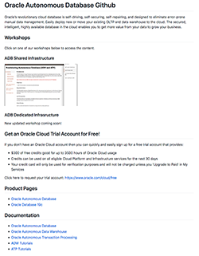
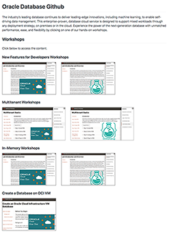
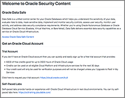

The Oracle Data Management Github is the central location for workshops related to all things Autonomous Database (ADB), Database, Big Data, Data Integration, Machine Learning, Security and more.  Across multiple deployment options:  on-premises and in the cloud.  

- [Autonomous Database](./autonomous-database) 
- [Database and Database 19c](./database) 
- [Oracle Machine Learning](./oracle-machine-learning) 
- [Security](./security) 

# Autonomous Database (ADB) Github
 
- Autonomous Dedicated 
- Autonomous Database Serverless

# Database Github
 
- 19c
- In-Memory
- Multitenant
- Developer New Features for 19c
- DBs on OCI VMs
- Database on Docker
- JSON
  
# Oracle Machine Learning (OML) Github
 
- OML on ADB
  
# Security Github
 

- Data Safe

## Certifications ##

**Autonomous Database Cloud Specialist Certification** - [Learn More](https://education.oracle.com/oracle-autonomous-database-cloud-2019-certified-specialist/trackp_OADB19)

## Videos
- [Oracle Database Product Management YouTube Channel](https://www.youtube.com/channel/UCr6mzwq_gcdsefQWBI72wIQ)

## Issues?
Please submit an issue on our [issues](https://github.com/oracle/learning-library/issues) page.  We review it regularly.

-- Oracle Database Product Management

