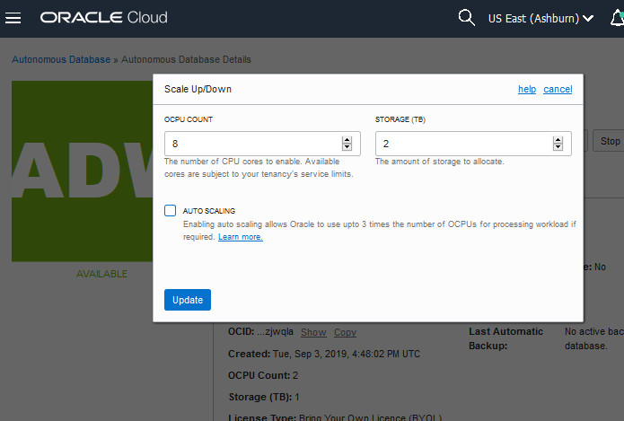

# Bonus Lab 8: Scaling and Performance in Your Autonomous Database

### Introduction

In this lab you will scale up your Oracle Autonomous Data Warehouse (ADW) or Autonomous Transaction Processing (ATP) service to have more CPUs. And you will watch a demo that shows the performance and concurrency impacts of scaling your service online.

To **log issues**, click <a href="https://github.com/millerhoo/journey4-adwc/issues/new" target="\_blank"> here </a> to go to the GitHub Oracle repository issue submission form.

### Objectives

-   Learn how to scale up an ADW or ATP service

-   Understand the performance and concurrency impacts of scaling your autonomous database service online

### Required Artifacts

-   The following lab requires an Oracle Public Cloud account. If you don't already have your own cloud account then you can obtain a new cloud account through the free Oracle trial program.

## <!--buggy, did this so Part 1 would collapse-->

## Step 1: Scaling your Autonomous Database Instance

-   Go back to the Cloud Console you used during the provisioning exercise and open the database instance's Details screen. From the **action menu**, click **Scale Up/Down**.

-   Fill in the form with the following information.

    -   **CPU core count :** 8
    -   **Storage capacity:** 2 TB

-   Click **Update** after filling in the form. This will take you to the database instance's Details screen.

**Note** The applications can continue running during the scale operation without downtime.

-   **Refresh** the page to see the result of the scaled operation.

## Step 2: Performance and Concurrency Benefits of Dynamic Scaling

-   <a href="https://raw.githubusercontent.com/millerhoo/journey4-adwc/master/workshops/journey4-adwc/images/ADWC%20HOL%20-%20Scaling.mp4" target="\_blank">Click here</a> to watch a demo of the performance impact of scaling up your instance. In the demo you will see that scaling up provides more concurrency for your users.

-   The demo will show a workload that has 10 concurrent users running with the MEDIUM database service. You will see that on a 2 CPU autonomous database instance 5 queries are running whereas 5 queries are waiting in the queue for resources.

-   While the workload is running the database will be scaled up from 2 CPUs to 4 CPUs. You will see that the queries waiting in the queue are now able to start and there are no sessions waiting in the queue anymore.

-   ADW allows you to dynamically scale your service online when you require more concurrency and performance.

<table>
<tr><td class="td-logo"></td>
<td class="td-banner">
## Great Work - All Done!
**You are ready to move on to the next lab. You may now close this tab.**
</td>
</tr>
<table>
