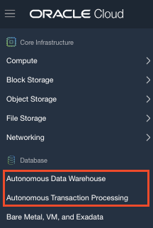
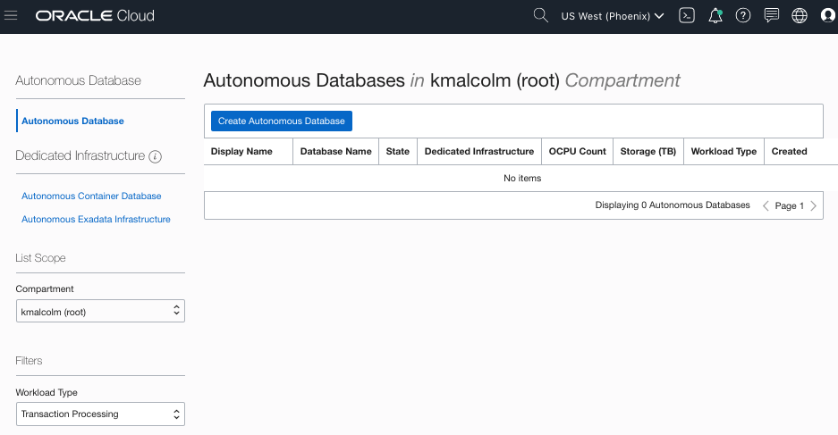
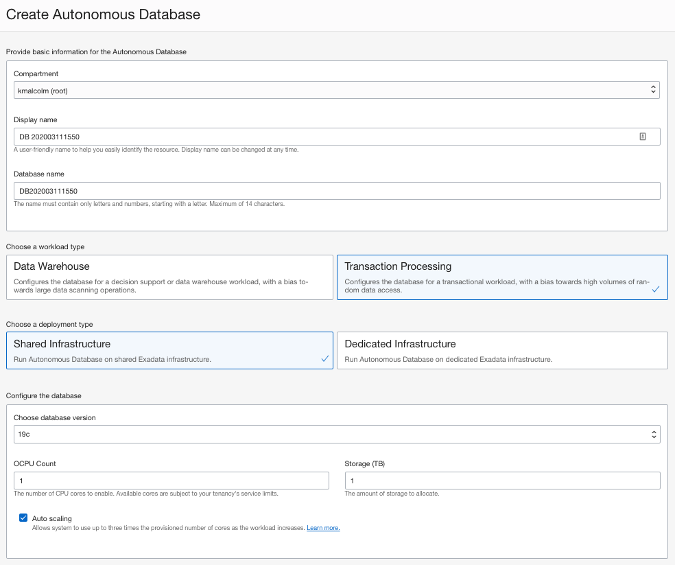

# Provisioning Autonomous Transaction Processing #

## Before You Begin ##
This 10-minute lab walks you through the steps to get started using the Oracle Autonomous Database on Oracle Cloud. You will provision either a new ATP or ADW database based on the workload needed for your lab. 

### What Do You Need? ###
* Access to an Oracle Cloud account

## Step 1: Create an ATP Instance ##
1. Click the menu icon to expand the menu on the left edge of the screen.
3. Select **Autonomous Transaction Processing** or **Autonomous Data Warehouse**.

    

    [Description of the illustration menu.png](files/OCIMenu.txt)

4. Click the **Create Autonomous Database** button to start the instance creation process.

    

5. On the Create Autonomous Database page, enter the following information:

    

     * **Compartment**: Select the *compartment you were assigned* or optionally use the *root* compartment if you are using the Freetier.
     * **Display Name**: adb<*initials*><*year you were born*> - For your display name, enter adb-yourinitials-the year you were born.  Example: *adbkm92* (Initials KM born in 1992)
     * **Database Name**: adb<*initials*><*year you were born*> - For your display name, enter adb-yourinitials-the year you were born.  Example: *adbkm92* (Initials KM born in 1992)
     * **Workload Type**: Choose the type of workload needed `Data Warehouse` (ADW) or `Transaction Processing` (ATP)
     * **Deploymen Type**: `Shared Infrastructure`
     * **Database version**:  Choose the database version:  `18c` or `19c`
     * **CPU Core Count**: `1`
     * **Storage (TB)**:  `1`
     * **Administrator Credentials**: Create a password for the ADMIN user of the service instance. Remember this password! You'll need it in later labs to sign in to various services like Performance Hub and SQL Developer Web.
     * **Choose network access**:  Accept the defaults
     * **License Type**: `Bring Your Own License`

6. Click the **Create Autonomous Database** button to start provisioning the instance. 

7. You're taken to the instance's details page. Details include a State field, which indicates the instance is **Provisioning**. When it's complete, the State field changes from **Provisioning** to **Available**. If the status doesn't change after few minutes, try refreshing the page.

    

    [Description of the illustration atp_instance.png](files/atp_instance.txt)

