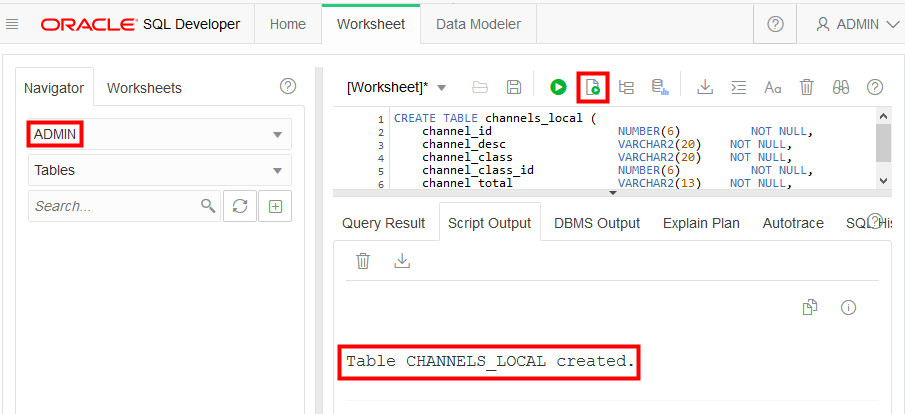

# Loading Data into Your New Autonomous Database


## Introduction

In this lab, you will upload files to the Oracle Cloud Infrastructure (OCI) Object Storage, create sample tables, load data into them from files on the OCI Object Storage, and troubleshoot data loads with errors.

You can load data into your new autonomous database (Autonomous Data Warehouse [ADW] or Autonomous Transaction Processing [ATP]) using Oracle Database tools, and Oracle and 3rd party data integration tools. You can load data:

+ from files local to your client computer, or
+ from files stored in a cloud-based object store

For the fastest data loading experience Oracle recommends uploading the source files to a cloud-based object store, such as Oracle Cloud Infrastructure Object Storage, before loading the data into your ADW or ATP database.

To load data from files in the cloud into your autonomous database, use the new PL/SQL `DBMS_CLOUD` package. The `DBMS_CLOUD` package supports loading data files from the following Cloud sources: Oracle Cloud Infrastructure Object Storage, Oracle Cloud Infrastructure Object Storage Classic, Amazon AWS S3, and Microsoft Azure Object Store.

This lab shows how to load data from Oracle Cloud Infrastructure Object Storage using two of the procedures in the `DBMS_CLOUD` package:

+ **create_credential**: Stores the object store credentials in your Autonomous Data Warehouse schema.
    + You will use this procedure to create object store credentials in your ADW admin schema.
+ **copy_data**: Loads the specified source file to a table. The table must already exist in ADW.
    + You will use this procedure to load tables in your admin schema with data from data files staged in the Oracle Cloud Infrastructure Object Storage cloud service.

**Note:** While this lab uses ADW, the steps are identical for loading data into an ATP database.

For more information about loading data, see the documentation [Loading Data from Files in the Cloud](https://www.oracle.com/pls/topic/lookup?ctx=en/cloud/paas/autonomous-data-warehouse-cloud&id=CSWHU-GUID-07900054-CB65-490A-AF3C-39EF45505802).

To **log issues**, click [here](https://github.com/millerhoo/journey4-adwc/issues/new) to go to the GitHub Oracle repository issue submission form.

### Objectives

-   Learn how to use SQL Developer Web to load data into an autonomous database table

-   Learn how to upload files to the OCI Object Storage

-   Learn how to define object store credentials for your autonomous database

-   Learn how to create tables in your database

-   Learn how to load data from the Object Store

-   Learn how to troubleshoot data loads

#### Required Artifacts

-   The following lab requires an Oracle Cloud account. You may use your own cloud account, a cloud account that you obtained through a trial, or a training account whose details were given to you by an Oracle instructor.

In Steps 1 to 3, you will create one ADW table, CHANNELS_LOCAL, and load it with sample data from your local file system. In the remaining steps, you will create several ADW tables and load them with sample data that you stage to an OCI Object Store.

## STEP 1: Download the Sample Data File to Your Local Computer

-   For this step, you will download a .csv file to your local computer, then use it to populate the CHANNELS_LOCAL table that you will create in your ADW database in the next step.  Click <a href="./files/channels.csv" target="\_blank">here</a> to download the sample channels.csv file, saving it to a directory on your local computer.


## STEP 2: Create CHANNELS_LOCAL Table in your autonomous database using SQL Developer Web

-   In your autonomous database's details page, click the **Tools** tab. Click **Open SQL Developer Web**.


-   To define the CHANNELS_LOCAL table, click <a href="./files/define_channels_local_table.txt" target="\_blank">here</a> to copy or download the table creation code snippet. Then paste it into the SQL Developer Web worksheet and click the **Run Script** button to run it.



## STEP 3: Load Local Data Using SQL Developer Web

-   In the Navigator, **right-click** your new CHANNELS_LOCAL table. You might need to refresh the Navigator to see the new table. In the menu, select **Data loading → Upload Data...**:

    

-   The Data Import Wizard is started. Perform the following:

    -   Click **Select files** to select the file for data uploading.

    -   Click the browse button and navigate to the channels.csv file that you downloaded in Step 1.

        

After you select the file, the wizard provides a **Data preview** step. You can click the **Show/Hide options** button to perform actions including skipping rows and limiting rows to upload. Use the horizontal toolbar to check the data.

When you are satisfied with the file's data, click **NEXT**.


<!--When newline is fixed -->

  **Note** - If your source .csv file has delimiters other than commas between words, or line delimiters other than new-line characters, you will need to use SQL Developer for now, rather than SQL Developer Web.

-   In Step 2 of the Import Wizard, **Column mapping**, you can change the source-to-target column mappings. For this exercise, leave them as default and click **NEXT**.


-   The final step of the Import Wizard, **Review**, reflects all of the choices you made in the Wizard. Click **FINISH** to load the data into your newly created table *CHANNELS_LOCAL*. If you don't see it in your object tree under Tables, right click on Tables and hit refresh.


-   Click **OK** to confirm the import. Depending on the size of the data file you are importing, the import may take some time.


## STEP 4: Download the Sample Data Files to Upload to an Object Store

In Steps 1 to 3, you created an ADW table and loaded it with sample data from your local file system. Now, you will create several ADW tables and load them with sample data that you stage to an OCI Object Store.

-   For this step, you will need a handful of data files.  Click <a href="./files/files.zip" target="\_blank">here</a> to download a zip file of the sample source files for you to upload to the object store. Unzip it to a directory on your local computer.


## STEP 5: Create Target Tables for Data Loading

-   Connected as your admin user in SQL Developer Web, copy and paste <a href="./scripts/300/create_tables.txt" target="\_blank">this code snippet</a> to a worksheet. Take a moment to examine the script. Then click the **Run Script** button to run it.

-   It is expected that you may get ORA-00942 *table or view does not exist* errors during the DROP TABLE commands for the first execution of the script, but you should not see any other errors.

    

Note that you do not need to specify anything other than the list of columns when creating tables in the SQL scripts. You can use primary keys and foreign keys if you want, but they are not required.

## STEP 6: Navigate to Object Storage

-  Now you set up the OCI Object Store. From the Autonomous Data Warehouse console, pull out the left side menu from the top-left corner and select **Object Storage > Object Storage**. To revisit signing-in and navigating to ADW, please see [Lab 1](LabGuide1.md).

  

  To learn more about the OCI Object Storage, refer to its <a href="https://docs.us-phoenix-1.oraclecloud.com/Content/GSG/Tasks/addingbuckets.htm" target="\_blank">documentation</a> .

-   You should now be on the **Object Storage** page. Choose the **root** compartment in the **Compartment** drop-down if it is not already chosen.
    

## STEP 7: Create a Bucket for the Object Storage
In OCI Object Storage, a bucket is the terminology for a container of multiple files.

-   Click the **Create Bucket** button:

    

-   Name your bucket **ADWCLab** and click the **Create Bucket** button.

    

## STEP 8: Upload Files to Your OCI Object Store Bucket

-   Click your **bucket name** to open it:

    

-   Click the **Upload Objects** button:

    

-   Drag and drop, or click  **select files**,  to select all the files downloaded in Step 1. Click **Upload Objects** and wait for the upload to complete:

    

-   Repeat this for all files you downloaded in Step 1 for this lab. When the upload is complete, click **Close.**

-   The end result should look like this with all files listed under Objects:

    

## STEP 9: Copy the URL for the Files in Your OCI Object Storage
-   Copy following base URL that points to the location of your files staged in the OCI Object Storage. The simplest way to get this URL is from the "Object Details" in the right hand side ellipsis menu in the Object Store.


 


 

 - Take a look at the URL you copied. In this example above, the **region name** is us-ashburn-1, the **Namespace** is idthydc0kinr, and the **bucket name** is ADWCLab.

*Note:* The URL can also be constructed as below:

https://objectstorage.<**region name**>.oraclecloud.com/n/<**namespace name**>/b/<**bucket name**>/o


-   **Save** the base URL you copied in a note. We will use the base URL in upcoming steps.

## STEP 10: Creating an Object Store Auth Token

To load data from the Oracle Cloud Infrastructure(OCI) Object Storage you will need an OCI user with the appropriate privileges to read data (or upload) data to the Object Store. The communication between the database and the object store relies on the native URI, and the OCI user Auth Token.

-   Go back to the **Autonomous Data Warehouse Console** in your browser. From the pull-out menu on the top left, under **Identity**, click **Users**.

    

-   Click the **user's name** to view the details.  Also, remember the username as you will need that in the next step. This username could also be an email address.

    

-   On the left side of the page, click **Auth Tokens**.

    

-   Click **Generate Token**.

    

-   Enter a meaningful **description** for the token and click **Generate Token**.

    

-   The new Auth Token is displayed. Click **Copy** to copy the Auth Token to the clipboard.  You probably want to save this in a temporary notepad document for the next few minutes (you'll use it in the next step).
    *Note:* You can't retrieve the Auth Token again after closing the dialog box.

    

-  Click **Close** to close the Generate Token dialog.

## STEP 11: Create a Database Credential for Your User

In order to access data in the Object Store you have to enable your database user to authenticate itself with the Object Store using your OCI object store account and Auth token. You do this by creating a private CREDENTIAL object for your user that stores this information encrypted in your Autonomous Data Warehouse. This information is only usable for your user schema.

-   Connected as your user in SQL Developer Web, copy and paste <a href="./scripts/300/create_credential.txt" target="\_blank">this code snippet</a> to a SQL Developer Web worksheet.

    Specify the credentials for your Oracle Cloud Infrastructure Object Storage service: The username will be your **OCI username** (usually your email address, not your database username) and the password is the OCI Object Store **Auth Token** you generated in the previous step.  In this example, the credential object named **OBJ\_STORE\_CRED** is created. You reference this credential name in the following steps.

    

<!-- -->

-   Run the script.

    

-   Now you are ready to load data from the Object Store.

## STEP 12: Loading Data from the Object Store Using the PL/SQL Package, DBMS_CLOUD

As an alternative to the wizard-guided data load, you can use the PL/SQL package **DBMS_CLOUD** directly. This is the preferred choice for any load automation.

-   Connected as your user in SQL Developer Web, copy and paste <a href="./scripts/300/load_data_without_base_url.txt" target="\_blank">this code snippet</a> to a SQL Developer Web  worksheet. This script uses the **copy\_data** procedure of the **DBMS\_CLOUD** package to copy the data in the source files to the target tables you created before.

<!--   At the top of the script, specify the Object Store base URL in the definition of the **base\_URL** variable. You have copied and saved this URL in the step "Copy the URLs of the Files on Your OCI Object Storage" above. -->

- For each **file\_uri\_list** statement, specify the Object Store base URL that you copied and saved in the step "Copy the URLs of the Files on Your OCI Object Storage" above.

    **Note:** In SQL Developer Web, you will soon be able to define the Object Store base URL once, to use as a variable in file\_uri\_list statements. This capability is already supported in the full Oracle SQL Developer client tool.

-   For the **credential_name** parameter in the **copy\_data** procedure, it is the name of the credential you defined in the step "Create a Database Credential for Your User" above.  You can use that credential.

-  For the **format** parameter, it is a list of DBMS_CLOUD options (you can read more about these options <a href="https://docs.oracle.com/en/cloud/paas/autonomous-data-warehouse-cloud/user/dbmscloud-reference.html">here</a>).

- Run the script.

    

- You have successfully loaded the sample tables. You can now run any sample query in the <a href="https://docs.oracle.com/database/122/DWHSG/part-relational-analytics.htm#DWHSG8493" target="\_blank">relational analytics</a> section of the Oracle documentation. For example, to analyze the cumulative amount sold for specific customer IDs in quarter 2000, you could run the query in <a href="./scripts/300/query_tables.txt" target="\_blank">this code snippet</a>. <a href="https://docs.oracle.com/en/database/oracle/oracle-database/12.2/dwhsg/introduction-data-warehouse-concepts.html#GUID-452FBA23-6976-4590-AA41-1369647AD14D" target="\_blank">Click Here</a> to read more about Data Warehousing.

    

## STEP 13: Troubleshooting DBMS_CLOUD data loads

-   Connected as your user in SQL Developer Web, run the following query to look at past and current data loads.
    ```
    $ <copy>select * from user_load_operations;
    line 2
    line 3
    line x
    </copy>
    ```
    Notice how this table lists the past and current load operations in your schema.  Any data copy and data validation operation will have backed up records in your Cloud.

-   For an example of how to troubleshoot a data load, we will attempt to load a data file with the wrong format (chan_v3_error.dat).  Specifically, the default separator is the | character, but the channels_error.csv file uses a semicolon instead.  To attempt to load bad data, copy and paste <a href="./scripts/300/load_data_with_errors.txt" target="\_blank">this code snippet</a> to a SQL Developer Web worksheet and run the script as your user in SQL Developer Web. Specify the URL that points to the **chan\_v3\_error.dat** file. You have copied and saved the URL in the step "Copy the URLs of the Files on Your OCI Object Storage" above. Expect to see "reject limit" errors when loading your data this time.

    

-   Run the following query to see the load that errored out.
    ```
    select * from user_load_operations where status='FAILED';
    ```

    

A load or external table validation that errors out is indicated by status=FAILED in this table. Get the names of the log and bad files for the failing load operation from the column **logfile\_table** and **badfile\_table**. The logfile\_table column shows the name of the table you can query to look at the log of a load operation. The column badfile_table shows the name of the table you can query to look at the rows that got errors during loading.

-   Query the log and bad tables to see detailed information about an individual load. In this example, the names are copy$25\_log and copy$25\_bad respectively.

        

-   To learn more about how to specify file formats, delimiters, reject limits, and more, review the <a href="https://docs.oracle.com/en/cloud/paas/autonomous-data-warehouse-cloud/user/dbmscloud-reference.html" target="\_blank"> DBMS_CLOUD Package Format Options </a>

-   Keep your SQL Developer Web open and move to the next lab - Querying External Data.

<table>
<tr><td class="td-logo">[](#)</td>
<td class="td-banner">
## Great Work - All Done!
**You are ready to move on to the next lab. You may now close this tab.**
</td>
</tr>
<table>
