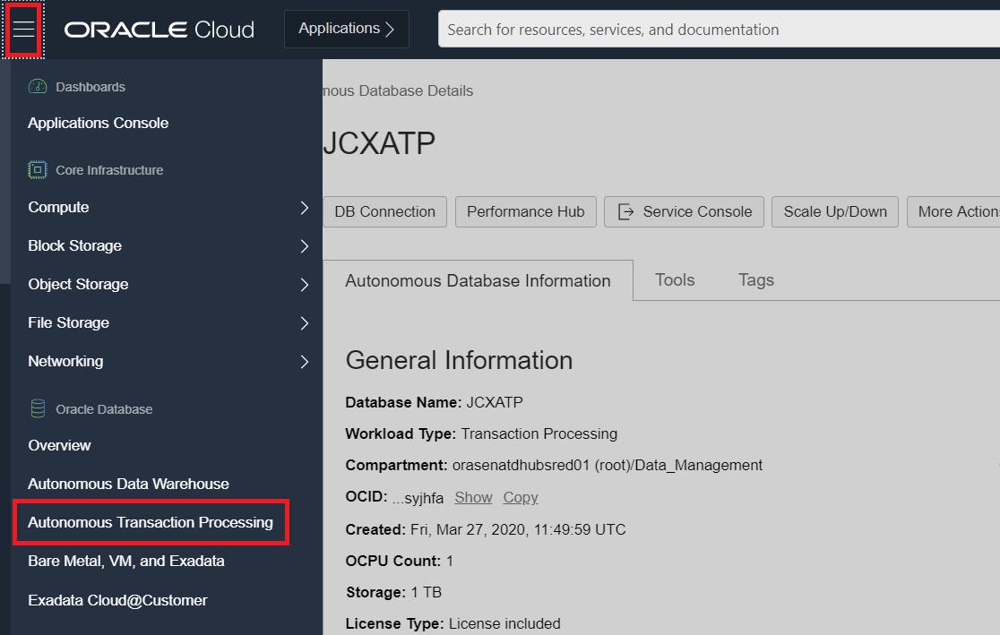
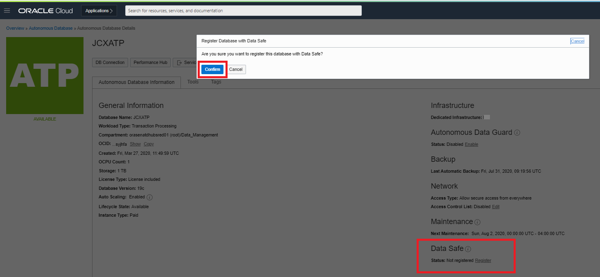

# Register a dedicated ADB instance with  Data Safe 
## Introduction

Oracle Data Safe can connect to an Oracle Cloud database that has a public or private IP address on a virtual cloud network (VCN) in Oracle Cloud Infrastructure (OCI). This workshop describes the difference between public and private endpoints and explains the network connection between Oracle Data Safe and the databases. It also walks you through the steps of creating a private endpoint and registering an Autonomous Database (ADB) on dedicated Exadata Infrastructure with Oracle Data Safe

## STEP 1: Register your ADB-D

If your DB system has a private IP address, you need to create a private endpoint for it prior to registering it with Oracle Data Safe. You can create private endpoints on the Data Safe page in OCI. Be sure to create the private endpoint in the same tenancy and VCN as your database. The private IP address does not need to be on the same subnet as your database, although, it does need to be on a subnet that can communicate with the database. You can create a maximum of one private endpoint per VCN.
However, with the Autonomous Database, the entire registration is reduced to a single click operation.

- From your Menu, navigate to Autonomous Transaction Processing, Ensure you are in the right compartment and select the ADB-D instance you wish to register.

  

- On the extreme down right corner you would see an option to register your ADB-D database. Click on it and select Confirm.

  
  
- Once registered, click on "View Console". This takes you directly to the Data Safe console in your Region.

  
  
## Acknowledgements

*Great Work! You have successfully Registered your ADB-D with Data Safe.*

- **Author** - Padma Priya Rajan, Navya M S & Jayshree Chatterjee
- **Last Updated By/Date** - Jayshree Chatterjee, July 2020

## Need Help?
Please submit feedback or ask for help using our [LiveLabs Support Forum](https://community.oracle.com/tech/developers/categories/autonomous-database-dedicated). Please click the **Log In** button and login using your Oracle Account. Click the **Ask A Question** button to the left to start a *New Discussion* or *Ask a Question*.  Please include your workshop name and lab name.  You can also include screenshots and attach files.  Engage directly with the author of the workshop.

If you do not have an Oracle Account, click [here](https://profile.oracle.com/myprofile/account/create-account.jspx) to create one.

