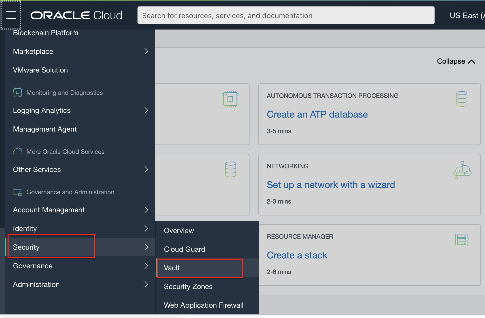
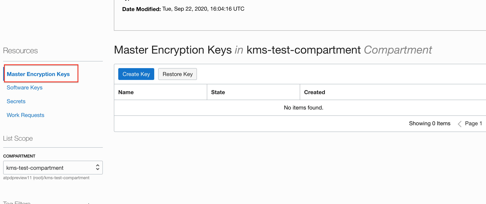
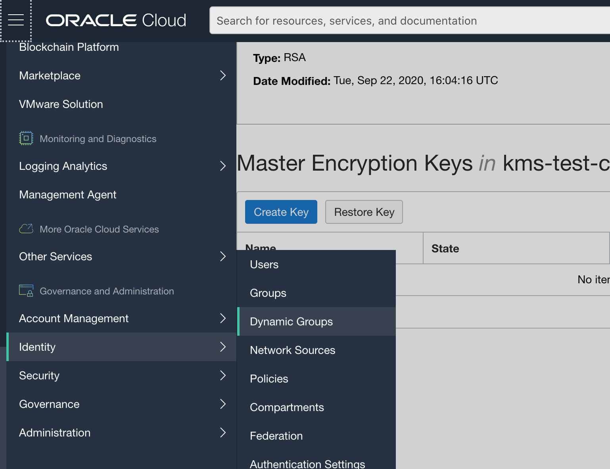

# Customer Controlled Database Encryption Keys

## Introduction
The Autonomous database service allows customers to retain control of the database encryption master keys. Keys are stored in an HSM based Vault service in OCI and are accessed by the database for encryption / decryption of data keys. No human operator has access to the keys once they are in the vault. Customers retain full control of their key vault and can disable / delete keys as required. 
Each autonomous container database (ACD) and each autonomous database (ADB) within it can have its own unique master encryption key (MEK). Keys may be rotated at desired frequency either through console UI or using REST APIs.

### Objectives

As a database security administrator,
1. Create a Vault and Master Key in OCI Vault service 
2. Setup IAM policies for Vault access
3. Create ACDs or ADB using customer controlled keys
4. Rotate keys

### Required Artifacts

- An Oracle Cloud Infrastructure account.

## STEP 1: Create a Vault and Key in OCI Vault service

The first step is for a security admin responsible for all encryption keys to login to the OCI Vault service and create a Vault for storing autonomous database keys. Oracle Vault is an OCI service for storing encryption keys, certificates and other secrets. Keys are stored in a FIPS-140 Security Level 3 certified HSM module. Check out [OCI Vault documentation](https://docs.cloud.oracle.com/en-us/iaas/Content/KeyManagement/Concepts/keyoverview.htm) for details.

- Login to your OCI tenancy and navigate to the Vault service from the main hamburger menu.

- Choose a compartment where you would like to keep your Vault. 

**As a best practice, plan and create a compartment hierarchy such that all autonomous database related Vaults and Keys are in a separate compartment and isolated by business unit, application etc.**

- Hit 'Create Vault' and provide a name

- Once your Vault is ready you may then create a Master Encryption Key.

Scroll down on the Vault console page, make sure you select 'Master Encryption Keys' from the list of Resources on the left and hit 'Create Key'

The key you just created can now be used to encrypt ACDs and ADBs. Note that a 'key version' is automatically created. Each time you create and ACD / ADB with Vault managed keys or if you rotate keys, a new key version is generated. 

**Therefore a good rule of thumb is to create one key per Autonomous Container Database so that all keys associated with the ACD and its ADBs are part of it.**

If you do not ever need an ACD and decide to drop it, you may simply drop the corresponding Vault Key and all the key versions are removed with it. 

**It is also important to remember that Keys should be deleted or disabled with extreme caution. Once a key is deleted / disabled, the associated database becomes unavailable immediately unless Keys are restored from a backup or enabled again.**

## STEP 2: Setup IAM policy & Network Access to allow Exadata to access Vault

This puts the control around who accesses the Key Vault in the hands of the customer. You need to, 

1. Create a dynamic group that includes the **Compartment holding the Autonomous Exadata Infrastructure**
2. Allow this dynamic group to manage keys in the compartment housing the Vault using a policy statement

Let's start with creating the dynamic group

- From the main menu navigate to Identity --> Dynamic Groups

- Hit 'Create Dynamic Group', provide a Name, Description and the following Matching Rule

All {resource.compartment.id = 'OCID of Compartment holding your Autonomous Exadata Infrastructure'}

**Note: if you use the Rule Builder, be sure to change instance.compartment.id to resource.compartment.id**

- Next, add a policy statement in the root compartment ( or a compartment higher up in hierarchy to your Key Vault Compartment)

**Super Important Note: This policy statement and dynamic group determine if your Exadata Infrastructure has access to the Key Vault. If this policy statement does not resolve correctly, encryption keys will not be accessible and associated databases will become unavailable immediately.**

Therefore, its important the dynamic group,  policy statements, compartment hierarchies and permissions are well thought out and do not accidentally change.

- Finally, make sure the Exadata VCN has a 'Service Gateway' in place and the Exadata Subnet has a route rule allowing access to OCI services through the service gateway

First, create a service gateway if one has not been provisioned already by your network admin

Create a route rule in your exadata subnet, routing traffic to the service gateway you created. For more information on creating network resources in your tenancy, contact your network admin or refer to [Lab 1](?lab=lab-1-prepare-private-network-for-oci).

## STEP 3: Create ACDs and ADBs with Customer managed keys in Vault

You are now ready to create an Autonomous Container Database with customer controlled encryption keys residing in the OCI Key Vault

In the provisioning screen for ACDs, scroll down to the bottom, click **Show Advanced Options** and pick the **Encryption Key** tab

Choose **Encrypt using customer-managed keys**, change to compartment housing the vault and key you created earlier, and pick the Vault and Key from the dropdown.

That is it. You ACD will now be encrypted using an AES 256 key created and held by you in the Key Vault.

Every Autonomous Database provisioned in this ACD will be encrypted using a separate encryption key. There is no action required at the time of provisioning ADB thereby making the key management operation transparent to the ADB consumer. 

However, both the ACD Fleet Admin and the ADB admin / developer may rotate ACD or ADB keys from the database console or via REST APIs. 

ADB Key rotation option is under **More Action** drop down button on the database console.

## Acknowledgements
*Congratulations! You successfully configured the Key Vault Service to work with your Autonomous Databases*

- **Author** - Kris Bhanushali
- **Last Updated By/Date** -  September 22nd, 2020

## See an issue or have feedback?  
Please submit feedback [here](https://apexapps.oracle.com/pls/apex/f?p=133:1:::::P1_FEEDBACK:1).   Select 'Autonomous DB on Dedicated Exadata' as workshop name, include Lab name and issue / feedback details. Thank you!
