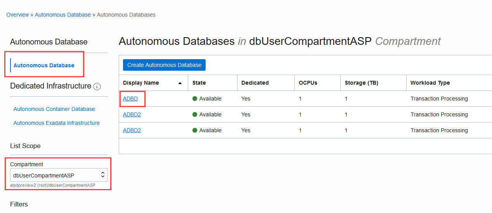
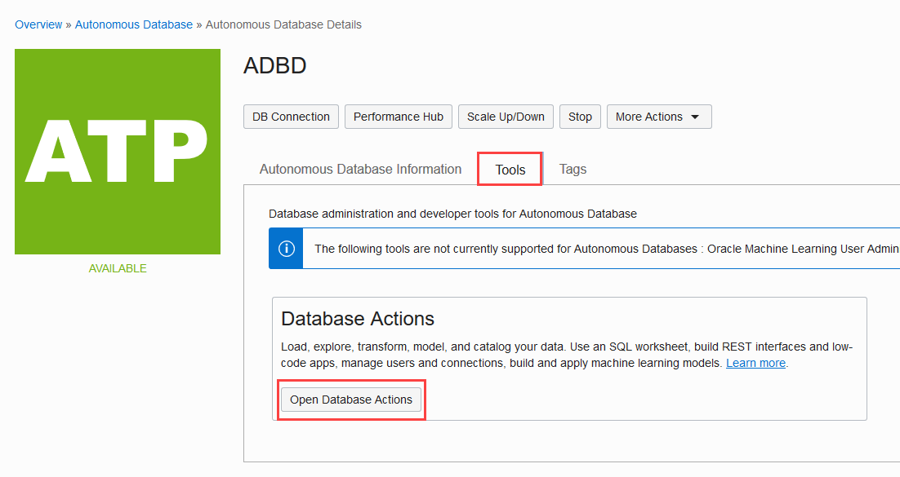
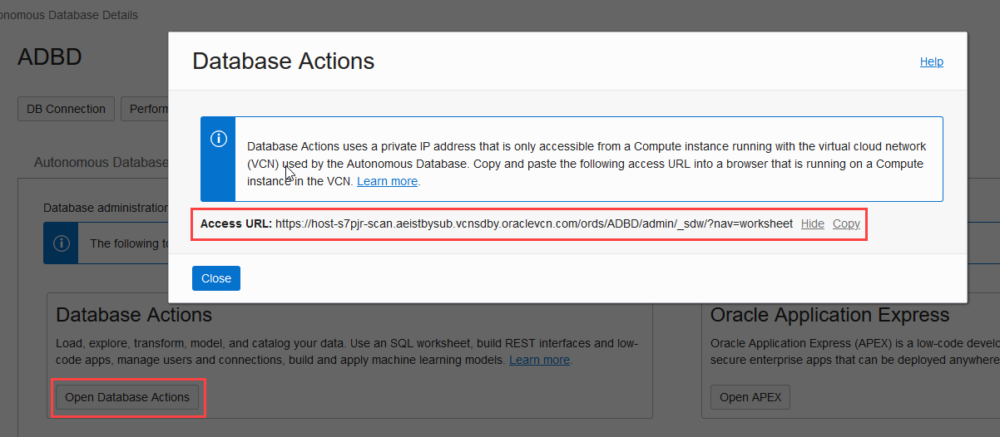
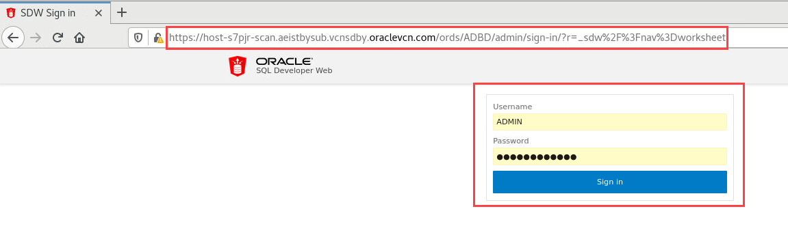
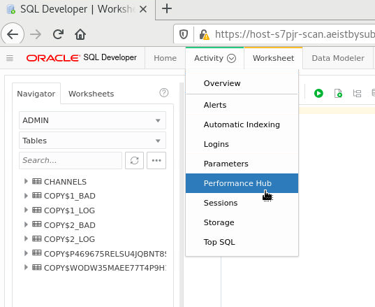
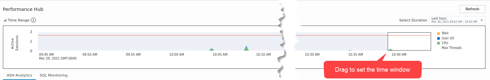
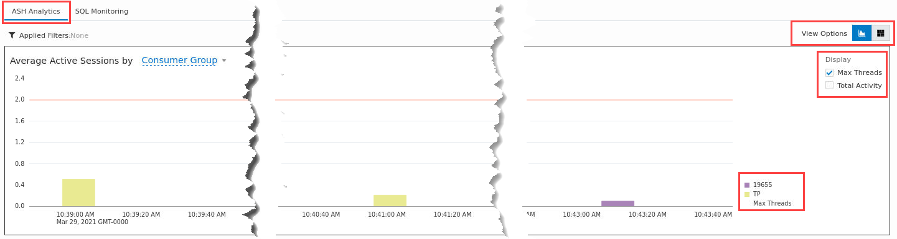
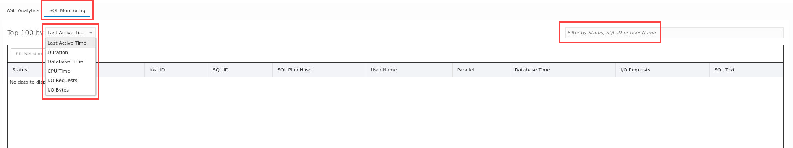

# Accessing Database Actions and Performance Hub consoles on your dedicated Autonomous Database instance

## Introduction
Oracle  provides an integrated development environment and a database administration interface for Oracle databases in OCI. A web interface for Oracle SQL Developer, Database Actions provides a subset of the desktop product features and is bundled with various database services available in Oracle Cloud, including the dedicated Autonomous Database.

On the Performance Hub page of the Database Actions console, you can monitor your Autonomous Database entities' performance and ensure that these entities perform optimally.

This page allows you to view all the performance data available for a specific period. Once a period is selected, the database performance is displayed.

### Objectives

As a developer or DBA,

1. Access the OCI Autonomous Database console and get the URL for the Database Actions console.
2. Create a VNC connection to the developer client VM and access the Database Actions console.
3. Access Performance Hub for your Autonomous Database instance.

### Required Artifacts
- An Oracle Cloud Infrastructure account with access to Autonomous Transaction Processing console.
- A pre-provisioned Autonomous Database with admin access.
- A pre-provisioned developer client machine with network access to the database.

## STEP 1: Access the OCI Autonomous Database console and get the URL for the Database Actions console

- Login to your Oracle Cloud Infrastructure account and navigate to your dedicated Autonomous Database console page.
    

- Navigate to the database details page. On the **Tools** tab, you will find the **Open Database Actions** button that would lead you to the Database Actions access URL as shown below.
    
    

- Save the URL someplace while working on the next step to access your developer client machine over VNC.


## STEP 2: Create a VNC connection to the developer client VM and access the Database Actions console

- Since your Autonomous Database is in a private network, you cannot access it with the above URL unless you are on a machine that has a network path to your database subnet.

- Let's connect to the developer client machine you setup in [Lab 8](?lab=lab-8-configuring-development-system) using a secure ssh tunnel.

- Open an ssh tunnel from your local laptop to your developer client. For instructions, refer to [Lab 8](?lab=lab-8-configuring-development-system).

**Mac or Linux users**

- Open a terminal window and create an ssh tunnel using the following command,

    ```
    <copy>
    $ ssh -N -L 5901:127.0.0.1:5901 -i \<priv-key-file\> opc@\<publicIP-of-your-devClient\> &
    </copy>
    ```

**Windows users**

- You can connect to and manage a Linux host machine using an SSH client. Recent versions of Windows 10 provide OpenSSH client commands to create and manage SSH keys and make SSH connections from a command prompt.

- Another familiar Windows SSH client you can install locally is PuTTY. Click [here](https://docs.microsoft.com/en-us/azure/virtual-machines/linux/ssh-from-windows) to follow the steps to connect to a Linux host machine from your windows using PuTTY.

- Once you have an ssh tunnel open, you can now access your developer client machine using VNC Viewer or any other VNC Client.

- Open the Firefox browser from the Applications menu top left and paste the Database Actions access URL you saved in Step 1.

    *Note: Mac users should user CRTL + V to paste into VNC and not Command + V*

- Provide the **ADMIN** username and password you created at the time of provisioning your database.
    

- Click **Sign in**, and should now be looking at your Database Actions Console.

- Explore the Database Actions interface and refer to its documentation for usage details.

- You may also access the Database Actions console of your dedicated Autonomous Database instance from your local web browser, if you are in the same OCI Network/VCN as your database. For detailed instructions on setting up a VPN connection into your private database cloud infrastructure, refer to [Lab 9](?lab=lab-9-configuring-vpn-into-private-atp).


## STEP 3: Access the Performance Hub through the Database Actions Console

- You can access Performance Hub from the Database Actions console. Click the **Performance Hub** from the **Activity** menu to navigate to it.
    

*The Performance Hub consists of three major sections: Time Selector field and Time Slider, ASH Analytics tab, and SQL Monitoring tab.*

### **Time Selector field and Time Slider**
- The **Select Duration** field is displayed on the top-right corner, and performance data for the time selected in this field is displayed on the Performance Hub. By default, *Last hour* is selected in this field.
    

- The **Time Slider** on the Performance Hub shows the **Active Sessions** chart for the period selected in the **Time Selector** field. The **Active Sessions** chart displays the average number of active sessions broken down by Wait, User I/O, and CPU. You can use the block on the **Time Slider** to select a shorter period for which data is displayed on the Performance Hub, and this is a subset of the period selected in the **Time Selector** field.

### **ASH Analytics tab**
- The **ASH Analytics** tab shows Active Session History (ASH) analytics charts to explore ASH data. It allows you to drill down into database performance across multiple dimensions such as Consumer Group, Wait Class, SQL ID, and User Name. On the ASH Analytics tab, you can perform tasks such as:

  - Selecting an Average Active Sessions dimension and viewing the top activity for that dimension for the selected period. For information on ASH, see Active Session History (ASH) in Oracle Database Concepts.

  - Generating an Automatic Workload Repository (AWR) report. For information on AWR, see Automatic Workload Repository (AWR) in Oracle Database Concepts.
    

### **SQL Monitoring tab**
- The **SQL Monitoring** tab is not displayed by default, and to view it, click **SQL Monitoring** on the Performance Hub.

- The **SQL Monitoring** tab enables real-time SQL monitoring. It allows you to view long-running SQL statements in your Autonomous Database. On this tab, you can:

    - Drill down into individual SQL statements
    - View the execution plan and the amount of database time being used by each SQL execution plan line
    - Identify and analyze resource intensive SQL statements.
    

  Note that SQL statements are only monitored if they've been running for at least five seconds or if they're run in parallel.
    

## Acknowledgements

*Fantastic! You successfully learned to use the Database Actions Console and Performance Hub on your Autonomous Database instance.*

- **Author** - Tejus S. & Kris Bhanushali
- **Adapted by** -  Yaisah Granillo, Cloud Solution Engineer
- **Last Updated By/Date** - Anjani Pothula, March 2021


## See an issue or have feedback?  
Please submit feedback [here](https://apexapps.oracle.com/pls/apex/f?p=133:1:::::P1_FEEDBACK:1).   Select 'Autonomous DB on Dedicated Exadata' as workshop name, include Lab name and issue/feedback details. Thank you!
