# Analyze movie sales data

## Introduction
In this lab, use Oracle analytic SQL over both structured and semi-structured data to gain a better understanding of MovieStream's sales performance.


### Objectives

- Understand how to use SQL Worksheet

- Perform time series analyses

- Bin customers by key metrics

- Perform deeper analytics combining data stored in Autonomous Database tables and JSON data in data lake buckets

### Prerequisites
- This lab requires completion of Labs 1 and 2 in the Contents menu on the left.

## Task 1: Navigate to the SQL Worksheet
1. From the Data Load tool, navigate to the SQL Worksheet by clicking the hamburger menu in the top left and selecting **Development -> SQL**.

    

2. Enter your commands in the worksheet. You can use the shortcuts [Control-Enter] or [Command-Enter] to run the command and view the Query Result (tabular format). Clear your worksheet by clicking the trash:

    

You are now ready to start analyzing MovieStream's performance using SQL.


## Task 2: Explore sales data with fast performance

1. Let's use a very simple query to look at sales for the top 5 movie genres.

    ```
    <copy>select
      name,
      round(sum(actual_price),0) as sales
    from custsales c, genre g
    where c.genre_id = g.genre_id
    group by name
    order by sales desc
    fetch first 5 rows only
    </copy>
    ```
   
    This returns a result similar to the following:

    

    
    Note the time taken to run your query. In the above example, this was 0.532 seconds to run (*when you run your query the timing may vary slightly*).

2. Now simply run the query again

    


    This time the query ran much faster, taking just 0.005 seconds! So what happened?

    When we executed the query the first time, Autonomous Database executed the query against our movie sales table and scanned all the rows. It returned the result of our query to our worksheet and then it stored the result in something called a **result cache**. When we then ran the same query again, Autonomous Database simply retrieved the result from its result cache! No need to scan all the rows again. This saved a lot of time and saved us money because we used hardly any compute resources.


## Task 3: Compare sales to last year

### Overview

Time comparisons are one of the most common types of analyses. MovieStream has just completed sales for December. What is the year over year comparison for this latest month? What is this breakout by movie genre? Oracle SQL has a **LAG** function that facilitates these types of analyses.  

1. Let's start by looking at sales in December for the latest two years for our major genres (we can use an INNER JOIN because there is always a current and previous year value):

    ```
    <copy>SELECT 
       g.name as genre,
       TO_CHAR(c.day_id,'YYYY-MM') as month,
       count(*) views,
       round(sum(c.actual_price),0) as sales
    FROM  custsales c, genre g
    WHERE g.genre_id = c.genre_id
      AND to_char(c.day_id, 'MON') in ('DEC')
      AND g.name in ('Action','Drama','Comedy')
    GROUP BY to_char(c.day_id,'YYYY-MM'), c.genre_id, g.name
    ORDER BY genre, month;</copy>
    ```

    This produces the following result:

    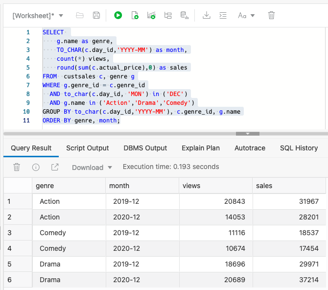

    This result is fine, but to simplify comparisons we want to do a side-by-side comparison of sales across the two years.  Oracle SQL analytic functions will help solve that problem.


2. The **LAG** function will allow us to compare this year vs last (or any other time comparison). In addition, we are going to leverage the SQL **WITH** clause. The **WITH** clause allows you to define in-line views - which greatly simplifies your queries by breaking a query down into smaller, understandable chunks. It's a very powerful tool to have in your toolbox. We'll be using these in-line views as "query blocks" - or named result sets that can be easily referenced. Here, we're using the **WITH** clause to set up the comparison to last year.

    ```
    <copy>WITH sales_vs_lastyear as (
    SELECT 
        g.name as genre,
        TO_CHAR(c.day_id,'YYYY-MM') as month,
        count(*) as views,
        LAG(count(*), 1) OVER (
            PARTITION BY g.name
            ORDER BY to_char(c.day_id,'YYYY-MM') ASC
            ) as views_last_year,         
        ROUND(SUM(c.actual_price),0) as sales,
        LAG(ROUND(SUM(c.actual_price),0), 1) OVER (
            PARTITION BY g.name
            ORDER BY to_char(c.day_id,'YYYY-MM') ASC
            ) as sales_last_year         
    FROM custsales c, genre g
    WHERE g.genre_id = c.genre_id
    AND to_char(c.day_id, 'MON') in ('DEC')
    AND g.name in ('Action','Drama','Comedy')
    GROUP BY TO_CHAR(c.day_id,'YYYY-MM'), c.genre_id, g.name
    ORDER BY genre, month
    )
    SELECT 
        genre, 
        views,
        views_last_year,
        views - views_last_year as views_change,
        sales,
        sales_last_year,
        sales - sales_last_year as sales_change
    FROM  sales_vs_lastyear
    WHERE sales_last_year is not null
    ORDER BY sales_change DESC;</copy>
    ```
    
    The subquery **sales\_vs\_lastyear** aggregates sales by genre and month for both this year and last. The **LAG** function is looking back "1" row for each genre name **PARTITION** - or grouping. The **ORDER BY** clause is critical to ensure that the prior row is indeed the prior month for that genre. The subquery is then used by the SELECT statement that calculates the sales change. 

    You can see that Action and Comedy genres have shown a significant drop off in both sales and views. Even though Drama views have dropped, its sales has increased. And, its sales increase is making up for the other genres' shortfall.

    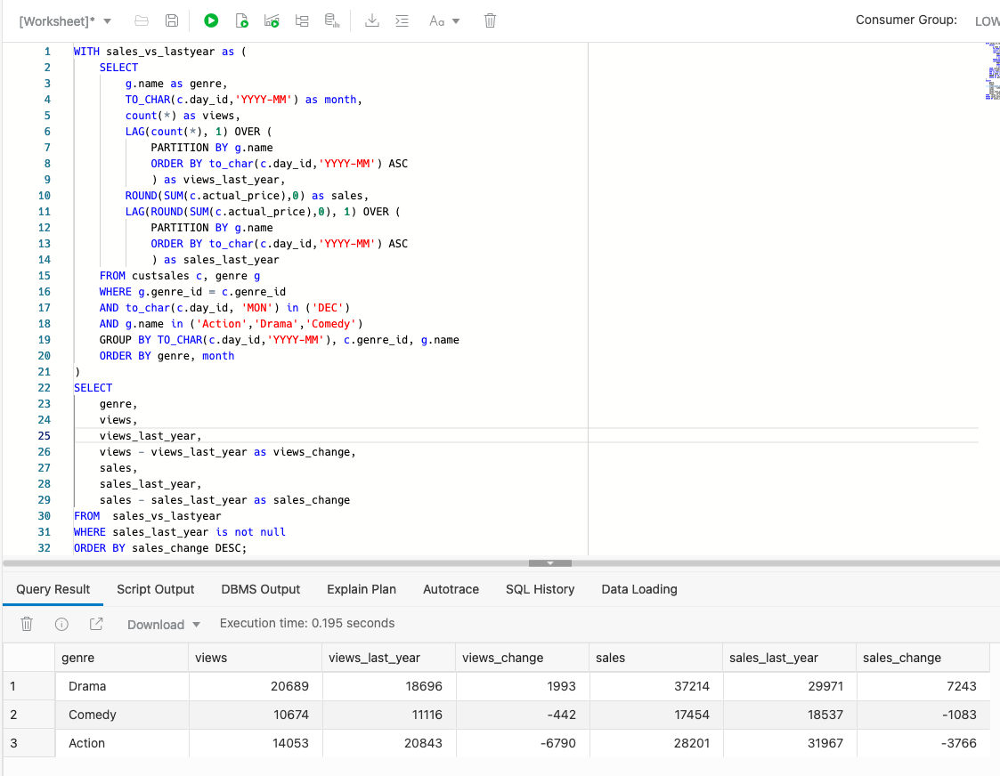


## Task 4: Finding our most important customers

### Overview
Let's pivot and look at customer behavior by utilizing an RFM analysis. RFM is a very commonly used method for analyzing customer value. It is commonly used in general customer marketing, direct marketing, and retail sectors.

In the following steps, the scripts will build a SQL query that will identify:

- Recency: when was the last time the customer accessed the site?

- Frequency: what is the level of activity for that customer on the site?

- Monetary: how much money has the customer spent?

Customers will be categorized into 5 buckets measured (using the NTILE function) in increasing importance. For example, an RFM combined score of 551 indicates that the customer is in the highest tier of customers in terms of recent visits (R=5) and activity on the site (F=5), however the customer is in the lowest tier in terms of spend (M=1). Perhaps this is a customer that performs research on the site, but then decides to buy movies elsewhere!

1.  Binning customers' sales by value

    Use the following query to segment customers into 5 distinct bins based on the value of their purchases:

    ```
    <copy>SELECT
        m.cust_id,
        c.first_name||' '||c.last_name as cust_name,
        c.country,
        c.gender,
        c.age,
        c.income_level,
        NTILE (5) OVER (ORDER BY SUM(m.actual_price)) AS rfm_monetary
    FROM custsales m
    INNER JOIN customer c ON c.cust_id = m.cust_id
    GROUP BY m.cust_id,
        c.first_name||' '||c.last_name,
        c.country,
        c.gender,
        c.age,
        c.income_level
    ORDER BY m.cust_id,
    c.first_name||' '||c.last_name,
    c.country,
    c.gender,
    c.age,
    c.income_level;</copy>
    ```
    Below is a snapshot of the result (and your result may differ):

    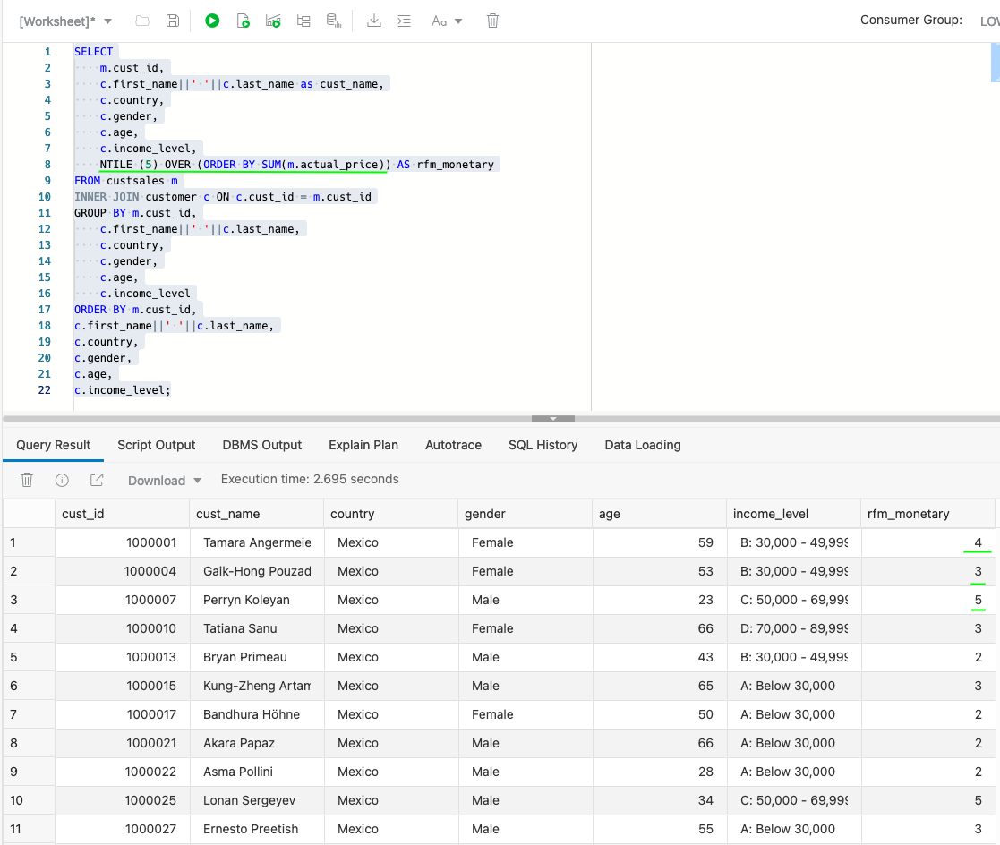
    
    
    The last column in the report shows the "Bin" value. A value of 1 in this column indicates that a customer is a low spending customer and a value of 5 indicates that a customer is a high spending customer. For more information about using the `NTILE` function, see [the SQL documentation](https://docs.oracle.com/en/database/oracle/oracle-database/19/sqlrf/NTILE.html#GUID-FAD7A986-AEBD-4A03-B0D2-F7F2148BA5E9).

2.  Binning customer sales by frequency

    The next step is to determine how frequently customers are watching movies on our platform. To do this, we simply calculate the number of movies watched by each customer and then bin that calculation across 5 buckets.

    ```
    <copy>SELECT
        cust_id,
        NTILE (5) OVER (ORDER BY max(day_ID)) AS rfm_recency,
        NTILE (5) OVER (ORDER BY count(1)) AS rfm_frequency
    FROM custsales
    GROUP BY cust_id
    ORDER BY cust_id;</copy>
    ```
    This should return a result similar to the following (again, your results may differ):

    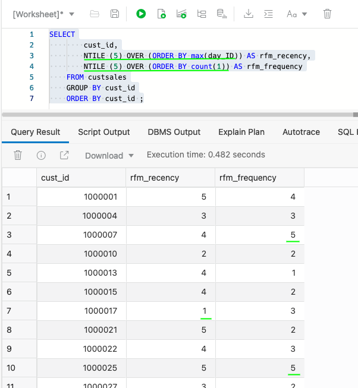

    Now we can categorize customers based on when they last watched a movie (rfm\_recency) and how frequently they viewed movies (rfm\_frequency).

3.  Create an RFM query

    Now we use the **`WITH`** clause to combine these two queries to create an RFM query:

    ```
    <copy>WITH rfm AS (
    SELECT
        m.cust_id,
        NTILE (5) OVER (ORDER BY max(day_id)) AS rfm_recency,
        NTILE (5) OVER (ORDER BY count(1)) AS rfm_frequency,
        NTILE (5) OVER (ORDER BY SUM(m.actual_price)) AS rfm_monetary
    FROM custsales m
    GROUP BY m.cust_id
    )
    SELECT
        r.cust_id,
        c.first_name||' '||c.last_name AS cust_name,
        r.rfm_recency,
        r.rfm_frequency,
        r.rfm_monetary,
        c.country,
        c.gender,
        c.age,
        c.income_level
    FROM rfm r
    INNER JOIN customer c ON c.cust_id = r.cust_id
    WHERE r.rfm_monetary >= 5
      AND r.rfm_recency = 1
    ORDER BY r.rfm_monetary desc, r.rfm_recency desc;</copy>
    ```
    The result only shows customers who have history had significant spend (equal to 5) but have not visited the site recently (equal to 1).  MovieStream does not want to lose these important customers!

    

## Task 5: Accessing JSON data in the data lake

### Overview

Sometimes data does not come in a simple, tabular format. JSON format is an open standard file format which is typically used to simplify the way information can be moved around the web. 

There is a movies data set in our data lake that contains key details about each of the rented movies. The fields in that file can be complex. For example, each movie has a **crew** associated with it and that crew is comprised of many **jobs**, such as "producer," "director," "writer," along with the names of the individuals. Each movie also has a list of award nominations and wins. An example of how this information is organized is shown below:


1. Create a table over this movies data set using the **DBMS_CLOUD** API. In this example, the movie data set is not loaded into Autonomous Database - the table is accessing the data set in the object store directly.

    ```
    <copy>
    begin
        dbms_cloud.create_external_table(
        table_name => 'movie',
        file_uri_list => 'https://objectstorage.us-ashburn-1.oraclecloud.com/n/c4u04/b/moviestream_landing/o/movie/movies.json',
        format => '{"skipheaders":"0", "delimiter":"\n", "ignoreblanklines":"true"}',
        column_list => 'doc varchar2(30000)'
        );
    end;
    /</copy>
    ```

2. Let's see how many rows are in this new table:

    ```
    <copy>SELECT count(*) FROM movie;</copy>
    ```
    This query returns the following result:

    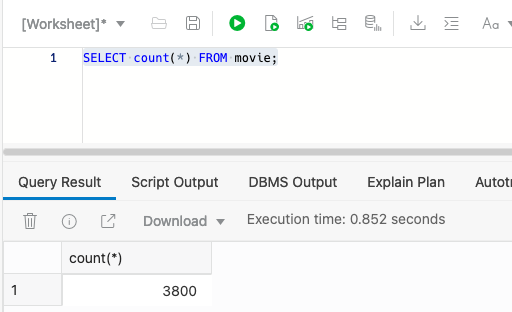

2. Go to the SQL Worksheet Navigator panel and click the refresh button. Then, click the arrow to the left of the name, **MOVIE**, to show the list of columns in our table.  Notice that there is a single column called **DOC** that contains the JSON data:

    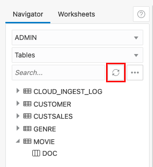

    This external table behaves just like an ordinary table. Let's run a simple query to show the rows in the table:

    ```
    <copy>SELECT * FROM movie WHERE rownum < 10;</copy>
    ```

    Result:
    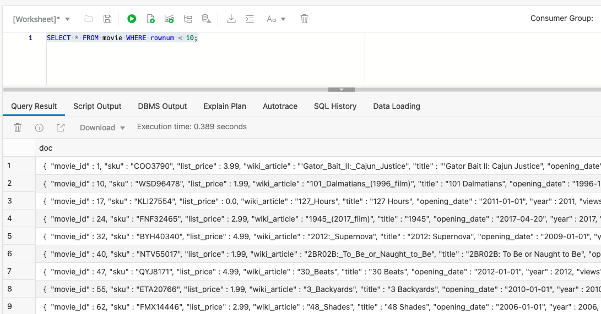
    

    As you can see, the data is shown in its native JSON format; that is, there are no columns in the table for each identifier (movie_id, sku, list price, and more). So how can we query this table if there is only one column?

## Task 6: Simple queries over JSON data

1. As a first step, let's show you how to query  JSON data using SQL. Use the dot notation within our SQL query to convert the content above into a more normal looking table containing columns and rows. This approach is known as Simple Dot Notation and it looks very similar to the way we have constructed previous queries. Here is our first query which you can run in your SQL Worksheet:

    ```
    <copy>SELECT
        m.doc.movie_id,
        m.doc.title,
        m.doc.budget,
        m.doc.runtime
    FROM movie m
    WHERE rownum < 10;</copy>
    ```
    It should return a result set that looks similar to this:

    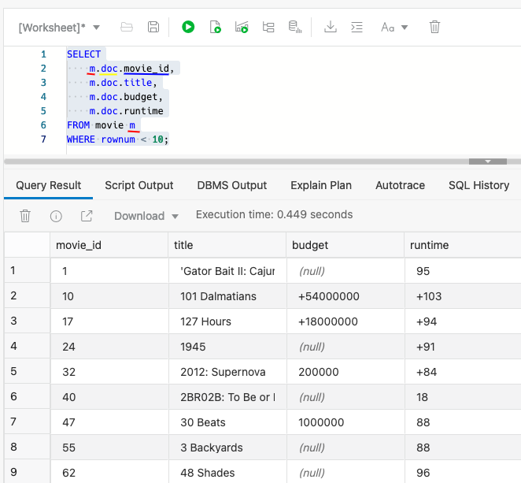
    
    > **Note:** Each column has three components:

    - the name of the source table - **movie** which is referenced using the letter **m**

    - the column containing our json data - **doc**

    - the name of the json attribute - **movie_id**, **title**, **budget** and **runtime**

2. Now that movie queries return data in column format, you can join that data with data stored in other Oracle Database tables.  Let's find the top 10 movies (JSON) based on customer sales (tabular).  This requires joining the **MOVIE\_ID** column from the **CUSTSALES** table with the json document's **movie\_id** attribute.

    ```
    <copy>SELECT 
        m.doc.title, 
        round(sum(c.actual_price),0) as sales
    FROM movie m, custsales c
    WHERE m.doc.movie_id = c.movie_id
    GROUP BY m.doc.title
    ORDER BY 2 desc
    FETCH FIRST 10 ROWS ONLY;</copy>
    ```

    This produces the following - and not surprising - result:

    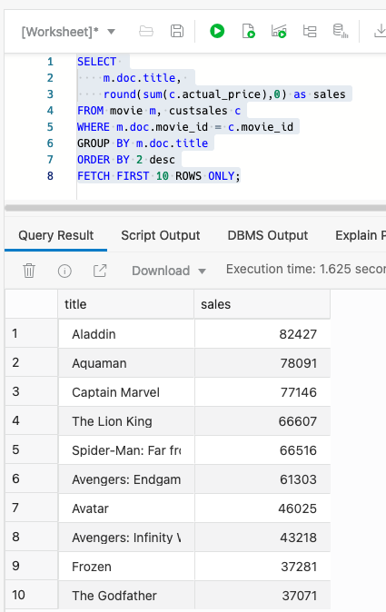


3. Notice that some attributes in our JSON data set contain multiple entries. For example, cast has a list of names and nominations a list of nominated awards. Take a look at the cast, crew and awards for a couple of popular movies:

    ```
    <copy>SELECT
        m.doc.movie_id,
        m.doc.title,
        m.doc.budget,
        m.doc.cast,
        m.doc.crew,
        m.doc.awards
    FROM movie m
    WHERE m.doc.title in ('Rain Man','The Godfather');;</copy>
    ```

    It will return:

    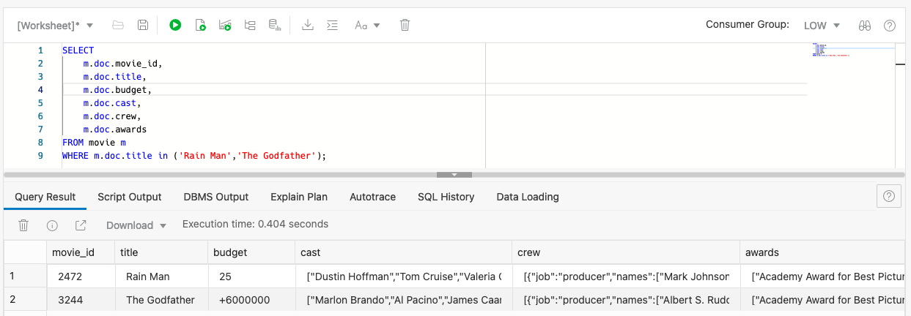

This is good - but the arrays are still part of a single record.  What if you want to ask questions that need to look at the values within the arrays?  

## Task 7: More sophisticated JSON queries

The Academy Awards is an exciting time for the movie industry. It would be interesting to understand movie sales during that time. What happens to movie sales before and after the event? Specifically, what happens to sales for those movies that have won the Academy Award? This can be a challenging question. A movie has an **awards** column - but it is an array.  How do you find sales for a movie that's won the best picture?

Your Autonomous Data Warehouse includes a number of helper packages that can simplify access to your JSON data. The **JSON_TABLE** function can be used to automatically translate JSON data into a row-column format so you can query the JSON data in exactly the same way as our movie sales data.

1. Let's use the JSON_TABLE function to create a row for each movie -> award combination. Run the following command in your SQL Worksheet:

    ```
    <copy>SELECT 
        m.doc.title, 
        award    
    FROM movie m, 
         JSON_TABLE(m.doc.awards, '$[*]' columns (award path '$')) jt
    WHERE title IN ('Rain Man','The Godfather');</copy>
    ```
    You can now see the movie and its award in tabular format:

    

2. Now that we have rows for each value of the array, it is straightforward to find all Academy Award winners for Best Picture:

    ```
    <copy>SELECT
        m.doc.year, 
        m.doc.title, 
        award    
    FROM movie m, 
        JSON_TABLE(m.doc.awards, '$[*]' columns (award path '$')) jt
    WHERE award = 'Academy Award for Best Picture'
    ORDER BY m.doc.year
    FETCH FIRST 10 ROWS ONLY;</copy>
    ```

    Below are the oldest award winners that MovieStream offers:

    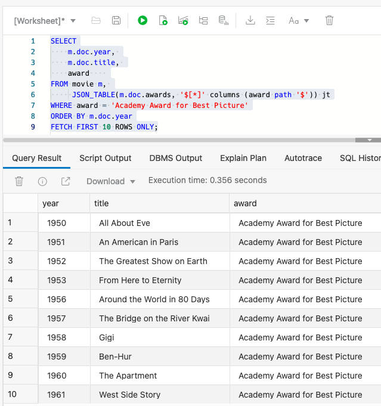

3. What were sales before and after the Academy Awards?  Let's see the results for past winners of the major awards.

    > **Note:** Note: For the following query, highlight the entire SQL text in the SQL Worksheet and then click run.

    ```
    <copy>WITH academyAwardMovies as (
    -- Find movies that won significant awards
    SELECT distinct
        to_number(m.doc.movie_id) as movie_id,
        m.doc.title,
        to_date('09/02/2020', 'DD/MM/YYYY') as award_date
    FROM movie m, JSON_TABLE(m.doc.awards, '$[*]' columns (award path '$')) jt
    WHERE jt.award in ('Academy Award for Best Picture','Academy Award for Best Actor','Academy Award for Best Actress','Academy Award for Best Director')
    ),
    academyAwardSales as (
        -- Get the sales for these movies before and after the award
        -- Do not include the day of the award.  Everyone is watching the event!!
        SELECT
            c.movie_id,
            a.title,
            c.day_id,
            a.award_date,
            count(1) as num_views
        FROM custsales c, academyAwardMovies a
        WHERE c.movie_id = a.movie_id      
        AND day_id between a.award_date -14
                        AND a.award_date +14
        AND day_id != a.award_date               
        GROUP BY c.movie_id, a.title, c.day_id, a.award_date
        ORDER BY c.movie_id ASC, c.day_id ASC
    )
    SELECT movie,
        pre_award_views,
        post_award_views,
        post_award_views - pre_award_views as difference
    FROM academyAwardSales 
    MATCH_RECOGNIZE (
        PARTITION BY movie_id ORDER BY day_id
        MEASURES
            classifier() event,
            match_number() match,
            title as movie,
            day_id as d,
            sum(pre_award_views.num_views) as pre_award_views,
            sum(post_award_views.num_views) as post_award_views
        ONE ROW PER MATCH
        PATTERN (pre_award_views* post_award_views*)
        DEFINE
            pre_award_views  as pre_award_views.day_id  < award_date,
            post_award_views as post_award_views.day_id > award_date
    )
    ORDER BY difference desc
    ;</copy>
    ```
    We saved our most sophisticated query for last!  

    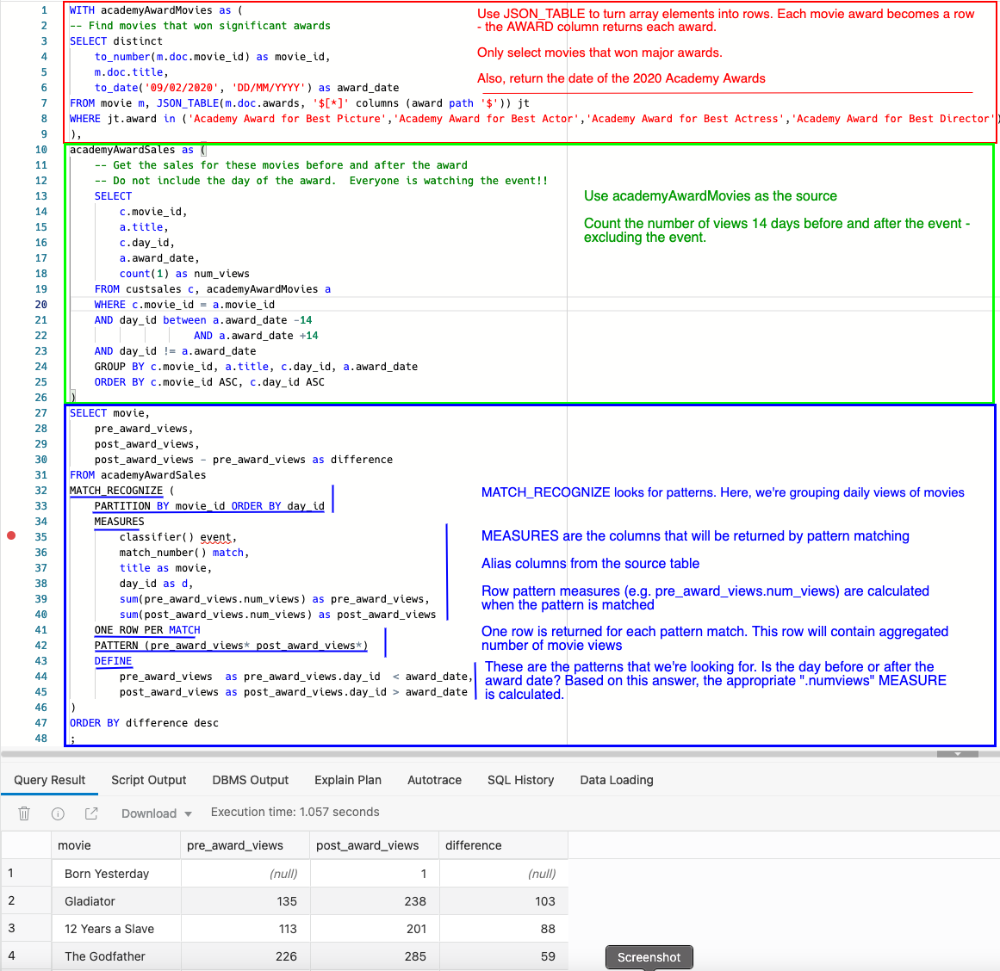

    This is a sophistcated query that draws on our previous concepts and introduces the MATCH\_RECOGNIZE clause. MATCH\_RECOGNIZE (a.k.a. SQL pattern matching) is a powerful capability that allows you to examine many different types of patterns - like rising and falling of stock prices. Our pattern will be simple - did the customer watch the movie before or after the Academy Awards?
    
    Here is a summary of the query specification:
    * Subquery `academyAwardMovies` returns movies that have won significant awards
    * Subquery `academyAwardSales` uses these movies and counts the number of views 14 days before and after the event. 
    * **MATCH_RECOGNIZE** is used to find the patterns. In this case, the patterns are simple: did the event - or row - take place before or after the award date?
        * **MEASURES** contain the columns that are returned by the query. 
        * **MEASURES** can alias the source table's columns 
        * **MEASURES** refer to and perform calculations over the objects from the patterns **DEFINE** clause.

    Looks like the Academy Awards is very good for business!
### Recap
We covered alot of ground in this lab. You learned how to use different types of analytic functions, time series functions and subqueries to answer important questions about the business. 
These features include:

- Different ways of joining tables

- Time-series functions

- Analytic functions to calculate contribution (**RATIO\_TO\_REPORT** and **RANK**)

- **NTILE** binning functions that helps categorize customer sales and activity

Subsequent labs will showcase other types of database analytics that are equally if not more powerful.

You may now [proceed to the next lab](#next).

## **Acknowledgements**

- **Authors** - Keith Laker and Marty Gubar, Oracle Autonomous Database Product Management
- **Adapted for Cloud by** - Richard Green, Principal Developer, Database User Assistance
- **Last Updated By/Date** - Marty Gubar, October 2021
