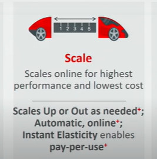
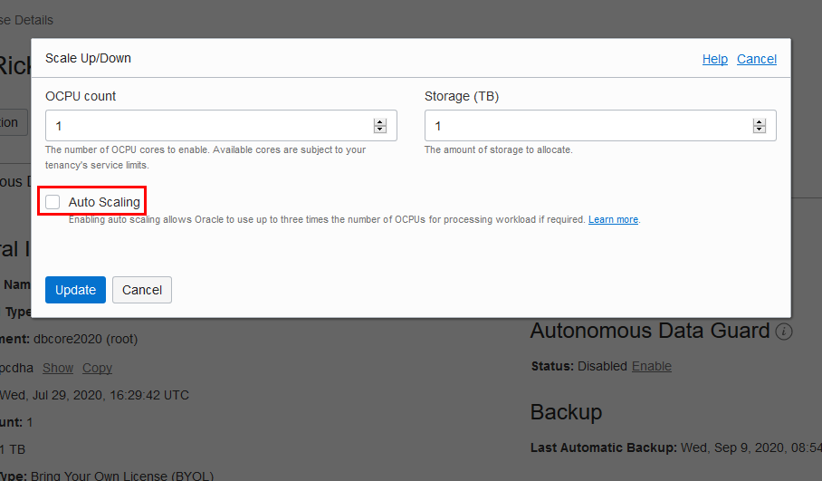
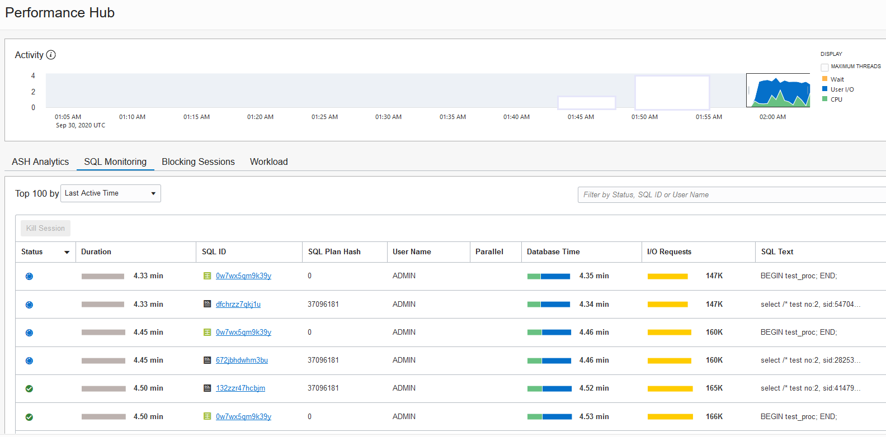
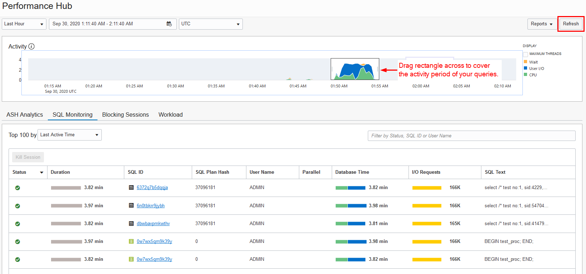
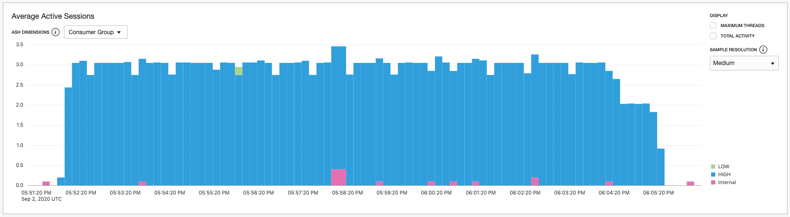
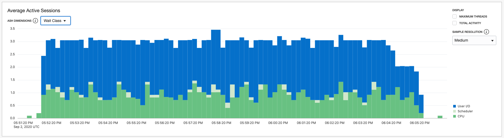
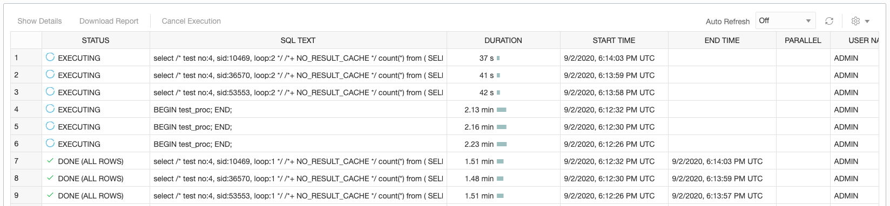
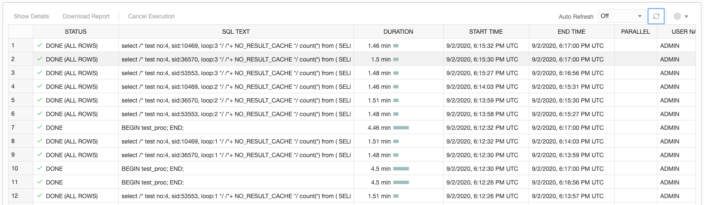
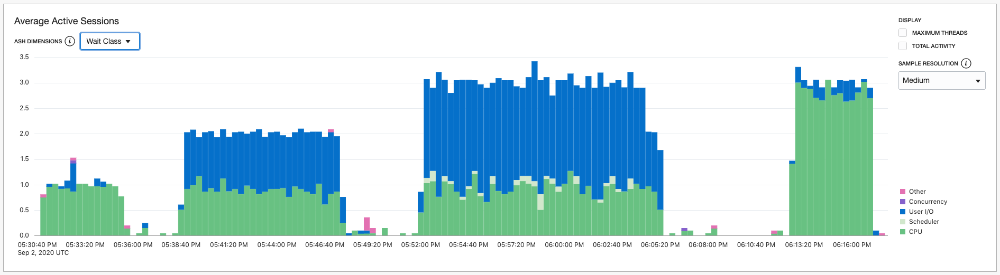

# Auto Scaling an Autonomous Database

## **Introduction**

In this lab, you will learn the benefits of auto-scaling an Oracle Autonomous Database. This lab uses the existing SSB schema in Autonomous Data Warehouse (ADW). The lab executes a PL/SQL procedure which loops through executing one query twice. You run this procedure from 3 SQL Developer Web worksheet sessions concurrently to see how CPU is utilized with and without auto scaling.

### What is Auto Scaling?

With auto scaling enabled, the database can use up to **three times** more CPU and IO resources than specified by the number of OCPUs currently shown in the **Scale Up/Down** dialog.

When you enable auto scaling, if your workload requires additional CPU and IO resources, the database automatically uses the resources without any manual intervention required.

*You don't need to perform a "triggering action" after which your database can start to scale; the CPUs are ALWAYS available to you.*



When you create an Autonomous Database, the auto scaling checkbox is enabled by default. After the database is created, you can use **Scale Up/Down** on the Oracle Cloud Infrastructure console to disable or enable auto scaling.

If your organization performs intensive queries during specific times, auto scaling will ramp up and ramp down CPU resources when needed.

### How Auto Scaling Works

- If a customer provisions an autonomous database with 4 OCPUs for example, he or she will immediately have access to 3x the 4 OCPUs provisioned, therefore 12 OCPUs.
- The **CPU\_COUNT** parameter displays 2x the number of allocated OCPUs, as each OCPU has 2 CPU threads.
- Therefore, this customer who provisioned an autonomous database with 4 OCPUs will see 12 x 2 = 24 CPU\_COUNT.
- The customer is charged only for the actual OCPU usage, between 1 and 3 in this example.

### Objectives

-   Learn the benefits of auto scaling
-   Learn how to enable and disable auto scaling
-   Examine the before/after performance improvements of auto scaling

### Prerequisites

- This lab requires an <a href="https://www.oracle.com/cloud/free/" target="\_blank">Oracle Cloud account</a>. You may use your own cloud account, a cloud account that you obtained through a trial, a LiveLabs account or a training account whose details were given to you by an Oracle instructor.
- Make sure you have completed the previous lab in the Contents menu on the left, *Provision Autonomous Database*, before you proceed with this lab, if you want to apply auto scaling to an existing ADW database. Otherwise, proceed with this lab to try auto scaling with a new autonomous database.
- **Note** Auto scaling is not available with Oracle's **Always Free** databases.

### How You Will Test Auto Scaling in this Lab

- **Test 1**: With auto scaling disabled, you will have 3 SQL Developer Web worksheet sessions executing queries and sharing the CPU resources, and you'll examine query times.
- **Test 2**: You will enable auto scaling and again have 3 SQL Developer Web worksheet sessions executing queries. Auto-scaling will allow your running sessions to use up to 3x more OCPUs, reducing your execution times significantly.

## **STEP 1**: Disable Auto Scaling and Create Four Connections in SQL Developer Web to your ADW Database

1. You created an Autonomous Data Warehouse database in an earlier lab named *Provision Autonomous Database*. Go to the details page for the database, click the  **Scale Up/Down** button, and deselect the **Auto Scaling** checkbox to disable auto scaling.

    

2. Go back to the details page for your ADW database. Click the **Tools** tab. In the next screen, click **Open SQL Developer Web**. In the log-in dialog, provide the username `admin` and the administrator password you specified when you created the autonomous database. (Note that you can alternatively use SQL Developer desktop client instead of SQL Developer Web.)

    

    

3. Create and save 4 SQL Developer Web worksheets:
    - Save the first worksheet with the name **Setup**. You will use this worksheet with the LOW consumer group in STEP 2, to run the setup that creates a procedure for running test queries. The LOW consumer group is appropriate for non-CPU-intensive tasks such as this creation of a procedure.
    - Save the other 3 worksheets with the names **Query 1**, **Query 2**, and **Query 3**. In later steps, you will use these 3 worksheets to simultaneously run the test queries using the HIGH consumer group. For real production workloads, you will typically use the MEDIUM or HIGH consumer group. Each HIGH worksheet is associated with one CPU. A worksheet using the HIGH consumer group gets top priority. Our test later in the lab using auto scaling will have 3 CPUs; the HIGH consumer group brings the lowest concurrency and highest parallelism.

In SQL Developer Web worksheets, you choose the consumer group from a drop-down menu in the upper right corner.

  

**Note:** When you re-open a saved worksheet, it opens by default with the LOW consumer group. If you want to run a script in the re-opened worksheet using the HIGH consumer group, you need to manually change it from LOW to HIGH. For more information on using the HIGH, MEDIUM and LOW consumer groups, see the documentation [Predefined Database Service Names for Autonomous Data Warehouse](https://docs.oracle.com/en/cloud/paas/autonomous-data-warehouse-cloud/user/connect-predefined.html#GUID-9747539B-FD46-44F1-8FF8-F5AC650F15BE).

## **STEP 2**: Create the `test_proc` Procedure for the Workload Used in the Test
In this step, you run a script that will:
- Create the procedure **test\_proc** for the workload used in the test.
    - The query used in the test will summarize orders by month and city for customers in the US in the Fall of 1992.
    - The query will run in a loop 2 times. (After performing this lab, you can go back and increase the `i_executions` number for further testing.)
- Create a sequence used for each test number.
- Create the table used to save the results.

1. Copy and paste the following script into the first worksheet you named **Setup**. Run the following script using the LOW consumer group.

```
<copy>-- Create a sequence to increment the number of tests running
drop sequence test_run_seq;
create sequence test_run_seq order nocache;

drop table test_run_data;
create table test_run_data
(test_no    number,
 cpu_count  number,
 sid        number,
 query_no   number,
 start_time timestamp,
 end_time   timestamp
);

create or replace procedure test_proc(i_executions number := 2) as
  v_sid        number;
  v_loop       number := 0;
  v_test_sql   varchar2(32767);
  v_test_sql_1 varchar2(32767);
  v_test_sql_2 varchar2(32767);
  v_end_date   date;
  v_begin_date date;
  v_begin_sql_time timestamp;
  v_end_sql_time timestamp;
  v_minute     number;
  v_result     number;
  v_last_test_no  number;
  v_test_no   number;
  v_test_start_time date;
  v_last_test_start_time date;
  v_cpu_count number;
--
function get_test_no return number is
  v_last_test_no         number;
  v_last_test_start_time date;
  v_test_no              number;
  v_test_start_time      date;
begin
  select test_no, start_time into v_last_test_no, v_last_test_start_time
  from   test_run_data
  where  start_time = (select max(start_time)
                       from   test_run_data);
  if v_last_test_start_time > (sysdate - 1/1440)
    then v_test_no := v_last_test_no;
    else v_test_no:= test_run_seq.nextval;
    end if;
  return v_test_no;
exception
  when others then
    v_test_no:= test_run_seq.nextval;
    return v_test_no;
end get_test_no;
--
begin
--  v_end_date := sysdate + (i_minutes/1440);
  v_test_no := get_test_no;
  select userenv('SID') into v_sid from dual;
  select sum(value) into v_cpu_count from gv$parameter where name = 'cpu_count';
  insert into test_run_data values(v_test_no, v_cpu_count, v_sid, null, systimestamp, null);
  commit;
  v_begin_date := sysdate;
  v_test_sql_1 := q'#select /* #';
  v_test_sql_2 := q'# */ /*+ NO_RESULT_CACHE */ count(*) from (
--
-- This query will summarize orders by month and city for customers in the US in the Fall of 1992
SELECT
    d.d_month,
    d.d_year,
    c.c_city,
    SUM(lo.lo_quantity),
    SUM(lo.lo_ordtotalprice),
    SUM(lo.lo_revenue),
    SUM(lo.lo_supplycost)
FROM
    ssb.lineorder   lo,
    ssb.dwdate      d,
    ssb.customer    c
WHERE
    lo.lo_orderdate = d.d_datekey
    AND lo.lo_custkey = c.c_custkey
    AND d.d_year = 1992
    AND d.d_sellingseason='Fall'
    AND c.c_nation = 'UNITED STATES'
GROUP BY
    d.d_month,
    d.d_year,
    c.c_city
)
#';
  loop
    v_loop   := v_loop + 1;
    v_minute := round((sysdate - v_begin_date) * 1440, 1);
    v_test_sql := v_test_sql_1 || 'test no:' || v_test_no || ', sid:' || v_sid || ', loop:' || v_loop || v_test_sql_2;
    v_begin_sql_time := systimestamp;
    execute immediate v_test_sql into v_result;
    v_end_sql_time := systimestamp;
    insert into test_run_data values(v_test_no, v_cpu_count, v_sid, v_loop, v_begin_sql_time, v_end_sql_time);
    commit;
    exit when v_loop = i_executions;
  end loop;
end;
/
</copy>
```

## **STEP 3**: Run the `test_proc` Procedure Concurrently on Three Worksheets

1. Now run the `test_proc` procedure concurrently on the 3 worksheets you named **Query 1**, **Query 2**, and **Query 3**. To open 3 SQL Developer Web worksheets, go to the OCI console's Details page for your database, open the **Tools** tab and click the **Open SQL Developer Web** button on the console 3 times. Each time you click it, a new SQL Developer Web tab will open in the browser.

    

2. **Make sure that each of the 3 worksheets are set to the HIGH consumer group.** Enter - but do not immediately execute - the following command in each worksheet. After you have entered the command into all 3 worksheets, rapidly execute the command in each worksheet so that they begin at nearly the same time.

````
exec test_proc;
````

3. While the 3 procedure instances are running concurrently, which might run for approximately 4.5 minutes on a 1-OCPU system, go to the OCI console's details page for your autonomous database and click **Performance Hub**. In Performance Hub, click the **SQL Monitoring** tab, and look at the Monitored SQL to see that each procedure instance is running a query.

    

4. Go back to the worksheets. After all 3 worksheets indicate that the queries have completed, return to the SQL Monitoring tab in the Performance Hub. In the upper right corner, click the **Refresh** button. The SQL Monitoring panel might display the message, "No monitored SQLs found for the selected time period".

    If that happens, position your mouse cursor in the **Activity** panel above the SQL Monitoring panel, and drag the rectangle horizontally across to cover the portion of the timeline that indicates your recent query activity. This will fill in the SQL Monitoring panel at the bottom, with information indicating the completed queries.

  

5. Run this script to see the test results:

```
<copy>alter session set nls_date_format='DD-MM-YYYY HH24:MI:SS';

select test_no,
       cpu_count,
       sessions,
       queries_finished,
       test_duration_in_seconds,
--       test_start_time,
--       test_end_time,
--       next_min_after_start,
--       min_before_end,
       avg_query_time,
       (select max(value)
        from   (SELECT trunc(end_time, 'MI') metric_end_time,
                       round(SUM(value) / 100, 3) value
                FROM   gv$con_sysmetric_history
                WHERE  metric_name = 'CPU Usage Per Sec'
                GROUP BY trunc(end_time, 'MI'))
        WHERE metric_end_time between next_min_after_start and min_before_end) max_cpu_usage
from   (select test_no,
               cpu_count,
               count(distinct sid) sessions,
               sum(nvl2(end_time,1,0)) queries_finished,
               round(extract(minute from (max(end_time) - min(start_time))) * 60 + extract(second from (max(end_time) - min(start_time))),1) test_duration_in_seconds,
               cast(min(start_time) as date) test_start_time,
               cast(max(end_time) as date) test_end_time,
               trunc(min(start_time), 'MI') + 1/1440 next_min_after_start,
               trunc(max(end_time), 'MI') - 1/1440 min_before_end,
               round(avg(to_number(extract(minute from (end_time - start_time)) * 60 + extract(second from (end_time - start_time)))),1) avg_query_time
        from   test_run_data
--        where  end_time is not null
        group by test_no,
                 cpu_count)
order by 1;
</copy>
```

6. Review the results of running the script:

```
TEST_NO CPU_COUNT SESSIONS QUERIES_FINISHED TEST_DURATION_IN_SECONDS AVG_QUERY_TIME MAX_CPU_USAGE
------- --------- -------- ---------------- ------------------------ -------------- -------------
      1         2        3                6                    581.5          275.5         0.968
```
Notice the AVG\_QUERY\_TIME is 275.5 seconds and MAX\_CPU\_USAGE is only approximately 1 OCPU. In the next steps, you will see if auto scaling reduces query time and increases OCPU usage.

7. Go to the OCI console's details page for your autonomous database and click **Performance Hub**. Performance Hub opens with the **ASH Analytics** tab selected. Scroll down and view the **Average Active Sessions** chart.  This chart shows 3 sessions are using the HIGH service.

    

8. The drop-down menu in the upper left corner of the chart shows Consumer Group by default. In the drop-down menu, choose **Top Dimensions** and choose **Wait Class** from the sub-menu. You can see the number of waits on CPU and on I/O. The queries are waiting on the CPUs to become available to run on them. The number of CPUs is 1. There are 3 queries running concurrently, so 2 queries are waiting for CPUs to become available.

    

In the next step, enable auto scaling to improve query performance.

## **STEP 4**: Enable Auto Scaling

1. Enable auto scaling, to allow you to use 3X the amount of CPU. Go to the details page for the database, click the  **Scale Up/Down** button, and select the **Auto Scaling** checkbox to re-enable auto scaling.

    

## **STEP 5**: Run the Procedure Again Concurrently on Three Worksheets After Enabling Auto Scaling

1. Run the procedure again from 3 SQL Developer Web worksheet connections using the HIGH consumer group. Enter - but do not immediately execute - the following command in each worksheet. After you have entered the command into all 3 worksheets, rapidly execute the command in each worksheet so that they begin at nearly the same time.

````
exec test_proc;
````

2. While the procedures are running, monitored SQL shows 3 queries executing. In the previous test, before you enabled Auto Scaling, the procedure's 3 query sessions averaged 4.5 minutes to run. After enabling Auto Scaling, the queries now might require just less than 2 minutes to run.

    

3. Check the monitored SQL periodically, using the **Refresh** button, until you see that the procedures have completed.

    

## **STEP 6**: Review the Improved Performance After Enabling Auto Scaling

1. When the procedures have completed, run this script to see the test results:

```
<copy>alter session set nls_date_format='DD-MM-YYYY HH24:MI:SS';

select test_no,
       cpu_count,
       sessions,
       queries_finished,
       test_duration_in_seconds,
--       test_start_time,
--       test_end_time,
--       next_min_after_start,
--       min_before_end,
       avg_query_time,
       (select max(value)
        from   (SELECT trunc(end_time, 'MI') metric_end_time,
                       round(SUM(value) / 100, 3) value
                FROM   gv$con_sysmetric_history
                WHERE  metric_name = 'CPU Usage Per Sec'
                GROUP BY trunc(end_time, 'MI'))
        WHERE metric_end_time between next_min_after_start and min_before_end) max_cpu_usage
from   (select test_no,
               cpu_count,
               count(distinct sid) sessions,
               sum(nvl2(end_time,1,0)) queries_finished,
               round(extract(minute from (max(end_time) - min(start_time))) * 60 + extract(second from (max(end_time) - min(start_time))),1) test_duration_in_seconds,
               cast(min(start_time) as date) test_start_time,
               cast(max(end_time) as date) test_end_time,
               trunc(min(start_time), 'MI') + 1/1440 next_min_after_start,
               trunc(max(end_time), 'MI') - 1/1440 min_before_end,
               round(avg(to_number(extract(minute from (end_time - start_time)) * 60 + extract(second from (end_time - start_time)))),1) avg_query_time
        from   test_run_data
--        where  end_time is not null
        group by test_no,
                 cpu_count)
order by 1;
</copy>
```

2. Let's examine the improved performance after enabling auto scaling. **Test 1** was with auto scaling **disabled** and **Test 2** was with auto scaling **enabled**:
````
TEST_NO CPU_COUNT SESSIONS QUERIES_FINISHED TEST_DURATION_IN_SECONDS AVG_QUERY_TIME MAX_CPU_USAGE
------- --------- -------- ---------------- ------------------------ -------------- -------------
      1         2        3                6                    581.5          275.5         0.968
      2         6        3                6                    210.2             97         2.699
````

In the Performance Hub Average Active Sessions chart by Wait Class, you can see that in the 2nd test after auto scaling is enabled, since there are 3 CPUs available, one for each of the queries, the queries are no longer waiting for CPUs to become available.

  

- After enabling auto scaling, CPU_COUNT jumps from 2 to 6, a factor of 3x.
- The duration of the procedure that ran queries concurrently in 3 worksheet sessions dropped from 581 to 210 seconds.
- The average query time dropped from 275 to 97 seconds.
- The MAX\_CPU\_USAGE increased from 1 CPU to 2.7 CPUs.
- The auto scaling allowed all 3 sessions to use 3x the amount of CPU, reducing query times significantly, by nearly 3x.
- This information comes from the ``gv$con_sysmetric_history`` view.

## Things to Note

- When auto scaling is enabled, only the amount of OCPUs and IO available to the database is changed.
- Other database parameters, including memory, concurrency and parallel statement queueing, do not automatically scale.
- Consequently, parallel statement queuing acts the same with and without auto scaling enabled.
- When auto scaling is enabled, IO is also scaled to 3X the OCPU allocation. So even if only one session is executing a SQL Statement, it benefits from the additional IO.
- To see the average number of OCPUs used during an hour you can use the "Number of OCPUs allocated" graph on the Overview page on the Autonomous Data Warehouse service console.
    - These graphs are updated **per hour**, so the user will be able to see this in the next hour.
- Actual CPU usage is tracked with the metric **CPU Usage Per Sec** in `gv$con_sysmetric_history`. This view shows metric averages per minute. The per-minute metrics are then averaged over an hour for billing.

## Want to Learn More?

For more information about auto scaling, see the documentation [Use Auto Scaling](https://docs.oracle.com/en/cloud/paas/autonomous-data-warehouse-cloud/user/autonomous-auto-scale.html#GUID-27FAB1C1-B09F-4A7A-9FB9-5CB8110F7141).

## **Acknowledgements**

- **Authors** - Rick Green, Database User Assistance; Nilay Panchal, ADB Product Management
- **Contributors** - John Zimmerman, Real World Performance Team; Keith Laker, ADB Product Management
- **Last Updated By/Date** - Rick Green, October 2020

## See an issue?
Please submit feedback using this [form](https://apexapps.oracle.com/pls/apex/f?p=133:1:::::P1_FEEDBACK:1). Please include the *workshop name*, *lab* and *step* in your request.  If you do not see the workshop name listed, please enter it manually. If you would like for us to follow up with you, enter your email in the *Feedback Comments* section.
