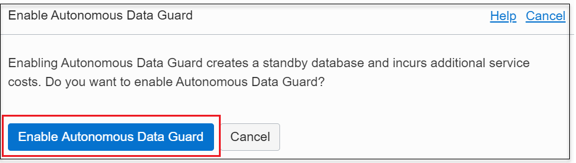
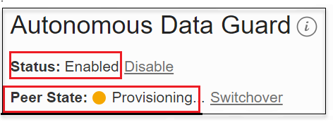
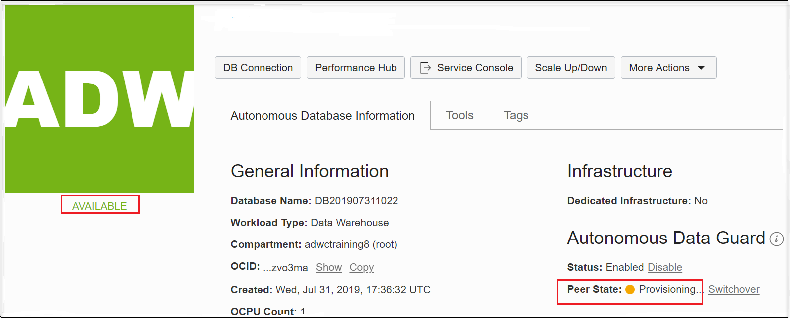
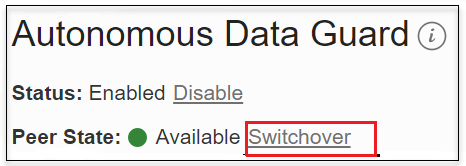
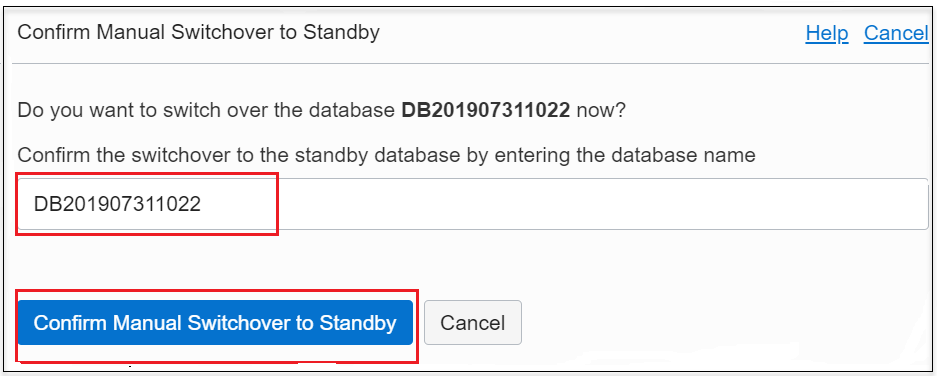
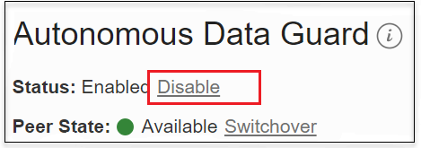
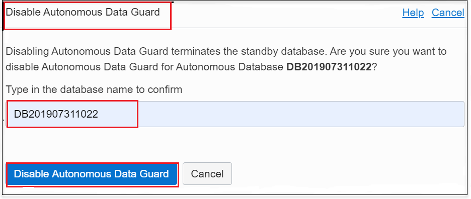
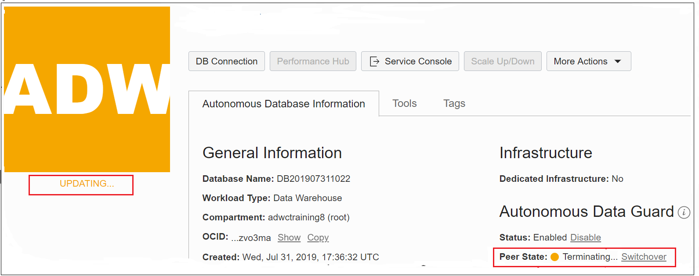

<!-- Start by renaming this file with the same name as the lab folder, for example, provision-adb.md -->
# Enable Disaster Recovery in Autonomous Database
In this lab, you will enable the Autonomous Data Guard (ADG), which is the Disaster Recovery (DR) feature in Autonomous Database (ADB) on Shared Infrastructure (ADB-S).

## Introduction
Every enterprise today needs to protect its data with high availability, data protection, and disaster recovery. Businesses need a comprehensive set of services that create, maintain, manage, and monitor one or more standby databases to enable production databases to survive disasters and data corruption. While ADB already runs on highly available Exadata infrastructure, this feature further protects your databases against unforeseen disaster scenarios like earthquakes, fires, floods, major network outages etc. by automatically switching to a standby database when the primary database goes down.

Estimated time: 15 minutes

### Objectives

* Learn the benefits of disaster recovery
* Learn how to enable and disable Autonomous Data Guard
* Learn how to switchover from primary database to a standby database

### Prerequisites

* This lab requires an [Oracle Cloud account](https://www.oracle.com/cloud/free/). You may use your own cloud account, a cloud account that you obtained through a trial, a LiveLabs account or a training account whose details were given to you by an Oracle instructor.
* Make sure you have completed the previous lab in the Contents menu on the right, **Provision Autonomous Database**, before you proceed with this lab.

**Note:**  Autonomous Data Guard is not available with Oracle's Always Free databases. Please sign up for free trial credits or use your own tenancy to test this feature yourself.
**Note:**  Autonomous Data Guard is available only in Autonomous Database instances 19c and above.

## Basic Disaster Recovery Terminology
**Primary or Source Database**: The main database that is actively being used to read from, and write to, by a user or application.

**Standby Database**: A replica of the primary database which is constantly and passively replicating data from the primary database. This standby database is used in case of failure of the primary. In the case of ADG, you keep this standby on a different physical Exadata machine (in a different Availability Domain in regions that have more than one) for the highest level of protection.

**Recovery Point Objective (RPO)**: An organization's tolerance for data loss, after which business operations start to get severely impacted, usually expressed in minutes. This should be as low as possible.

**Recovery Time Object (RTO)**: An organization's tolerance for the unavailability (or downtime) of a service after which business operations can be severely impacted, usually expressed in minutes. This should be as low as possible.

## How does Autonomous Data Guard Function?

Autonomous Data Guard monitors the primary database and if the Autonomous Database instance goes down, then the standby instance assumes the role of the primary instance.

Unforeseen database failures due to disasters can happen at any time. Autonomous Data Guard offers the highest level of protection for an enterprise's data availability and system performance requirements.

If a disaster were to occur and your primary database is brought down, you can **"Failover"** to your standby database. A failover is a role change, switching from the primary database to the standby database when the primary is down and unavailable, while the standby is available. This has to happen fast so that both RTO and RPO are minimized.

The failover from the Primary to the Standby is seamless and does not require downloading a new wallet or new URLs for available tools. You can continue to use existing wallets and URL endpoints for your tools ( [APEX](https://docs.oracle.com/en/cloud/paas/autonomous-data-warehouse-cloud/cswgs/autonomous-apex-about.html#GUID-F275EA9F-F9A4-4A72-B777-5548362FDDA5), [OML](https://docs.oracle.com/en/cloud/paas/autonomous-data-warehouse-cloud/omlug/get-started-oracle-machine-learning.html#GUID-2AEC56A4-E751-48A3-AAA0-0659EDD639BA), and [ORDS](https://docs.oracle.com/en/database/oracle/oracle-rest-data-services/20.3/qsord/index.html)).

After a failover, a new standby for your primary will automatically be provisioned.

Currently, the standby database is created in the same region as the primary database. For better resilience, the standby database is provisioned as follows:
* In regions with more than one availability domain, the standby database is provisioned automatically in a different availability domain than the primary database.
* In regions with a single availability domain, the standby database is provisioned automatically on a different physical machine than the primary database.

## STEP 1: Enable Autonomous Data Guard

1. If you are not logged in to Oracle Cloud Console, log in and navigate to your Autonomous Database.
2. Under **Autonomous Data Guard** section, click **Enable** to enable the Data Guard feature.

3. In the Enable Autonomous Data Guard dialog, click **Enable Autonomous Data Guard**.

4. The Autonomous Database Lifecycle State changes to **Updating** and on the Details page, under **Autonomous Data Guard** the **Peer State** field shows **Provisioning**. Depending on the size of your primary database this may take several minutes.

When the standby database is being provisioned, the primary database status becomes available and all database activities can continue as enabling Autonomous Data Guard is non-blocking.

When provisioning completes, the **Peer State** field shows **Available**.

## Automatic and Manual Failover options in case of a disaster
In a disaster situation when the Primary becomes unavailable the Switchover button would turn to a Failover one. With ADG, an **Automatic Failover** is automatically triggered (no user action is needed) by the Autonomous Database when a user is unable to connect to their primary database for a few minutes. Since this is an automated action, the automatic failover is allowed to succeed only when you can guarantee that no data loss will occur.  In ADG, for automatic failover, RTO is 2 minutes and RPO is 0 minutes.

In the rare case when your primary is down and automatic failover is unsuccessful, the Switchover button will turn into a Failover button and the user can trigger and perform a **Manual Failover**. During a manual failover, the system automatically recovers as much as data possible, minimizing any potential data loss; there may be a few seconds or minutes of data loss. You would usually only perform a manual failover in a true disaster scenario, accepting the few minutes of potential data loss to ensure getting your database back online as soon as possible.
For manual failover, the RTO is 2 minutes and RPO is 5 minutes.

## STEP  2: Test Switchover to a Standby Database
After Autonomous Data Guard is enabled, if you perform a switchover operation the primary database becomes the standby database, and the standby database becomes the primary database, with no data loss. A switchover is typically done to test your application's failover procedures when Autonomous Data Guard is enabled.

The Oracle Cloud Infrastructure console shows a switchover link in the Peer State field when both the primary database and the standby database are available. That is, the primary database Lifecycle State field shows Available or Stopped and the standby database is available (the Peer State field shows Available).

To perform a switchover, do the following:
1. On the Details page, under **Autonomous Data Guard**, in the Peer State field, click **Switchover**.

2. In the Confirm Manual Switchover to Standby dialog, enter the database name and click **Confirm Manual Switchover to Standby**.

The database Lifecycle State changes to **Updating** and the Peer State field shows **Role Change in Progress**.

  When the switchover operation completes, Autonomous Data Guard does the following:
    * The Primary database goes into the Available state and can be connected to for queries and updates.
    * The Peer State field will change to Available when the standby is ready. (The standby may go into a Provisioning state first, if necessary, without blocking operations on the Primary.)
    * You can see the time of the last switchover when you hover over the tooltip icon in the **Peer State** field.

## STEP  3: (Optional) Disable Autonomous Data Guard
1. If you are not logged in to Oracle Cloud Console, log in and navigate into your Autonomous Database.
2. Under **Autonomous Data Guard** section, click **Disable** to disable the Autonomous Data Guard.

   In the Disable Autonomous Data Guard dialog, enter the Autonomous Database name to confirm that you want to disable Autonomous Data Guard for the instance. Click **Disable Autonomous Data Guard**.
    

   The database Lifecycle State changes to **Updating** and the Peer State field changes to **Terminating**.
    

**Note:**
Disabling Autonomous Data Guard terminates the standby database. If you later enable Autonomous Data Guard, the system creates a new standby database.

## Want to Learn More?
For more information about Standby Databases, see the documentation  [About Standby Databases](https://docs.oracle.com/en/cloud/paas/autonomous-data-warehouse-cloud/user/autonomous-data-guard-about.html#GUID-045AD017-8120-4BDC-AF58-7430FFE28D2B). To use OCI REST APIs to enable and use Autonomous Data Guard, See [Use the API](https://docs.oracle.com/en/cloud/paas/autonomous-data-warehouse-cloud/user/autonomous-data-guard-api.html#GUID-3E4C0FA6-DE04-4F7F-A7AF-4C270870DCFF).

## Acknowledgements
* Authors - Vandanadevi Rajamani, Database User Assistance; Nilay Panchal, ADB Product Management
* Last Updated By/Date -Vandanadevi Rajamani/November 2020

## Need Help?
Please submit feedback or ask for help using our [LiveLabs Support Forum](https://community.oracle.com/tech/developers/categories/livelabsdiscussions). Please click the **Log In** button and login using your Oracle Account. Click the **Ask A Question** button to the left to start a **New Discussion** or **Ask a Question**. Please include your workshop name and lab name. You can also include screenshots and attach files. Engage directly with the author of the workshop.

If you do not have an Oracle Account, click [here](https://profile.oracle.com/myprofile/account/create-account.jspx) to create one.
