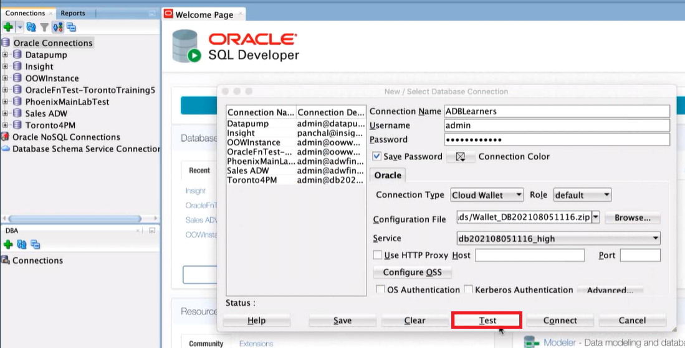
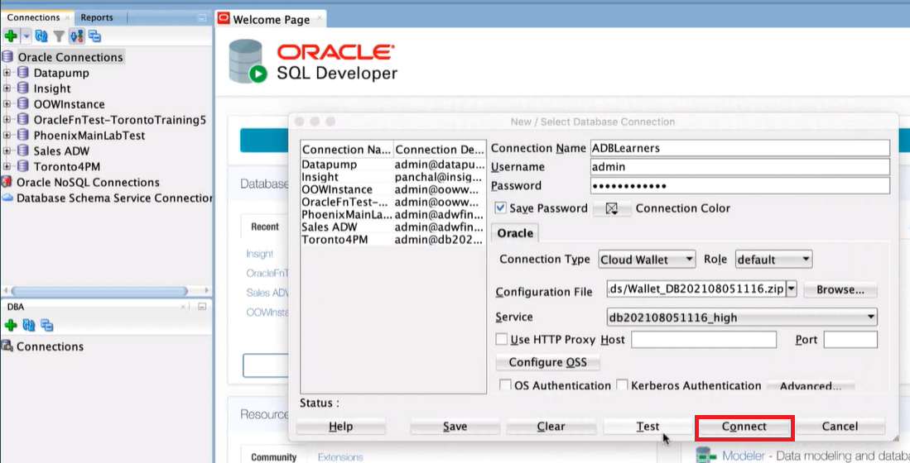

# Connect to ADB

## Introduction
In this demo, we will connect to an Autonomous Database via SQL Developer using a wallet. 

Estimated Time: 5 minutes

### Objectives
- Download an instance Wallet
- Connect SQL Developer to instance using wallet

### Prerequisites
  This lab assumes you have:
  - Obtained and signed in to your `workshop-installed` compute instance
  - Have SQL Developer installed

## Task 1: Download an Instance Wallet
1. Click on the menu and navigate to your database. 

  

2. Click on DB Connection. Select Instance Wallet, and click Download Wallet to download the wallet. 

  

3. Specify a password of choice for the wallet. You will need this password when connecting to the database via SQL Developer later.

## Task 2: Connect SQL Developer to Instance using Wallet

4. Open SQL Developer, and select New Connection. 

5. Fill in the name, your username, and your password. For connection type, select Cloud Wallet.

  

6. Select Browse, and locate your wallet. 

  

7. Test your connection by selecting Test. You should see status Success. 

  

8. Connect to your database by clicking Connect. 

  

This concludes this lab. You may now proceed to the next lab.

## Acknowledgements

- **Author** - Kamryn Vinson, Product Manager, Oracle Database
- **Contributor** - Nicholas Cusato, Solution Engineer, Santa Monica Specialist Hub
- **Last Updated By/Date** - Nicholas Cusato, Santa Monica Specialist Hub, March 2022
